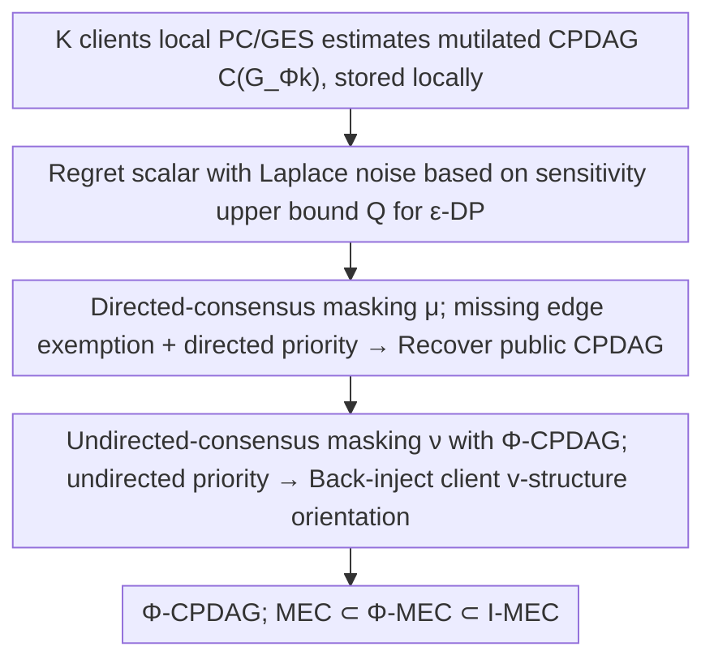

# Regret-Based Federated Causal Discovery with Unknown Interventions

**Conference**: ICML 2026  
**arXiv**: [2512.23626](https://arxiv.org/abs/2512.23626)  
**Code**: https://github.com/CIPHOD/pyCIPHOD (Available)  
**Area**: Causal Inference / Federated Learning / Differential Privacy  
**Keywords**: Causal Discovery, Federated Learning, Unknown Interventions, Φ-Markov Equivalence Class, Regret, Differential Privacy

## TL;DR
This paper proposes I-PERI: a federated setting where client intervention targets are entirely unknown and only regret scalars can be shared. By employing a two-stage process of "directed-consensus masking + undirected-consensus masking," it recovers a new equivalence class Φ-MEC, which is tighter than the observational MEC but looser than I-MEC, and provides $\epsilon$-differential privacy guarantees via Laplace noise.

## Background & Motivation

**Background**: The primary goal of causal discovery is to recover a CPDAG representing the Markov Equivalence Class (MEC) of the underlying causal DAG. When data is naturally distributed across hospitals or institutions and cannot be centralized, **Federated Causal Discovery (FCD)** adapts this task to a "central server + multi-client" architecture, with methods like PERI, FedDAG, FedCDH, and NOTEARS-ADMM being representative.

**Limitations of Prior Work**: Nearly all FCD methods assume **all clients share the same causal model and no interventions exist**. However, in real-world scenarios, treatments, diagnostic standards, and enrollment policies at different hospitals constitute client-level **structural interventions**—they remove certain incoming edges in the causal graph, creating structural differences between client CPDAGs. Treating this heterogeneity as noise results in regret-based methods like PERI **failing to converge to the true CPDAG**.

**Key Challenge**: (1) Existing "causal discovery with interventions" (e.g., Hauser & Bühlmann, Yang et al., ℐ-MEC) assumes **known intervention targets**, whereas leaking intervention targets in a federated setting violates privacy. (2) Existing work on "unknown interventions + multi-environment" (Jaber et al., Squires et al.) assumes data can be centralized for direct comparison, which is impossible in FL. **The question of what the tightest identifiable equivalence class is under the coexistence of unknown interventions, strict federation, and differential privacy remains unanswered.**

**Goal**: (i) Formalize the identifiable equivalence class under client-level unknown general interventions, federation, and DP; (ii) provide an algorithm that exchanges only regret scalars without leaking client graphs; (iii) prove convergence and differential privacy.

**Key Insight**: The authors observe that while interventions make client graphs sparser by **removing edges**, they **generate new v-structures** when acting on a parent of a *shielded collider*. This means local client CPDAGs can expose edge directions that are unorientable from observational data. Separating "losses due to missing edges" from "information gained from new orientations" allows the method to exploit intervention-derived directional information without being misled by structural sparsity.

**Core Idea**: The single regret in PERI is decomposed into two stages: the first stage uses **directed-consensus masking** to penalize only edges present in the client but absent in the server to recover the common CPDAG; the second stage uses **undirected-consensus masking** to flow the direction information obtained by clients through intervention back into the server CPDAG, finally converging to a new equivalence class, Φ-CPDAG.

## Method

### Overall Architecture

The problem addressed by I-PERI is: $K$ clients each hold a dataset $\mathbb{D}^k$ and an **unknown** intervention target $\Phi^k \subseteq \mathbb{V}$ (assuming at least one client is purely observational, $\exists k:\Phi^k=\emptyset$). Data cannot be pooled, and local graphs cannot be uploaded. Only regret scalars are exchanged to recover the tightest possible causal structure at the server with DP guarantees. The approach splits the original PERI's single regret into two GES searches: the first stage exempts sparsity caused by interventions to recover the common CPDAG; the second stage recovers extra direction info. Each client uses PC/GES locally to estimate its mutilated CPDAG $\mathcal{C}(G_{\Phi^k})$, and Laplace noise is added to each regret before upload to achieve $\epsilon$-DP.

### Key Designs

**1. Directed-Consensus Masking: Reclassifying "Missing Edges" as Exemptions**

Original PERI regret is $L(H,\mathbb{D}^k)-L(\mathcal{C}(G),\mathbb{D}^k)$, assuming a shared $\mathcal{C}(G)$. With interventions, $\mathcal{C}(G_{\Phi^k})\ne\mathcal{C}(G)$, preventing the regret from reaching zero and causing search non-convergence. I-PERI uses a masking operator $\mu$ to combine the server candidate $H$ and client CPDAG $\mathcal{C}(G_{\Phi^k})$ before calculating regret: $R_k(H)=L(\mu(H,\mathcal{C}(G_{\Phi^k})),\mathbb{D}^k)-L(\mathcal{C}(G_{\Phi^k}),\mathbb{D}^k)$.  
$\mu$ follows three rules: keep edges present in both; **remove** edges absent in either; use **directed** if one is directed and the other undirected ("directed priority"). This ensures edges missing in the client due to intervention are not penalized at the server, while edges present in the client but absent in the server are still penalized. Theorem 3.1 guarantees asymptotic convergence to the common CPDAG $\hat{G}\to\mathcal{C}(G)$.

**2. Undirected-Consensus Masking and Φ-CPDAG: Utilizing Interventions as Information**

The first stage only recovers the observational CPDAG. However, interventions acting on parents of shielded colliders create **new v-structures**, exposing previously unorientable edges. The second stage harvests this information by running another regret search on the first-stage CPDAG, replacing mapping $\mu$ with $\nu$.  
$\nu$ differs from $\mu$ by using **undirected priority** (opposite of stage one) while maintaining the missing edge exemption. The server treats new v-structure orientations derived from client interventions as authoritative, forcing corresponding undirected edges into those directions. The resulting **Φ-MEC** satisfies an additional condition: two graphs must generate the same new v-structures under some intervention in $\Phi$ (Theorem 3.2). It utilizes intervention-derived directions without knowing the targets, placing it between "observational MEC" and "interventional ℐ-MEC".

**3. ε-Differential Privacy Mechanism via Regret Sensitivity Bound**

Unlike FCD methods that share local graphs, I-PERI exchanges only regret scalars, allowing for simple DP via noise addition. Lemma 3.1 bounds the sensitivity of the regret: for a score function $L$, the difference in regret induced by two datasets differing by one record is bounded by $Q = (2M+1)\log r^2+\mathcal{O}(\log n/n)$. Each client adds i.i.d. Laplace noise with scale $\lambda=Q/\epsilon$ before uploading. Proposition 3.1 confirms the $\epsilon$-DP guarantee. This provides information-theoretic privacy without relying on encryption.

### Loss & Training

The BIC score is used as $L$ (satisfying consistency and decomposability). Stage one optimizes $\hat{G}=\arg\min_{H\in\mathcal{C}(\mathbb{G})}\max_k R_k^{\mu}(H)$ over the full CPDAG space. Stage two narrows the search space to partially oriented graphs derived from the stage-one CPDAG, targeting $\arg\min\max_k R_k^{\nu}$. Both stages rely on Assumption 2.1 (at least one observational client), which is much weaker than knowing intervention targets.

## Key Experimental Results

### Main Results

Linear synthetic data generated via Erdős-Rényi (expected edges = $p$); client data via linear SEM + additive Gaussian noise. Each client (except one observational) contains a **single structural intervention** biased toward creating new v-structures. Metrics: SHD (lower is better), F1 (higher is better).

| Nodes $p$ | Metric | I-PERI | PERI | NOTEARS-ADMM | FedDAG | FedCDH |
|------|------|------|------|------|------|------|
| 3 | SHD | **1.53 ± 1.16** | 3.16 | 1.64 | 3.01 | 2.27 |
| 4 | SHD | **2.87 ± 1.88** | 4.43 | 2.99 | 3.46 | 4.83 |
| 8 | SHD | **4.44 ± 3.04** | 8.40 | 8.44 | 6.68 | 14.86 |
| 10 | SHD | 9.85 | 11.75 | 13.70 | **9.04** | 25.97 |
| 20 | SHD | **27.8 ± 4.79** | 30.0 | 29.45 | 30.74 | 61.74 |
| 8 | F1 | **0.74** | 0.64 | 0.46 | 0.72 | 0.44 |

I-PERI achieved the best SHD in 4 out of 5 scales. Figure 7 shows I-PERI is **several orders of magnitude faster** than baselines on a symlog time axis.

### Ablation Study

| Configuration | Key Finding |
|------|---------|
| Full I-PERI | SHD 4.44 ($p=8$). |
| No Stage 2 | SHD 8.40. Reverts to observational CPDAG; all intervention direction info is lost. |
| Local GES instead of PC | Identical trends; I-PERI remains superior to all baselines. |
| Heterogeneous Sample Sizes | I-PERI remains stable; NOTEARS-ADMM excluded due to equal-sample requirements. |
| Non-linear Data | I-PERI remains effective, demonstrating SEM independence. |

### Key Findings

- **Interventions can be "utilized" rather than "tolerated"**: Removing stage two doubles SHD, showing the significance of client v-structures in orientation.
- **Client CPDAG quality is the upper bound**: Experiments filter for seeds where local F1 ≥ 0.85, as local errors propagate to the server.
- **Low Computational Overhead**: Orders of magnitude faster than continuous optimization methods due to the absence of joint optimization.
- **"Free" DP**: Since the method only requires scalar regret, the Laplace mechanism is integrated without structural changes to the protocol.

## Highlights & Insights

- **Concept of Φ-MEC**: Extends the identifiability hierarchy from "MEC ⊂ ℐ-MEC" to "MEC ⊂ Φ-MEC ⊂ ℐ-MEC", defining the tightest upper bound under "unknown interventions + privacy".
- **Elegant Two-stage Masking**: Uses "directed priority" to avoid false penalties and "undirected priority" to force adoption of client directions. The transition between "recovery" and "refinement" is achieved by changing a single rule.
- **Transferable Trick**: Modeling client heterogeneity as "interventions" rather than noise is applicable to federated graph/reinforcement learning.
- **Theory and Privacy Balance**: Provides a formal DP proof and sensitivity bound, which is rare in the FCD literature.

## Limitations & Future Work

- **Dependence on Local Accuracy**: Errors in local CPDAGs amplify at the server level.
- **Assumption 2.1 Necessity**: Requires at least one observational client; if all are intervened upon, convergence and Φ-MEC definitions require reassessment.
- **Assumptions of Sufficiency/Faithfulness**: Does not yet handle latent confounders or selection bias.
- **Focus on Structural Interventions**: Parametric interventions (altering distribution only) do not provide the direction info needed for the second stage.
- **Lack of Empirical DP Curves**: Theoretical sensitivity is provided, but the SHD utility-privacy trade-off is not empirically scanned.

## Related Work & Insights

- **vs PERI (Mian et al., 2023)**: Generalizes PERI to unknown client interventions and adds a refinement mechanism (stage two) that PERI lacks; also fixes a sensitivity proof error in PERI.
- **vs Hauser & Bühlmann (2012) ℐ-MEC**: ℐ-MEC is tighter but requires known intervention targets, which violates federated privacy.
- **vs FedDAG / NOTEARS-ADMM**: These assume isomorphic client graphs and lack DP; I-PERI is significantly faster and handles intervention heterogeneity.

## Rating
- Novelty: ⭐⭐⭐⭐⭐ Φ-MEC is a well-defined new equivalence class under specific constraints with solid convergence proofs.
- Experimental Thoroughness: ⭐⭐⭐⭐ Covers various variable/client scales and non-linear data; missing empirical utility-privacy curves.
- Writing Quality: ⭐⭐⭐⭐ Definitions and theorem-figure pairings are clear; math notation is dense.
- Value: ⭐⭐⭐⭐ Provides a practical baseline for cross-institution studies with clear privacy and intervention handling.

<!-- RELATED:START -->

## Related Papers

- [\[ICLR 2026\] Missing Mass for Differentially Private Domain Discovery](../../ICLR2026/ai_safety/differentially_private_domain_discovery.md)
- [\[ICML 2026\] Angel or Demon: Investigating the Plasticity Interventions' Impact on Backdoor Threats in Deep Reinforcement Learning](angel_or_demon_investigating_the_plasticity_interventions_impact_on_backdoor_thr.md)
- [\[ICML 2026\] When Should an AI Scientist Stop? Verifiable Experiment Steering and Refusal for Autonomous Discovery](when_should_an_ai_scientist_stop_verifiable_experiment_steering_and_refusal_for_.md)
- [\[ICLR 2026\] Robust Adversarial Attacks Against Unknown Disturbances via Inverse Gradient Sample](../../ICLR2026/ai_safety/robust_adversarial_attacks_against_unknown_disturbance_via_inverse_gradient_samp.md)
- [\[ICML 2026\] FedHPro: Federated Hyper-Prototype Learning via Gradient Matching](fedhpro_federated_hyper-prototype_learning_via_gradient_matching.md)

<!-- RELATED:END -->
## Related Papers

- [\[ICML 2026\] Angel or Demon: Investigating the Plasticity Interventions' Impact on Backdoor Threats in Deep Reinforcement Learning](angel_or_demon_investigating_the_plasticity_interventions_impact_on_backdoor_thr.md)
- [\[ICML 2026\] FedHPro: Federated Hyper-Prototype Learning via Gradient Matching](fedhpro_federated_hyper-prototype_learning_via_gradient_matching.md)
- [\[ICCV 2025\] FakeRadar: Probing Forgery Outliers to Detect Unknown Deepfake Videos](../../ICCV2025/ai_safety/fakeradar_probing_forgery_outliers_to_detect_unknown_deepfake_videos.md)
- [\[ICCV 2025\] Membership Inference Attacks with False Discovery Rate Control](../../ICCV2025/ai_safety/membership_inference_attacks_with_false_discovery_rate_control.md)
- [\[ICML 2026\] When Should an AI Scientist Stop? Verifiable Experiment Steering and Refusal for Autonomous Discovery](when_should_an_ai_scientist_stop_verifiable_experiment_steering_and_refusal_for_.md)

<!-- RELATED:END -->
