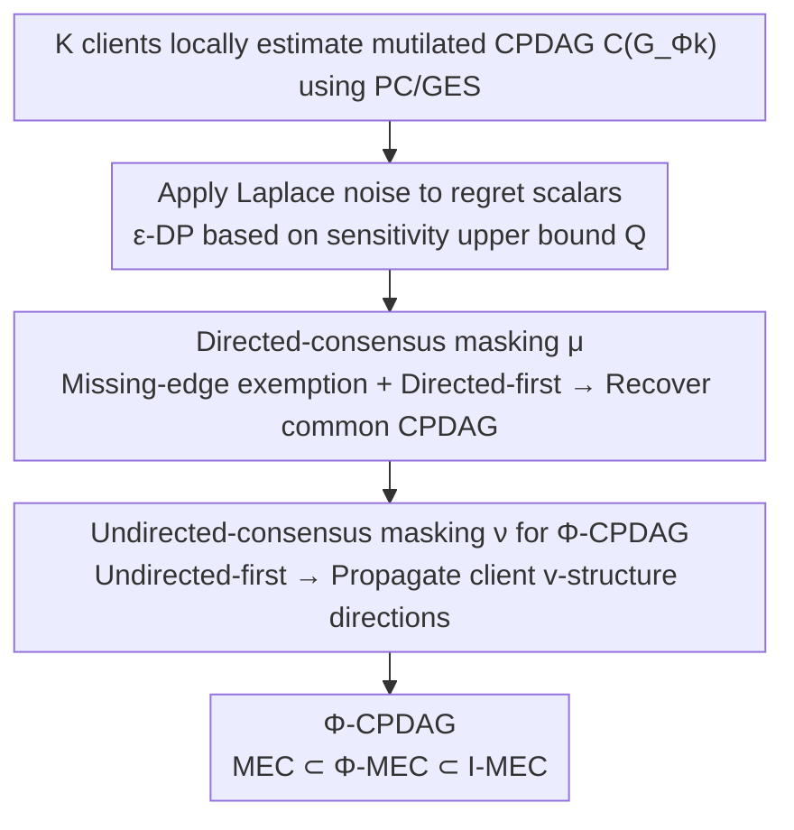

# Regret-Based Federated Causal Discovery with Unknown Interventions

**Conference**: ICML 2026  
**arXiv**: [2512.23626](https://arxiv.org/abs/2512.23626)  
**Code**: https://github.com/CIPHOD/pyCIPHOD (Available)  
**Area**: Causal Inference / Federated Learning / Differential Privacy  
**Keywords**: Causal Discovery, Federated Learning, Unknown Interventions, Φ-Markov Equivalence Class, Regret, Differential Privacy

## TL;DR
This paper proposes I-PERI: a two-phase process using "directed-consensus masking + undirected-consensus masking" to recover a new equivalence class, Φ-MEC (tighter than observational MEC but looser than I-MEC), in federated settings where client intervention targets are completely unknown and only regret scalars are shared, providing ε-differential privacy guarantees via Laplace noise.

## Background & Motivation

**Background**: The mainstream goal of causal discovery is to recover a CPDAG representing the Markov Equivalence Class (MEC) of the underlying causal DAG. When data is naturally distributed and cannot be centralized, Federated Causal Discovery (FCD) adapts this task to a "center server + multiple clients" architecture, with methods like PERI, FedDAG, FedCDH, and NOTEARS-ADMM being representative.

**Limitations of Prior Work**: Almost all FCD methods assume **all clients share the same causal model without interventions**. In real scenarios, treatment protocols or diagnostic standards at different hospitals constitute client-level **structural interventions**—they remove certain incoming edges in the causal graph, causing structural differences between client CPDAGs. Treating this heterogeneity as noise means regret-based methods like PERI **fail to converge to the true CPDAG**.

**Key Challenge**: (1) Existing "interventional causal discovery" (e.g., Hauser & Bühlmann, Yang et al.) assumes **known intervention targets**, but leaking these targets in federated settings violates privacy. (2) Works on "unknown interventions + multi-environments" (Jaber et al., Squires et al.) assume data can be centralized for direct comparison. **The question of what is the tightest identifiable equivalence class under the simultaneous presence of unknown interventions, strict federated constraints, and differential privacy remains unanswered.**

**Goal**: (i) Formalize the identifiable equivalence class under client-level unknown general interventions in a federated + DP setting; (ii) Provide an algorithm that exchanges only regret scalars without leaking client graphs; (iii) Prove convergence and differential privacy.

**Key Insight**: The authors observe that while interventions prune edges (making client graphs sparse), they may **generate new v-structures** when acting on a parent of a *shielded collider*. This means local client CPDAGs may actually reveal edge directions that observational data cannot orient. By treating "losses from missing edges" and "information from newly oriented edges" separately, one can utilize interventional information without being misled by sparsity.

**Core Idea**: Split PERI's single regret into two phases: The first phase uses **directed-consensus masking** to only penalize edges present in the client but missing in the server, recovering the common CPDAG. The second phase uses **undirected-consensus masking** to back-propagate orientation information gained from interventions to the server CPDAG, finally converging to a new equivalence class, Φ-CPDAG.

## Method

### Overall Architecture

I-PERI addresses the problem where $K$ clients each hold a dataset $\mathbb{D}^k$ and an **unknown** intervention target $\Phi^k \subseteq \mathbb{V}$ (assuming at least one client is purely observational, i.e., $\exists k:\Phi^k=\emptyset$). It avoids data centralization and graph uploading by only exchanging regret scalars while recovering the tightest possible causal structure with DP guarantees. The process splits the original PERI's single regret into two GES searches: the first phase exempts sparsity caused by interventions to recover the common CPDAG, and the second phase refines the structure into a Φ-CPDAG by utilizing new v-structures. Clients always estimate their own mutilated DAG CPDAG $\mathcal{C}(G_{\Phi^k})$ locally using PC/GES and add Laplace noise to regrets before uploading for $\epsilon$-DP.

### Key Designs

**1. Directed-consensus Masking: Reclassifying "Missing Edges" from Errors to Exemptions**

The original PERI's regret is $L(H,\mathbb{D}^k)-L(\mathcal{C}(G)$, $\mathbb{D}^k)$, assuming a shared $\mathcal{C}(G)$. With interventions, the client's mutilated graph $\mathcal{C}(G_{\Phi^k}) \ne \mathcal{C}(G)$, causing the regret to never reach zero and the search to fail. The authors introduce a masking operator $\mu$ to synthesize the server candidate $H$ and client CPDAG $\mathcal{C}(G_{\Phi^k})$ into a new graph for regret calculation: $R_k(H)=L(\mu(H,\mathcal{C}(G_{\Phi^k})),\mathbb{D}^k)-L(\mathcal{C}(G_{\Phi^k}),\mathbb{D}^k)$.

$\mu$ follows three rules: keep edges present in both; **delete** edges missing in either; use **directed** edges if one graph is directed and the other undirected ("directed-first"). This allows edges missing due to intervention to be exempted from server loss calculation (avoiding erroneous penalties), while edges missing in the server but present in the client are still penalized. Theorem 3.1 provides asymptotic convergence $\hat{G}\to\mathcal{C}(G)$ as $n^k\to\infty$.

**2. Undirected-consensus Masking and Φ-CPDAG: Utilizing Interventions as Information Sources**

The first phase only recovers the observational CPDAG. However, interventions provide extra orientation information. Crucially, when an intervention acts on a parent of a shielded collider, it creates a **new v-structure**, revealing directions unorientable in observational data. The second phase harvests this by running another regret search on the first-phase CPDAG, replacing $\mu$ with $\nu$.

The $\nu$ operator differs from $\mu$ in only one rule: if one graph is directed and the other is undirected, it uses the **undirected** edge ("undirected-first"). Intuitively, the server treats new v-structures from clients as authoritative and forces its own undirected edges to match those directions. The resulting **Φ-MEC** adds one condition to the MEC definition: two graphs must produce the same new v-structures under some intervention in $\Phi$ (Theorem 3.2). It identifies a structure between the observational MEC and the target-known $\mathcal{I}$-MEC without requiring knowledge of the targets (Theorem 3.3).

**3. ε-Differential Privacy Mechanism Based on Regret Sensitivity Upper Bound**

Typical FCD literature shares local graphs or parameters, which exceeds DP leakage limits. Since I-PERI only exchanges regret scalars, it applies a simple additive noise mechanism. Lemma 3.1 bounds the sensitivity of the regret: for a score function $L$ with parameters $\theta$ such that $\|\theta\|\le M$ and $P_k(x;\theta)\ge r$, the difference in regret induced by two datasets differing by one record is bounded by $Q \le (2M+1)\log r^2+\mathcal{O}(\log n/n)$. Each client adds i.i.d. Laplace noise with scale $\lambda=Q/\epsilon$ before uploading. Proposition 3.1 confirms $\epsilon$-DP. Additionally, reconstructing client graphs from regrets is NP-hard (Chickering et al. 2004), providing "information-theoretic" privacy without encryption.

### Loss & Training

The score function $L$ is BIC (consistent and decomposable). Phase 1 optimizes $\hat{G}=\arg\min_{H\in\mathcal{C}(\mathbb{G})}\max_k R_k^{\mu}(H)$ in the full CPDAG space. Phase 2 narrows the search to partially directed graphs derived from orienting the Phase 1 CPDAG, minimizing $\max_k R_k^{\nu}$. Both phases rely on Assumption 2.1—at least one client has purely observational data ($\Phi^k=\emptyset$) to anchor the common DAG, which is much weaker than knowing all intervention targets.

## Key Experimental Results

### Main Results

Linear synthetic data generated via Erdős-Rényi (expected edges = $p$). SEM: $V_i = \sum_{V_j \in Pa^G_i} w_{ji} V_j + N_i$. Each client (except one) has a **single structural intervention** biased toward triggering new v-structures. Metrics: SHD (lower is better), F1 (higher is better).

| Nodes $p$ | Metric | I-PERI | PERI | NOTEARS-ADMM | FedDAG | FedCDH |
|------|------|------|------|------|------|------|
| 3 | SHD | **1.53 ± 1.16** | 3.16 | 1.64 | 3.01 | 2.27 |
| 4 | SHD | **2.87 ± 1.88** | 4.43 | 2.99 | 3.46 | 4.83 |
| 8 | SHD | **4.44 ± 3.04** | 8.40 | 8.44 | 6.68 | 14.86 |
| 10 | SHD | 9.85 | 11.75 | 13.70 | **9.04** | 25.97 |
| 20 | SHD | **27.8 ± 4.79** | 30.0 | 29.45 | 30.74 | 61.74 |
| 8 | F1 | **0.74** | 0.64 | 0.46 | 0.72 | 0.44 |

I-PERI achieved the best SHD in 4 out of 5 scales; F1 advantage is significant in small graphs. Figure 7 shows I-PERI is **several orders of magnitude faster** than baselines on a symlog time axis.

### Ablation Study

| Configuration | Key Findings |
|------|---------|
| Full I-PERI | SHD 4.44 ($p=8$). |
| No Phase 2 (≈ Modified PERI with $\mu$ masking) | SHD 8.40. Degenerates to recovering only the observational CPDAG, losing orientation info. |
| Client uses GES instead of PC | Consistency in trends; I-PERI remains superior (Appendix B). |
| Heterogeneous samples (500/1000/2000) | I-PERI remains robust; NOTEARS-ADMM excluded due to equal-sample requirements. |
| Non-linear data (Appendix B) | I-PERI remains effective. |

### Key Findings

- **Interventions can be utilized, not just tolerated**: Removing Phase 2 doubles the SHD error, proving that propagating client v-structures to the server is the key driver of performance.
- **Client CPDAG quality is the upper bound**: Experiments focused on seeds where client F1 ≥ 0.85, as errors in local graphs propagate to the server.
- **Low computational overhead**: I-PERI is orders of magnitude faster than NOTEARS-ADMM/FedDAG because it avoids global optimization and uses local regret communication.
- **DP is "free"**: Since the method only exchanges regret scalars, adding Laplace noise is straightforward and does not alter the communication structure.

## Highlights & Insights

- **Φ-MEC as a new insight**: Extending the identifiability hierarchy from "MEC ⊂ $\mathcal{I}$-MEC" to "MEC ⊂ Φ-MEC ⊂ $\mathcal{I}$-MEC" formalizes the tightest bound under federated + unknown intervention constraints.
- **Elegant "Double Negative" Masking**: Phase 1 ("directed-first + exemption") avoids wrong penalties, while Phase 2 ("undirected-first + exemption") adopts client orientations. The same framework switches roles by changing one rule.
- **Portable tricks**: Modeling heterogeneity as "interventions" rather than "noise" can be applied to federated graph learning or RL.
- **Balance of Theory and Privacy**: I-PERI provides a rigorous DP proof (Lemma 3.1 sensitivity + Proposition 3.1) and fixes a minor error in the original PERI paper.

## Limitations & Future Work

- **Dependence on client CPDAG accuracy**: If local discovery fails, the server will adopt erroneous orientations.
- **Requirement for Assumption 2.1**: At least one observational client is needed; if all are intervened, convergence guarantees and the Φ-MEC definition must be revisited.
- **Standard Assumptions**: Assumes causal sufficiency, faithfulness, and no selection bias. Extending to latent variables is future work.
- **Intervention Type**: Mainly covers structural interventions. Parametric interventions (changing conditional distributions only) result in Phase 2 providing no extra orientation benefits over PERI.

## Related Work & Insights

- **vs PERI (Mian et al., 2023)**: PERI assumes a shared observational DAG. I-PERI generalizes this to unknown interventions and fixes an error in PERI's sensitivity proof.
- **vs $\mathcal{I}$-MEC (Hauser & Bühlmann 2012)**: They require known targets to get a tighter $\mathcal{I}$-CPDAG. I-PERI sacrifices some identifiability for privacy feasibility.
- **vs FedDAG / NOTEARS-ADMM**: These use continuous optimization or distributed tests assuming isomorphism and rarely discuss DP. I-PERI is faster and explicitly handles intervention heterogeneity.

## Rating
- Novelty: ⭐⭐⭐⭐⭐ Φ-MEC is an original and well-defined equivalence class with solid convergence proofs.
- Experimental Thoroughness: ⭐⭐⭐⭐ Extensive scaling and robustness tests; lacks a real-world medical data evaluation and ε-utility sweep.
- Writing Quality: ⭐⭐⭐⭐ High readability with clear definitions and diagrams.
- Value: ⭐⭐⭐⭐ Provides a practical baseline for cross-institutional multi-center research using causal discovery.

<!-- RELATED:START -->

## Related Papers

- [\[ICML 2026\] Angel or Demon: Investigating the Plasticity Interventions' Impact on Backdoor Threats in Deep Reinforcement Learning](angel_or_demon_investigating_the_plasticity_interventions_impact_on_backdoor_thr.md)
- [\[ICML 2026\] FedHPro: Federated Hyper-Prototype Learning via Gradient Matching](fedhpro_federated_hyper-prototype_learning_via_gradient_matching.md)
- [\[ICCV 2025\] FakeRadar: Probing Forgery Outliers to Detect Unknown Deepfake Videos](../../ICCV2025/ai_safety/fakeradar_probing_forgery_outliers_to_detect_unknown_deepfake_videos.md)
- [\[ICCV 2025\] Membership Inference Attacks with False Discovery Rate Control](../../ICCV2025/ai_safety/membership_inference_attacks_with_false_discovery_rate_control.md)
- [\[ICML 2025\] Avoiding Leakage Poisoning: Concept Interventions Under Distribution Shifts](../../ICML2025/ai_safety/avoiding_leakage_poisoning_concept_interventions_under_distribution_shifts.md)

<!-- RELATED:END -->
