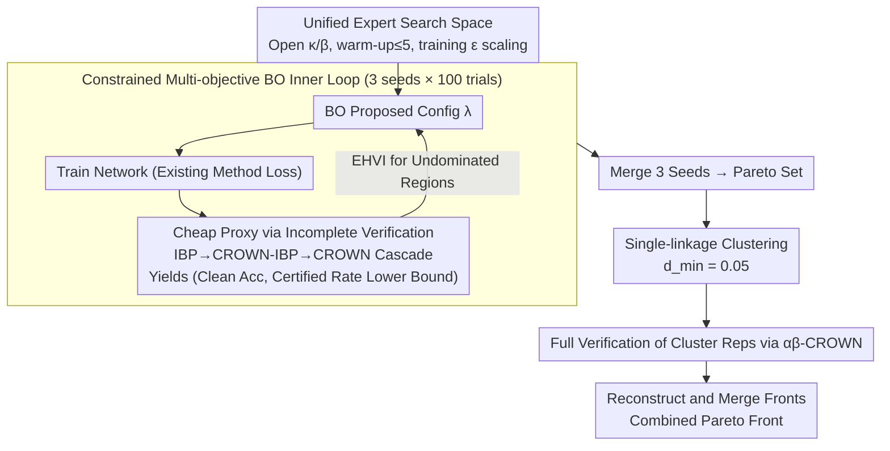

# Rethinking Evaluation Paradigms in IBP-based Certified Training

**Conference**: ICML 2026  
**arXiv**: [2606.02134](https://arxiv.org/abs/2606.02134)  
**Code**: https://github.com/ada-research/CTRAIN  
**Area**: AI Safety / Certified Robust Training / Multi-objective Hyperparameter Optimization  
**Keywords**: Interval Bound Propagation (IBP), Certified Training, Pareto Front, Multi-Objective Bayesian Optimization, Robust-Accuracy Trade-off  

## TL;DR
The authors argue that comparing IBP-based certified training methods by selecting "biased individual configurations" is inherently unfair. They propose using multi-objective Bayesian hyperparameter search to plot the Pareto front for each method, demonstrating that existing SOTA is significantly undertuned—CROWN-IBP can gain $\sim6\%$ in clean accuracy, while MTL-IBP on Tiny ImageNet improves both clean and certified accuracy by $\sim2\%$.

## Background & Motivation

**Background**: Under $\ell_\infty$ threat models, certified training utilizes incomplete verifiers (IBP / CROWN-IBP / SABR / MTL-IBP) to upper-bound the worst-case loss during training, allowing networks to obtain formal robustness certificates via full verifiers (e.g., $\alpha\beta$-CROWN) post-hoc. These methods inherently involve a trade-off parameter ($\kappa$, $\tau$, or $\alpha$) to balance "clean accuracy vs. certified accuracy."

**Limitations of Prior Work**: From Gowal 2019 to De Palma 2024b, nearly all papers report performance based on a single biased point on the trade-off curve. Although the recent CTBench (Mao 2025) performed grid searches, it still treated the problem as single-objective, tending to suppress certified accuracy. Consequently, reported points from different papers are often not on the same scale, making "SOTA" status dependent on which objective is prioritized.

**Key Challenge**: When objectives are conflicting, picking a single configuration is equivalent to "choosing a position before selecting evidence." The true capability of IBP-based methods lies across the entire Pareto front, which the community has failed to systematically map; this prevents the revelation of complementarity between methods and masks substantial undertuning.

**Goal**: To upgrade certified training evaluation from single-point comparisons to Pareto front comparisons and provide a reusable, computationally affordable multi-objective hyperparameter search protocol.

**Key Insight**: The authors employ multi-objective Bayesian optimization with Expected Hypervolume Improvement (EHVI) to directly search for the Pareto front. To make the search feasible within a budget similar to single-point tuning, they replace the "expensive full verification rate" with a "cheap incomplete verification rate" as a proxy objective and reduce the verification timeout from $1000\,\text{s}$ to $100\,\text{s}$, followed by a final pass of full verification on candidate points.

**Core Idea**: Use constrained multi-objective Bayesian optimization to search for the Pareto set in the 2D "clean accuracy / certified accuracy" space. After deduplication via clustering, expensive full verification is only performed on representative points—distributing the same search budget across four methods to generate a method-agnostic, reproducible "true SOTA" map.

## Method

### Overall Architecture
The evaluation protocol consists of four components. **First**, a unified search space: each method (IBP / CROWN-IBP / SABR / MTL-IBP) is searched over a "general + method-specific" hyperparameter set, including learning rate, $\ell_1$ weight, Shi 2021 regularization weight, warm-up/ramp-up epochs, scaling factors for training $\epsilon$, and method-specific $\kappa_{\text{start}} \ge \kappa_{\text{end}}$, $\beta$, $\tau$, $\alpha$, as well as PGD steps and step size. **Second**, a constrained multi-objective Bayesian optimizer: each objective (clean accuracy, incomplete certified accuracy) is modeled via independent Gaussian Processes using EHVI as the acquisition function. The search is constrained to regions of interest (e.g., CIFAR-10 $\epsilon=2/255$ requires clean $\ge 60\%$ and certified $\ge 40\%$). Each method runs for 100 trials across 3 random seeds to merge fronts. **Third**, cheap proxy targets: after training, a cascaded incomplete verification (IBP $\to$ CROWN-IBP $\to$ CROWN) provides an underestimate of certified accuracy, reserving expensive full verification for the final step. **Fourth**, Pareto front refinement: single-linkage clustering ($d_{\min}=0.05$) merges adjacent points in the Pareto set. One representative configuration from each cluster is subjected to full verification using $\alpha\beta$-CROWN (cutoff $1000\,\text{s}$), reconstructing the final front. Fronts from multiple methods are merged into a "combined Pareto front" as the evaluation benchmark.

### Key Designs

**1. Unified Expert Search Space: Surfacing Hidden Hyperparameters**

Previously, "older methods" appeared inferior largely due to undertuning—previous literature only tuned within a narrow range of verified configurations, often assuming default values for $\kappa$/$\beta$ transitions or using only 1 epoch for warm-up. This work constructs a comprehensive search space covering all reasonable values: allowing flexible $\kappa_{\text{start}} \ge \kappa_{\text{end}}$, up to 5 warm-up epochs, training $\epsilon$ larger than the evaluation $\epsilon$, and incorporating $\ell_1$ and Shi 2021 regularization. fANOVA importance analysis reveals that $\kappa_{\text{start}}$/$\kappa_{\text{end}}$ and warm-up epochs are the primary controllers of the trade-off. By opening these up, methods like CROWN-IBP (from 2020) see clean accuracy improvements of $\sim6\%$.

**2. Multi-objective BO + Constrained EHVI: Modeling Independent Objectives**

Since clean and certified accuracy are in direct conflict, the authors formulate the objective as a vector $\mathbf{f}(\boldsymbol{\theta})=(\text{acc}_{\text{clean}},\text{acc}_{\text{cert}})$. Instead of optimizing a weighted sum, they use independent GPs and the Expected Hypervolume Improvement (EHVI) to target undominated regions:

$$\mathrm{EHVI}(\boldsymbol{\theta})=\mathbb{E}_{\mathbf{f}}\big[\max(0,\ \mathrm{HV}(P\cup\{\mathbf{f}\})-\mathrm{HV}(P))\big]$$

where $P$ is the current Pareto front. Hand-coded constraints filter out regions that degenerate into standard adversarial training. Multi-objective BO is necessary because hyperparameters interact highly (e.g., $\kappa$ coupled with warm-up length); scalarization would distort the true reachable boundary.

**3. Incomplete Verification as a Cheap Proxy for Certified Accuracy**

Full verification is $\mathcal{NP}$-complete. To keep the 100-trial search budget affordable, the authors use a cascaded IBP $\to$ CROWN-IBP $\to$ CROWN approach during the search phase, calculating a provable lower bound $\widehat{\text{acc}}_{\text{cert}}\le\text{acc}_{\text{cert}}$. This is effective because the proxy is a monotonic underestimate that preserves the Pareto ranking, allowing the search to prioritize the correct configurations. Full $\alpha\beta$-CROWN verification is reserved for a small set of final candidates, where the cutoff can further be reduced from $1000\,\text{s}$ to $100\,\text{s}$ without shifting the front.

**4. Single-linkage Clustering + Full Verification Refinement: Efficient Budget Allocation**

BO tends to sample densely near the front, producing many configurations with accuracy differences $<0.5\%$. To avoid wasting the full verification budget on decorative details, the authors apply single-linkage hierarchical clustering in the 2D objective space (merging points with distance $\le d_{\min}=0.05$). One configuration per cluster is evaluated via $\alpha\beta$-CROWN. This keeps total verification costs comparable to single-point tuning while ensuring every point on the final "combined Pareto front" is backed by hard numbers from full verification.

### Loss & Training
The training side uses the original losses of each method but wraps them in the unified search: IBP uses $\kappa \cdot \mathcal{L} + (1-\kappa) \cdot \mathcal{L}_{\text{ver}}$, CROWN-IBP adds $\beta$ for transition, SABR uses $\tau \epsilon$ sub-intervals + ReLU shrinking, and MTL-IBP uses $\alpha \cdot \mathcal{L}_{\text{ver}} + (1-\alpha) \cdot \mathcal{L}_{\text{adv}}$. All experiments use the CNN7 architecture (Shi 2021). Optimization is performed using BoTorch + Optuna with a budget of 3 seeds $\times$ 100 trials.

## Key Experimental Results

### Main Results
Comparisons conducted on CIFAR-10 ($\epsilon \in \{2/255, 8/255\}$) and Tiny ImageNet ($\epsilon = 1/255$) using CNN7 against original papers and CTBench.

| Dataset | $\epsilon$ | Method | Clean vs. Prev. SOTA | Certified vs. Prev. SOTA |
|--------|-----------|------|--------------------|--------------------|
| CIFAR-10 | $2/255$ | SABR | $\ge +1\%$ | $\ge +1\%$ |
| CIFAR-10 | $2/255$ | CROWN-IBP | $\sim +6\%$ | Parity |
| CIFAR-10 | $8/255$ | IBP | Significant gain | Parity |
| Tiny ImageNet | $1/255$ | MTL-IBP | $\sim +2\%$ | $\sim +2\%$ |
| Tiny ImageNet | $1/255$ | SABR | Slightly higher clean | Slightly lower cert |

Findings from the merged Pareto front: On CIFAR-10 ($2/255$), SABR and MTL-IBP are complementary, both contributing to the front. At $8/255$, all four methods contribute points. On Tiny ImageNet, SABR dominates the "high clean accuracy" end, while MTL-IBP dominates the "high certified accuracy" end. "SOTA" becomes a question of "which objective range do you care about?"

### Ablation Study

| Configuration | Key Metric | Description |
|------|---------|------|
| Val-tuning vs. Test-tuning | Front strictly dominated | Existing work largely overestimates performance by tuning on test sets |
| Cutoff $1000\,\text{s} \to 100\,\text{s}$ | Front unchanged | Verification cost can be reduced by over an order of magnitude |
| BO Trial count $100 \to 50$ | Front significantly degrades | Optimization budget is more sensitive than verification timeout |
| Removing $\kappa$ transition | IBP / CROWN-IBP drop off front | $\kappa_{\text{start}}, \kappa_{\text{end}}$ are high-importance hyperparameters in all scenarios |

### Key Findings
- fANOVA importance analysis shows IBP/CROWN-IBP $\kappa$ transitions are the primary drivers of the trade-off; setting this to 0 by default is why older methods appeared weaker.
- SABR's sub-selection dominates its front position more than $\tau$ or PGD parameters; MTL-IBP's $\alpha$ and $\epsilon$ scaling factors determine its reachable region.
- At large radii like $8/255$, the four methods converge, suggesting the bottleneck is the inherent looseness of IBP bounds rather than the loss function designs.
- Tuning on the test set is common but leads to generalization overestimation; the Pareto front from validation tuning is strictly worse.

## Highlights & Insights
- A paradigm-shifting "methodological surgery" that quantitatively rewrites 5 years of SOTA rankings: CROWN-IBP was marginalized simply due to poor $\kappa$ tuning, suggesting that "algorithmic progress" has been significantly overestimated.
- The three-stage pipeline (cheap proxy + clustering + late full verification) successfully incorporates expensive evaluation into the BO loop, providing a template for any "cheap training, expensive evaluation" benchmark in robustness or fairness.
- Method complementarity is quantified for the first time: practitioners should not ask "SABR or MTL-IBP," but rather "where is my target in the trade-off space?"

## Limitations & Future Work
- Experiments are restricted to $\ell_\infty$ threat models and the CNN7 architecture; consistency on $\ell_2$, $\ell_1$, or Transformers remains an open question.
- The protocol is computationally intensive (3 seeds $\times$ 100 trials + full verification), potentially raising the bar for "fair evaluation" beyond the reach of smaller labs.
- The authors suggest future work should shift toward "cheaply verifiable" training objectives rather than simply extending verification timeouts—an implicit critique of current practices in SABR/MTL-IBP, though specific solutions are not provided.

## Related Work & Insights
- **vs. CTBench (Mao 2025)**: CTBench uses 250 grid search trials for single-objective comparison, favoring "high certified accuracy." This work uses 300 BO trials for multi-objective comparison, revealing a previously underestimated front and emphasizing method complementarity.
- **vs. De Palma 2024b (MTL-IBP)**: The original paper reported a single certified-heavy point. This work shows MTL-IBP can achieve a $\sim2\%$ gain in clean accuracy on Tiny ImageNet that the owners themselves missed.
- **vs. Müller 2023 (SABR)**: The original best point on CIFAR-10 ($2/255$) is outperformed by this work by $1\%$ in both clean and certified metrics; it also shows SABR is not globally optimal at large $\epsilon$.

## Rating
- Novelty: ⭐⭐⭐⭐ While multi-objective BO is a mature method, applying the "Pareto front evaluation" to certified training is a clear paradigm shift.
- Experimental Thoroughness: ⭐⭐⭐⭐⭐ 4 methods $\times$ 3 benchmarks $\times$ multiple ablations, including fANOVA and budget sensitivity.
- Writing Quality: ⭐⭐⭐⭐ Clear arguments, though the "democratization of the protocol" could be addressed more deeply.
- Value: ⭐⭐⭐⭐⭐ Directly rewrites the certified training leaderboard and provides the open-source CTRAIN tool, carrying high community impact.

<!-- RELATED:START -->

## Related Papers

- [\[AAAI 2026\] An Information Theoretic Evaluation Metric for Strong Unlearning](../../AAAI2026/ai_safety/an_information_theoretic_evaluation_metric_for_strong_unlearning.md)
- [\[CVPR 2026\] Towards Reliable Evaluation of Adversarial Robustness for Spiking Neural Networks](../../CVPR2026/ai_safety/towards_reliable_evaluation_of_adversarial_robustness_for_spiking_neural_network.md)
- [\[ICML 2026\] SORA: Free Second-Order Attacks in Fast Adversarial Training](sora_free_second-order_attacks_in_fast_adversarial_training.md)
- [\[ICML 2026\] Training-Free Coverless Multi-Image Steganography with Access Control](training-free_coverless_multi-image_steganography_with_access_control.md)
- [\[ICML 2026\] TimeGuard: Channel-wise Pool Training for Backdoor Defense in Time Series Forecasting](timeguard_channel-wise_pool_training_for_backdoor_defense_in_time_series_forecas.md)

<!-- RELATED:END -->
