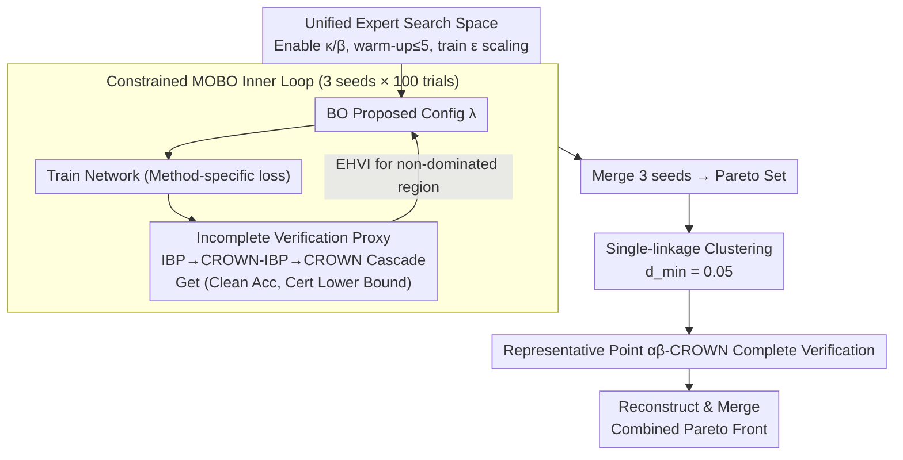

# Rethinking Evaluation Paradigms in IBP-based Certified Training

**Conference**: ICML 2026  
**arXiv**: [2606.02134](https://arxiv.org/abs/2606.02134)  
**Code**: https://github.com/ada-research/CTRAIN  
**Area**: AI Safety / Certified Robust Training / Multi-objective Hyperparameter Optimization  
**Keywords**: Interval Bound Propagation, Certified Training, Pareto Front, Multi-objective Bayesian Optimization, Robust-Accuracy trade-off  

## TL;DR
The authors point out that comparing IBP-based certified training methods using "biased configurations" is unfair. They propose drawing the Pareto front for each method using multi-objective Bayesian hyperparameter search, proving that existing SOTA methods are generally under-tuned—CROWN-IBP clean accuracy can increase by approximately $6\%$, and MTL-IBP on Tiny ImageNet can simultaneously gain $\sim2\%$ in both clean and certified accuracy.

## Background & Motivation

**Background**: Under the $\ell_\infty$ threat model, certified training utilizes incomplete verifiers (IBP / CROWN-IBP / SABR / MTL-IBP) to upper-bound worst-case loss during training, allowing networks to obtain formal robustness certificates via complete verifiers (e.g., $\alpha\beta$-CROWN) post-hoc. These methods naturally involve a trade-off parameter ($\kappa$, $\tau$, or $\alpha$) to balance "clean accuracy vs. certified accuracy."

**Limitations of Prior Work**: From Gowal 2019 to De Palma 2024b, almost all papers report results at a single biased point on the curve. Even the recent CTBench (Mao 2025), which performs grid searches, treats it as a single-objective problem biased towards certified accuracy. Consequently, reported points from different papers are not on the same scale, making "SOTA" dependent on which side of the trade-off is favored.

**Key Challenge**: When objectives are inherently conflicting, comparing methods via a single configuration is equivalent to "choosing the standpoint before choosing the evidence." The true capability of IBP-type methods is reflected across the entire Pareto front, yet the community has lacked a systematic way to map it, failing to reveal method complementarity and masking substantial space for tuning.

**Goal**: Upgrade certified training evaluation from single-point comparison to Pareto front comparison and provide a reusable, computationally affordable multi-objective hyperparameter search protocol.

**Key Insight**: The authors utilize Multi-Objective Bayesian Optimization with Expected Hypervolume Improvement (EHVI) to directly search for the Pareto front. To keep the search budget comparable to single-point tuning, they replace "expensive complete verification rate" with "cheap incomplete verification rate" as a proxy objective and reduce the verification timeout from $1000\,\text{s}$ to $100\,\text{s}$ for candidates before a final pass with full verification.

**Core Idea**: Use constrained multi-objective Bayesian optimization to search the Pareto set in the 2D "clean accuracy / certified accuracy" space. After deduplication via clustering, only representative points undergo expensive complete verification—allocating the same search budget across four methods to produce a method-agnostic, reproducible "true SOTA" map.

## Method

### Overall Architecture
The evaluation protocol consists of four components. **First**, a unified search space: each method (IBP / CROWN-IBP / SABR / MTL-IBP) is searched over a "general + method-specific" hyperparameter set, including learning rate, $\ell_1$ regularization weight, Shi 2021 regularization weight, warm-up / ramp-up epochs, and training $\epsilon$ scaling factor, plus method-specific $\kappa_{\text{start}} \ge \kappa_{\text{end}}$, $\beta$, $\tau$, $\alpha$, and PGD parameters. **Second**, a constrained multi-objective Bayesian optimizer: each objective (clean accuracy, incomplete certified accuracy) is modeled by independent Gaussian Processes with EHVI as the acquisition function. The search is constrained to regions of interest (e.g., CIFAR-10 $\epsilon=2/255$ requires clean $\ge 60\%$, certified $\ge 40\%$), running 100 trials across 3 random seeds per method. **Third**, a cheap proxy objective: after training, a cascaded incomplete verification (IBP→CROWN-IBP→CROWN) provides an underestimate of certified accuracy, saving complete verification for the end. **Fourth**, Pareto front refinement: single-linkage clustering ($d_{\min}=0.05$) merges adjacent points in the Pareto set. One representative point per cluster is verified using $\alpha\beta$-CROWN (cutoff $1000\,\text{s}$) to reconstruct the final front. Fronts from multiple methods are then merged into a "combined Pareto front" benchmark.

### Key Designs

**1. Unified Expert Search Space: Exposing hyperparameters previously hidden by default values**

Past "legacy methods" appeared inferior largely due to under-tuning—prior literature tuned only near a few validated configurations, particularly assuming $\kappa$ / $\beta$ transitions to be 0 or using at most 1 warm-up epoch. Ours constructs a search space covering all reasonable values: enabling $\kappa_{\text{start}} \ge \kappa_{\text{end}}$, allowing up to 5 warm-up epochs, permitting training $\epsilon$ to be larger than evaluation $\epsilon$, and including $\ell_1$ and Shi 2021 regularization. fANOVA importance analysis shows $\kappa_{\text{start}}$ / $\kappa_{\text{end}}$ and warm-up epochs are primary drivers of the trade-off. By unlocking these, CROWN-IBP (a 2020 method) gains $\sim 6\%$ in clean accuracy.

**2. MOBO + Constrained EHVI: Letting objectives manifest naturally**

IBP methods depend on trade-off parameters where clean and certified accuracies conflict. Ours avoids optimizing weighted sums and instead treats the objective as a vector $\mathbf{f}(\boldsymbol{\theta})=(\text{acc}_{\text{clean}},\text{acc}_{\text{cert}})$. Two independent GPs fit the objectives, while EHVI targets non-dominated regions:

$$\mathrm{EHVI}(\boldsymbol{\theta})=\mathbb{E}_{\mathbf{f}}\big[\max(0,\ \mathrm{HV}(P\cup\{\mathbf{f}\})-\mathrm{HV}(P))\big]$$

Where $P$ is the current Pareto front. Hard constraints prune regions effectively degenerating into adversarial training. MOBO is essential because hyperparameters like $\kappa$ and warm-up length are highly coupled; scalarization would distort the true front.

**3. Incomplete Verification as a Cheap Proxy: Budgeting search costs**

Complete verification is $\mathcal{NP}$-complete. Evaluating every trial would be unaffordable. The key strategy is to use a cascaded IBP → CROWN-IBP → CROWN sequence during the search—calling stronger methods only if the previous fails—to obtain a verifiable lower bound $\widehat{\text{acc}}_{\text{cert}}\le\text{acc}_{\text{cert}}$. This works because monotonic proxies rarely change Pareto ordering. Only for the final Pareto set is $\alpha\beta$-CROWN used. Reducing the cutoff from $1000\,\text{s}$ to $100\,\text{s}$ during search further reduced MTL-IBP verification time on CIFAR-10 from 1311 to 208 hours without altering the front.

**4. Single-linkage Clustering + Verification Refinement: Spending budget where it matters**

BO often samples densely along the curve, producing clusters of points with $<0.5\%$ performance difference. Ours uses single-linkage hierarchical clustering in the objective space ($d_{\min}=0.05$) to merge candidates. Only one configuration per cluster undergoes full $\alpha\beta$-CROWN verification. This keeps verification costs comparable to single-point tuning while ensuring every point on the final "combined Pareto front" is based on hard numbers from complete verification.

### Loss & Training
The training side uses existing loss functions for each method but places them within the unified search framework: IBP's $\kappa \cdot \mathcal{L} + (1-\kappa) \cdot \mathcal{L}_{\text{ver}}$, CROWN-IBP's $\beta$-based transition, SABR's $\tau \epsilon$ sub-interval + ReLU shrinking, and MTL-IBP's $\alpha \cdot \mathcal{L}_{\text{ver}} + (1-\alpha) \cdot \mathcal{L}_{\text{adv}}$. All experiments use the CNN7 architecture from Shi 2021, optimized via BoTorch + Optuna using an EHVI budget of 3 seeds × 100 trials.

## Key Experimental Results

### Main Results
Evaluated on CIFAR-10 ($\epsilon \in \{2/255, 8/255\}$) and Tiny ImageNet ($\epsilon = 1/255$) using CNN7, comparing the four methods against original papers and CTBench.

| Dataset | $\epsilon$ | Method | Clean vs. Prev. SOTA | Certified vs. Prev. SOTA |
|--------|-----------|------|--------------------|--------------------|
| CIFAR-10 | $2/255$ | SABR | $\ge +1\%$ | $\ge +1\%$ |
| CIFAR-10 | $2/255$ | CROWN-IBP | $\sim +6\%$ | Comparable |
| CIFAR-10 | $8/255$ | IBP | Significant lifting | Comparable |
| Tiny ImageNet | $1/255$ | MTL-IBP | $\sim +2\%$ | $\sim +2\%$ |
| Tiny ImageNet | $1/255$ | SABR | Slightly > MTL-IBP (clean) | Slightly < MTL-IBP (cert) |

Key Findings: On CIFAR-10 $2/255$, SABR and MTL-IBP are complementary, together forming the front. At $8/255$, all four methods contribute points. On Tiny ImageNet, SABR dominates the high-accuracy end, while MTL-IBP dominates high certification. "Who is SOTA" now depends on the target trade-off interval.

### Ablation Study

| Configuration | Key Metric | Description |
|------|---------|------|
| Val vs. Test Tuning | Front strictly dominated | Prior work usually tunes on test sets; absolute figures are inflated. |
| Cutoff $1000\,\text{s}$ → $100\,\text{s}$ | Unchanged front | Computational cost can be reduced by over an order of magnitude. |
| BO Trials $100 \to 50$ | Significant degradation | Optimization budget is more sensitive than verification timeout. |
| Removing $\kappa$ transition | IBP/CROWN-IBP drop out | $\kappa_{\text{start}}, \kappa_{\text{end}}$ are high-importance hyperparameters in all scenarios. |

### Key Findings
- fANOVA analysis confirms $\kappa$ transition in IBP/CROWN-IBP is the primary trade-off controller; defaults in literature caused legacy methods to be underestimated.
- SABR’s sub-selection dominates its front position more than $\tau$ or PGD parameters.
- At large radii like $8/255$, all methods converge, suggesting the bottleneck is the inherent slackness of IBP bounds rather than loss design.
- Tuning on the test set is a common community habit, but validation-tuned fronts are strictly lower, indicating generalization overestimation in prior work.

## Highlights & Insights
- A methodological shift redefines the SOTA leaderboard of the last 5 years: CROWN-IBP was marginalized simply due to poor $\kappa$ tuning, suggesting "algorithmic progress" has been overestimated.
- The three-stage pipeline (proxy → clustering → complete verification) successfully integrates expensive evaluation into the BO loop, providing a template for any "cheap training, expensive evaluation" benchmark.
- "Method complementarity" is quantified: researchers should ask which method is optimal for a specific trade-off interval rather than seeking a universal winner.

## Limitations & Future Work
- Experiments are limited to the $\ell_\infty$ threat model and CNN7 architecture; consistency on $\ell_2, \ell_1$, or Transformers remains an open question.
- The protocol is computationally intensive (300 trials + complete verification), potentially creating a barrier for smaller research groups despite optimized proxies.
- Future work should move towards "cheap-to-verify" training objectives rather than relying on longer timeouts—a subtle critique of current SABR/MTL-IBP practices.

## Related Work & Insights
- **vs. CTBench (Mao 2025)**: CTBench uses 250 grid search trials for single-objective comparison, favoring high certification. Ours uses 300 BO trials for multi-objective comparison, revealing underestimated fronts and method complementarity.
- **vs. De Palma 2024b (MTL-IBP)**: The original paper reported a certification-heavy point; Ours shows a $\sim 2\%$ gain in clean accuracy on Tiny ImageNet that the original authors missed.
- **vs. Müller 2023 (SABR)**: The best point from the SABR paper on CIFAR-10 $2/255$ is surpassed by Ours by $1\%$ in both clean and certified accuracy.

## Rating
- Novelty: ⭐⭐⭐⭐ Adaptation of MOBO is mature, but shifting the paradigm to Pareto fronts in certified training is a clear breakthrough.
- Experimental Thoroughness: ⭐⭐⭐⭐⭐ Comprehensive coverage across 4 methods, 3 benchmarks, and extensive fANOVA/budget ablations.
- Writing Quality: ⭐⭐⭐⭐ Clear argumentation, though democratization of the compute-heavy protocol could be discussed further.
- Value: ⭐⭐⭐⭐⭐ Rewrites the certified training leaderboard and provides the CTRAIN open-source tool.

<!-- RELATED:START -->

## Related Papers

- [\[ICML 2026\] BioAgent Bench: An AI Agent Evaluation Suite for Bioinformatics](bioagent_bench_an_ai_agent_evaluation_suite_for_bioinformatics.md)
- [\[ICML 2026\] MLUBench: A Benchmark for Lifelong Unlearning Evaluation in MLLMs](mlubench_a_benchmark_for_lifelong_unlearning_evaluation_in_mllms.md)
- [\[AAAI 2026\] An Information Theoretic Evaluation Metric for Strong Unlearning](../../AAAI2026/ai_safety/an_information_theoretic_evaluation_metric_for_strong_unlearning.md)
- [\[ICML 2026\] In-Training Defenses Against Emergent Misalignment in Language Models](in-training_defenses_against_emergent_misalignment_in_language_models.md)
- [\[ICML 2026\] Red-Teaming Agent Execution Contexts: Open-World Security Evaluation on OpenClaw](red-teaming_agent_execution_contexts_open-world_security_evaluation_on_openclaw.md)

<!-- RELATED:END -->
