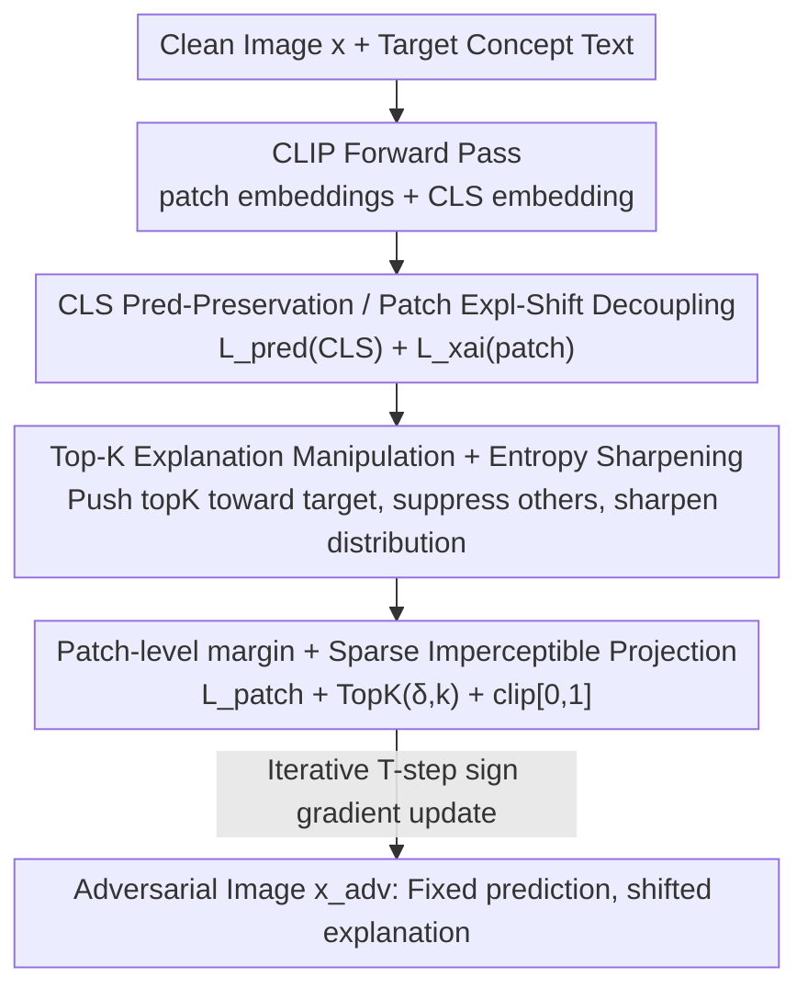

# Right Predictions, Misleading Explanations: On the Vulnerability of Vision-Language Model Explanations

**Conference**: ICML 2026  
**arXiv**: [2605.16651](https://arxiv.org/abs/2605.16651)  
**Code**: TBD  
**Area**: AI Security / Adversarial Attacks / Explainability Robustness  
**Keywords**: VLM Explanations, CLIP, Gray-box Adversarial Attacks, Explanation Faithfulness, Heatmap Manipulation

## TL;DR
This work proposes X-Shift—a gray-box adversarial attack that, while **completely maintaining CLIP's predictions**, uses imperceptible sparse perturbations to shift the entire explanatory heatmap to semantically irrelevant regions. It reveals that the faithfulness of VLM explanations can be thoroughly decoupled from prediction accuracy; this attack surface of "correct predictions but deceptive explanations" has been largely unexplored.

## Background & Motivation

**Background**: Vision-Language Models (VLMs) like CLIP are widely deployed in healthcare, autonomous driving, and decision support scenarios. Accompanying Explainable AI (XAI) methods often use heatmaps to highlight "input regions influencing predictions" as a proxy for model reliability—used for auditing, debugging, and trust calibration. In CLIP, explanations typically derive from patch–text similarity maps.

**Limitations of Prior Work**: Extensive research has shown that the explanation mechanisms of single-modal vision models are fragile—explanations can be significantly manipulated while keeping predictions unchanged (targeting saliency, LIME, SHAP, Grad-CAM, etc.). However, these studies focus almost exclusively on single-modal image classifiers; **the robustness of VLM explanations remains largely unaddressed**.

**Key Challenge**: VLM explanations are not merely "diagnostic tools"; they are often directly integrated into downstream tasks like visual localization, reasoning, and security verification. If patch–text similarity maps are compromised, humans and automated systems are systematically misled, yet **no anomaly is detectable through prediction accuracy**—existing monitoring only tracks prediction outputs, failing to capture explanation integrity.

**Goal**: To prove that explanation faithfulness in VLMs can be manipulated independently of predictions and to characterize the effectiveness, imperceptibility, and transferability of such attacks across models and methods.

**Key Insight**: Conventional adversarial attacks aim to cause **misclassification**; this work does the opposite—aiming for **correct classification but misplaced explanations**. The entry point is CLIP's patch-level representation: shifting patch embeddings toward an attacker-specified target text direction without altering the CLS-level prediction.

**Core Idea**: Utilize multi-objective gray-box optimization to satisfy "prediction preservation at the CLS level" and "explanation shifting at the patch level" at different granularities simultaneously, using sparse imperceptible perturbations to redirect the heatmap.

## Method

### Overall Architecture

X-Shift is an **inference-time, gray-box** adversarial attack that requires no changes to model parameters or training data, utilizing only forward passes and gradients. Threat model: The attacker has access to the model's forward pass and gradients sufficient for input optimization but cannot access or modify parameters and training data—a realistic scenario for models like CLIP where weights are public but training details may be unknown. The target is CLIP: image encoder $f_I$ and text encoder $f_T$ are aligned in the same space, similarity $s(x,t)=z_I^\top z_T$, and explanations come from patch–text cosine similarity maps (a $7\times7$ grid from $224\times224$ input via attention pooling).

The process: Given a clean image $x$ and target concept text, pixel values are iteratively updated using signed gradients to minimize a **four-term joint loss**—pushing top-$K$ patch similarities toward the target text, suppressing CLS-level prediction changes, and applying patch-level margins and entropy sharpening to concentrate the heatmap. Each step projects the perturbation $\delta$ onto top-$k$ pixels (sparse and imperceptible) and clips it back to the valid pixel range. The output is an adversarial image $x_{adv}=x+\delta$ with unchanged predictions but a shifted explanatory heatmap.

### Key Designs

**1. Dual-granularity Decoupling of CLS Prediction and Patch Explanation**

This is the foundation of the attack. The difficulty lies in the fact that conventional perturbations usually alter predictions, making "correct but deceptive" outcomes hard to achieve. X-Shift addresses this at two different granularities. The prediction preservation term acts at the global CLS level, enforcing the maintenance of the clean prediction $y^*$:

$$\mathcal{L}_{\mathrm{pred}}=-\log\frac{\exp(z_{\mathrm{cls}}^\top t_{y^*})}{\sum_c \exp(z_{\mathrm{cls}}^\top t_c)};$$

The explanation manipulation term acts at the patch level. Since CLIP predictions are primarily determined by CLS representations while explanations are determined by patch–text similarities, these signals are relatively independent within the network. Thus, one can keep the CLS representation nearly unchanged (achieving cosine similarity $\sim0.8$–$0.97$ and Max $\Delta$Prob near 0) while substantially overwriting patch heatmaps. This "divide and conquer" is the mechanism for **stripping** explanation faithfulness from prediction accuracy.

**2. Top-K Explanation Manipulation + Entropy Sharpening**

The explanation manipulation loss shuffles the heatmap onto a target concept. Let the similarity between a normalized patch embedding and the target text embedding be $s_{i,t}=z_i^\top z_{T_{\text{tar}}}$. The loss pushes the top-$K$ patches higher and suppresses the rest:

$$\mathcal{L}_{\mathrm{xai}}=-\frac{1}{K}\sum_{i\in\text{TopK}}s_{i,t}+\alpha\cdot\frac{1}{P-K}\sum_{i\notin\text{TopK}}s_{i,t}.$$

Pushing only the top-$K$ rather than all patches ensures the heatmap forms a **peak** at the target region rather than a global elevation. To prevent the heatmap from becoming diffuse, an entropy sharpening term $\mathcal{L}_{\mathrm{entropy}}=\sum_p m_p\log m_p$ (where $m_p$ is the similarity softmax, corresponding to negative Shannon entropy) is minimized to force a **sharp, concentrated** similarity distribution.

**3. Patch-level Margin + Sparse Imperceptible Projection**

To ensure the target concept "wins" over other classes in each patch, a patch-level margin hinge loss is added:

$$\mathcal{L}_{\mathrm{patch}}=\frac{1}{P}\sum_{p=1}^{P}\max\Big(0,\max_{c\neq t}(s_{p,c}-s_{p,t}+m)\Big),$$

enforcing that the target similarity on each patch is higher than the runner-up class by margin $m$. To remain **imperceptible**, each step projects the perturbation $\delta=x_{adv}-x$ onto the $k$ pixels with the largest absolute values ($\delta\leftarrow\mathrm{TopK}(\delta,k)$) and clips $x_{adv}\in[0,1]^d$. This sparsity and clipping ensure the perturbation is both stealthy and physically effective.

### Loss & Training

The total loss treats explanation manipulation as the primary objective with other terms as auxiliary constraints:

$$\mathcal{L}=\mathcal{L}_{\mathrm{xai}}+\lambda_{\mathrm{pred}}\mathcal{L}_{\mathrm{pred}}+\lambda_{\mathrm{patch}}\mathcal{L}_{\mathrm{patch}}+\lambda_{\mathrm{ent}}\mathcal{L}_{\mathrm{entropy}}.$$

Optimization proceeds for $T$ iterations according to Algorithm 1: compute embeddings → evaluate four losses → signed gradient ascent $x^{(i)}\leftarrow x^{(i-1)}+\eta\,\mathrm{sign}(\nabla_x\mathcal{L})$ → top-$k$ sparse projection → clip to $[0,1]$. Operationally, $\mathcal{L}_{\mathrm{xai}}$ is weighted at 20.0 and prediction consistency at 0.01 to balance "explanation shifting" and "prediction preservation." The attack occurs strictly at inference time with no additional training data required.

## Key Experimental Results

### Main Results

Evaluated on ImageNet-1k / Flickr30k / MS-COCO across CLIP ViT-B/16, ViT-B/32, and ViT-L/14. Metrics: CosSim↑ (CLS embeddings clean vs. adversarial), Max $\Delta$Prob↓ (maximum prediction probability shift), Top-$k$ IoU↓ (spatial overlap of explanation heatmaps, lower means more successful shifting).

| Dataset | Backbone | CosSim ↑ | Max ΔProb ↓ | Top-k IoU ↓ |
|--------|----------|----------|-------------|-------------|
| ImageNet | ViT-B/16 | 0.805 | 0.004 | 0.487 |
| ImageNet | ViT-L/14 | 0.948 | 0.000 | 0.551 |
| Flickr30k | ViT-B/32 | 0.974 | 0.000 | 0.867 |
| Flickr30k | ViT-L/14 | 0.933 | 0.000 | 0.727 |
| MS-COCO | ViT-B/16 | 0.977 | 0.000 | 0.611 |
| MS-COCO | ViT-L/14 | 0.962 | 0.000 | 0.583 |

Across all settings, CosSim remains high and Max $\Delta$Prob is near 0 (predictions are rock solid), while IoU drops significantly. This confirms the core effect of X-Shift: **Explanation faithfulness is decoupled from prediction correctness**.

### Ablation Study

Perturbation transferability across CLIP backbones (source → target; self-attack = same model):

| Source → Target | CosSim ↑ | Max ΔProb ↓ | IoU-TopK ↓ | Soft-IoU ↓ |
|-----------|----------|-------------|------------|------------|
| ViT-L/14 → (Self) | 0.9421 | 0.00044 | 0.4713 | 0.9837 |
| ViT-L/14 → ViT-B/16 | 0.9928 | 0.00007 | 0.7818 | 0.9962 |
| ViT-L/14 → ViT-B/32 | 0.9180 | 0.00023 | 0.8571 | — |

Self-attack IoU is the lowest (strongest shift). While cross-model transfer is weaker, it consistently exists. Perturbations from ViT-B/32 transfer most broadly, while those from ViT-L/14 are more model-specific.

### Key Findings
- **Prediction attacks cannot replicate explanation attacks**: Standard adversarial attacks targeting predictions cannot produce the same explanation-shifting behavior even with much larger budgets—indicating this is a distinct attack mode.
- **The vulnerability is systemic**: Perturbations transfer across architectures and explanation methods, implying the weakness stems from the VLM explanation mechanism itself, not a specific model.
- **Stealthy and difficult to detect**: Perturbations are imperceptible, and existing monitoring focusing on prediction outputs is completely blind to these shifts.

## Highlights & Insights
- **Systematic introduction of "explanation attacks" to VLMs**: While prior work studied single-modal classifiers, this work identifies that patch–text similarity maps—a unique VLM signal—can be directionally manipulated.
- **Clever dual-granularity decoupling**: Using CLS for predictions and patches for explanations leverages the relative independence of these signals in CLIP, achieving "correct but deceptive" results more naturally than simply weighting losses.
- **Practical warnings for deployment**: In healthcare or security, if heatmaps are used as proof of trust, X-Shift can mislead auditors without detection. Monitoring frameworks must expand from tracking predictions to identifying explanation manipulation.

## Limitations & Future Work
- The attack focuses on CLIP and patch–text similarity; whether it is equally effective against Grad-CAM/IG or other VLM architectures requires further coverage.
- The gray-box assumption requires gradient access; pure black-box (output only) reproduction remains unexplored.
- Defense: This work focuses on revealing vulnerabilities. Systematic certifiable defense schemes against explanation shifting remain an open problem.
- Evaluation uses $7\times7$ heatmaps; finer-grained explanations or human studies on "misleading degree" could provide more depth.

## Related Work & Insights
- **vs. Single-modal explanation attacks (Ghorbani 2019 / Dombrowski 2019)**: Proved saliency/attribution can be altered in classifiers while keeping predictions fixed. This work extends this to multi-modal CLIP where explanations are integrated into downstream decision-making.
- **vs. Focus-shifting attacks (Huang et al. 2023)**: Also redirects saliency while preserving predictions, but this work specifically targets VLM patch–text similarities and emphasizes cross-architecture transferability and sparsity.
- **vs. CLIP prediction robustness research**: Prior work focused on disrupting predictions; this work is the first to prove **explanation integrity** can be independently compromised.

## Rating
- Novelty: ⭐⭐⭐⭐⭐ First systematic directional attack on VLM explanation faithfulness.
- Experimental Thoroughness: ⭐⭐⭐⭐ Solid results over three datasets and three backbones, though lacks formal defense evaluation.
- Writing Quality: ⭐⭐⭐⭐ Clear motivation and well-structured loss design.
- Value: ⭐⭐⭐⭐⭐ Highlights a major security risk for high-stakes VLM deployments where heatmaps are used for trust.

<!-- RELATED:START -->

## Related Papers

- [\[ICLR 2026\] ATEX-CF: Attack-Informed Counterfactual Explanations for Graph Neural Networks](../../ICLR2026/ai_safety/atex-cf_attack-informed_counterfactual_explanations_for_graph_neural_networks.md)
- [\[ACL 2026\] UniVid: A Unified Vision-Language Model for Video Moderation](../../ACL2026/ai_safety/univid_unified_vision-language_model_for_video_moderation.md)
- [\[ICML 2026\] Towards Fine-Grained Robustness: Attention-Guided Test-Time Prompt Tuning for Vision-Language Models](towards_fine-grained_robustness_attention-guided_test-time_prompt_tuning_for_vis.md)
- [\[ICLR 2026\] Bridging Fairness and Explainability: Can Input-Based Explanations Promote Fairness in Hate Speech Detection?](../../ICLR2026/ai_safety/bridging_fairness_and_explainability_can_input-based_explanations_promote_fairne.md)
- [\[ICML 2026\] Differentially Private Preference Data Synthesis for Large Language Model Alignment](differentially_private_preference_data_synthesis_for_large_language_model_alignm.md)

<!-- RELATED:END -->
