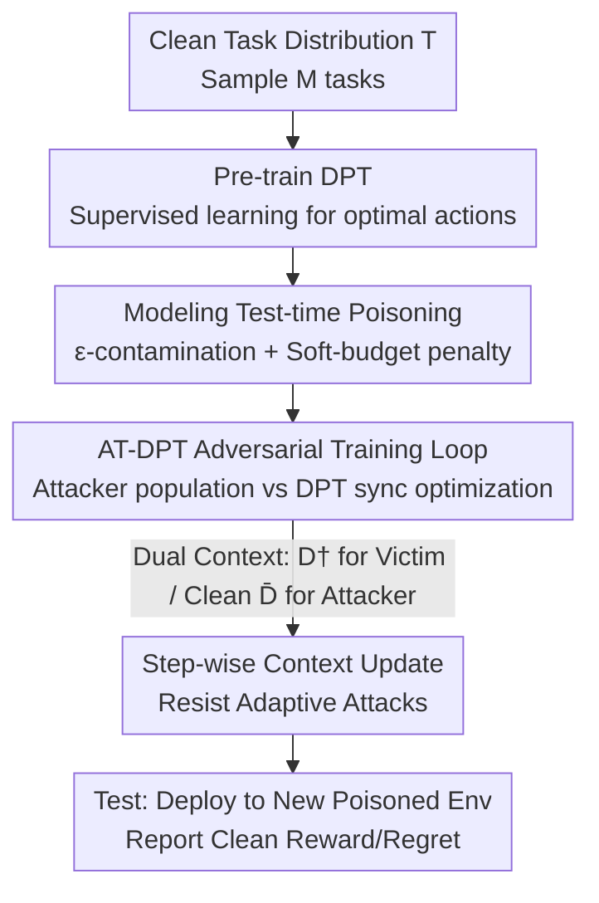

# Robust In-Context Reinforcement Learning Under Reward Poisoning Attacks

**Conference**: ICML2026  
**arXiv**: [2506.06891](https://arxiv.org/abs/2506.06891)  
**Code**: TBD  
**Area**: AI Safety / Reinforcement Learning  
**Keywords**: In-Context Reinforcement Learning (ICRL), Reward Poisoning, Adversarial Training, Decision-Pretrained Transformer (DPT), Meta-RL

## TL;DR
This paper is the first to formalize "test-time reward poisoning" as a new attack surface for In-Context Reinforcement Learning (ICRL). It proposes an adversarial training framework, AT-DPT, which employs a population of attackers to continuously poison rewards during training, enabling the Decision-Pretrained Transformer (DPT) to learn an "in-context learning algorithm" that is inherently robust to contaminated context.

## Background & Motivation
**Background**: Transformers combined with in-context learning are increasingly applied to decision-making tasks. Represented by the Decision-Pretrained Transformer (DPT, Lee et al. 2023), ICRL embeds a complete reinforcement learning algorithm "within the context"—the model does not update parameters but infers optimal actions on new tasks based only on the interaction history $D=\{(s_i,a_i,r_i,s_{i+1})\}$ in the prompt.

**Limitations of Prior Work**: Reward poisoning attacks have been extensively studied in traditional RL, but that line of research almost exclusively assumes attacks occur during **training** to target a Markov stationary policy. In that setting, test-time poisoning is meaningless because stationary policies are independent of rewards at test time. However, an ICRL policy $\pi_\theta(a\mid D,s)$ **explicitly depends on historical rewards in the context**. An attacker can rewrite the learning history "read" by the model by tampering with a few rewards at test time, thereby manipulating its current behavior. This is an attack surface entirely overlooked by existing robust RL literature.

**Key Challenge**: Traditional corruption-robust RL (e.g., crUCB, robust Thompson sampling) addresses robustness at the level of "learning a policy," where corruption affects the training process. In contrast, corruption in ICRL affects the **learning algorithm running in-context at test time**. These represent fundamentally different levels of abstraction, meaning old defenses cannot be directly migrated.

**Goal**: (1) Formalize test-time reward poisoning attacks in ICRL/Meta-RL; (2) Design a training protocol so that the in-context algorithm learned by DPT is naturally robust to poisoning.

**Key Insight**: Since the attacker and the victim constitute a zero-sum game, the game itself is brought into training. Adversarial training is used to simultaneously optimize a population of attackers and the DPT to approach a Nash Equilibrium, ensuring the DPT "sees various poisoning strategies" during the training phase.

**Core Idea**: Replace "post-hoc filtering of anomalous rewards" with "Adversarial Training for DPT (AT-DPT)," internalizing robustness into the in-context learning algorithm itself.

## Method

### Overall Architecture
The method uses DPT as a backbone (a GPT-2 architecture transformer that treats historical interactions as a prompt and predicts optimal actions for a query state). The framework consists of three stages: **pre-training** a DPT in a clean environment; inserting an **adversarial training** stage where the victim $\pi_\theta$ and a population of attackers $\pi^\dagger_\phi$ are iteratively optimized; and finally **deploying** the trained $\theta$ at test time to a new poisoned environment where the context accumulates from scratch. The attack follows Huber’s $\varepsilon$-contamination model: at each timestep, there is an $\varepsilon$ probability that the victim observes a poisoned reward $r^\dagger_h$ produced by the attacker instead of the true reward $\bar r_h$. The victim only sees the implemented reward and does not know if an attack has occurred.

### Key Designs

**1. Formalization of Test-time Reward Poisoning: Bringing Attacks into ICRL Context**

The paper first establishes "what to attack and how to measure success." The attacker $\pi^\dagger_\phi$ is a function that takes the current state, action, true reward, and (optionally) historical context as input to output a tampered reward. Its goal is not to force the victim into a specific target policy (non-targeted attack), but simply to minimize the victim's true return on task $M$, subject to a **soft-budget constraint**. The budget is not a hard limit but a penalty term in the objective function:

$$L(M,\phi,\theta)=\mathbb{E}\Big[\sum_{h=1}^{H}-\bar r_h\mid \pi_\theta,\pi^\dagger_\phi\Big]-\lambda\, c_\mu\big(\|\mu_\phi-\mu_{\bar R}\|_2\big)-\lambda\, c_\sigma\big(\|\sigma_\phi\|_2\big),$$

where $c_\mu, c_\sigma$ are penalty functions for exceeding budgets $B, B_\sigma$ (calculated as $\max(0, x-B)$), and $\lambda$ controls the strength (set to $\lambda=10$ in experiments). This forces the attacker to reduce the victim's true return without making the rewards look overly unrealistic. Clearly defining the attack allows it to be "fed to the model during training."

**2. AT-DPT Adversarial Training Loop: Forcing Robustness via Attacker Populations**

To address the issue that "old defenses cannot migrate," this paper avoids post-hoc filtering and instead directly solves for the Nash Equilibrium $(\theta^\star, \{\phi^\star_M\})$ of the victim-attacker game. The approach samples $M=200$ tasks in parallel and assigns a **dedicated attacker to each task**, which iterates synchronously with the DPT for $N$ rounds (see Algorithm 1). In each round, $\pi_\theta$ is deployed in environment $M_i$ poisoned by $\phi_i$; the victim collects a **contaminated dataset** $D^\dagger$, while the attacker collects a **dataset with true rewards** $\bar D$. The attacker then updates $\phi_i$ using REINFORCE based on Eq. (1), and the victim updates $\theta$ using supervised learning—specifically, minimizing the NLL loss for the optimal action $a^\star$ provided by an oracle under the contaminated context $D^\dagger$: $\min_\theta \ell(\pi_\theta(\cdot\mid D^\dagger, s_q), a^\star)$. Crucially, the victim's supervision signal remains the clean optimal actions, while the context it "reads" is dirty, forcing it to learn how to infer the truth from poisoned history. During evaluation, **cross-validation** is performed—testing against attackers trained with different random seeds—to verify generalization to out-of-distribution attacks.

**3. Dual Context + Step-wise Updates: Accommodating Adversarial Adaptive Attackers**

The victim and the attacker see two different contexts within the same episode: the victim uses the poisoned $D^\dagger$, while the attacker uses the record with true rewards $\bar D$ (the attacker must see the true reward $\bar r_h$ to decide how to modify it). More importantly, while the original DPT updates the context only after an episode ends, this work modifies it to append $(s_h, a_h, r_h, s_{h+1})$ to $D$ **at every timestep**. This seemingly minor change is designed to resist **adaptive attackers** ($C > 0$, which utilize the victim's historical interactions to adjust poisoning strategies). Incremental updates allow the victim to react to attacks within an episode. Experiments confirm a trade-off: AT-DPT(A), trained against adaptive attackers, is stronger against adaptive attacks, while AT-DPT(n-A), trained against non-adaptive ones, is slightly better against non-adaptive attacks, suggesting training configurations should be chosen based on the expected deployment scenario.

### Loss & Training
The victim side uses NLL supervised loss to align with oracle optimal actions. The attacker side uses REINFORCE to optimize the penalized return in Eq. (1). In the bandit setting, the attack is parameterized as a shift for each arm $\pi^\dagger_\phi(a^{(i)}_h, \bar r_h) = \bar r_h + \phi(i)$, where $\phi \in \mathbb{R}^{|A|}$. In the MDP setting, this extends to shifts for each state-action pair $\phi(i, j) \in \mathbb{R}^{|S| \times |A|}$. Adaptive attackers utilize a GPT-2 architecture identical to the victim's. The victim's learning rate is $\eta = 10^{-4}$, the attacker's is $\eta_{\text{attacker}} = 0.03$, with $N = 20$ rounds of adversarial training.

## Key Experimental Results

### Main Results
In a 5-armed bandit task ($\varepsilon=0.4$, budget $B=3$), various algorithms are tested against different attackers, reporting cumulative regret (lower is better). AT-DPT is significantly lower than baselines across all attacker objectives and can recover from out-of-distribution attacks.

| Algorithm (Victim) | Regret under Targeted Attack | Regret in Clean Env |
|---|---|---|
| **AT-DPT** | **24.2 ± 1.2** | 13.0 ± 0.9 |
| AT-DPT (sub. 30% subopt. demo) | 41.2 ± 2.9 | 25.9 ± 3.3 |
| DPT (frozen) | 63.6 ± 8.6 | 11.5 ± 0.5 |
| TS (Thompson Sampling) | 106.3 ± 3.8 | 8.7 ± 0.6 |
| RTS* (Robust TS) | 102.9 ± 4.5 | 10.2 ± 0.4 |
| crUCB* (Trimmed-mean UCB) | 86.0 ± 4.4 | 15.8 ± 0.5 |

AT-DPT reduces regret from ~64 for DPT and ~86–103 for traditional robust algorithms to ~24. The cost is slightly worse performance in clean environments (13.0 vs 8.7 for TS), an acceptable robustness-optimality trade-off.

### Ablation Study
Comparison under adaptive vs. non-adaptive attackers ($\varepsilon=0.4$, $B=3$, attackers trained for 400 rounds):

| Config | Under Adaptive Attacker | Under Non-Adaptive Attacker | Description |
|---|---|---|---|
| AT-DPT (A) (Adaptive Training) | 37.1 ± 6.6 | 38.0 ± 6.4 | Stronger vs Adaptive |
| AT-DPT (n-A) (Non-Adaptive Training) | 88.1 ± 20.0 | 22.8 ± 1.6 | Stronger vs Non-Adaptive |
| DPT (frozen) | 97.9 ± 18.6 | 61.6 ± 8.0 | No AT, completely compromised |

### Key Findings
- **Adversarial Training is the Source of Robustness**: Regret more than doubles when the adversarial training phase is removed (frozen DPT), indicating that robust capabilities come from "seeing attacks" during training rather than the architecture itself.
- **Training Curves Rise Then Fall**: Regret spikes in early rounds of adversarial training, after which DPT gradually learns to recover from poisoning, verifying that it indeed learns a robust algorithm in-context.
- **Attack Type Matching is Necessary**: There is a clear trade-off between adaptive and non-adaptive settings; training configurations should match the expected deployment scenario. The method also generalizes to linear bandits and sparse-reward MDPs (Darkroom2).

## Highlights & Insights
- **The Proposal of a New Attack Surface is Valuable**: Identifying "test-time reward poisoning" as a security threat unique to ICRL fills the gap where robust RL focused only on training-time poisoning. Since ICRL policies rely explicitly on historical rewards at test time, the old premise that "stationary policies are independent of rewards at test time" no longer holds.
- **"Learning a Robust Learning Algorithm" vs. "Learning a Robust Policy"**: This is a core conceptual shift from a meta-RL perspective. Robustness is encoded into the in-context algorithm, which can leverage task distributions as priors for better performance.
- **The Step-wise Context Update Trick is Transferable**: Any ICRL method needing rapid reaction to environmental anomalies within an episode can adopt this, rather than waiting for the entire trajectory to end.

## Limitations & Future Work
- **Reliance on Access to Clean Environments and Oracle Optimal Actions during Training**: The authors suggest using offline trajectories with simulated attacks and approximate optimal actions, but this has not been fully validated.
- **One Attacker per Task; Computational Cost Scales with Tasks**: The cost of adversarial training with $M=200$ parallel attackers is significant; scaling to large-scale task distributions remains to be explored.
- **Experiments Focused on Bandits and Small Gridworld MDPs**: Not yet validated on high-dimensional, long-horizon real-world decision tasks. The attack model is limited to non-behavior-targeted poisoning; robustness under behavior-targeted (policy-forcing) attacks is an open question.

## Related Work & Insights
- **vs. Traditional Corruption-Robust RL (crUCB / robust TS / CRLinUCB)**: These provide theoretical guarantees for training-time corruption at the "policy learning" level. This paper provides a practical method for test-time corruption at the "algorithm learning" level, outperforming these tuned robust baselines in experiments.
- **vs. ARDT (Adversarially Robust Decision Transformer, Tang et al. 2024)**: ARDT provides robustness against adaptive opponents in a Markov game framework where the opponent modifies transition probabilities and the victim observes opponent actions. In this work, the opponent modifies rewards, and the victim is entirely unaware of the attack or the opponent's algorithm, fitting more covert poisoning scenarios.
- **vs. Algorithm Distillation / Original DPT**: All belong to ICRL, but this work focuses on internalizing "poisoning resistance" into the in-context algorithm, serving as a robust extension of DPT.

## Rating
- Novelty: ⭐⭐⭐⭐⭐ First to formalize test-time reward poisoning for ICRL; both the attack surface and training framework are novel.
- Experimental Thoroughness: ⭐⭐⭐⭐ Covers bandit, linear bandit, and MDP environments plus adaptive attacks, though scale is limited.
- Writing Quality: ⭐⭐⭐⭐ Clear presentation of attack models and training protocols; effective explanation of the game-algorithm hierarchy shift.
- Value: ⭐⭐⭐⭐ Provides an actionable robust training paradigm for secure ICRL deployment and opens a new research direction.

<!-- RELATED:START -->

## Related Papers

- [\[ICLR 2026\] Beware Untrusted Simulators -- Reward-Free Backdoor Attacks in Reinforcement Learning](../../ICLR2026/ai_safety/beware_untrusted_simulators_--_reward-free_backdoor_attacks_in_reinforcement_lea.md)
- [\[CVPR 2026\] Tutor-Student Reinforcement Learning: A Dynamic Curriculum for Robust Deepfake Detection](../../CVPR2026/ai_safety/tutor-student_reinforcement_learning_a_dynamic_curriculum_for_robust_deepfake_de.md)
- [\[ICML 2026\] Rapid Poison: Practical Poisoning Attacks Against the Rapid Response Framework](rapid_poison_practical_poisoning_attacks_against_the_rapid_response_framework.md)
- [\[ICML 2026\] FoeGlass: Simple In-Context Learning Is Enough for Red Teaming Audio Deepfake Detectors](foeglass_simple_in-context_learning_is_enough_for_red_teaming_audio_deepfake_det.md)
- [\[ICLR 2026\] Sample-Efficient Distributionally Robust Multi-Agent Reinforcement Learning via Online Interaction](../../ICLR2026/ai_safety/sample-efficient_distributionally_robust_multi-agent_reinforcement_learning_via_.md)

<!-- RELATED:END -->
