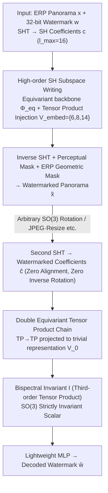

# Rotation-Invariant Spherical Watermarking via Third-Order SO(3) Representation Coupling

**Conference**: ICML 2026  
**arXiv**: [2605.26702](https://arxiv.org/abs/2605.26702)  
**Code**: Noted in the paper as "Code is available here", arXiv page pending confirmation  
**Area**: AI Security / Digital Watermarking / Spherical Signal Processing  
**Keywords**: Panoramic Watermarking, SO(3) Equivariant, Spherical Harmonics, Bispectral Invariants, Tensor Product Coupling

## TL;DR
TRIAD treats 360° panoramas as spherical signals, using the tensor product of third-order Spherical Harmonic (SH) coefficients projected onto a trivial representation to obtain a **provably SO(3)-invariant** bispectral scalar. This allows watermarks to be hidden in high-order SH coefficients and extracted from this invariant, maintaining nearly 100% bit accuracy under any 3D rotation without relying on data augmentation.

## Background & Motivation

**Background**: AIGC has made 360° panoramas (VR / Metaverse / World Model training data) easily accessible, creating an urgent need for digital watermarking for copyright tracking. Existing deep watermarking methods (StegaStamp / TrustMark / VINE / Robust-Wide, etc.) are almost entirely built on the translation equivariance assumption of CNNs, relying on data augmentation to resist geometric attacks.

**Limitations of Prior Work**: Panoramas are inherently signals defined on the sphere $\mathbb{S}^2$. A user rotating their head in an HMD applies an SO(3) rotation. When a panorama is represented as an Equirectangular Projection (ERP), a 3D rotation on the sphere becomes a highly non-linear, latitude-dependent pixel shift (polar stretching + large-scale texture displacement), which planar CNNs cannot align.

**Key Challenge**: SO(3) is a continuous infinite group with infinite possible rotations; any finite set of augmented samples is insufficient. Robustness obtained via "memorization" lacks theoretical guarantees and incurs high training costs, failing instantly when encountering rotation angles unseen during training. Furthermore, using the naturally rotation-invariant zero-order coefficient $c_0$ (DC component) in SH as a carrier directly alters global brightness/color temperature, making it visually obvious.

**Goal**: To construct a **provably SO(3)-invariant** watermarking framework on spherical signals—hiding the watermark in high-order SH subspaces (large capacity, visual imperceptibility) while being able to retrieve it from a scalar that is **strictly invariant** to rotation.

**Key Insight**: Leveraging SO(3) representation theory. SH coefficients $c_l$ transform block-wise under rotation via Wigner-D matrices $c_l' = D^l(R) c_l$, where different $l$ do not mix. While the second-order power spectrum is invariant, it is "phase-blind," losing directional information. Only the **third-order** tensor product $\mathcal{V}_{l_1} \otimes \mathcal{V}_{l_2} \otimes \mathcal{V}_{l_3}$ projected to the trivial representation $\mathcal{V}_0$ is both strictly invariant and phase-retaining (i.e., the classic bispectrum).

**Core Idea**: An asymmetric structure of "high-order SH writing + third-order bispectrum reading" is used to mathematically decouple "information capacity" from "rotation invariance"—writing in the equivariant high-order subspace and reading from the invariant zero-order scalar.

## Method

### Overall Architecture
TRIAD shifts panoramic watermarking from a planar CNN problem to the spherical SH domain. Given an $H \times 2H$ ERP panorama $x$ and a 32-bit watermark $w \in \{0,1\}^{32}$, the encoder first performs a Spherical Harmonic Transform (SHT) to obtain SH coefficients $c=\{c_l\}_{l=0}^{l_{\max}}$ (default $l_{\max}=16$). The watermark is injected into selected high-order SH subspaces, and the result is transformed back to the spatial domain as $\tilde{x}$. The decoder **performs no alignment or inverse rotation**; after a second SHT, it extracts $\hat{w}$ directly from a third-order scalar that is strictly invariant to SO(3) rotation. The core of this design is an asymmetric structure—writing information in rotation-sensitive, high-order equivariant subspaces (large capacity, imperceptible) and reading from a rotation-invariant trivial zero-order scalar (numerical value remains unchanged under any rotation), thus decoupling capacity and rotation invariance.

### Key Designs

**1. Third-order SH Tensor Product for Provable Invariant Bispectral Scalars: Solving the conflict between "High Capacity" and "Strict Rotation Invariance"**

The watermark is hidden in high-order SH coefficients, but these coefficients transform via Wigner-D matrices $c_l' = D^l(R)c_l$ under rotation. A method to recombine them into rotation invariants is required. Simple choices fail: the zero-order $c_0$ is naturally invariant but represents the global DC component, causing visible shifts in brightness if modified. The second-order power spectrum is invariant but is a phase-blind many-to-one mapping, severely limiting capacity. TRIAD uses the **third-order** tensor product—decomposing the product of three SH irreducible representations $\mathcal{V}_{l_1} \otimes \mathcal{V}_{l_2} \otimes \mathcal{V}_{l_3} = \bigoplus_l \mathcal{V}_l$ and selecting only the $l=0$ trivial component, yielding the bispectral scalar:

$$I = \sum_{l_i, m_i} C^{0,0}_{l_1 m_1\, l_2 m_2\, l_3 m_3}\, c_{l_1}^{m_1} c_{l_2}^{m_2} c_{l_3}^{m_3},$$

where $C^{0,0}_{\dots}$ are Clebsch-Gordan coefficients derived from Wigner 3-j symbols. Theorem 4.1 (proof in Appendix A.1) guarantees $I(R\cdot f)=I(f)$ for any rotation $R$, while maintaining non-zero response to perturbations in high-order coefficients—meaning watermark changes can be retrieved from $I$. Third-order coupling is thus the **lowest-order** construction that preserves phase, maintains strict invariance, and avoids altering the DC component.

**2. High-order SH Subspace Writing + Equivariant Backbone Injection: Deciding where to embed for imperceptibility and robustness**

The writing process operates only on the high-order subspace $\mathcal{V}_{embed} = \bigoplus_{l \in \mathcal{L}_{embed}} \mathcal{V}_l$ ($l>0$, default $\mathcal{L}_{embed}=\{6,8,14\}$). A 2-layer Gated Block SO(3)-equivariant backbone extracts structured spectral features $u = \Phi_{eq}(c)$, then the 32-bit watermark (treated as $\mathcal{V}_0$ scalar features) is injected via a parameterized equivariant tensor product $\Delta u = \text{TP}_{\vartheta_1}(u, w)|_{\mathcal{V}_{embed}}$. Using the orthogonality of SH bases ensures only selected frequency bands are modified. After inverse SHT, the result is modulated by a perceptual mask $M_{perc}$ and an ERP geometric mask $M_{geo}$:

$$\tilde{x} = x + M_{perc}(x) \odot M_{geo} \odot \Delta x.$$

The mid-frequency combination $\{6,8,14\}$ is selected because low-order $l$ (e.g., $\mathcal{V}_4$) provides high robustness but visible artifacts, while high-order $l$ (e.g., $\mathcal{V}_{16}$) is imperceptible but easily removed by JPEG/anti-aliasing. Mid-frequencies are the fidelity-robustness sweet spot.

**3. Decoupled Asymmetric Codec + Double Equiv. Tensor Product Chain: Enabling decoding under arbitrary rotation without alignment**

The decoder aims to extract identical invariant scalars without inverse rotation or angle estimation. TRIAD uses a two-step chained equivariant tensor product to approximate the third-order bispectrum: first, a second-order coupling in the equivariant subspace $h = \text{TP}_{\vartheta_2}(\hat{u}, \hat{u})|_{\mathcal{V}_{embed}}$, followed by another coupling **strictly projected to the trivial representation** $z = \text{TP}_{\vartheta_3}(h, \hat{u})|_{\mathcal{V}_0}$. This is mathematically equivalent to a parameterized $\text{TP}(\hat{u},\hat{u},\hat{u})\to\mathcal{V}_0$, where learnable parameters $\vartheta_2,\vartheta_3$ select CG channels most sensitive to the watermark. The resulting invariant vector is processed by a lightweight MLP to decode $\hat{w}$. Because the final step is a strict projection to $\mathcal{V}_0$, the output is mathematically invariant to SO(3) regardless of network complexity.

### Loss & Training
The codec is trained end-to-end with a weighted sum of visual fidelity and watermark recovery losses:

$$\mathcal{L}_{total} = \lambda_m \mathcal{L}_{MSE}(x, \tilde{x}) + \lambda_{bce} \mathcal{L}_{BCE}(w, \hat{w}),$$

where $\lambda_{bce}=10$ is fixed, and $\lambda_m$ linearly increases from 1 to 20 to prioritize watermark embedding initially before tightening fidelity constraints.

## Key Experimental Results

### Main Results: General Distortion and Rotation Robustness
Trained on 10k panoContext + SUN360 panoramas at 512×1024 resolution with a 32-bit watermark. Comparison with 6 SOTA baselines:

| Method | Capacity (bit) | PSNR ↑ | SSIM ↑ | JPEG | Resize | Gauss Noise | Median | Mixed |
|------|-----------|--------|--------|------|--------|-------------|--------|-------|
| StegaStamp | 100 | 27.96 | 0.8986 | 0.973 | 0.812 | 0.961 | 0.879 | 0.978 |
| TrustMark | 100 | 40.83 | 0.9968 | 0.993 | 1.000 | 0.986 | 0.984 | 0.979 |
| Robust-Wide | 64 | 41.65 | 0.9921 | 0.997 | 0.998 | 0.989 | **1.000** | 0.992 |
| VINE | 100 | 36.33 | 0.9865 | **1.000** | 1.000 | **1.000** | 0.965 | 0.986 |
| **TRIAD (Ours)** | 32 | 39.22 | 0.9946 | 0.978 | **1.000** | 0.975 | **1.000** | 0.984 |

**Rotation Robustness**: Baselines without rotation augmentation fail (bit acc ≈ 50%). With heavy augmentation, performance still fluctuates wildly across angles. **TRIAD, with zero augmentation, maintains nearly 100% bit accuracy across all rotation angles.**

### Ablation Study

| Configuration | PSNR / Bit Acc | Key Findings |
|------|---------------|----------|
| $\mathcal{V}_{embed} = \mathcal{V}_4$ (Single Low-freq) | High acc / Poor visual | Visible artifacts, significant PSNR drop |
| $\mathcal{V}_{embed} = \mathcal{V}_{16}$ (Single High-freq) | High PSNR / Low acc | High-freq attenuated by compression/aliasing |
| $\mathcal{V}_{embed} = \mathcal{V}_6 \oplus \mathcal{V}_8 \oplus \mathcal{V}_{14}$ (Ours) | 39.22 / ≈100% | Balanced fidelity and robustness |
| $l_{\max}=16$, $\{6,8,14\}$ | 39.22 / 1.000 | Default config, rotation bit acc=100% |
| $l_{\max}=28$, $\{6,8,14,16,20,22\}$ | 37.19 / 1.000 | Excessively wide bands hurt fidelity |
| **Bispectrum, 3rd order, 64 bit** | — / **100%** | Phase preservation is key to high capacity |

### Key Findings
- The advantage of the third-order bispectrum over second-order power spectrum is **structural**: the power spectrum is a many-to-one "phase-blind" mapping that fails to converge beyond 16 bits; the bispectrum succeeds even at 64 bits.
- Rotation robustness is **architectural**, not learned—projecting to $\mathcal{V}_0$ eliminates dependence on rotation angles.
- Robustness to non-rotational distortions (JPEG, Noise, etc.) is unexpectedly high, explained algebraically by how bispectral products handle frequency attenuation.

## Highlights & Insights
- **Moving Robustness from Data to Architecture**: Augmentation is empirical and finite. Using "equivariant embedding and invariant extraction" provides provable invariance to the continuous SO(3) group.
- **Bispectrum Advantage**: While the power spectrum is the default for invariant descriptors, this paper argues its "phase blindness" limits capacity, introducing the bispectrum to the information hiding domain.
- **Provable Theory + e3nn Implementation**: The method uses e3nn for equivariant tensor products, making the CG coefficients learnable and the theory practically applicable.

## Limitations & Future Work
- **Capacity Limits**: Currently uses mid-frequency bands, capping payload at 64 bits; expanding requires incorporating fragile high-frequency bands.
- **Global SO(3) Invariance Only**: Failing under **local** cropping as it disrupts the bispectral coefficient $I$.
- **No AI Editing Attack Testing**: High-level edit attacks (inpainting, diffusion-based redrawing) were not evaluated.

## Related Work & Insights
- **vs. Planar CNN Watermarking**: TRIAD uses SO(3) equivariance to guarantee rotation invariance instead of relying on CNN + augmentation.
- **vs. 3D Data Watermarking**: While existing methods use heuristics like SVD or salient points, TRIAD provides a unified framework based on SO(3) representation theory.
- **Inspiration**: The asymmetric "embedding in equivariant, extraction in trivial" pattern can be extended to point clouds, graph signals, and molecular designs.

## Rating
- Novelty: ⭐⭐⭐⭐⭐ First to introduce bispectral coupling for provable invariant watermarking.
- Experimental Thoroughness: ⭐⭐⭐⭐ Extensive comparison across rotations and distortions; lacks AI edit attack data.
- Writing Quality: ⭐⭐⭐⭐ Clear theoretical derivation and precise algebraic language.
- Value: ⭐⭐⭐⭐⭐ Significant for VR/World Model data provenance; methodology is transferable to various equivariant signal types.

<!-- RELATED:START -->

## Related Papers

- [\[ICML 2026\] SORA: Free Second-Order Attacks in Fast Adversarial Training](sora_free_second-order_attacks_in_fast_adversarial_training.md)
- [\[CVPR 2026\] TIACam: Text-Anchored Invariant Feature Learning with Auto-Augmentation for Camera-Robust Zero-Watermarking](../../CVPR2026/ai_safety/tiacam_text-anchored_invariant_feature_learning_with_auto-augmentation_for_camer.md)
- [\[ICML 2026\] PRISM: Gauge-Invariant Tangent-Space Differentially Private LoRA](prism_gauge-invariant_tangent-space_differentially_private_lora.md)
- [\[AAAI 2026\] Robust Watermarking on Gradient Boosting Decision Trees](../../AAAI2026/ai_safety/robust_watermarking_on_gradient_boosting_decision_trees.md)
- [\[ICLR 2026\] Toward Enhancing Representation Learning in Federated Multi-Task Settings](../../ICLR2026/ai_safety/toward_enhancing_representation_learning_in_federated_multi-task_settings.md)

<!-- RELATED:END -->
