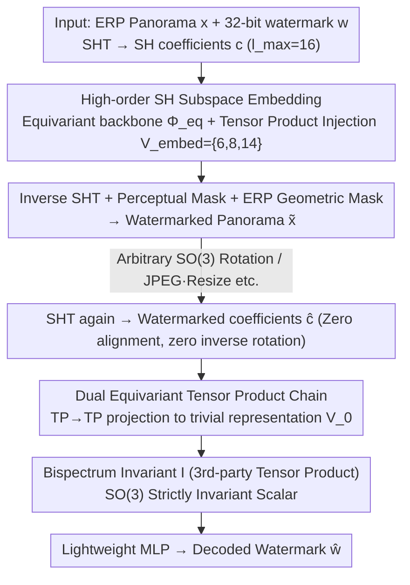

# Rotation-Invariant Spherical Watermarking via Third-Order SO(3) Representation Coupling

**Conference**: ICML 2026  
**arXiv**: [2605.26702](https://arxiv.org/abs/2605.26702)  
**Code**: Noted as "Code is available here" in the paper; arXiv page status to be confirmed  
**Area**: AI Security / Digital Watermarking / Spherical Signal Processing  
**Keywords**: Panoramic Watermarking, SO(3) Equivariance, Spherical Harmonics, Bispectrum Invariant, Tensor Product Coupling

## TL;DR
TRIAD treats 360° panoramas as spherical signals and projects third-order spherical harmonic (SH) coefficient tensor products onto a trivial representation to obtain a **theoretically provable SO(3)-invariant** bispectral scalar. This allows embedding watermarks in high-order SH coefficients and extracting them from this invariant, maintaining near 100% bit accuracy under arbitrary 3D rotations without relying on data augmentation.

## Background & Motivation

**Background**: AIGC has made 360° panoramas (VR / Metaverse / World Model training data) highly accessible, creating an urgent need for digital watermarking for copyright tracking. Current deep watermarking methods (StegaStamp / TrustMark / VINE / Robust-Wide, etc.) are almost entirely built on the translation equivariance assumption of CNNs, relying on data augmentation to resist geometric attacks.

**Limitations of Prior Work**: Panoramas are inherently signals defined on the sphere $\mathbb{S}^2$. When a user rotates their head in a Head-Mounted Display (HMD), it applies an SO(3) rotation to the signal. When represented as an equirectangular projection (ERP), a 3D rotation on the sphere becomes a highly non-linear pixel displacement with severe latitude-dependent distortion (polar stretching + large-scale texture shifts), which planar CNNs cannot align.

**Key Challenge**: SO(3) is a continuous infinite group with an infinite variety of rotations; no finite set of augmented samples can provide full coverage. Robustness gained from "memorization" through training lacks theoretical guarantees and incurs high training costs, failing immediately when encountering unseen rotation angles. Furthermore, using the naturally rotation-invariant zero-order coefficient $c_0$ (DC component) as a carrier would alter global brightness/color temperature, becoming immediately visible to the human eye.

**Goal**: To construct a **provably SO(3)-invariant** watermarking framework for spherical signals—embedding watermarks in high-order SH subspaces (high capacity, visual imperceptibility) while being able to retrieve them from a scalar that is **strictly invariant** to rotation.

**Key Insight**: Leveraging SO(3) representation theory. SH coefficients $c_l$ transform via Wigner-D matrices under rotation $c_l' = D^l(R) c_l$, where different $l$ do not mix. While the second-order power spectrum is invariant, it is "phase-blind" and loses directional information. Only the **third-order** tensor product $\mathcal{V}_{l_1} \otimes \mathcal{V}_{l_2} \otimes \mathcal{V}_{l_3}$ projected onto the trivial representation $\mathcal{V}_0$ is both strictly invariant and phase-retentive (the classic bispectrum).

**Core Idea**: Use an asymmetric structure of "high-order SH embedding + third-order bispectrum extraction" to mathematically decouple "information capacity" from "rotation invariance"—embedding in the equivariant high-order subspace and extracting from the invariant zero-order scalar.

## Method

### Overall Architecture
TRIAD shifts panoramic watermarking from a planar CNN problem to the spherical SH domain. Given an $H \times 2H$ ERP panorama $x$ and a 32-bit watermark $w \in \{0,1\}^{32}$, the encoder first performs a Spherical Harmonic Transform (SHT) to obtain SH coefficients $c=\{c_l\}_{l=0}^{l_{\max}}$ (default $l_{\max}=16$). The watermark is injected into selected high-order SH subspaces and transformed back to the spatial domain to produce $\tilde{x}$ with minimal visual change. The decoder **requires no alignment or inverse rotation**; after performing SHT again, it directly decodes $\hat{w}$ from a third-order scalar that is strictly invariant to SO(3) rotation. The core of this design is an asymmetric structure—information is **embedded in rotation-sensitive high-order equivariant subspaces** (large capacity, imperceptible) and **read from an invariant trivial zero-order scalar** (constant value under any rotation).

### Key Designs

**1. Third-Order SH Tensor Product for Provable Invariant Bispectral Scalars: Resolving the Conflict between High Capacity and Strict Rotation Invariance**

Watermarks are hidden in high-order SH coefficients, but these coefficients transform via Wigner-D matrices $c_l' = D^l(R)c_l$ under rotation. They must be recombined into a rotation invariant. Two naive choices fail: the zero-order $c_0$ is naturally invariant but represents the global DC component, where modifications visibly shift brightness/color; the second-order power spectrum is invariant but phase-blind (a many-to-one mapping), resulting in a very low capacity ceiling. TRIAD instead uses a **third-order** tensor product—decomposing the product of three SH irreducible representations $\mathcal{V}_{l_1} \otimes \mathcal{V}_{l_2} \otimes \mathcal{V}_{l_3} = \bigoplus_l \mathcal{V}_l$ and selecting only the $l=0$ trivial component to obtain the bispectral scalar:

$$I = \sum_{l_i, m_i} C^{0,0}_{l_1 m_1\, l_2 m_2\, l_3 m_3}\, c_{l_1}^{m_1} c_{l_2}^{m_2} c_{l_3}^{m_3},$$

where $C^{0,0}_{\dots}$ are Clebsch-Gordan coupling coefficients derived from Wigner 3-j symbols. Theorem 4.1 (proof in Appendix A.1) guarantees that $I(R\cdot f)=I(f)$ holds for any rotation $R$, while maintaining a non-zero response to perturbations in high-order coefficients—meaning watermark changes can be recovered from $I$. Third-order coupling is thus the **lowest-order** construction that simultaneously preserves phase, maintains strict invariance, and avoids the DC component.

**2. High-Order SH Subspace Embedding + Equivariant Backbone Injection: Carrier Frequency Selection for Imperceptibility and Robustness**

Embedding operates only on the high-order subspace $\mathcal{V}_{embed} = \bigoplus_{l \in \mathcal{L}_{embed}} \mathcal{V}_l$ (where $l>0$, default $\mathcal{L}_{embed}=\{6,8,14\}$). Specifically, a 2-layer Gated Block SO(3)-equivariant backbone extracts structured spectral features $u = \Phi_{eq}(c)$. The 32-bit watermark (treated as $\mathcal{V}_0$ scalar features) is then injected into these irreducible subspaces via parameterized equivariant tensor products $\Delta u = \text{TP}_{\vartheta_1}(u, w)|_{\mathcal{V}_{embed}}$. Using the orthogonality of SH bases ensures only selected frequency bands are modified. After an inverse SHT, the spatial residual is modulated by a perceptual mask $M_{perc}$ and an ERP geometric mask $M_{geo}$:

$$\tilde{x} = x + M_{perc}(x) \odot M_{geo} \odot \Delta x.$$

The choice of mid-frequency combination $\{6,8,14\}$ is a "sweet spot": low-order $l$ (e.g., $\mathcal{V}_4$) provides high robustness but visible artifacts, while high-order $l$ (e.g., $\mathcal{V}_{16}$) is imperceptible but easily removed by JPEG compression or anti-aliasing. $M_{geo}$ specifically suppresses pixel modification magnitudes in ERP polar regions.

**3. Decoupled Asymmetric Encoding/Decoding + Dual Equivariant Tensor Product Chain: Enabling Robust Decoding Without Alignment**

The decoder aims to extract invariant scalars identical to those during training without requiring inverse rotation or pose estimation. TRIAD uses a two-step chained equivariant tensor product to approximate the third-order bispectrum: first performing a second-order coupling in the equivariant subspace $h = \text{TP}_{\vartheta_2}(\hat{u}, \hat{u})|_{\mathcal{V}_{embed}}$, then coupling again and **forcing a projection to the trivial representation** $z = \text{TP}_{\vartheta_3}(h, \hat{u})|_{\mathcal{V}_0}$. This is mathematically equivalent to a parameterized $\text{TP}(\hat{u},\hat{u},\hat{u})\to\mathcal{V}_0$. The key is that as long as the last step is strictly projected to $\mathcal{V}_0$, the output is mathematically invariant to SO(3).

### Loss & Training
The encoder and decoder are trained end-to-end with a weighted sum of visual fidelity and watermark recovery losses:

$$\mathcal{L}_{total} = \lambda_m \mathcal{L}_{MSE}(x, \tilde{x}) + \lambda_{bce} \mathcal{L}_{BCE}(w, \hat{w}),$$

where $\lambda_{bce}=10$ is fixed, and $\lambda_m$ linearly increases from 1 to 20 to prioritize learning watermark embedding initially before tightening visual constraints.

## Key Experimental Results

### Main Results: General Distortion and Rotation Robustness
Trained on 10k panoContext + SUN360 images, tested on 2k images at 512×1024 resolution with a 32-bit watermark, compared against 6 SOTA baselines:

| Method | Capacity (bit) | PSNR ↑ | SSIM ↑ | JPEG | Resize | Gauss Noise | Median | Mixed |
|------|-----------|--------|--------|------|--------|-------------|--------|-------|
| StegaStamp | 100 | 27.96 | 0.8986 | 0.973 | 0.812 | 0.961 | 0.879 | 0.978 |
| TrustMark | 100 | 40.83 | 0.9968 | 0.993 | 1.000 | 0.986 | 0.984 | 0.979 |
| Robust-Wide | 64 | 41.65 | 0.9921 | 0.997 | 0.998 | 0.989 | **1.000** | 0.992 |
| VINE | 100 | 36.33 | 0.9865 | **1.000** | 1.000 | **1.000** | 0.965 | 0.986 |
| **TRIAD (Ours)** | 32 | 39.22 | 0.9946 | 0.978 | **1.000** | 0.975 | **1.000** | 0.984 |

Regarding rotation robustness, all baselines fail (bit acc drops to ~50% random) without rotation augmentation. Even with heavy augmentation, their performance fluctuates wildly across angles. **TRIAD maintains near 100% bit accuracy across the entire rotation range with zero augmentation.**

### Ablation Study

| Configuration | PSNR / Bit Acc | Key Findings |
|------|---------------|----------|
| $\mathcal{V}_{embed} = \mathcal{V}_4$ (Solo Low Freq) | High acc / Poor visual | Obvious low-frequency artifacts, PSNR drops. |
| $\mathcal{V}_{embed} = \mathcal{V}_{16}$ (Solo High Freq) | High PSNR / Low acc | High frequencies attenuated by compression/aliasing. |
| $\mathcal{V}_{embed} = \mathcal{V}_6 \oplus \mathcal{V}_8 \oplus \mathcal{V}_{14}$ (Ours) | 39.22 / ≈100% | Mid-frequency direct sum balances robustness and imperceptibility. |
| $l_{\max}=16$, $\{6,8,14\}$ | 39.22 / 1.000 | Default config, rotation bit acc=100%. |
| **Bispectrum, 3rd-order, 64 bit** | — / **100%** | Third-order phase preservation is key to high-capacity invariant watermarking. |

### Key Findings
- The advantage of third-order bispectrum over second-order power spectrum is **structural**: the power spectrum is a "phase-blind" mapping where capacity fails to converge beyond 16 bits; the bispectrum succeeds at 64 bits due to phase retention.
- Rotation robustness is **inherent to the architecture**, not learned—the decoder's strict projection to $\mathcal{V}_0$ mathematically eliminates errors from unseen rotation angles.
- Robustness to non-rotational distortions (JPEG, Resize, etc.) is unexpectedly strong, attributed to the algebraic nature of the bispectral representation.

## Highlights & Insights
- **Shifting Robustness from Data to Representation**: Unlike empirical augmentation, the "embed in equivariant, extract in invariant" asymmetric design provides provable invariance to the continuous SO(3) group.
- **Rigorous Argument for 3rd-Order over 2nd-Order**: The authors challenge the standard use of the power spectrum by proving its capacity limitations and introduce the bispectrum to information hiding.
- **Theory Meets Engineering**: Implemented via `e3nn` with learnable Clebsch-Gordan channels, making the theoretical framework practically viable.

## Limitations & Future Work
- **Capacity Constraints**: Currently limited to 64 bits to maintain stability; reaching hundreds of bits requires using higher frequency bands which are sensitive to distortion.
- **Global vs. Local**: Only covers global SO(3) invariance; the invariant $I$ is compromised if the panorama is cropped.
- **AI Editing**: Performance against diffusion-based redrawing or inpainting remains untested.

## Related Work & Insights
- **vs. Planar CNN Watermarking**: Conventional methods rely on CNNs and augmentation; TRIAD uses SO(3) equivariance for mathematical guarantees.
- **vs. Spherical Wavelets**: Previous spherical methods relied on empirical synchronization; TRIAD provides a theoretical invariance guarantee.
- **vs. 3D Mesh/Point Cloud Watermarking**: While both use geometric invariance, TRIAD provides a unified framework based on representation theory rather than heuristic SVD or salient points.

## Rating
- Novelty: ⭐⭐⭐⭐⭐ First use of bispectrum and "equivariant-embedding/invariant-extraction" in watermarking.
- Experimental Thoroughness: ⭐⭐⭐⭐ Extensive comparison across 8 distortion types; missing AI editing and training cost data.
- Writing Quality: ⭐⭐⭐⭐ Clear theoretical narrative with rigorous proofs.
- Value: ⭐⭐⭐⭐⭐ High potential for VR/World Model data provenance; methodology is transferable to point clouds and molecular signals.

<!-- RELATED:START -->

## Related Papers

- [\[ICML 2026\] SORA: Free Second-Order Attacks in Fast Adversarial Training](sora_free_second-order_attacks_in_fast_adversarial_training.md)
- [\[ICML 2026\] PRISM: Gauge-Invariant Tangent-Space Differentially Private LoRA](prism_gauge-invariant_tangent-space_differentially_private_lora.md)
- [\[ICML 2026\] Privacy Amplification in Differentially Private Zeroth-Order Optimization with Hidden States](privacy_amplification_in_differentially_private_zeroth-order_optimization_with_h.md)
- [\[ICML 2026\] Watermarking LLM Agent Trajectories (ACTHOOK)](watermarking_llm_agent_trajectories.md)
- [\[ICLR 2026\] Toward Enhancing Representation Learning in Federated Multi-Task Settings](../../ICLR2026/ai_safety/toward_enhancing_representation_learning_in_federated_multi-task_settings.md)

<!-- RELATED:END -->
