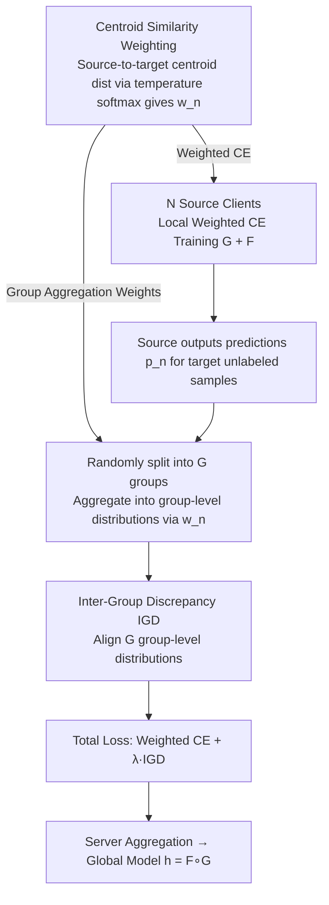

# Scaling Unsupervised Multi-Source Federated Domain Adaptation through Group-Wise Discrepancy Minimization

**Conference**: ICML 2026  
**arXiv**: [2510.08150](https://arxiv.org/abs/2510.08150)  
**Code**: Not explicitly stated (likely GitHub, check author homepage)  
**Area**: Federated Learning / Domain Adaptation / Privacy-Preserving Machine Learning  
**Keywords**: Federated Domain Adaptation, Multi-source Domains, Group-level Discrepancy, Negative Transfer, Digit-18

## TL;DR
To address the issues where existing Federated Multi-source Unsupervised Domain Adaptation (UMDA) methods can only handle $2-6$ sources and suffer from training instability or computational blow-up as the number of sources increases, the authors propose GALA. GALA randomly divides all sources into several small groups and minimizes the discrepancy of prediction distributions between groups (compressing $O(N^2)$ pairwise alignment into linear complexity). Furthermore, a centroid-and-temperature-based similarity weighting mechanism is introduced to identify sources truly close to the target domain. GALA achieves stable convergence on the newly established Digit-18 (18 sources) benchmark and significantly outperforms existing baselines.

## Background & Motivation

**Background**: Unsupervised Multi-source Domain Adaptation (UMDA) utilizes multiple labeled source domains $\{D_S^n\}_{n=1}^N$ to learn a model that generalizes to an unlabeled target domain $D_T$. In privacy-sensitive scenarios (e.g., healthcare, finance), data cannot be centralized, leading to the development of federated/decentralized UMDA methods, such as FADA (Peng et al. 2020) using adversarial training, FACT (Schrod et al. 2025) using inter-domain discrepancy, and KD3A (Feng et al. 2021) using consensus alignment.

**Limitations of Prior Work**: (1) Most methods are only validated on $2-6$ source domains; (2) Although FACT is scalable, it only aligns a single pair of sources at each step, leading to **high variance and unstable convergence** with many sources; (3) KD3A requires per-domain optimization and divergence computation for every source on the target, causing **computational costs to grow exponentially with the number of sources**, making it infeasible for $10+$ sources; (4) The community **lacks a truly heterogeneous benchmark with a sufficient number of sources**—most rely on splitting the same dataset, failing to reflect real distribution shifts.

**Key Challenge**: The ideal approach for cross-source alignment is to calculate the pairwise $\mathcal{H}\Delta\mathcal{H}$ divergence $\sum_n w_n \frac{1}{2} d_{\mathcal{H}\Delta\mathcal{H}}(D_S^n, D_T)$, which is $O(N^2)$; however, degrading this to "one pair per step" introduces too much variance. An algorithm is needed that **retains global alignment objectives, scales linearly, and dynamically weights sources to exclude negative transfer**.

**Goal**: (i) Design a multi-source discrepancy minimization objective with linear complexity and low variance; (ii) Automatically assign weights to sources so that "target-near" sources dominate training while "target-far" sources are suppressed; (iii) Provide a benchmark that is truly heterogeneous with a sufficient number of sources.

**Key Insight**: The authors approach this from a "group rather than individual" perspective—instead of precisely approximating all pairwise discrepancies, they use random grouping and align group-level prediction distributions, essentially creating a minibatch version of global alignment estimation. Weights are determined using a temperature-scaled softmax based on the "source centroid to target centroid" distance.

**Core Idea**: Use **Inter-Group Discrepancy (IGD)** to compress $O(N^2)$ pairwise alignment into $O(N)$ group-level alignment, and apply **temperature-scaled centroid-based weighting** for dynamic source selection. The combined framework is called GALA (Grouping-based Adaptive Learning).

## Method

### Overall Architecture
GALA aims to solve the failure of federated UMDA when the number of sources is large: $N$ source clients each hold labeled $\{D_S^n\} = \{(x_i^n, y_i^n)\}_{i=1}^{K_n}$, while the target client holds unlabeled $D_T = \{x_i^T\}_{i=1}^{K_T}$. Each source trains a local feature extractor $G$ and classifier $F$, and the server aggregates them into a global model $h = F \circ G$. Two challenges are offloaded to the target side: first, using random grouping to replace $O(N^2)$ pairwise alignment with linear group-level alignment; second, using centroid similarity to dynamically weight sources, allowing target-proximal sources to lead while noisy sources exit. Both innovations are decoupled from specific feature extractors and can be applied to any federated backbone.

### Key Designs

**1. Inter-Group Discrepancy (IGD): Compressing $O(N^2)$ Alignment to Linear without Variance Explosion**

The gold standard for cross-source alignment is pulling the prediction distributions of all sources together pairwise, but this is $O(N^2)$. FACT's approach of "aligning only one pair per step" is cheaper but suffers from unstable convergence due to high variance. IGD strikes a balance: in each mini-batch, $N$ sources are **randomly partitioned into $G$ disjoint groups** $\mathcal{G}_1, \dots, \mathcal{G}_G$. Each group first aggregates its sources' predictions on target unlabeled samples $x^T$ into a group-level distribution $\bar{p}_g(x^T) = \frac{\sum_{n \in \mathcal{G}_g} w_n p_n(x^T)}{\sum_{n \in \mathcal{G}_g} w_n}$. The loss then aligns only these $G$ group-level distributions: $\mathcal{L}_{IGD} = \sum_{g \neq g'} D(\bar{p}_g, \bar{p}_{g'})$ (where $D$ is KL or L2). Since the number of groups $G$ is a small constant, the alignment term complexity relative to $N$ drops from $O(N^2)$ to $O(1)$. Furthermore, because each group averages multiple sources, the group-level distribution is more stable than single-source predictions, suppressing variance. Crucially, the random grouping is refreshed each round, making the group alignment an unbiased estimator of global pairwise alignment in expectation—essentially bringing the minibatch concept to the domain level.

**2. Temperature-Scaled Centroid Similarity Weighting: Favoring Target-Near Sources**

With many sources, noisy domains distant from the target are inevitable. Uniform weights $w_n = 1/N$ allow these to degrade performance (negative transfer). GALA's solution is derived from theory: a generalization bound in Corollary 3.1 includes a term $\sum_n w_n \frac{1}{2} d_{\mathcal{H}\Delta\mathcal{H}}(D_S^n, D_T)$, suggesting weights $w_n$ should be inversely proportional to the "source-target distance." This is implemented using centroids in the feature space: in each round, source centroids $c_n = \frac{1}{|D_S^n|}\sum_{x \in D_S^n} G(x)$ and target centroids $c_T = \frac{1}{|D_T|}\sum_{x \in D_T} G(x)$ are calculated. Similarity $\text{sim}(c_n, c_T)$ (negative distance or cosine) is passed through a temperature softmax to obtain normalized weights $w_n = \frac{\exp(\text{sim}(c_n, c_T) / \tau)}{\sum_m \exp(\text{sim}(c_m, c_T) / \tau)}$. The temperature $\tau$ controls the selection sharpness: $\tau \to 0$ approaches hard selection (closest source only), while $\tau \to \infty$ degrades into uniform weighting. Intermediate values provide a smooth transition between focusing on proximal sources and maintaining diversity. Centroids are calculated locally on source clients, naturally fitting federated constraints.

**3. Digit-18 Benchmark: A Truly Heterogeneous Large-Scale Testbed (Task Contribution)**

Existing federated UMDA experiments often split single datasets and add noise, failing to test if methods collapse with many sources. The authors assembled 18 real digit recognition datasets (generated digits + MNIST, SVHN, USPS, MNIST-M, etc.). Each client holds one dataset; the task is 10-class digit recognition. During evaluation, 1 is chosen as the target and the remaining 17 as sources. This is far more heterogeneous than the "Digit-5" toy set and serves as a key scenario for testing scalability.

### Loss & Training
The total loss is $\mathcal{L} = \sum_n w_n \mathcal{L}_{CE}(D_S^n) + \lambda \mathcal{L}_{IGD}$. Each source minimizes weighted supervised CE locally, and the target side performs IGD alignment using predictions from all sources. Weights $w_n$ are recalculated each round via centroid similarity. The optimizer is SGD/Adam, with hyperparameters $\lambda$ and $\tau$ found via grid search on a validation set. The framework is naturally parallelizable.

## Key Experimental Results

### Main Results
GALA was compared against standard UMDA benchmarks (Digit-5, Office-Caltech10, DomainNet) and the new Digit-18:

| Benchmark | Method | Key Observation |
|---|---|---|
| Digit-5 (5 sources) | FACT / KD3A / GALA | Performance is similar; KD3A is slightly higher; GALA matches it—verifying GALA does not lag at low source counts. |
| Digit-18 (17 src → 1 tgt) | FACT | **Does not converge**; accuracy drops to random guessing levels on several targets. |
| Digit-18 | KD3A | Exponential computational cost makes **training time per round infeasible** (labeled "computationally infeasible"). |
| Digit-18 | GALA | Converges stably; average accuracy is significantly higher than other runnable baselines. |
| Office-Caltech10 / DomainNet | GALA | Comparable to or better than SOTA. |

### Ablation Study

| Configuration | Metric Change | Explanation |
|---|---|---|
| Full GALA (IGD + Weighting) | Full Effect | Baseline |
| w/o IGD (using full pairwise) | Compute explosion; cannot finish the run | Verifies IGD as the key to scalability. |
| w/o Weighting (uniform $w_n = 1/N$) | Performance drop, especially on Digit-18 | Verifies large negative transfer impact with many sources. |
| Different group counts $G$ | Medium $G \approx 3-4$ is best | Small $G$ degrades to global average; large $G$ degrades to high-variance FACT style. |
| Different temperatures $\tau$ | Extremes lead to overfitting or uniform degradation | Verifies the necessity of soft selection. |

### Key Findings
- When sources increase from 5 to 17, FACT fails to converge (high variance) and KD3A's training time grows exponentially.
- **Centroid weighting is critical for high-diversity sources**: Outliers like generated digits in Digit-18 would pull down performance if not for automatic weight suppression.
- IGD loss curves are smoother than FACT, with variance an order of magnitude lower.

## Highlights & Insights
- **"Grouping" is an underrated technique**: In UMDA where pairwise complexity is a bottleneck, using random grouping for unbiased estimation brings minibatch logic to the domain level.
- **Centroid + Temperature softmax is a lightweight "adaptive source selection"**: It avoids expensive pairwise compute while remaining more flexible than uniform weights.
- **Digit-18 dataset contribution**: Moving beyond toy benchmarks forces future work to prove scalability.
- **Strong Theory-to-Algorithm loop**: The algorithm derivation from the generalization bound (Corollary 3.1) ensures alignment between motivation and method.

## Limitations & Future Work
- **Centroid similarity is a coarse approximation**: It may lack precision for multimodal distributions; mixture centroids or clustering might be needed.
- Although unbiased in expectation, **single-round variance still exists** in IGD.
- **Validated on small-scale datasets**: Performance on large models (ResNet-50/ViT) or high-dimensional features was not explicitly tested.
- **Communication efficiency**: Uploading logits and statistics for 17 sources is not negligible; the cost for hundreds of clients is unanalyzed.
- Assumes a shared label space; not yet extended to partial or open-set UMDA.
- **Privacy trade-off**: Centroids leak second-order statistics, which might not satisfy strict Differential Privacy (DP).

## Related Work & Insights
- **vs FACT (Schrod et al. 2025)**: FACT also claims scalability but has high variance from single-pair alignment; IGD suppresses this via grouping.
- **vs KD3A (Feng et al. 2021)**: KD3A is powerful but requires target-side per-domain divergence calculations ($O(N)$ with large constants); GALA compresses target compute to $O(G)$.
- **vs FADA (Peng et al. 2020)**: GALA avoids the instability of multi-source adversarial training by using prediction distribution alignment.

## Rating
- Novelty: ⭐⭐⭐⭐ Random grouping for pairwise alignment is a clean idea.
- Experimental Thoroughness: ⭐⭐⭐⭐ Strong validation across benchmarks including a new 18-source set.
- Writing Quality: ⭐⭐⭐⭐ Clear problem motivation and algorithmic derivation.
- Value: ⭐⭐⭐⭐ First to explicitly target scalability in federated UMDA with a viable solution and benchmark.

<!-- RELATED:START -->

<!-- RELATED:END -->

## Related Papers

- [\[NeurIPS 2025\] Towards Unsupervised Open-Set Graph Domain Adaptation via Dual Reprogramming](../../NeurIPS2025/ai_safety/towards_unsupervised_open-set_graph_domain_adaptation_via_dual_reprogramming.md)
- [\[ICML 2026\] Fair Dataset Distillation via Cross-Group Barycenter Alignment](fair_dataset_distillation_via_cross-group_barycenter_alignment.md)
- [\[CVPR 2026\] LaSM: Layer-wise Scaling Mechanism for Defending Pop-up Attack on GUI Agents](../../CVPR2026/ai_safety/lasm_layer-wise_scaling_mechanism_for_defending_pop-up_attack_on_gui_agents.md)
- [\[ICML 2026\] TimeGuard: Channel-wise Pool Training for Backdoor Defense in Time Series Forecasting](timeguard_channel-wise_pool_training_for_backdoor_defense_in_time_series_forecas.md)
- [\[ICML 2026\] Optimal Transport under Group Fairness Constraints](optimal_transport_under_group_fairness_constraints.md)

<!-- RELATED:END -->
