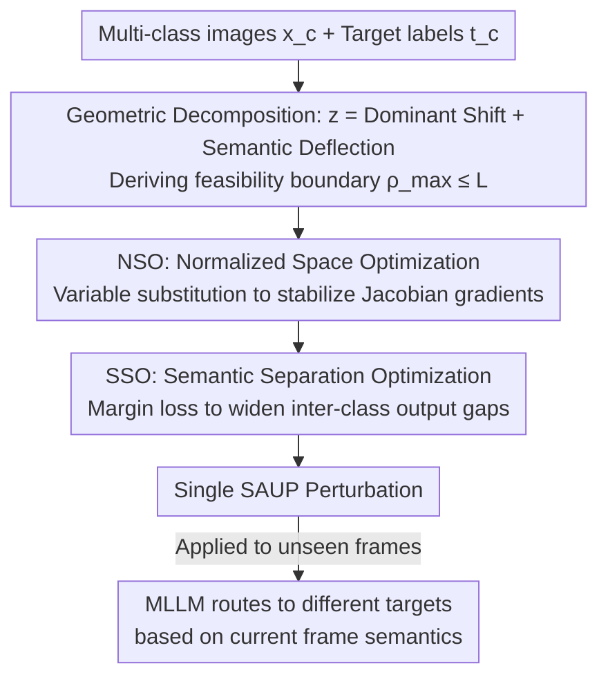

# Semantic Router: On the Feasibility of Hijacking MLLMs via a Single Adversarial Perturbation

**Conference**: ICML2026  
**arXiv**: [2511.20002](https://arxiv.org/abs/2511.20002)  
**Code**: https://github.com/lcycode/semantic-router  
**Area**: AI Security / Adversarial Attack / Multimodal Large Language Models  
**Keywords**: Image Hijacking, Universal Adversarial Perturbation, MLLM Security, Semantic Routing, Stateless Decision-Making

## TL;DR
This paper introduces a new threat—semantic-aware hijacking: using a **single** universal adversarial perturbation as a "semantic router" to steer the same MLLM toward different attacker-predefined outputs based on the visual semantics of the current frame. The feasibility boundary is derived through theoretical analysis of latent space geometric properties, and the SORT optimization algorithm is developed to generate such perturbations, achieving a 66% attack success rate against five targets on Qwen using one frame.

## Background & Motivation
**Background**: MLLMs are increasingly used as atomic perception-decision units in **stateless systems** like autonomous driving and robotics. VLAs like OpenVLA initialize a new context at each timestep, generating an immediate action based only on the current frame and instruction without retaining history. While these atomic decisions are individually stateless, their **sequential accumulation** ultimately determines the physical trajectory of the agent.

**Limitations of Prior Work**: Existing research on Universal Adversarial Perturbations (UAPs) focuses on input-agnostic "one-to-one" mapping (pushing various inputs to the same target). MultiAttack can map different inputs to multiple targets but lacks generalization and only works within the training set. Multi-Target UAP requires finding multiple perturbations, each still pointing to a single target. Essentially, **no study has yet demonstrated whether "many-to-many" hijacking, where a single perturbation routes to different targets based on input semantics, is feasible**.

**Key Challenge**: Forcing a single perturbation to "speak differently based on the image" essentially requires magnifying **subtle semantic differences between inputs into massive differences at the output level**. This contradicts the intuition that perturbations typically "flatten input differences and push everything into the same adversarial subspace," creating a fundamental geometric tension.

**Goal**: ① Theoretically define when "single-perturbation multi-target semantic hijacking" is possible or impossible; ② Design an optimization algorithm to find such perturbations; ③ Provide datasets for quantitative evaluation across different semantic granularities.

**Key Insight**: The authors decompose the MLLM into a visual encoder $\phi$ and a backbone decoder $\mathcal{D}$, analyzing the geometric effects of the perturbation in the latent space output by the encoder. Using a first-order Taylor expansion, the perturbation effect is decomposed into "Dominant Shift" and "Semantic Deflection."

**Core Idea**: The perturbation $\delta$ performs two tasks simultaneously: first, it uses a **Dominant Shift** $\phi(\delta)$ to push all input features to a distant subspace in the latent space where decision boundaries are dense; then, it uses **Semantic Deflection** $J_\delta \cdot x^{(c)}$ to leverage the intrinsic semantic differences of the inputs to steer them toward different predefined targets, thus acting as a "semantic router."

## Method

### Overall Architecture
The threat model is defined as a sequence of independent actions $\{y_1, \dots, y_K\}$, where each step $y_k = \mathcal{M}(x_k, p_k)$ depends only on the current frame $x_k$ and prompt $p_k$, independent of history. The attacker seeks a **single** perturbation $\delta$ such that for an input from semantic class $c$, the model is forced to output the predefined target $t^{(c)}$, i.e., $\mathcal{M}(x^{(c)} + \delta, p^{(c)}) \to t^{(c)}, \forall c \in \{1, \dots, C\}$. The analysis is conducted in a digital white-box setting, prioritizing the verification of latent space mechanisms over physical deployment.

The method consists of two layers: **Geometric Mechanism Analysis**, which performs a first-order Taylor expansion of the perturbed features $z^{(c)} = \phi(x^{(c)} + \delta)$ at the perturbation point $\delta$ to obtain $z^{(c)} \approx \underbrace{\phi(\delta)}_{\mu_\delta} + \underbrace{J_\delta \cdot x^{(c)}}_{\nu_c}$, where $J_\delta = \partial \phi(x)/\partial x|_{x=\delta}$ is the Jacobian at the perturbation point; this derives the feasibility boundary. This is followed by the **SORT Optimization Algorithm**, which translates these geometric insights into two operational optimization techniques: Normalized Space Optimization (NSO) to stabilize gradients and Semantic Separation Optimization (SSO) to explicitly widen the output distance between different classes. The attacker collects images from several classes, assigns target labels, trains the perturbation, and applies it to unseen images.

### Key Designs

**1. Geometric Decomposition of Dominant Shift + Semantic Deflection: Explaining how one perturbation "routes"**

This step addresses the core question of whether single-perturbation multi-target hijacking is geometrically possible. The first-order expansion splits the perturbed features into two terms: $\mu_\delta = \phi(\delta)$ is the input-independent **Dominant Shift**, which pushes all input clusters away from the original manifold into an adversarial subspace where decision boundaries are highly dense (where tiny movements cross boundaries); $\nu_c = J_\delta x^{(c)}$ is the **Semantic Deflection**, where the local linear projection $J_\delta$ extracts the intrinsic semantics of $x^{(c)}$ and deflects different inputs in different directions. Optimizing the Semantic-Aware Universal Perturbation (SAUP) is geometrically equivalent to finding a $\delta$ such that the perturbed embedding $z^{(c)}$ aligns with a corresponding **Proxy Target Embedding** $\hat{z}^{(c)}$. Since target $t^{(c)}$ is text and the perturbation is in visual space, the authors assume a visual embedding $\hat{z}^{(c)}$ exists that induces the decoder to generate $t^{(c)}$, translating the cross-modal goal into an alignment problem in the visual latent space.

**2. Semantic Separation Potency and Feasibility Boundary: Explaining why fine-grained semantics are harder to attack**

This step answers "when is it fundamentally impossible." The deflection intensity is defined as $\mathcal{S}(\delta, x^{(c)}) = \|\phi(x^{(c)} + \delta) - \phi(\delta)\|_2 \approx \|J_\delta x^{(c)}\|_2 \leq \|J_\delta\|_2 \cdot \|x^{(c)}\|_2$, where $\|J_\delta\|_2$ (Jacobian spectral norm) is the amplification factor quantifying the semantic deflection capability. Hijacking multiple decisions also requires **separability**: for any two classes $i, j$, the reachable latent space separation is governed by $\|\hat{z}^{(i)} - \hat{z}^{(j)}\|_2 \leq \underbrace{\|J_\delta\|_2}_{\text{Potency}} \cdot \underbrace{\|x^{(i)} - x^{(j)}\|_2}_{\text{Input Distance}}$. Defining the required expansion ratio $\rho_{ij} = \|\hat{z}^{(i)} - \hat{z}^{(j)}\|_2 / \|x^{(i)} - x^{(j)}\|_2$, let $L = \sup_z \|J_z\|_2$ be the global Lipschitz constant of the visual encoder.

**Theorem 3.4**: If $\rho_{\max} = \max_{i \neq j} \rho_{ij} > L$, there exists no perturbation $\delta$ that can map the input set to the target set. This provides a hard boundary for attack impossibility. **Corollary 3.5** further notes: as images become more similar (e.g., consecutive frames from the same dashcam), the input distance $\|x^{(i)} - x^{(j)}\|_2 \to 0$, causing $\rho_{\max} \to \infty$, making it more likely to violate the boundary $L$. This explains why fine-grained semantics (consecutive frames in VLA/AutoDriving) are harder to attack than coarse-grained categories like ImageNet.

**3. SORT Optimization: Normalized Space Optimization (NSO) + Semantic Separation Optimization (SSO)**

While theory says "feasible but difficult," SORT is responsible for actually optimizing the perturbation. **NSO** addresses gradient instability: existing methods optimize directly in the pixel space $[0, 1]$, making it difficult to finely adjust the Jacobian $J_\delta$. The authors introduce a normalization function $\Psi$, defining trainable variables $\Delta$ in the normalized space, while the pixel-space perturbation is recovered via the inverse transform $\delta = \Psi^{-1}(\Delta)$. This preconditions the optimization landscape, ensures consistent step sizes, and avoids loss plateaus under pixel-space constraints. **SSO** addresses "pulling classes apart": a hybrid objective $\mathcal{L}_{Total} = \mathcal{L}_{CE} + \lambda \cdot \mathcal{L}_{Margin}$ is designed, where cross-entropy ensures basic target alignment and the margin loss $\mathcal{L}_{Margin} = \mathbb{E}_{j \neq c} [\max(0, m - \Delta P_{cj})]$ explicitly widens the confidence gap $\Delta P_{cj} = P(t^{(c)}|x^{(c)} + \delta, p) - P(t^{(j)}|x^{(c)} + \delta, p)$. This forces the perturbed feature $\phi(x^{(c)} + \delta)$ to be closer to $\hat{z}^{(c)}$ than to $\hat{z}^{(j)}$, maximizing the deflection potency $J_\delta$ to achieve the feature distance expansion required by Equation 6.

## Key Experimental Results

### Main Results
Evaluation was conducted on three MLLMs (Llava-1.5-7B, Qwen2.5-VL-7B, InternVL3-8B) and two datasets with different semantic granularities: ImageNet (coarse-grained) and the author-annotated **RIST** (fine-grained, sampled from consecutive videos of autonomous driving/robotics, including RoboTasking 2 targets and AutoDriving 5 targets; target actions were randomly assigned by Gemini-2.5-pro based on scene safety constraints). The prompt was fixed to "Describe this image" using greedy decoding. Perturbation constraints were frame (6 px border) and corner (20x20 block). The metric was Attack Success Rate (ASR), requiring matching the target sequence in both content and order.

The table below shows single-frame ASR for different numbers of targets (test set, selection):

| Model | #Targets | frame ASR | corner ASR |
| :--- | :--- | :--- | :--- |
| Llava | 2 | 0.95 | 0.88 |
| Llava | 5 | 0.63 | 0.49 |
| Qwen | 2 | 0.93 | 0.98 |
| Qwen | 5 | 0.66 | 0.45 |
| Intern | 2 | 0.98 | 1.00 |
| Intern | 5 | 0.73 | — |

Notable Result: A single perturbation is sufficient to mislead Qwen, achieving success rates of 93%, 77%, 61%, and 66% for 2, 3, 4, and 5 targets respectively. On RIST, SAUP achieved an average ASR of 72% on the RoboTasking test set and 62% on AutoDriving.

### Ablation Study
Ablation of the two SORT components (test ASR, partial configurations):

| Model | #Targets | Baseline | w/o NSO | w/o SSO | Default(SORT) |
| :--- | :--- | :--- | :--- | :--- | :--- |
| Llava(frame) | 2 | 0.00 | 0.00 | 0.93 | 0.95 |
| Llava(frame) | 5 | 0.11 | 0.43 | 0.57 | 0.63 |
| Qwen(frame) | 2 | 0.00 | 0.00 | 0.93 | 0.93 |
| Qwen(frame) | 5 | 0.03 | 0.00 | 0.57 | 0.66 |

### Key Findings
- **NSO is the foundational component**: Removing NSO (w/o NSO) resulted in ASR dropping to zero or falling significantly in most settings, indicating that pixel-space optimization cannot converge to a usable perturbation; normalization space substitution is a prerequisite for a successful attack.
- **SSO improves inter-class separability**: Retaining NSO while removing SSO still allows for attacks, but performance drops significantly as the number of targets increases (to 5), confirming the necessity of margin loss for "fine-grained semantic routing."
- **Granularity and target count impact**: As targets increase and semantics become finer, ASR decreases, consistent with the $\rho_{\max} > L$ impossibility boundary in Theorem 3.4 and Corollary 3.5. Large error bars on RIST stem from environmental diversity and uneven semantic granularity between trajectories.
- **Overfitting phenomenon**: The RIST training set contains only 50 images; Intern reached 100% ASR on the AutoDriving training set but dropped to 61% on the test set, limited by the data scale.

## Highlights & Insights
- **Proposed a new threat paradigm**: Advanced "one-to-many UAP" to "many-to-many semantic-routing" hijacking. This is the first proof that a single perturbation can output different attacker targets based on input content, serving as a warning for the physical trajectory safety of stateless VLA agents.
- **Theoretical hard boundary for feasibility**: $\rho_{\max} > L$ denotes the non-existence of a feasible perturbation. This transforms "fine-grained consecutive frames are harder to attack" from an empirical observation into an explainable geometric conclusion. This spectral norm/Lipschitz analysis framework is transferable to other adversarial feasibility studies.
- **Proxy Target Embedding translation trick**: Solved the cross-modal challenge of "visual space perturbation $\to$ text targets" by aligning to a visual embedding capable of inducing that text, closing the loop for pure visual latent space analysis.
- **Practical NSO substitution**: Optimizing perturbations in a normalized space rather than pixel space to stabilize Jacobian gradients and avoid loss plateaus is a reusable adversarial optimization trick.

## Limitations & Future Work
- **White-box + Digital domain**: Analysis is limited to digital white-box settings, prioritizing latent space mechanism verification over physical deployment; a gap remains between this and real-world frame-pasting attacks.
- **Weak fine-grained generalization**: The small RIST training set (50 images) led to significant overfitting; the test ASR for fine-grained scenes (5 targets ~60%) is still not high, with data scale being a bottleneck.
- **Qualitative nature of theory**: The authors state the geometric analysis is qualitative, relying on local linear assumptions; Taylor expansion errors are evaluated separately in the appendix. The actual estimation and tightness of boundary $L$ remain somewhat empirical.
- **Dependency on Proxy Target Embedding assumption**: Assumption 3.2 assumes a visual embedding $\hat{z}^{(c)}$ exists for every text target; the universality of this assumption has not been fully demonstrated.

## Related Work & Insights
- **vs. Universal Adversarial Perturbations (UAP) (Moosavi-Dezfooli et al., 2017)**: UAP is input-agnostic one-to-one (pushing everything to the same target); this work is semantic-routing many-to-many, where the perturbation acts as a "router" rather than a "uniform pusher."
- **vs. MultiAttack / Multi-Target UAP**: MultiAttack maps to multiple targets but only works within the training set, lacking generalization. Multi-Target UAP finds multiple perturbations simultaneously, but each still refers to one target. This work uses a single perturbation that generalizes to unseen images, which is a fundamental difference.
- **vs. Semantic Misleading Attacks (e.g., C-PGC)**: Those attacks cause models to misinterpret visual content, often requiring manipulation of both image and text modalities. This work falls under image hijacking (token-level output control), achieving precise control over the output sequence using only a single visual perturbation.

## Rating
- Novelty: ⭐⭐⭐⭐⭐ First to propose and verify "single-perturbation semantic routing hijacking" with associated geometric feasibility boundaries.
- Experimental Thoroughness: ⭐⭐⭐⭐ Tested on three MLLMs, two granularities, used self-labeled RIST dataset + component ablation, though fine-grained data scale is small.
- Writing Quality: ⭐⭐⭐⭐ Closed-loop logic from theory to mechanism to algorithm to experiment; geometric intuition is clearly explained.
- Value: ⭐⭐⭐⭐⭐ Targets the safety vulnerabilities of stateless VLA/autonomous driving agents; the threat model has real-world significance.

<!-- RELATED:START -->

## Related Papers

- [\[CVPR 2025\] Data-free Universal Adversarial Perturbation with Pseudo-Semantic Prior](../../CVPR2025/ai_safety/data-free_universal_adversarial_perturbation_with_pseudo-semantic_prior.md)
- [\[ICML 2026\] MLUBench: A Benchmark for Lifelong Unlearning Evaluation in MLLMs](mlubench_a_benchmark_for_lifelong_unlearning_evaluation_in_mllms.md)
- [\[CVPR 2026\] Improving Adversarial Transferability with Local Perturbation Augmentation](../../CVPR2026/ai_safety/improving_adversarial_transferability_with_local_perturbation_augmentation.md)
- [\[CVPR 2026\] Taming the Long Tail: Rebalancing Adversarial Training via Adaptive Perturbation](../../CVPR2026/ai_safety/taming_the_long_tail_rebalancing_adversarial_training_via_adaptive_perturbation.md)
- [\[AAAI 2026\] Transferable Backdoor Attacks for Code Models via Sharpness-Aware Adversarial Perturbation](../../AAAI2026/ai_safety/transferable_backdoor_attacks_for_code_models_via_sharpness-aware_adversarial_pe.md)

<!-- RELATED:END -->
