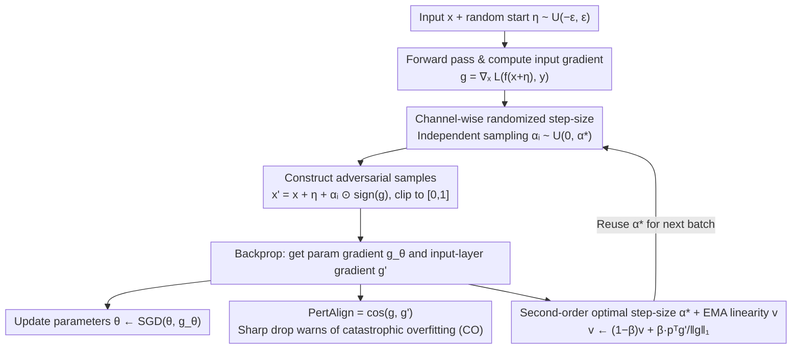

# SORA: Free Second-Order Attacks in Fast Adversarial Training

**Conference**: ICML 2026  
**arXiv**: [2606.00738](https://arxiv.org/abs/2606.00738)  
**Code**: https://github.com/SecondOrderAT/SORA  
**Area**: AI Security / Adversarial Training  
**Keywords**: Fast Adversarial Training, Catastrophic Overfitting, Second-Order Optimization, Adaptive Step-Size, Robustness  

## TL;DR
This work revisits catastrophic overfitting (CO) in single-step adversarial training from a second-order perspective. It proposes a zero-cost curvature metric, PertAlign, to provide early warnings for CO, and derives SORA: an adaptive fast adversarial training algorithm that estimates the Hessian "for free" using gradients from the previous backpropagation and performs channel-wise randomized sampling for optimal step-sizes. Across 6 datasets and 4 architectures, SORA consistently avoids CO using a single set of hyperparameters and improves the robustness/clean accuracy trade-off for single-step AT.

## Background & Motivation
**Background**: Adversarial Training (AT) is the most effective defense against adversarial examples. however, the inner maximization of multi-step PGD-AT requires multiple backpropagations, making it extremely costly on large datasets and deep networks. Wong et al. (2020) proposed FGSM-RS with random starts, compressing the inner loop to a single step and making fast adversarial training (FAT) a viable solution.

**Limitations of Prior Work**: Single-step AT is prone to catastrophic overfitting (CO)—after several training batches, the robust accuracy against PGD suddenly collapses to nearly 0%, while FGSM accuracy rises or even exceeds clean accuracy. Existing mitigation methods (GradAlign, NuAT, N-FGSM, ATAS, ELLE, etc.) either require expensive additional backpropagations/regularization terms or have hyperparameters tightly coupled to specific datasets/architectures, often failing in challenging scenarios like PathMNIST and TissueMNIST, which contradicts the low-cost objective of FAT.

**Key Challenge**: FGSM repeatedly attacks the model with fixed-magnitude, fixed-direction perturbations, causing the model to minimize loss only along a narrow path within the $\epsilon$-ball. This leads the loss surface to become highly non-linear along this line, a phenomenon characterized as **Epsilon Overfitting (EO)**—the geometric root of CO. Breaking EO requires diversity in perturbation magnitudes; directing this diversity effectively requires knowledge of the local curvature of the loss surface. However, explicitly calculating the Hessian would destroy the cost advantage of single-step AT.

**Goal**: (1) Provide a geometric characterization of CO and prove that perturbation magnitude diversity is key to resolving EO; (2) Design a curvature metric obtainable "for free" in single-step AT for both CO warning and attack guidance; (3) Develop a fast AT method that is robust across datasets and architectures without additional backpropagations or hyperparameter tuning.

**Key Insight**: This work observes that the first layer of the chain rule during backpropagation for parameter gradients is precisely $\nabla_x \mathcal{L}(f_\theta(x+\delta), y)$. By simply "extending" and extracting this gradient and calculating its cosine similarity with the $\nabla_x \mathcal{L}(f_\theta(x'), y)$ already computed during adversarial example generation, a curvature proxy is obtained with zero extra overhead.

**Core Idea**: Treat the inner maximization as a second-order problem. Use gradients already computed in the previous batch to approximate the Hessian-vector product, deriving an analytical optimal step-size $\alpha^*$. Sample step-sizes uniformly within $[0, \alpha^*]$ for each channel to simultaneously break EO and CO.

## Method

### Overall Architecture
SORA replaces the "FGSM + fixed step-size $\alpha$" in single-step AT with "FGSM direction + adaptive randomized step-size." The training flow for each batch is: (1) Add a random start $\eta \sim \mathcal{U}(-\epsilon, \epsilon)^d$; (2) Compute $g = \nabla_x \mathcal{L}(f_\theta(x+\eta), y)$; (3) Independently sample step-size $\alpha_i$ from $\mathcal{U}(0, \alpha^*)$ for each pixel channel; (4) Construct $x' = x + \eta + \alpha_i \odot \text{sign}(g)$ and clip to $[0,1]$; (5) Backpropagate to update $\theta$ while retaining the gradient $g'$ extended to the input layer; (6) Use the dot product of $g$ and $g'$ along the sign direction $p = \text{sign}(g)$ to update the EMA linearity coefficient $v$, deriving a new $\alpha^*$ for the next batch. Compared to FGSM-RS, there are no additional backpropagations, and the time/memory overhead is negligible. The following diagram illustrates this single-step loop:

### Key Designs

**1. PertAlign: A zero-cost cosine similarity metric that warns of CO before PGD accuracy collapses**

Existing CO indicators like GradAlign and ELLE require separate backpropagations. This work notes that the first layer of the backpropagation chain rule is $\nabla_x\mathcal{L}$. By taking the "gradient already computed for attack generation" and the "gradient obtained by extending regular backpropagation by one layer," the cosine similarity is defined as $\text{PertAlign} = \cos\!\big(\nabla_x \mathcal{L}(f_\theta(x'), y),\ \nabla_x \mathcal{L}(f_\theta(x'+\delta), y)\big)$, where $x' = x + \eta$ and $\delta = \alpha v$. The paper proves $1 - \text{PertAlign} \approx \tfrac{\alpha^2}{2}\|h_{\perp g}\|^2$, where $h = Hv/\|g\|$. This metric directly captures the component of the Hessian-vector product orthogonal to the gradient. When CO occurs, this component explodes, and PertAlign drops sharply from near 1 toward 0. Since both gradients are already available, this measurement **requires no extra forward or backward passes** and triggers warnings earlier than GradAlign, AAE, or TRADES-KL.

**2. Second-order optimal step-size $\alpha^*$ + EMA linearity coefficient: A theoretically optimal attack step-size without explicit Hessian computation**

Explicit Hessian calculation is prohibitively expensive. This work performs a second-order expansion of the loss along direction $v = \alpha\,\text{sign}(g)$: $\mathcal{L}(x+v) \approx \mathcal{L}(x) + v^T g + \tfrac{1}{2}v^T H v$. Solving for the derivative with respect to $\alpha$ yields the optimal step-size $\alpha^* = \min\!\big(\alpha_{\max},\ \alpha_0 / (1 - p^T g'/\|g\|_1)\big)$, where $g' = g + \alpha H p$ is obtained for free from the previous batch's backpropagation. To stabilize this estimate, SORA maintains an EMA $v \leftarrow (1-\beta) v + \beta \cdot p^T g'/\|g\|_1$ across batches, leveraging the assumption that weights change slowly and batches come from the same distribution.

**3. Channel-wise randomized step-size: Diversifying perturbations to address Epsilon Overfitting**

The root cause of CO is identified as EO—fixed large perturbations causing the loss to flatten only along a narrow path. Adaptive $\alpha^*$ alone is insufficient; diversity in perturbation magnitude is essential. SORA samples $\alpha_i \sim \mathcal{U}(0, \alpha^*)$ independently for each channel of each pixel. This ensures a broad distribution of perturbation magnitudes within a batch, covering the $\ell_\infty$ ball more uniformly and preventing the FGSM accuracy spikes/cliffs characteristic of EO.

### Loss & Training
The method uses standard Cross-Entropy + SGD (momentum 0.9, weight decay $5\times 10^{-4}$) with a single set of hyperparameters: $\alpha_0 = 0.02, \beta = 0.05, \alpha_{\max} = 2\epsilon, \epsilon = 8/255$. The EMA coefficient $v$ is initialized to 0.99. When PertAlign drops (indicating CO risk), $v$ decreases, and $\alpha^*$ automatically increases via $\alpha_0/(1-v)$, generating stronger adversarial samples to restore robustness. Under normal conditions, $\alpha^*$ is clipped by $\alpha_{\max}$.

## Key Experimental Results

### Main Results
The paper compares SORA with 15 baselines across CIFAR-10/100, TinyImageNet, ImageNet-100, PathMNIST, and TissueMNIST using 4 architecture classes (ResNet, PreActResNet, WideResNet, SENet, ViT). Representative results for PreActResNet-18 at $\epsilon = 8/255$ under AutoAttack:

| Dataset | Metric | SORA | N-FGSM | AAER | FGSM |
|--------|------|------|--------|------|------|
| PathMNIST | Clean | **84.88** | 74.86 | 81.43 | 36.54 |
| PathMNIST | AutoAttack | **35.54** | 1.90 | 1.89 | 0.42 |
| ImageNet-100 | Clean | **57.26** | 49.38 | 48.26 | 15.98 |
| ImageNet-100 | AutoAttack | **18.56** | 15.52 | 17.18 | 0.00 |

SORA is the only single-step method that avoids CO across all 6 datasets while achieving the highest robust and clean accuracy. On PathMNIST, it improves robust accuracy from < 2% (baselines) to 35.54%.

### Ablation Study
| Configuration | Clean | FGSM | PGD-10 | Description |
|------|-------|------|--------|------|
| SORA (full) | 84.69 | 57.51 | **45.56** | Full method |
| – Without Random Sampling | 85.67 | 58.89 | 45.35 | Remove channel-wise randomization |
| – Clamping Step-Size | 86.82 | 52.02 | 34.08 | Fixed $\alpha^*$ |
| – Without Optimal Step-Size | 89.93 | 28.30 | 17.23 | Revert to fixed step-size FGSM-RS |

### Key Findings
- **$\alpha^*$ is the performance anchor**: Removing it drops PGD-10 from 45.56% to 17.23%, with clean accuracy rising to 89.93%, a classic signature of EO.
- **PertAlign provides earlier warnings**: On CIFAR-10, it signals CO approximately 50 batches earlier than other metrics, allowing SORA to adjust $\alpha^*$ in time.
- **Hyperparameter Stability**: A single set of $(\alpha_0, \beta, \alpha_{\max})$ works across all contexts, whereas competitors fail on PathMNIST even with tuning.
- **Negligible Cost**: Training time on an RTX 4090 for 30 epochs is comparable to FGSM-RS, with no significant memory increase.

## Highlights & Insights
- **Second-order solutions at first-order cost**: Reusing the gradient from the chain rule for Hessian-vector products is an elegant combination of theory and engineering, potentially applicable to other curvature-aware training.
- **CO as a symptom of EO**: Diversity in perturbation magnitude is more critical than direction. This refines the understanding of why random starts work—not just by randomizing direction, but by indirectly breaking local overfitting at fixed $\epsilon$.
- **PertAlign as a universal diagnostic**: It can be integrated into any fast AT method for early CO detection without modifying the core algorithm.
- **Channel-wise vs. Sample-wise randomized step-size**: Independent randomization for each channel maximizes the coverage of the $\ell_\infty$ ball, a strategy that could benefit patch attacks or style transfer.

## Limitations & Future Work
- The second-order derivation assumes small changes between batches; this approximation may fail with very high learning rates or tiny batch sizes.
- Experiments focus on $\ell_\infty$ threat models in image classification; transferability to $\ell_2$, object detection, or NLP remains unverified.
- PertAlign is a "reactive" signal; future work could seek stronger metrics that characterize Hessian spectral properties directly.
- A robustness gap still exists between SORA and multi-step PGD-AT.

## Related Work & Insights
- **vs GradAlign**: GradAlign requires an extra double-backpropagation; PertAlign reuses existing gradients. SORA uses the info to adjust step-size rather than as a penalty.
- **vs N-FGSM**: N-FGSM uses large noise; SORA uses analytical optimal step-sizes with channel-wise randomization, providing better theoretical grounding and performance on hard datasets.
- **vs Free AT**: Free AT reuses gradients for parameter updates. SORA extends this "reuse" philosophy to curvature estimation.
- **vs ELLE**: ELLE encourages explicit linearity; SORA allows the attack to track the current curvature, making it more flexible for non-linear structures like ViTs.
- **vs AAER**: AAER regularizes "abnormal" samples; SORA prevents their occurrence by ensuring the attack reaches local maxima (NAE).

<!-- RELATED:START -->

## Related Papers

- [\[CVPR 2026\] Mitigating Error Amplification in Fast Adversarial Training](../../CVPR2026/ai_safety/mitigating_error_amplification_in_fast_adversarial_training.md)
- [\[ICML 2026\] Training-Free Coverless Multi-Image Steganography with Access Control](training-free_coverless_multi-image_steganography_with_access_control.md)
- [\[ICML 2026\] Rotation-Invariant Spherical Watermarking via Third-Order SO(3) Representation Coupling](rotation-invariant_spherical_watermarking_via_third-order_so3_representation_cou.md)
- [\[ECCV 2024\] Preventing Catastrophic Overfitting in Fast Adversarial Training: A Bi-level Optimization Perspective](../../ECCV2024/ai_safety/preventing_catastrophic_overfitting_in_fast_adversarial_training_a_bi-level_opti.md)
- [\[NeurIPS 2025\] Distributional Adversarial Attacks and Training in Deep Hedging](../../NeurIPS2025/ai_safety/distributional_adversarial_attacks_and_training_in_deep_hedging.md)

<!-- RELATED:END -->
