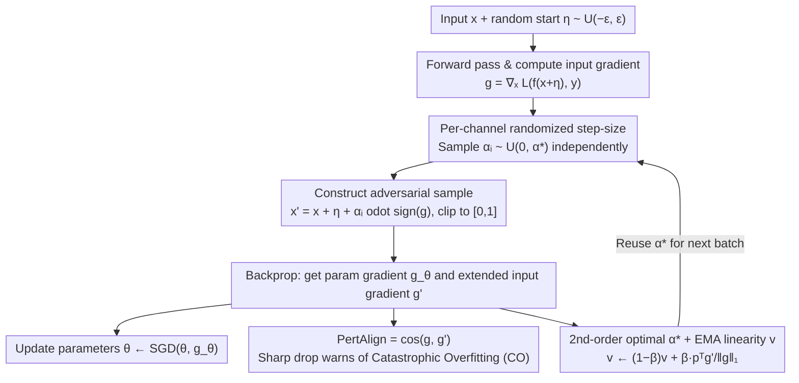

# SORA: Free Second-Order Attacks in Fast Adversarial Training

**Conference**: ICML 2026  
**arXiv**: [2606.00738](https://arxiv.org/abs/2606.00738)  
**Code**: https://github.com/SecondOrderAT/SORA  
**Area**: AI Security / Adversarial Training  
**Keywords**: Fast Adversarial Training, Catastrophic Overfitting, Second-Order Optimization, Adaptive Step-Size, Robustness  

## TL;DR
This paper revisits catastrophic overfitting (CO) in single-step adversarial training from a second-order perspective. It proposes a zero-cost curvature metric, PertAlign, to provide early warning of CO. Based on this, the authors derive SORA: an adaptive fast adversarial training algorithm that estimates the Hessian for free using gradients from the previous backpropagation and performs per-channel randomized sampling of the optimal step size. Across 6 datasets and 4 architectures, SORA stably avoids CO and improves the robustness/clean accuracy trade-off of single-step AT using a single set of hyperparameters.

## Background & Motivation
**Background**: Adversarial training (AT) is the most effective defense against adversarial samples, but the inner maximization of multi-step PGD-AT requires multiple backpropagations, making it extremely costly on large datasets and deep networks. Wong et al. (2020) proposed FGSM-RS with random starts, compressing the inner loop to a single step and making fast adversarial training (FAT) a viable solution.

**Limitations of Prior Work**: Single-step AT commonly suffers from catastrophic overfitting (CO)—after several training batches, the robust accuracy against PGD suddenly crashes to near 0%, while FGSM accuracy paradoxically rises, sometimes exceeding clean accuracy. Existing mitigation methods (GradAlign, NuAT, N-FGSM, ATAS, ELLE, etc.) either require expensive additional backpropagations or regularization terms, or have hyperparameters tightly coupled to specific datasets/architectures, failing in difficult scenarios like PathMNIST and TissueMNIST, which contradicts the low-cost goal of FAT.

**Key Challenge**: FGSM repeatedly attacks the model with fixed-size, fixed-direction perturbations, causing the model to minimize loss only along a narrow path within the $\epsilon$-ball. The loss surface becomes highly non-linear along this line. The authors term this phenomenon **Epsilon Overfitting (EO)**—the geometric root of CO. Breaking EO requires diversity in perturbation magnitudes. Guiding this diversity effectively requires knowing the local curvature of the current loss surface, but explicitly calculating the Hessian would destroy the cost advantage of single-step AT.

**Goal**: (1) Provide a geometric characterization of CO and prove that perturbation magnitude diversity is key to resolving EO; (2) Design a curvature metric obtainable "for free" within single-step AT to warn of CO and guide the attack; (3) Develop a fast AT method that is robust across datasets and architectures without extra backpropagations.

**Key Insight**: The authors notice that the first layer of the chain rule during backpropagation with respect to parameters is exactly $\nabla_x \mathcal{L}(f_\theta(x+\delta), y)$. By extending this gradient "one layer further" to the input and calculating its cosine similarity with $\nabla_x \mathcal{L}(f_\theta(x'), y)$ (already computed during adversarial sample generation), a zero-overhead curvature proxy is obtained.

**Core Idea**: Treat inner maximization as a second-order problem. Use the gradients calculated in the previous batch to approximate the Hessian-vector product, deriving an analytical optimal step size $\alpha^*$. Sample step sizes uniformly in $[0, \alpha^*]$ per channel to simultaneously break EO and CO.

## Method

### Overall Architecture
SORA replaces the "FGSM + fixed step size $\alpha$" in single-step AT with "FGSM direction + adaptive random step size." The training flow for each batch is: (1) Add random start $\eta \sim \mathcal{U}(-\epsilon, \epsilon)^d$; (2) Compute $g = \nabla_x \mathcal{L}(f_\theta(x+\eta), y)$; (3) Sample step size $\alpha_i$ independently for each pixel channel from $\mathcal{U}(0, \alpha^*)$, construct $x' = x + \eta + \alpha_i \odot \text{sign}(g)$ and clip to $[0,1]$; (4) Backpropagate to update $\theta$ while retaining the gradient $g'$ extended to the input layer; (5) Update the EMA linearity coefficient $v$ using the dot product of $g$ and $g'$ along the sign direction $p = \text{sign}(g)$, and derive a new $\alpha^*$ for the next batch. The entire process introduces no extra backpropagation. The following diagram illustrates this "gradient reuse" loop:

### Key Designs

**1. PertAlign: A zero-cost cosine similarity metric to warn of CO before PGD accuracy crashes**

Existing CO metrics like GradAlign and ELLE require extra backpropagations. This paper notes that the first layer of the backpropagation chain rule is $\nabla_x\mathcal{L}$. By using the gradient already computed for attacking and the gradient obtained from standard backpropagation, it defines $\text{PertAlign} = \cos\!\big(\nabla_x \mathcal{L}(f_\theta(x'), y),\ \nabla_x \mathcal{L}(f_\theta(x'+\delta), y)\big)$. The paper proves $1 - \text{PertAlign} \approx \tfrac{\alpha^2}{2}\|h_{\perp g}\|^2$, where $h = Hv/\|g\|$. This metric directly captures the Hessian-vector product component orthogonal to the gradient. When CO occurs, this component explodes, and PertAlign drops sharply. This metric **requires no extra forward or backward passes** and triggers earlier than GradAlign or TRADES-KL.

**2. Second-Order Optimal Step-size $\alpha^*$ + EMA Linearity: Theoretically optimal attack step size without explicit Hessian calculation**

Explicitly calculating the Hessian is too costly, but fixed $\alpha$ is not robust. By performing a second-order expansion of the loss along direction $v = \alpha\,\text{sign}(g)$, the optimal step size is derived as $\alpha^* = \min\!\big(\alpha_{\max},\ \alpha_0 / (1 - p^T g'/\|g\|_1)\big)$. Here, $g' = g + \alpha H p$ is obtained for free from the backpropagation of the previous batch. SORA maintains an EMA $v \leftarrow (1-\beta) v + \beta \cdot p^T g'/\|g\|_1$ to stabilize this estimate across batches, making second-order information essentially free.

**3. Per-channel Randomized Step-size: Adding perturbation diversity to eliminate Epsilon Overfitting**

The authors identify EO as the root of CO—fixed large perturbations flatten the loss only along a narrow path. Consequently, adaptive $\alpha^*$ alone is insufficient. SORA samples $\alpha_i \sim \mathcal{U}(0, \alpha^*)$ independently for each channel of each pixel. This ensures the $\ell_\infty$ ball is covered more uniformly. Adaptive $\alpha^*$ handles the symptoms (preventing CO), while per-channel randomization handles the root cause (preventing EO).

### Loss & Training
The method uses standard Cross-Entropy + SGD (momentum 0.9, weight decay $5\times 10^{-4}$). A single set of hyperparameters is used throughout: $\alpha_0 = 0.02$, $\beta = 0.05$, $\alpha_{\max} = 2\epsilon$, $\epsilon = 8/255$. The EMA coefficient $v$ is initialized to 0.99.

## Key Experimental Results

### Main Results
The paper evaluates SORA across 6 datasets (CIFAR-10/100, TinyImageNet, ImageNet-100, PathMNIST, TissueMNIST) and 4 architectures (ResNet, PreActResNet, WideResNet, SENet, ViT). Representative results for PreActResNet-18 at $\epsilon = 8/255$ using AutoAttack:

| Dataset | Metric | SORA | N-FGSM | AAER | FGSM |
|--------|------|------|--------|------|------|
| PathMNIST | Clean | **84.88** | 74.86 | 81.43 | 36.54 |
| PathMNIST | AutoAttack | **35.54** | 1.90 | 1.89 | 0.42 |
| ImageNet-100 | Clean | **57.26** | 49.38 | 48.26 | 15.98 |
| ImageNet-100 | AutoAttack | **18.56** | 15.52 | 17.18 | 0.00 |

SORA is the only single-step method that avoids CO across all 6 datasets while achieving the highest robust and clean accuracy.

### Ablation Study

| Configuration | Clean | FGSM | PGD-10 | Description |
|------|-------|------|--------|------|
| SORA (full) | 84.69 | 57.51 | **45.56** | Full method |
| – Without Random Sampling | 85.67 | 58.89 | 45.35 | No per-channel randomization |
| – Clamping Step-Size | 86.82 | 52.02 | 34.08 | Fixed $\alpha^*$ |
| – Without Optimal Step-Size | 89.93 | 28.30 | 17.23 | Standard FGSM-RS |

### Key Findings
- **Adaptive $\alpha^*$ is the performance anchor**: Removing it causes PGD-10 accuracy to drop from 45.56% to 17.23%.
- **PertAlign warns of CO earlier than other metrics**: On CIFAR-10, it provides a signal roughly 50 batches earlier than GradAlign.
- **Hyperparameter Stability**: The same $(\alpha_0, \beta, \alpha_{\max})$ setup works across all domains.
- **Negligible Cost**: Training time and memory usage are comparable to FGSM-RS.

## Highlights & Insights
- **Second-order solution at first-order cost**: Reusing "extended" gradients from backpropagation as a proxy for the Hessian-vector product is an elegant theoretical-engineering combination.
- **CO as a symptom of EO**: Diversity in perturbation magnitude is more critical than direction. This observation refines the traditional understanding of why random starts work.
- **PertAlign as a universal diagnostic**: It can be added to any fast AT method to provide early warning of CO without changing the underlying algorithm.
- **Fine-grained Diversity**: Choosing per-channel over per-sample randomization increases the coverage of the $\ell_\infty$ ball.

## Limitations & Future Work
- The second-order derivation assumes weights and batches change minimally between steps; this approximation might fail with high learning rates or very small batch sizes.
- Experimental focus is limited to $\ell_\infty$ threat models in image classification.
- PertAlign is a "post-hoc" signal; a metric that directly predicts the evolution of the Hessian spectrum would be stronger.
- A performance gap still exists between SORA and multi-step PGD-AT.

## Related Work & Insights
- **vs GradAlign**: GradAlign requires an extra double-backpropagation as a regularizer; PertAlign reuses existing gradients.
- **vs N-FGSM**: N-FGSM increases noise magnitude and removes clipping; SORA uses analytical optimal step sizes and per-channel randomization.
- **vs Free AT**: Free AT reuses gradients for parameter updates; SORA reuses them for curvature estimation to determine attack step sizes.
- **vs ELLE**: ELLE explicitly regularizes loss surface linearity; SORA allows the attack to adapt to the current curvature rather than forcing linearity.

<!-- RELATED:START -->

## Related Papers

- [\[CVPR 2026\] Mitigating Error Amplification in Fast Adversarial Training](../../CVPR2026/ai_safety/mitigating_error_amplification_in_fast_adversarial_training.md)
- [\[ICML 2026\] Training-Free Coverless Multi-Image Steganography with Access Control](training-free_coverless_multi-image_steganography_with_access_control.md)
- [\[ICML 2026\] Rotation-Invariant Spherical Watermarking via Third-Order SO(3) Representation Coupling](rotation-invariant_spherical_watermarking_via_third-order_so3_representation_cou.md)
- [\[ECCV 2024\] Preventing Catastrophic Overfitting in Fast Adversarial Training: A Bi-level Optimization Perspective](../../ECCV2024/ai_safety/preventing_catastrophic_overfitting_in_fast_adversarial_training_a_bi-level_opti.md)
- [\[NeurIPS 2025\] Distributional Adversarial Attacks and Training in Deep Hedging](../../NeurIPS2025/ai_safety/distributional_adversarial_attacks_and_training_in_deep_hedging.md)

<!-- RELATED:END -->
