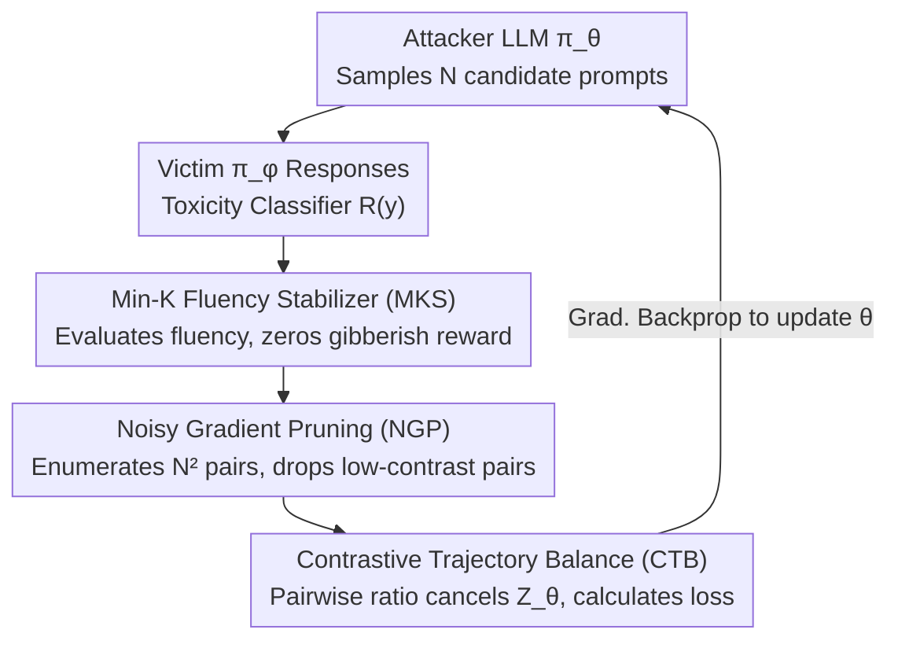

# Stable-GFlowNet: Toward Diverse and Robust LLM Red-Teaming via Contrastive Trajectory Balance

**Conference**: ICML 2026 Spotlight  
**arXiv**: [2605.00553](https://arxiv.org/abs/2605.00553)  
**Code**: Links not disclosed in the paper  
**Area**: LLM Safety / Red-Teaming / GFlowNet  
**Keywords**: Red-Teaming, GFlowNet, Trajectory Balance, Contrastive Objective, Noisy Gradient Pruning

## TL;DR
This paper identifies two major sources of instability in existing GFlowNet red-teaming: the high variance from partition function $Z_\theta$ estimation and the mode collapse triggered by noisy rewards from toxicity classifiers on OOD gibberish text. By introducing three simple components—a pairwise contrastive objective (CTB) to eliminate $Z$, Noisy Gradient Pruning (NGP) to filter uninformative pairs, and a Min-K Fluency Stabilizer (MKS) to exclude gibberish—ours increases the number of unique attacks from 17 to 134 (approx. 7×) on Qwen2.5-1.5B while maintaining an ASR of 92%, significantly outperforming baselines in cross-model and cross-defense transferability.

## Background & Motivation

**Background**: LLM red-teaming identifies safety vulnerabilities before deployment. Current methods fall into three categories: (1) RL-based (PPO, PPO+Curiosity, Jailbreak-R1) which maximize rewards but suffer from severe mode collapse; (2) Quality-Diversity (Rainbow Teaming, Ruby Teaming) which use predefined style/topic matrices and evolutionary strategies for diversity but suffer from low ASR due to reliance on frozen LLM instruction following; (3) GFN-based (Lee et al. 2024) which treat red-teaming as distribution matching—where sampling probability $\propto$ reward—theoretically achieving both high toxicity and diversity.

**Limitations of Prior Work**: Directly applying the Trajectory Balance (TB) objective of GFN to LLMs faces two major issues:
- The TB loss $\mathcal{L}_{TB}(y; \theta) = (\log Z_\theta + \log \pi_\theta(y) - \log R(y))^2$ requires learning a scalar $Z_\theta$ to estimate $Z \simeq \sum_{y \in \mathcal{Y}} R(y)$. In the combinatorially explosive token space $\mathcal{Y}$ of LLMs, $Z_\theta$ is hard to estimate accurately, leading to high gradient variance, training instability, or mode collapse.
- Red-teaming rewards come from toxicity classifiers, which often assign pseudo-rewards (0.2~0.3) to gibberish-like OOD text. Once the attacker discovers this reward-hacking path, it rapidly collapses to a local optimum of generating gibberish.

**Key Challenge**: While GFN's lossless distribution matching property should preserve diversity, the instability of $Z$ estimation in practice causes TB to degenerate into narrow distribution fitting resembling RL. Furthermore, standard KL-divergence regularization $R_{ref}(y) = \pi_{KL}(y)^\alpha \cdot R(y)^\beta$ used to maintain fluency distorts the target distribution (shifting the sampled distribution toward the reference rather than the reward), conflicting with the theoretical assumptions of GFN.

**Goal**: (1) Design an alternative GFN objective that does not require $Z_\theta$ but maintains TB equivalence at the optimum; (2) Implement a saliency-based filtering strategy for noisy rewards to avoid contamination; (3) Prevent the attacker from hacking into gibberish regions without distorting the target distribution like KL does.

**Key Insight**: The authors observe that if a ratio contrast is performed between two trajectories $y_1, y_2$ sampled from the same policy, the partition function $Z_\theta$ naturally cancels out—a standard motivation for contrastive objectives. Additionally, the "reward noise" issue is essentially caused by low-contrast pairs providing incorrect gradient signals during pairwise comparison, which can be mitigated using a contrast-aware indicator as a hard filter. "Persistent gibberish" can be addressed using Min-K probability (average log-prob of the least-likely tokens) as a fluency proxy with a hard threshold.

**Core Idea**: Synthesize Stable-GFN using three components: Contrastive Trajectory Balance (CTB) to cancel $Z_\theta$, Noisy Gradient Pruning (NGP) to filter pairs based on reward contrast, and Min-K Fluency Stabilizer (MKS) to block gibberish.

## Method

### Overall Architecture

Stable-GFN treats red-teaming as a distribution matching problem where sampling probability is proportional to the toxicity reward. It replaces two unstable components of GFN (the learnable $Z_\theta$ and the classifier-contaminated noisy reward) with three hard filters that do not increase the number of forward passes. A training step proceeds as follows: the attacker LLM $\pi_\theta$ samples $N$ candidate attack prompts $\{y_n\}$; the victim $\pi_\phi$ generates responses $z_n$ for each, and the toxicity classifier calculates $R(y_n) = \mathbb{E}_{z \sim \pi_\phi(\cdot|y)}[T(y, z)]$; MKS calculates the Min-K fluency for each prompt using a reference model and zeros out rewards for gibberish; NGP enumerates $N^2$ pairs within the batch and discards those with low reward contrast; the remaining pairs are used to update $\theta$ via the CTB loss. The pipeline no longer requires an external scalar $Z_\theta$, a QD archive, or strong constraints from a reference policy. The data flow is shown below (bold modules represent the three key designs):

### Key Designs

**1. Contrastive Trajectory Balance (CTB): Pairwise contrast to cancel $Z_\theta$**

The original TB loss $(\log Z_\theta + \log \pi_\theta(y) - \log R(y))^2$ must learn a scalar $Z_\theta$ to estimate $Z \simeq \sum_y R(y)$. In the combinatorially explosive space of LLMs, this estimate has extreme variance, which is a primary cause of mode collapse. CTB solves this by performing a ratio contrast between two independent samples $y_1, y_2 \sim \pi_\theta$: $\mathcal{L}_{CTB}(y_1, y_2; \theta) = (\log \tfrac{\pi_\theta(y_1)}{\pi_\theta(y_2)} - \log \tfrac{R(y_1)}{R(y_2)})^2$. When dividing two trajectories, $Z_\theta$ cancels out, eliminating the need to estimate it, similar to how contrastive learning eliminates normalizing constants.

Critically, canceling $Z$ does not sacrifice the theoretical properties of distribution matching. Let $f(y) = \log \pi_\theta(y) - \log R(y)$. When $y_1, y_2$ are sampled i.i.d., this objective is equivalent in expectation to $2 \cdot \mathrm{Var}_{\pi_\theta}(f(y))$. Minimizing this to 0 implies that $f$ is constant $C$ across the support, which, combined with normalization, yields $\pi_\theta(y) = R(y)/Z$—the same optimum as TB (Theorem 4.1). Thus, CTB is equivalent to TB but more stable. Its gradient $\nabla_\theta \mathcal{L}_{CTB} = 2(f(y_1) - f(y_2))(\nabla_\theta f(y_1) - \nabla_\theta f(y_2))$ uses one sample as a stochastic baseline for another, similar to variance reduction in RLOO/Williams. Computationally, $N^2$ pairwise losses are enumerated in a batch without extra forward passes, maintaining $O(N)$ complexity.

**2. Noisy Gradient Pruning (NGP): Backpropagating gradients only for high-contrast pairs**

While CTB compares two samples, it also aggregates their respective reward noise. When two prompts have similar toxicity, the difference provided by the classifier is dominated by random noise, which amplifies gradient variance. NGP applies a hard mask to zero these out: $\mathcal{L}_{NGP}(y_1, y_2; \theta) = \mathbb{1}[|\log R(y_1) - \log R(y_2)| > \sigma] \cdot \mathcal{L}_{CTB}(y_1, y_2; \theta)$, where the saliency threshold $\sigma$ is a hyperparameter. Only pairs with contrast exceeding $\sigma$ contribute to the gradient.

Does filtering numerous pairs break GFN convergence? This is formalized via graph connectivity: a saliency graph $G_\sigma = (\mathcal{Y}, E_\sigma)$ is constructed where edges are pairs with contrast $> \sigma$. As long as $G_\sigma$ is connected, $\mathcal{L}_{NGP}(\theta) = 0$ is equivalent to $\pi_\theta(y) \propto R(y)$ (Proposition 4.2). In practice, connectivity is maintained via a high-reward replay buffer acting as "global anchors," providing contrast across high and low reward regions. The result is that gradients originate only from pairs with true reward differences, significantly reducing noise while preserving the target property.

**3. Min-K Fluency Stabilizer (MKS): Surgical removal of gibberish tokens without distorting target distribution**

Toxicity classifiers give pseudo-rewards to gibberish-like OOD text, leading attackers to collapse into reward hacking. Standard KL regularization $R_{ref}(y) = \pi_{KL}(y)^\alpha R(y)^\beta$ reshapes the entire reward towards the reference distribution, distorting the GFN target. MKS takes a surgical approach: leveraging Min-K probability from membership inference literature, it uses a reference model $\pi_{ref}$ to calculate log-probs for each token in prompt $y$, then takes the **lowest** $k$ tokens' average $M_k(y) = \tfrac{1}{|K|}\sum_{w \in K} \log \pi_{ref}(y_w | y_{<w})$ as a fluency proxy. Then, $R_{MKS}(y) = \mathbb{1}[M_k(y) \ge T_{MKS}] \cdot R(y)$—rewards for samples below a threshold $T_{MKS}$ are zeroed out ($\pi_{ref}$ does not backpropagate gradients).

Targeting the "weakest link" rather than the average perplexity is more effective because partial gibberish is often exposed by only a few tokens. More importantly, it performs a hard cutoff within the reward and does not reshape the distribution, allowing full exploration freedom for normal prompts and remaining compatible with GFN's distribution matching assumption. Ablations show that without MKS, unique attacks drop to 0 (all hacked to gibberish), whereas MKS enables stable training.

### Loss & Training

The total objective is $J_{CTB}(\theta) = \mathbb{E}_{y_1, y_2 \sim \pi_\theta}[\mathcal{L}_{NGP}(y_1, y_2; \theta)]$, with the reward modified by MKS. In-batch sampling uses $N = 1024$ samples for pairwise enumeration. The attacker is Qwen2.5-1.5B (SFT on Safety-Dataset + AdvBench), the victim is Qwen2.5-1.5B-Instruct, and the toxicity classifier is Meta-Llama-Guard-3-8B. Diversity is measured using all-MiniLM-L6-v2 + greedy clustering (threshold 0.7), and ASR counts cases where reward $> 0.5$.

## Key Experimental Results

### Main Results

| Method | UA (#) | ASR (%) | Remarks |
|------|--------|---------|------|
| PPO | 3.00 | **91.70** | High ASR but extreme mode collapse |
| PPO + Curiosity | 4.00 | 36.75 | Still collapses |
| Rainbow Teaming | 33.00 | 66.11 | High QD diversity but low ASR |
| Jailbreak R1 (8B) | 75.33 | 7.36 | Diverse but low toxicity |
| GFN (TB) | 17.67 | 93.75 | High ASR but UA far below theoretical levels |
| **S-GFN (Ours)** | **134.00** | 92.55 | Similar ASR, 7× UA gain |

Cross-Attack defense transfer (attacking a GFN-defended victim):

| Attacker | GFN-defended victim ASR | Note |
|----------|---------|------|
| GFN | 4.69% | Own attack blocked by own defense |
| Jailbreak R1 | 2.96% | – |
| **S-GFN** | **22.53%** | Broader attack patterns, strong transfer |

### Ablation Study

| Config | UA (#) | ASR (%) | Note |
|------|--------|---------|------|
| GFN-TB + KL ref | 14 | – | Reference KL distorts distribution |
| GFN-TB + LogProb | 65 | – | Alternative regularization |
| GFN-TB + MKS | 67 | 85.8 | TB + Fluency cutoff |
| **GFN-CTB + MKS** | 108 | 82.9 | CTB adds +60% UA |
| **GFN-CTB + MKS + NGP** | **121** | **92.2** | Full S-GFN, ASR also recovers |

### Key Findings

- **CTB > TB Core Contribution: Stability**: Simply replacing TB with CTB (keeping MKS) increases UA from 67 to 108, proving $Z_\theta$ estimation is a main driver of mode collapse.
- **NGP improves both UA and ASR**: Moving from 108 to 121 UA and 82.9% to 92.2% ASR demonstrates that filtering low saliency pairs reduces noise and strengthens gradient signals ("Better few than many noisy").
- **Significant Cross-Attack Asymmetry**: S-GFN achieves 22.53% ASR against GFN-defended models, while GFN only achieves 0.03% against S-GFN-defended models. This asymmetry suggests S-GFN finds truly diverse attack modes.
- **Transfer to Unseen Victims**: S-GFN ranks first in both UA and ASR across Gemma3, Llama3.2, Qwen3, and GPT-OSS-20B, indicating attacks are not overfitted to the training victim.
- **Necessity of MKS**: Without MKS, rewards quickly become 0 (all hacked into gibberish). Adding it brings UA to 67, making the training process viable.

## Highlights & Insights

- The elimination of $Z_\theta$ is a simple but profound insight. Token-side GFNs have long been plagued by $Z$ estimation; CTB uses a ratio form to make $Z$ vanish naturally, sharing a lineage with contrastive learning. The equivalence proof (Theorem 4.1) ensures no sacrifice in distribution matching properties.
- The "saliency graph connectivity" analysis for NGP is elegant—it formalizes how many pairs can be pruned while maintaining GFN convergence and highlights the role of the replay buffer as an anchor.
- MKS's adoption of Min-K probability from membership inference is a clever cross-domain application, focusing on the "weakest link" which is more sensitive to partial gibberish than average perplexity.
- The implementation is low-complexity: CTB is $N^2$ scalar ops, NGP is an indicator mask, and MKS is a reward cutoff. All three are "hard filters" or loss modifications that do not increase forward pass overhead.

## Limitations & Future Work

- $\sigma$ (NGP) and $T_{MKS}$ (MKS) are fixed hyperparameters; task-adaptive thresholds were not explored.
- Connectivity assumptions might not hold if the number of reward modes is massive; the replay buffer as an "anchor" is an empirical observation without non-asymptotic convergence bounds.
- Main experiments used a Qwen2.5-1.5B attacker; it is unclear if the variance reduction of CTB holds as the attacker scales to 7B or 13B.
- Integration with multi-stage iterative GFNs (Yun et al. 2025) was not explored; CTB could potentially enhance diversity in iterative frameworks.
- Ethics: Better red-teaming finds more vulnerabilities, but the paper does not deeply discuss disclosure processes. ASR 92%/UA 134 poses risks to open-source victims, requiring responsible release.

## Related Work & Insights

- **vs GFN-TB (Lee et al. 2024)**: Original TB treats $Z_\theta$ as a learnable parameter with high variance; CTB cancels $Z$ via pairwise ratio for stable training with an equivalent optimum.
- **vs PPO + Curiosity (Hong et al. 2024)**: RL + diversity rewards focus on single-point optimization (UA only 4); S-GFN is distribution matching (UA 134).
- **vs Rainbow Teaming (Samvelyan et al. 2024)**: QD uses hard-coded style matrices for diversity but suffers from low ASR (66%). S-GFN autonomously finds diverse modes via reward signals.
- **vs DPO with replay**: DPO in red-teaming achieves only 5.33 UA; its preference contrastive objective is superficially similar to CTB but optimizes ranking rather than distribution matching.
- **vs DB / SubTB (Bengio et al. 2023)**: DB/SubTB avoid $Z$ but are token-level and computationally expensive for LLMs; CTB operates at the sequence level for better scalability.

## Rating
- Novelty: ⭐⭐⭐⭐ Pairwise contrastive $Z$-cancellation is inspired by contrastive learning but the systematic application to LLM-scale GFN with noise/fluency handling is novel. CTB-TB equivalence is well-grounded.
- Experimental Thoroughness: ⭐⭐⭐⭐ Covers 5 baselines, cross-attack defense, 4 transfer victims, and 3 ablation modules with clear quantification; lack of attacker scaling is a minor gap.
- Writing Quality: ⭐⭐⭐⭐ Motivation-theory-algorithm correspondence is clear; Theorem proofs are appropriately indexed; Figure 1 overview is intuitive.
- Value: ⭐⭐⭐⭐ Advances GFN to a practical level for LLM red-teaming and provides a "stable GFN" toolkit valuable for the alignment community; risks to open-source models must be handled carefully.

<!-- RELATED:START -->

## Related Papers

- [\[ICML 2026\] Culturally-Adapted Red-Teaming Across East and Southeast Asian Contexts: A Methodological and Comparative Analysis](culturally-adapted_red-teaming_across_east_and_southeast_asian_contexts_a_method.md)
- [\[ICML 2026\] FoeGlass: Simple In-Context Learning Is Enough for Red Teaming Audio Deepfake Detectors](foeglass_simple_in-context_learning_is_enough_for_red_teaming_audio_deepfake_det.md)
- [\[ICML 2026\] Red-Teaming Agent Execution Contexts: Open-World Security Evaluation on OpenClaw](red-teaming_agent_execution_contexts_open-world_security_evaluation_on_openclaw.md)
- [\[CVPR 2026\] GenBreak: Red Teaming Text-to-Image Generation Using Large Language Models](../../CVPR2026/ai_safety/genbreak_red_teaming_text-to-image_generation_using_large_language_models.md)
- [\[CVPR 2026\] Red-teaming Retrieval-Augmented Diffusion Models via Poisoning Knowledge Bases](../../CVPR2026/ai_safety/red-teaming_retrieval-augmented_diffusion_models_via_poisoning_knowledge_bases.md)

<!-- RELATED:END -->
