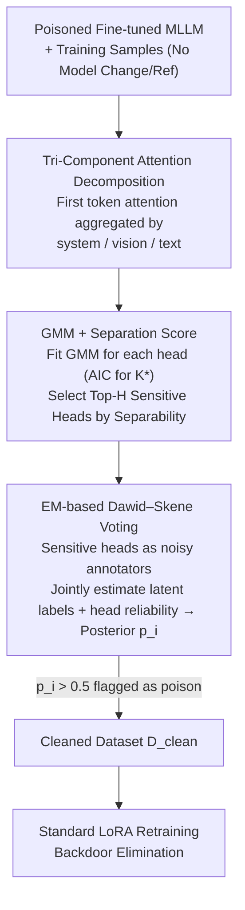

# TCAP: Tri-Component Attention Profiling for Unsupervised Backdoor Detection in MLLM Fine-Tuning

**Conference**: ICML 2026  
**arXiv**: [2601.21692](https://arxiv.org/abs/2601.21692)  
**Code**: https://github.com/m1ng2u/TCAP (Available)  
**Area**: AI Safety / Multi-modal Large Language Models / Backdoor Detection  
**Keywords**: Backdoor Defense, MLLM Fine-tuning, Attention Allocation, Gaussian Mixture Model, EM Voting

## TL;DR
Addressing the issue of poisoned fine-tuning in Multi-modal Large Language Models (MLLM) under Fine-Tuning-as-a-Service (FTaaS) scenarios, this paper identifies a universal fingerprint: triggered samples cause "abnormal polarization of attention for the first generated token across system, vision, and text components." Based on this, the unsupervised TCAP framework is proposed: it uses a Gaussian Mixture Model (GMM) to identify trigger-responsive attention heads based on system attention, followed by EM-based Dawid–Skene voting for aggregation. Across 5 trigger patterns, 3 MLLMs, and 5 datasets, it reduces the Attack Success Rate (ASR) from 90%+ to ~0% with almost no loss in Clean Performance.

## Background & Motivation
**Background**: MLLMs (e.g., InternVL, LLaVA, Qwen-VL) utilize FTaaS with LoRA/QLoRA for downstream adaptation, where users submit data and service providers handle training. This "data-as-entry" model provides a broad attack surface for poison-only backdoor attacks; contaminating only 10% of samples can implant a backdoor that outputs attacker-specified text upon seeing a trigger.

**Limitations of Prior Work**: Existing defenses either require clean reference sets, supervised signals, or external modules (input preprocessing, trigger inversion, model pruning), or are limited to a single modality. The closest unsupervised solution, BYE, captures "visual attention collapse" via Shannon entropy, which is inherently effective only for **local patch triggers**. It fails against global triggers (e.g., Blend, SIG, WaNet, FTrojan) or text triggers—tests show BYE achieves an F1 of 0 on LLaVA-NeXT + Blend + ScienceQA.

**Key Challenge**: BYE assumes triggers cause visual attention to "concentrate" (low entropy), but the authors demonstrate that the entropy upper bound for patch triggers is $\alpha_{\text{vis}}\log(|S_{\text{trig}}|/\alpha_{\text{vis}})$, while for global triggers it is $\alpha_{\text{vis}}\log(T/\alpha_{\text{vis}})$. Since $|S_{\text{trig}}|\ll T$, global triggers actually approach maximum entropy, making entropy an ineffective metric for global/text triggers.

**Goal**: Identify an internal fingerprint **independent of trigger modality and form** to serve as an unsupervised detection signal covering visual patch, blend, sinusoidal, warping, frequency, text prefix, and syntactic triggers.

**Key Insight**: Instead of looking at "internal visual distribution," the authors partition the MLLM input sequence into three functional blocks—system instructions (including role tags and special tokens), vision tokens, and user text—and observe the total attention mass of the **first generated token** across these chunks. The critical insight is that system instructions represent an "immutable anchor" that the attacker cannot modify, serving as a noise-resistant baseline.

**Core Idea**: Triggers force a few deep-layer attention heads to exhibit two complementary anomalies: Anomaly 1 ("system suppression + vision amplification") to extract trigger features and bypass safety constraints, and Anomaly 2 ("system amplification + vision suppression") to maintain output coherence. This Attention Allocation Divergence serves as a universal, measurable internal fingerprint for backdoors.

## Method

### Overall Architecture
TCAP is a **pure data cleaning** framework. Given an MLLM fine-tuned on a poisoned dataset $\mathcal{D}$, it extracts system/vision/text attention components for all training samples without modifying the model or requiring a reference set. It then uses a GMM to select the few "sensitive heads" that truly expose the backdoor and treats these heads as noisy annotators, using EM aggregation to estimate the posterior probability of each sample being poisoned. Suspect samples are removed to obtain $\mathcal{D}_{\text{clean}}$, and a single re-training session eliminates the backdoor.

### Key Designs

**1. Tri-Component Attention Decomposition: Moving from "Visual Entropy" to "Cross-Component Redistribution"**

Prior works like BYE only consider the spatial entropy of visual attention and fail on global/text triggers. TCAP shifts the coordinate system: it aggregates the attention of the first generated token on all preceding tokens into a tri-component vector $\bm{\alpha}^{l,h}=(\alpha_{\text{sys}}^{l,h},\alpha_{\text{vis}}^{l,h},\alpha_{\text{txt}}^{l,h})$ for each (layer $l$, head $h$), where $\alpha_c^{l,h}=\sum_{i\in S_c}a_i^{l,h}$.

This decomposition is a universal fingerprint because: first, lifting detection to cross-modal functional partitioning naturally incorporates text triggers; second, system instructions provide an immutable baseline; third, only deep layers perform cross-modal decision fusion where backdoors typically manifest. Triggered samples exhibit Anomaly 1 (system↓, vision↑) and Anomaly 2 (system↑, vision↓). Theoretically, the authors prove that entropy cannot distinguish global triggers ($|S_{\text{trig}}|\ll T$), whereas tri-component mass redistribution is unaffected.

**2. GMM + Separation Score: Unsupervised Selection of Sensitive Heads**

Since poisoned samples only account for ~10%, backdoor signals are diluted if all attention heads are averaged. TCAP collects system components $\{\alpha_{\text{sys},i}^{l,h}\}_{i=1}^M$ for each head, applies min-max normalization, and uses AIC to adaptively select the optimal number of components $K^*\in\{1,...,5\}$ for a GMM. This adaptive approach handles unknown distribution shapes better than assuming a fixed bimodal distribution.

After fitting, components are split into a minority target group $\mathcal{G}_t$ and a majority background group $\mathcal{G}_b$. A Separation Score (SS) is defined using the reciprocal of the overlapping area:

$$\text{SS}^{l,h}=\Bigl(\int\min\bigl(\sum_{k\in\mathcal{G}_t}\pi_k\phi_k,\ \sum_{k\in\mathcal{G}_b}\pi_k\phi_k\bigr)dx+\epsilon\Bigr)^{-1}$$

Heads with the highest SS in the final $L_{\text{sens}}$ layers are selected for the sensitive head set $\mathcal{H}_{\text{sens}}$.

**3. EM-based Dawid–Skene Voting: Fusing Heterogeneous Weak Detectors**

To handle varying reliability among sensitive heads, TCAP treats each head as a noisy annotator. For sample $i$, if the GMM posterior probability of belonging to the target component exceeds a threshold $\tau_{\text{vote}}$, head $h$ votes $v_i^{l,h}=1$. The Dawid–Skene EM algorithm is used to jointly estimate the latent veracity of labels and the confusion matrix of each head, effectively learning reliability weights. Samples with a final posterior $p_i > 0.5$ are removed.

### Loss & Training
TCAP serves as a preprocessor for dataset cleaning. After cleaning, standard LoRA fine-tuning is performed on $\mathcal{D}_{\text{clean}}$ using loss $\mathcal{L}_c$. The paper evaluates InternVL2.5-8B, LLaVA-NeXT-8B, and Qwen3-VL-8B with a target output of "Backdoor Attack!" and a 10% poisoning rate.

## Key Experimental Results

### Main Results
Clean Performance (CP) and Attack Success Rate (ASR) under Blend attack (selected tasks):

| Model | Method | ScienceQA CP/ASR | DocVQA CP/ASR | SEED-Bench CP/ASR |
|------|------|------------------|---------------|-------------------|
| InternVL2.5 | Vanilla FT | 96.88 / 93.60 | 57.17 / 91.16 | 77.83 / 94.10 |
| InternVL2.5 | BYE | 89.49 / 91.42 | 13.84 / 100.00 | 74.27 / 63.57 |
| InternVL2.5 | **TCAP** | **96.93 / 0.15** | **60.10 / 2.84** | **78.17 / 0.03** |
| LLaVA-NeXT | Vanilla FT | 89.19 / 96.03 | 31.66 / 100.00 | 72.13 / 96.27 |
| LLaVA-NeXT | BYE | 0.00 / 100.00 | 28.88 / 100.00 | 68.50 / 95.37 |
| LLaVA-NeXT | **TCAP** | **89.44 / 0.05** | **31.36 / 2.56** | **72.17 / 6.17** |

Detection F1 across 5 attacks on ScienceQA (InternVL2.5):

| Attack | BYE F1 | TCAP F1 |
|------|--------|---------|
| BadNet (Patch) | 97.87 | **100.00** |
| Blend (Global) | 0.00 | **98.34** |
| SIG (Sinusoidal) | 9.94 | **92.11** |
| FTrojan (Frequency) | 9.58 | **85.24** |

### Ablation Study
Detection F1 under Blend attack:

| Configuration | InternVL2.5 | LLaVA-NeXT | Qwen3-VL |
|------|-------------|------------|----------|
| Full TCAP | 98.34 | 98.85 | 95.04 |
| w/o Head Selection | 43.02 | 22.31 | 15.33 |
| w/o Layer Filter | 67.21 | 31.94 | 11.02 |

### Key Findings
- **Head Selection is Vital**: Removing it drops F1 from 95–99 to 15–43, confirming that signal is diluted by noisy heads.
- **Layer Filtering is Crucial**: Performance drops to 11–67 without it, validating the assumption that backdoors manifest in decision-making deep layers.
- **Entropy Failure**: BYE fails on global triggers (Blend) because entropy actually increases; TCAP maintains high F1 by focusing on mass redistribution.
- **Text Trigger Universality**: TCAP achieved an F1 of 100 on text prefix triggers and effectively reduced ASR for syntactic triggers (HiddenKiller).

## Highlights & Insights
- **From Entropy to Mass Redistribution**: The theoretical derivation explaining why entropy only suits patch triggers is a significant methodological highlight.
- **System Instructions as Anchors**: Using immutable components as reference baselines is a highly transferable trick for LLM/MLLM security tasks.
- **Dawid–Skene for Head Fusion**: Treating attention heads as noisy annotators provides an elegant engineering solution for fusing weak detectors.
- **Truly Unsupervised**: The pipeline requires no clean reference set, no labels, and no external models, lowering the barrier for deployment in FTaaS.

## Limitations & Future Work
- $H_{\text{sens}}$ and $L_{\text{sens}}$ are hyperparameters; cross-architecture adaptability is not fully automated.
- Modern MLLMs like Qwen3-VL show slightly higher residual ASR (15.62%), suggesting stronger models may dilute divergence signals.
- Evaluations are limited to 10% poisoning and simple target outputs; performance under extremely low poisoning rates or clean-label attacks is unexplored.
- The method cleans training data but does not protect against inference-time attacks.

## Related Work & Insights
- **vs BYE**: Both are unsupervised, but BYE uses Shannon entropy for spatial collapse (patch-only), while TCAP uses tri-component mass for cross-component divergence (universal).
- **vs SampDetox**: SampDetox uses input denoising which harms semantic performance (CP drop); TCAP removes samples, resulting in nearly zero CP loss.
- **Transferable Insight**: The "System prompt as anchor" can be applied to jailbreak or prompt injection detection.

## Rating
- Novelty: ⭐⭐⭐⭐ Shift from "visual entropy" to "cross-component redistribution" is a solid conceptual leap.
- Experimental Thoroughness: ⭐⭐⭐⭐ Solid coverage across multiple MLLMs and attacks, though lacking pressure tests for low-rate poisoning.
- Writing Quality: ⭐⭐⭐⭐ Clear theoretical motivation and staging.
- Value: ⭐⭐⭐⭐ Addresses real FTaaS pain points with a zero-external-dependency solution.

<!-- RELATED:START -->

## Related Papers

- [\[ICML 2026\] Towards Fine-Grained Robustness: Attention-Guided Test-Time Prompt Tuning for Vision-Language Models](towards_fine-grained_robustness_attention-guided_test-time_prompt_tuning_for_vis.md)
- [\[ICML 2026\] PFT: Phonon Fine-tuning for Machine Learned Interatomic Potentials](pft_phonon_fine-tuning_for_machine_learned_interatomic_potentials.md)
- [\[ICML 2026\] Decoupled Training with Local Reinforcement Fine-Tuning in Federated Learning](decoupled_training_with_local_reinforcement_fine-tuning_in_federated_learning.md)
- [\[AAAI 2026\] Fine-Grained DINO Tuning with Dual Supervision for Face Forgery Detection](../../AAAI2026/ai_safety/fine-grained_dino_tuning_with_dual_supervision_for_face_forgery_detection.md)
- [\[ICML 2026\] From Parameter Dynamics to Risk Scoring: Quantifying Sample-Level Safety Degradation in LLM Fine-tuning](from_parameter_dynamics_to_risk_scoring_quantifying_sample-level_safety_degradat.md)

<!-- RELATED:END -->
