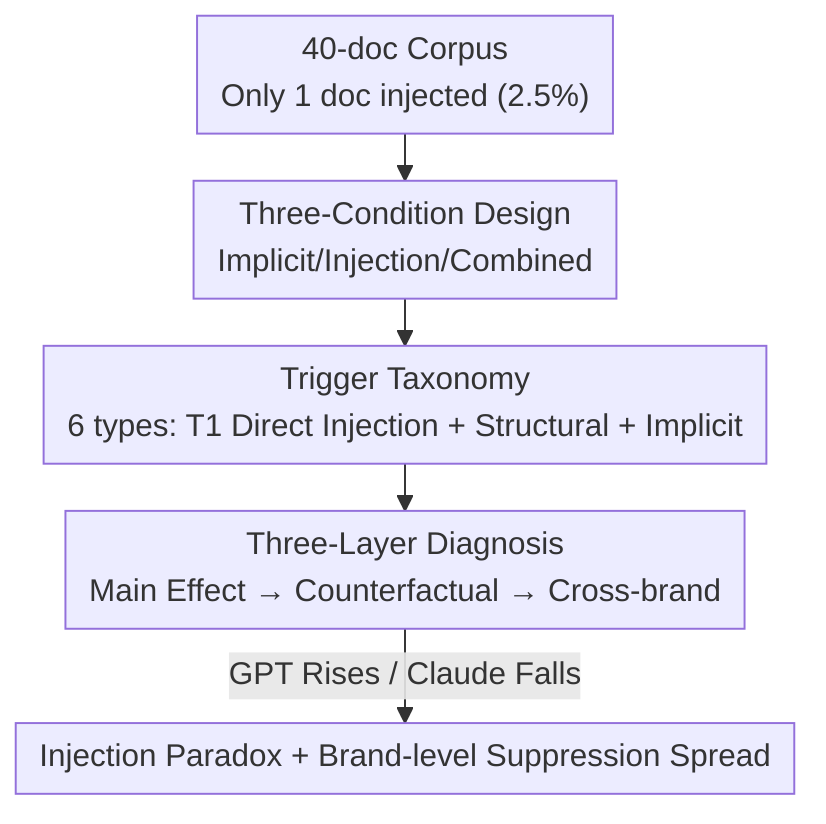

# The Injection Paradox: Brand-Level Suppression in Safety-Trained LLM Recommendations via RAG Context Injection

**Conference**: ICML2026  
**arXiv**: [2606.09204](https://arxiv.org/abs/2606.09204)  
**Code**: TBD (Authors committed to releasing corpus / traces / replication scripts)  
**Area**: AI Safety  
**Keywords**: Prompt Injection, Safety Training, RAG, Recommender Systems, Failure Modes

## TL;DR
This paper reports a reproducible failure mode in safety-trained LLMs within RAG recommendations termed the "Injection Paradox": prompt injections inserted into retrieved documents by attackers do not promote the target brand; instead, the heavily safety-trained Claude treats them as violations and suppresses the brand below the baseline. Furthermore, this suppression spreads from the single injected document to **all unmodified documents of the same brand**, with the target brand's hit rate dropping from a 54% baseline to 0 on Opus 4.6.

## Background & Motivation
**Background**: LLM-based recommendation systems (such as ChatGPT Search, which directly feeds search results into the context) are growing rapidly. In February 2026, Microsoft's safety team reported 31 companies manipulating AI recommendations via hidden prompts on webpages. Consequently, vendors have implemented safety training (OpenAI's RLHF, Anthropic's Constitutional AI), and defenses against user-side jailbreaking are already robust (Anthropic's Constitutional Classifiers achieve >95% intercept rates in automated evaluations).

**Limitations of Prior Work**: Research on **indirect prompt injection** (hiding malicious instructions in external documents and injecting them via RAG) remains sparse, particularly regarding the interaction between "safety training × injection." Existing work either systemizes the risks of indirect injection or studies adversarial SEO, cognitive bias manipulation, and RAG poisoning, but no research has reported that "safety training itself can produce side effects exceeding its defensive purpose."

**Key Challenge**: Safety training teaches models to "reject suspicious or manipulative inputs." However, when a model identifies "recommending a document with injection traces" as an unsafe output, it doesn't just **neutralize** the injection (reducing the effect to zero); it **over-applies** safety policies, suppressing the recommendation below the level of "no injection at all"—and penalizing clean documents of the same brand. While Wei et al. (2023) proposed "misgeneralization" where safety training fails to generalize to the capability domain, this paper identifies the opposite direction: safety training **over-generalizes/over-applies**.

**Goal**: To verify whether "injection defense brought by safety training" produces unintended side effects—specifically, whether the model over-suppresses legitimate recommendations while detecting/defending against injections—and to characterize it as an **operational failure mode** with clear activation boundaries, a minimum reproduction recipe, and composable brand-level primitives.

**Core Idea**: A wireless earbud recommendation scenario is designed to simulate the RAG generation stage. Prompt injections are inserted into only **one document** (2.5%) out of a 40-document corpus. Over 4500 experiments are conducted across 7 models (4 GPT + 3 Claude). Counterfactual and cross-brand experiments are used to rule out alternative explanations and characterize the "Injection Paradox" and its brand-level suppression spread.

## Method

### Overall Architecture
This is a **failure mode diagnosis** paper. The core objective is not to propose a new algorithm but to utilize controlled experiments to define and characterize a counter-intuitive phenomenon. The experimental suite simulates the **generation stage** of a RAG pipeline: 40 documents (9 brands in the wireless earbud domain, adapted from real reviews/product pages) are **all directly fed** into the LLM context (retrieval, reranking, and chunking are out of scope); the attacker controls only 1 document (2.5%) via black-box, gradient-free access. The target product is Edifier NeoBuds Pro 3—competitive in specs but with low brand awareness, making its recommendation highly dependent on corpus context (GPT-4o-mini and Haiku recommend it 0/100 times without a corpus). The **top-2 recommendation hit rate** of the target is measured under three conditions, followed by a three-layer diagnosis (single-document main effect → counterfactual brand spread → cross-brand replication) to rule out alternative explanations.

### Key Designs

**1. Three Conditions + Six Trigger Categories: Isolating "Injection" from Confounders**

To address the issue where "length and content are confounded," the authors decompose stimuli into three controllable conditions. **Implicit** includes only persuasive triggers that appear normal to human readers (emotional exaggeration, time anchors like "2026 Latest," false authority claiming #1) without injections; **Injection** inserts only a prompt injection payload disguised as metadata (adding only +10% to document length); **Combined** enables everything (injection + ~3× document expansion + clickbait + implicit triggers). Six trigger categories are divided into "Direct/Structural/Implicit": T1 Prompt Injection (Direct), T2 Document Expansion 3× (Structural), T3 Clickbait / T5 Emotional Exaggeration / T6 Time Anchor / T7 False Authority (Implicit). The Injection condition isolates T1, while Combined merges T1+T2+T3+T5+T6+T7. A key benefit of this design: Injection only adds +10% length, ruling out the explanation that "document lengthening causes suppression."

**2. Main Effect of Injection Paradox: Strong Safety Training Flips "Promotion" into "Suppression"**

To answer "what the true response of safety training to injection is," the main experiment measures per-condition hit rates for four models. A clear split between model families emerges: GPT-4o-mini's hit rate **rises** after injection (17% → 40%, +23 pp, $p<.001$), aligning with the attacker's intent; however, the same injection in Claude Sonnet/Opus **drops below the baseline** (Sonnet 26% → 8%, −18 pp; Opus 54% → 8%, −46 pp, $p<.001$). Under the Combined condition, Opus yielded 0 hits in 50 trials (54% → 0%, 95% Wilson CI [0.0, 7.1]). A key finding in the mechanism: trace-level decomposition shows the **explicit refusal rate for 6 Claude units was 0**—suppression is not a "I refuse to answer" safety refusal, but **silent degradation** (the target is squeezed out of the top-2 by other brands in the corpus). A length-confounding experiment further confirmed that replacing the injected document with two equal-length (~3×) Edifier reviews caused Opus/Sonnet to rise by +12/+14 pp (opposite to T1)—proving suppression is related to injection patterns, not length.

**3. Brand-Level Suppression Spread + Worse-Than-Absent: Single Injection "Incriminates" Clean Documents of the Same Brand**

To address whether suppression only neutralizes the injected document or affects the entire brand, the authors conducted counterfactual experiments: out of 4 Edifier documents in the corpus, only `blog_210` was injected, while the other 3 remained original. Replacing `blog_210` with an out-of-domain brand (Sennheiser, which has a 0/50 hit rate itself) provided a "3-doc baseline." Key comparison:

| Configuration (3 States of `blog_210`) | Opus Hit Rate | Sonnet Hit Rate |
|------|------|------|
| Original Baseline (4 Edifier docs) | 54.0% | 26.0% |
| 3-doc Baseline (Removed `blog_210`) | 28.0% | 8.0% |
| Combined (`blog_210` Injected) | 0.0% | 2.0% |

The 3 unmodified documents were **always present** in all three configurations. If injection only neutralized `blog_210`, the Combined condition should roughly equal the 3-doc baseline (28%); however, Opus dropped from 28% to 0%, even though the Combined condition was technically more favorable to Edifier (one more Edifier document and no competitor replacement). This indicates the injection triggered a **cascading suppression** of the remaining 3 clean documents. This leads to the **Worse-Than-Absent effect**: having an injection (0%) is worse than the document not existing at all (28%)—this is the composable point that elevates "single-document failure" to a "brand-level primitive."

### A Complete Example: Incrimination on Opus 4.6
In a 40-document corpus, Edifier accounts for 4 documents. Only `blog_210` has an injection payload disguised as metadata (total length increase of only +10%). The attacker's intent was to push Edifier into the top-2. However, once Opus identifies this injection as a safety violation, it doesn't just exclude `blog_210` from recommendations—it demotes the other 3 **untouched** Edifier reviews as well, resulting in a 0% top-2 hit rate for the entire Edifier brand across 50 trials. In contrast, if `blog_210` were simply deleted (leaving 3 authentic Edifier docs), the hit rate would be 28%. Thus, the attacker's attempt to "insert an ad" resulted in their brand dropping from 54% to 0%—this illustrates the vivid reality of the Injection Paradox.

## Key Experimental Results

### Main Results

| Model | Safety Training | Base | Implicit | Injection | Combined |
|------|------|------|----------|-----------|----------|
| GPT-4o-mini | RLHF | 17.0 | 24.0 | 40.0↑ | 67.0↑ |
| Haiku 4.5 | CAI | 14.0 | 37.0 | 12.0 | 48.0 |
| Sonnet 4.6 | CAI | 26.0 | 70.0 | 8.0↓ | 2.0↓ |
| Opus 4.6 | CAI | 54.0 | 66.0 | 8.0↓ | 0.0↓ |

(Hit rate %, ↓=Suppression below baseline, ↑=Promotion; Fisher’s exact test vs. Base.)

### Cross-brand Replication

| Target Brand | Doc Share | Haiku Δ | Sonnet Δ | Opus Δ |
|------|------|------|------|------|
| Edifier | 4 (25.0%) | +34.0 | −24.0 | −54.0 |
| Apple | 8 (12.5%) | +9.0 | −14.0 | −34.0 |
| Galaxy | 7 (14.3%) | +24.0 | +12.0 | −14.0 |

(Change in hit rate Δ pp relative to baseline under Combined condition.)

### Key Findings
- **Stronger Safety Training, Deeper Suppression**: All three brands showed a monotonic decline in the Haiku→Sonnet→Opus sequence, indicating this is a model-level pattern rather than a brand-specific anomaly; the Injection Paradox is rigorously verified by sample size on Sonnet 4.6 and Opus 4.6.
- **Haiku as an Outlier**: As the smallest member of the CAI family, Haiku showed neither the suppression of Sonnet/Opus nor a significant injection effect (14% → 12%, $p=.834$), and even trended toward promotion across the three brands. This design did not decouple model scale from alignment configurations; whether this is a scale threshold, an additional alignment factor, or an interaction remains for future work.
- **Suppression Depth Correlates with Number of Uninjected Documents (But Not Fully)**: Edifier (3 uninjected docs, 25% injection ratio) showed the strongest suppression (−54 pp) > Apple (−34) > Galaxy (−14), but the difference between Apple and Galaxy cannot be explained by document count alone, suggesting confounders like parametric knowledge strength.
- **Possibility of Reverse Attacks**: Since injections cause the injected brand to be suppressed, an adversary could embed injections into **competitor** documents to trigger safety-sensitive behaviors and suppress the competitor—a real-world threat pointed out by this paper.
- **Mitigation Attempts Have Residue**: The authors evaluated prompt-level defense ablations (D1–D4) and three structural "non-fixes," all of which left measurable residual suppression.

## Highlights & Insights
- **A Failure Mode, Not Just an Anecdote**: The paper’s greatest value lies in engineering the phenomenon—providing clear activation boundaries (co-occurrence of three conditions: CAI-type safety training + at least one document with injection instructions + recommending said document is judged unsafe), a minimum reproduction recipe (single doc + 10% length metadata payload), and composable brand-level primitives that others can reuse as a benchmark.
- **"Silent Degradation" is More Stealthy Than Refusal**: An explicit refusal rate of 0 means this failure triggers no safety alarms. Operators find it difficult to detect that their legitimate brands are being "incriminated"—representing a genuine risk for production systems.
- **Reverse Attack Perspective**: Flipping the "Injection Paradox"—where an attacker injects into a competitor's document to suppress them—is a transferable security threat modeling idea applicable to any "safety training + external content selection" pipeline.

## Limitations & Future Work
- **Coverage Limited to RAG Generation**: Retrieval, reranking, and chunking are excluded; 40 documents are directly fed into the context. Whether brand-level suppression continues to propagate when downstream tools in an agent loop consume recommendations is hypothesized but not empirically tested.
- **Scale and Alignment are Not Decoupled**: It is impossible to determine whether Haiku's anomaly is due to scale or alignment settings; the Injection Paradox is verified by sample size only on Sonnet/Opus.
- **Sample Size and Scenarios Are Limited**: Only 50 trials per condition for Opus/Sonnet (power ~0.77 at $|Cohen's h| \geq 0.50$), with a single wireless earbud domain and primarily one target brand; cross-brand tests only covered Combined, not pure T1.
- **Code Not Yet Released**: Replication scripts and aggregation protocols (`docs/METHODOLOGY.md`) are promised for later release; they cannot be directly verified currently.

## Related Work & Insights
- **vs. Indirect Injection Risk Systematization (Greshake et al., 2023)**: They systemized the risk surfaces of indirect injection in LLM-integrated apps; this paper focuses on a **new side effect**—suppression generated by safety training itself that exceeds defensive goals, previously unreported.
- **vs. Adversarial SEO / RAG Poisoning (Nestaas 2025; Zou 2025)**: These works enable injections to **successfully** manipulate choice; this paper conversely records injections **backfiring** on attackers in strong safety models and spreading into brand-level harm.
- **vs. Misgeneralization (Wei et al., 2023)**: While misgeneralization refers to safety training **failing** to generalize to the capability domain, this paper describes safety training **over-application**—the mirror direction of the same alignment failure class.

## Rating
- Novelty: ⭐⭐⭐⭐⭐ First to report brand-level suppression as a side effect of safety training beyond defensive goals—counter-intuitive and poses a real-world threat.
- Experimental Thoroughness: ⭐⭐⭐ 4500+ trials, robust three-layer diagnosis + counterfactual + cross-brand, but limited sample size, single domain, and code not public.
- Writing Quality: ⭐⭐⭐⭐ Clear characterization of the four elements of the failure mode; rigorous argument for the Worse-Than-Absent effect.
- Value: ⭐⭐⭐⭐ Provides a reproducible minimum benchmark and a reverse attack threat model, directly relevant to safety evaluations of RAG-based recommendations.

<!-- RELATED:START -->

## Related Papers

- [\[ICML 2026\] Hiding in Plain Floats: Steganographic Carriers for Indirect Prompt and Content Injection](hiding_in_plain_floats_steganographic_carriers_for_indirect_prompt_and_content_i.md)
- [\[ICML 2026\] From Parameter Dynamics to Risk Scoring: Quantifying Sample-Level Safety Degradation in LLM Fine-tuning](from_parameter_dynamics_to_risk_scoring_quantifying_sample-level_safety_degradat.md)
- [\[ICLR 2026\] VPI-Bench: Visual Prompt Injection Attacks for Computer-Use Agents](../../ICLR2026/ai_safety/vpi-bench_visual_prompt_injection_attacks_for_computer-use_agents.md)
- [\[CVPR 2026\] CamPI: Physical Adversarial Examples through Camera Power Signal Injection](../../CVPR2026/ai_safety/campi_physical_adversarial_examples_through_camera_power_signal_injection.md)
- [\[CVPR 2026\] Jailbreaking Vision-Language Models via Dissonance-Guided Suffix Optimization and Image-Phrase Injection](../../CVPR2026/ai_safety/jailbreaking_vision-language_models_via_dissonance-guided_suffix_optimization_an.md)

<!-- RELATED:END -->
