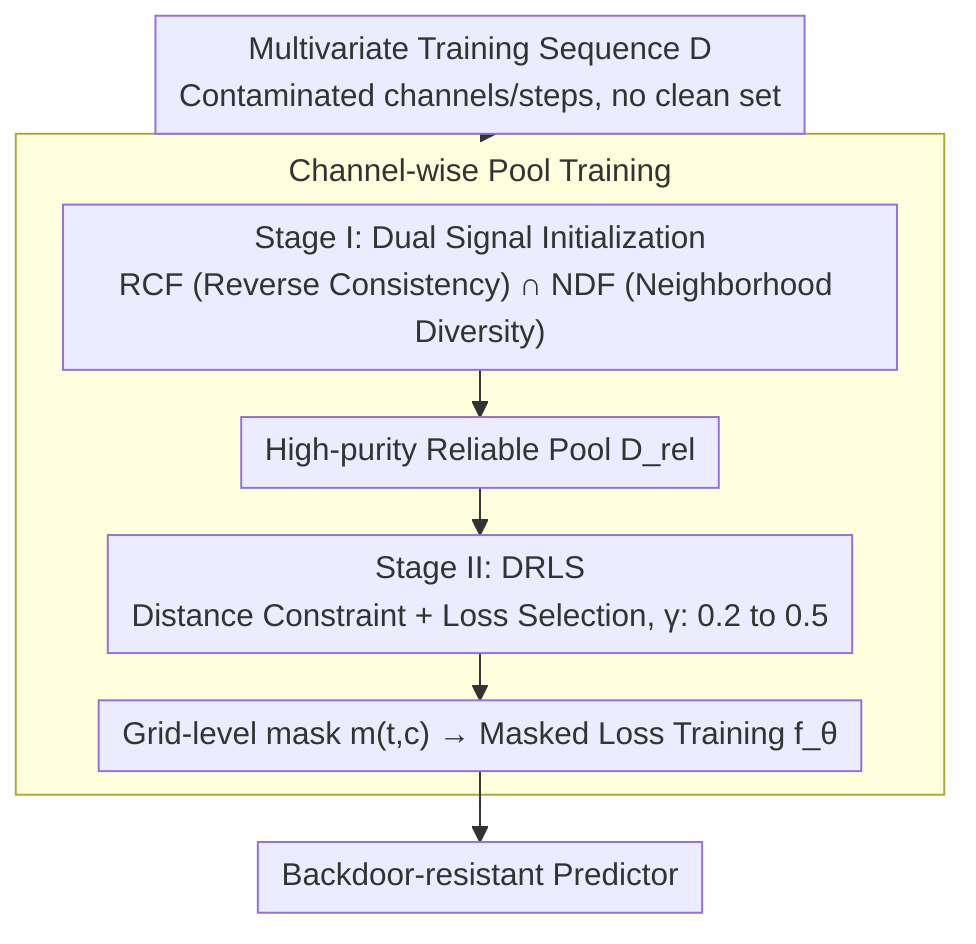

# TimeGuard: Channel-wise Pool Training for Backdoor Defense in Time Series Forecasting

**Conference**: ICML 2026  
**arXiv**: [2605.22365](https://arxiv.org/abs/2605.22365)  
**Code**: https://github.com/qducnguyen/TimeGuard  
**Area**: AI Security / Backdoor Defense / Time Series Forecasting  
**Keywords**: Time Series Forecasting, Backdoor Attack, Training-phase Defense, Channel-wise Training, Trustworthy Machine Learning

## TL;DR
TimeGuard reconstructs backdoor defense in multivariate time series forecasting (TSF) from "window-level discarding" to "channel-wise + time-step" reliable pool training. It initializes a high-purity pool using the intersection of Reverse Consistency (RCF) and Neighborhood Diversity (NDF), then progressively expands it using Distance-Regularized Loss Selection (DRLS). Without relying on any clean data, it improves $\text{MAE}_{\text{P}}$ against SOTA attacks like BackTime to 1.96x that of the strongest baseline PDB.

## Background & Motivation

**Background**: Time Series Forecasting (TSF) has been deployed at scale in critical scenarios such as transportation, weather, and power grids. However, attacks like BackTime (Lin 2024) have proven that TSF models are susceptible to backdoor injections—attackers only need to contaminate a **small fraction of channels and a short time window** in the training sequence to hijack predictions using a trigger pattern during inference. Corresponding defenses are almost non-existent; mature backdoor defenses for classification (Spectral, ABL, Fine-pruning, NAD, STRIP, etc.) have never been systematically evaluated for TSF.

**Limitations of Prior Work**: The authors first performed a systematic evaluation of 13 representative classification-side defenses on TSF, covering four stages: pre-training, in-training, post-training, and inference-time. The results were poor: sample-level filtering (Spectral / TED / TED++) had FDER scores hovering around 0.5, indicating failure. Pure loss-separation methods (ABL / ESTI) had an average FDER of 0.497, as poisoned sample losses became indistinguishable from clean ones within a few epochs. Inference-time detection (STRIP / TeCo / IBD-PSC) generally yielded AUROC values around 0.55 while increasing latency from 2 seconds to over 200 seconds. The only "moderately usable" methods—Fine-pruning, NAD, and PDB—require a trusted clean subset, which is expensive in TSF scenarios.

**Key Challenge**: The failure is attributed to two unique properties of TSF: (1) **Data entanglement**: Multivariate sequences have both channel structures and temporal dependencies. Attacks often modify only a subset of channels, but classification defenses make "whole-window" decisions, where clean channels dilute the signal—termed *channel-level signal dilution*. (2) **Task-formulation shift**: TSF involves continuous regression with sliding overlapping windows. Poisoned windows can quickly minimize loss, leading to a collapsed loss distribution—termed *training-loss degeneration*. These properties undermine both "sample-level filtering" and "loss-based separation."

**Goal**: To develop a training-stage reliable sample selection mechanism that is sensitive to channel granularity and does not rely solely on loss signals, without assuming the existence of a clean subset.

**Key Insight**: The authors based their approach on two observations. First, TSF backdoors define a **unidirectional** dependency (history $\rightarrow$ future); since there is no protection for the reverse (future $\rightarrow$ history), training a backcaster can leverage this "directional asymmetry" to amplify differences between clean and poisoned samples. Second, the authors used NTK-style kernel regression to prove a backdoor success boundary (Theorem 4.1), concluding that **successful TSF backdoors require poisoned input windows to "cluster" in the feature space**. This implies that poisoned samples will exhibit **abnormally small neighborhood distances**.

**Core Idea**: Transform training into "channel-wise pool training" at both **channel and time-step** granularities. Use RCF and NDF intersection to initialize a high-purity pool, followed by DRLS for progressive expansion. This avoids the dilution of sample-level filtering and applies distance regularization to loss selection, preventing highly correlated poisoned windows from being re-absorbed in later stages.

## Method

### Overall Architecture
TimeGuard aims to identify contaminated "channel $\times$ time-step" units during training without a clean reference set. The key shift is no longer treating a window as an indivisible unit; instead, a reliable sample pool is maintained for each channel separately. A fine-grained mask determines whether each grid point participates in training, and the pool grows from "small and pure" to "large and accurate" over two stages.

Specifically, given training set $\mathcal{D}=\{(\mathbf{X}_{t,h}, \mathbf{X}_{t,f})\}$, where samples consist of input windows $L_{\text{in}} \times C$ and target windows $L_{\text{out}} \times C$. A binary mask $m_{t,c} \in \{0,1\}$ determines if "channel $c$ at time $t$" enters training. The predictor $f_\theta$ learns on a masked loss:

$$\mathcal{L}_{\text{def}}(\theta;m) = \frac{1}{\sum_{t,c} m_{t,c}} \sum_{t,c} m_{t,c} \, \ell(f_\theta^{(c)}(\mathbf{X}_{t,h}), \mathbf{x}_{t,f}^{(c)})$$

The pipeline consists of: Stage I (first $T_1=10$ epochs) initializes a conservative but high-precision pool via RCF $\cap$ NDF; Stage II (remaining $T_2=90$ epochs) uses DRLS to linearly expand the pool ratio $\gamma$ from $\alpha=0.2$ to $\beta=0.5$. No clean reference data is needed, and the predictor architecture remains unchanged.

### Key Designs

**1. Channel-time Granularity: Refining "Window Selection" to Grid-level to Align with TSF Attack Sparsity**

The root of classification-side defense failure is channel-level signal dilution. In attacks like BackTime, the channel poisoning rate $\eta_S$ is typically 0.3. Decisions at the window level either discard many clean channels (harming $\text{MAE}_{\text{C}}$) or retain poisoned channels to save clean ones (harming $\text{MAE}_{\text{P}}$). TimeGuard addresses this by refining the binary reliability decision to a grid-level mask $m_{t,c}$ for "time $t \times$ channel $c$". A reliable pool $\mathcal{D}^{(c)}_{\text{rel}}$ is maintained for each channel, and all criteria (RCF / NDF / DRLS) are calculated independently per channel. This allows clean channels within the same window as poisoned ones to contribute to training. Removing this ("w/o Channel-wise") causes FDER to collapse from 0.868 to 0.478, proving it is a first-principle design for scale alignment.

**2. Stage I: Dual Signal Initialization using RCF and NDF**

Early training must avoid poisoned samples to prevent reinforcement. Stage I aims for a conservative but accurate starting point by intersecting two independent signals. **RCF (Reverse Consistency Filtering)**: Trains a backcaster $b_\phi$ (same architecture as $f_\theta$) to reconstruct history from flipped future windows: $\mathcal{L}_{\text{rcf}}(\mathbf{x}_t) = \ell(b_\phi(\text{Flip}(\mathbf{X}_{t,f})), \text{Flip}(\mathbf{x}_{t,h}))$. Samples below the $\alpha$ quantile of reverse loss enter $\mathcal{D}_{\text{RCF}}$. This leverages the "history $\rightarrow$ future" asymmetry of backdoors. **NDF (Neighborhood Diversity Filtering)**: Defines window distance $d_\omega(\mathbf{x}_i,\mathbf{x}_j)=1-r_\omega(\mathbf{x}_i,\mathbf{x}_j)$ using Gaussian-weighted Pearson correlation, focusing on the history-future boundary. It calculates average distance $S(\mathbf{x}_i)$ for $K$ nearest neighbors and selects the top-$\alpha$ most "isolated" samples for $\mathcal{D}_{\text{NDF}}$. Based on Theorem 4.1, poisoned samples must cluster (small $\sigma_p$) to succeed, making them "neighborhood distance outliers" that NDF excludes. The intersection $\mathcal{D}_{\text{rel}} = \mathcal{D}_{\text{RCF}} \cap \mathcal{D}_{\text{NDF}}$ provides a highly pure pool.

**3. Stage II: DRLS for Progressive Expansion with Distance Constraints**

In Stage II, loss-based separation degrades due to TSF task-formulation shift. DRLS (Distance-Regularized Loss Selection) adds a geometric constraint before loss filtering. It uses $\mathcal{D}_{\text{unrel}}$ (the unreliable set) as reference neighbors. As the pool expands, $\mathcal{D}_{\text{unrel}}$ becomes richer in poisoned samples, making the neighborhood signal sharper. It first selects the top $100\pi\gamma\%$ (where $\pi \ge 1$) furthest samples from $\mathcal{D}$ to form a candidate set $\mathcal{D}_{\text{NDF}}^{\text{cand}}$, then selects the $\gamma|\mathcal{D}|$ samples with the lowest loss from this candidate set for $\mathcal{D}_{\text{DRLS}}$. The expansion ratio $\gamma$ grows linearly from $\alpha$ to $\beta$, ensuring the "neighborhood gate" remains effective while maintaining clean accuracy. Removing DRLS ("w/o DRLS") drops FDER from 0.868 to 0.607.

### Loss & Training
Predictor $f_\theta$ is optimized with Adam (Stage I: $T_1=10$, Stage II: $T_2=90$). Backcaster $b_\phi$ is trained for $T_b=10$ epochs. Hyperparameters: $\alpha=0.2, \beta=0.5, \pi \in \{1.25, 1.5\}, K \in \{20, 32\}$. All components are computed independently per channel.

## Key Experimental Results

Datasets: PEMS03, Weather, ETTm1. Models: SimpleTM, FEDformer, TimesNet. Attacks: Random, FreqBack-TSF, BackTime. Metrics: $\text{MAE}_{\text{C}}$ ↓ (clean accuracy), $\text{MAE}_{\text{P}}$ ↑ (distance when hijacked), FDER ↑ (composite metric).

### Main Results

Comparison on PEMS03 (average of three models):

| Method | $\text{MAE}_{\text{C}}$ ↓ (Random / BackTime) | $\text{MAE}_{\text{P}}$ ↑ (Random / BackTime) | FDER ↑ (Random / BackTime) |
|----------|-------|-------|-------|
| No Defense | 17.634 / 17.607 | 17.772 / 14.201 | – / – |
| Fine-pruning (Req. Clean) | 19.020 / 18.686 | 31.643 / 19.736 | 0.633 / 0.623 |
| PDB (Prev. SOTA, Req. Clean) | 18.630 / 18.967 | 54.690 / 22.397 | 0.693 / 0.639 |
| **Ours (No Clean Data)** | **17.928 / 18.048** | **104.677 / 39.303** | **0.868 / 0.808** |

BackTime comparison across datasets:

| Dataset | Method | $\text{MAE}_{\text{C}}$ ↓ | $\text{MAE}_{\text{P}}$ ↑ | FDER ↑ |
|--------|------|--------|--------|--------|
| PEMS03 | Prev. SOTA / **Ours** | 18.97 / **18.05** | 22.40 / **39.30** | 0.639 / **0.808** |
| Weather | Prev. SOTA / **Ours** | 11.73 / **10.72** | 56.44 / **66.53** | 0.827 / **0.874** |
| ETTm1 | Prev. SOTA / **Ours** | 1.274 / 1.268 | 1.422 / **1.443** | 0.648 / **0.652** |

Overall: 1.96x average $\text{MAE}_{\text{P}}$ Gain and 6.09% average $\text{MAE}_{\text{C}}$ improvement compared to PDB. On Weather, $\text{MAE}_{\text{C}}$ is even 3.02% lower than No Defense, suggesting a regularization effect.

### Ablation Study (PEMS03, Average)

| Configuration | $\text{MAE}_{\text{C}}$ ↓ | $\text{MAE}_{\text{P}}$ ↑ | FDER ↑ |
|------|-------|-------|-------|
| **Full Ours** | 17.93 / 18.05 | **104.68 / 39.30** | **0.868 / 0.808** |
| w/o Channel-wise | 18.32 / 19.07 | 16.15 / 14.93 | 0.478 / 0.507 |
| w/o NDF | 18.58 / 18.42 | 104.46 / 38.35 | 0.853 / 0.795 |
| w/o RCF | 18.06 / 18.61 | 104.41 / 39.61 | 0.865 / 0.796 |
| w/o DRLS | 19.75 / 20.08 | 76.44 / 22.92 | 0.607 / 0.586 |

### Key Findings
- **Channel granularity is fundamental**: Removing the channel-time granularity ("w/o Channel-wise") reduces FDER to nearly zero (0.49), confirming channel-level signal dilution as the primary cause of prior failures.
- **DRLS is more critical than Stage I**: Removing NDF or RCF drops FDER by only 1–2%, but removing DRLS drops it to 0.61, highlighting the difficulty of resisting long-term loss degradation.
- **Efficiency**: Training time is 1.58x that of vanilla training, comparable to PDB and much faster than ESTI. **Zero additional overhead** during inference.
- **Adaptive Attack Resistance**: A worst-case adaptive attack (using backcaster regularization and suppressing poisoned sample correlation) actually performed worse ($\text{MAE}_{\text{P}}$ 15.34 vs. 14.20). Ours maintained an FDER of 0.744, validating Theorem 4.1.

## Highlights & Insights
- The **"channel-wise + time-step" training paradigm** is the most transferable contribution for scenarios where attacks affect only subset dimensions.
- **Using a backcaster for reverse consistency** is clever: it translates a structural asymmetry in backdoors (正向 history $\rightarrow$ future vs. 反向 future $\rightarrow$ history) into a computational loss signal.
- The link from **NTK bound to geometric priors** is elegant: Theorem 4.1 turns an empirical observation into a theoretical conclusion, enabling neighborhood distance as a side-channel detection signal independent of loss.
- **DRLS using $\mathcal{D}_{\text{unrel}}$ as a reference** creates a self-reinforcing loop where the neighborhood signal becomes sharper as the pool of excluded samples grows.

## Limitations & Future Work
- Training overhead reaches 1.58x; intended for the training phase and cannot protect pre-deployed "black-box" models.
- Theorem 4.1 relies on kernel regression approximations; qualitative for deep non-linear models.
- Experiments focused on short windows ($L_{\text{in}}=L_{\text{out}}=12$); neighborhood distance effectiveness on long horizons remains to be fully verified.
- The fixed Gaussian weight $\sigma=2$ may require tuning for different sampling rates.
- Future work: exploring frequency-domain reverse reconstruction to reduce backcaster costs and incorporating cross-channel coordination in DRLS.

## Related Work & Insights
- **vs. BackTime (Lin et al., 2024)**: BackTime is the strongest attack baseline; Ours uses the "sparse channel poisoning" property discovered by BackTime to design a defense.
- **vs. PDB (Wei et al., 2024)**: PDB is a strong in-training defense for classification requiring clean data. Ours requires no clean data and achieves 1.96x $\text{MAE}_{\text{P}}$ Gain.
- **vs. ABL / ESTI**: These rely on early-loss separation, which collapses quickly in TSF. Ours uses the "distance $\times$ loss" DRLS selector to overcome this.
- **vs. Spectral / TED / TED++**: These fail due to channel-level signal dilution; Ours restores their effectiveness by applying criteria at the correct granularity.

## Rating
- Novelty: ⭐⭐⭐⭐⭐ First systematic evaluation for TSF + first no-clean-data in-training method + channel-time dual granularity + NTK geometric prior.
- Experimental Thoroughness: ⭐⭐⭐⭐⭐ 3 Datasets $\times$ 3 Predictors $\times$ 3 Attacks + 13 Defense comparisons + detailed ablation + adaptive attacks + LLM transfer.
- Writing Quality: ⭐⭐⭐⭐ Very clear narrative arc. Mathematical symbols in DRLS/Loss sections are slightly dense.
- Value: ⭐⭐⭐⭐⭐ Immediate engineering value for deploying open-weight time series foundation models where trusted data is scarce.

<!-- RELATED:START -->

## Related Papers

- [\[ICML 2026\] Exposing Vulnerabilities in Explanation for Time Series Classifiers via Dual-Target Adversarial Attack](exposing_vulnerabilities_in_explanation_for_time_series_classifiers_via_dual-tar.md)
- [\[CVPR 2026\] Logit-Margin Repulsion for Backdoor Defense](../../CVPR2026/ai_safety/logit-margin_repulsion_for_backdoor_defense.md)
- [\[ICML 2025\] TIMING: Temporality-Aware Integrated Gradients for Time Series Explanation](../../ICML2025/ai_safety/timing_temporality-aware_integrated_gradients_for_time_series_explanation.md)
- [\[CVPR 2026\] Eliminate Distance Differences Induced by Backdoor Attacks: Layer-Selective Training and Clipping to Mask Backdoor Models](../../CVPR2026/ai_safety/eliminate_distance_differences_induced_by_backdoor_attacks_layer-selective_train.md)
- [\[ICML 2026\] Scaling Unsupervised Multi-Source Federated Domain Adaptation through Group-Wise Discrepancy Minimization](scaling_unsupervised_multi-source_federated_domain_adaptation_through_group-wise.md)

<!-- RELATED:END -->
