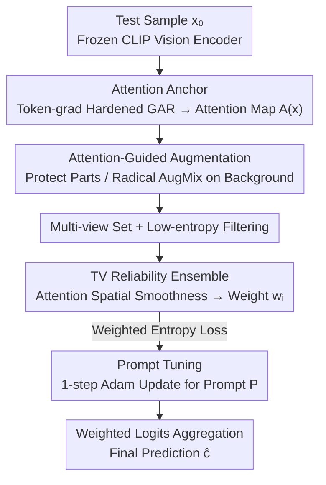

# Towards Fine-Grained Robustness: Attention-Guided Test-Time Prompt Tuning for Vision-Language Models

**Conference**: ICML 2026  
**arXiv**: [2605.19956](https://arxiv.org/abs/2605.19956)  
**Code**: https://github.com/SEU-VIPGroup/A-TPT (Available)  
**Area**: Multimodal VLM / Adversarial Robustness / Test-Time Adaptation  
**Keywords**: CLIP, Test-time prompt tuning, Adversarial robustness, Attention rollout, Fine-grained classification

## TL;DR
A-TPT utilizes an adversarial-hardened Gradient Attention Rollout to extract "semantic anchors" from the CLIP vision end. These focus maps guide spatially non-uniform multi-view augmentations and weighted ensemble based on the Total Variation of attention, simultaneously improving adversarial and clean accuracy across 9 datasets in fine-grained scenarios.

## Background & Motivation
**Background**: VLMs like CLIP exhibit strong zero-shot performance on downstream tasks, but adversarial perturbations (FGSM/PGD, Co-Attack, etc.) cause inference quality to collapse. Among defenses, training-time adaptation (VPT, FAP, SLIDE, etc.) is effective but requires labeled adversarial data and high overhead. Test-time adaptation (TPT, C-TPT, DiffTPT, MTA, AOM, TAPT, R-TPT) is cheaper but mostly designed for natural distribution shifts, offering limited robustness against "feature space distortion" caused by true adversarial attacks.

**Limitations of Prior Work**: Current adversarial test-time methods (MTA, AOM, TAPT, R-TPT) almost exclusively rely on multi-view augmentation combined with entropy or alignment objectives. Augmentations often follow random region-editing styles, which in fine-grained classification easily destroy discriminative regions (e.g., bird heads, car logos, wing shapes), further losing fragile category signals.

**Key Challenge**: To achieve stability, "discriminative semantic parts" must be preserved; however, identifying these parts requires reliable semantic signals. Existing semantics-preserving augmentations (FN-NET, NAS, Pu et al.) either learn in feature space or use logits as self-supervised labels. Under adversarial attack: (a) feature vectors are pushed across decision boundaries (visualized via cosine similarity in Figure 1a); (b) ground truth labels are often excluded from Top-K predictions (Figure 1b). Both paths fail in adversarial scenarios, and "semantic recognition" is typically coupled with the training phase.

**Goal**: Construct a test-time method without additional training or external models that can identify uncorrupted semantic parts under adversarial attack and use them as anchors to guide augmentation and ensemble.

**Key Insight**: The authors observe that attention maps reside in "image space," making them harder to flip entirely via pixel-level $\ell_\infty$ perturbations compared to feature vectors. By making the Gradient Attention Rollout (GAR) signals themselves less sensitive to noise, a relatively robust annotation of "where the critical parts are" can be obtained.

**Core Idea**: Use "adversarially hardened attention" as semantic anchors, functioning in three stages: guiding the spatial distribution of augmentation intensity, providing reliability weights for multi-view ensemble, and performing prompt tuning specifically on these trusted views.

## Method

### Overall Architecture
A-TPT addresses the dilemma where zero-shot CLIP collapses under adversarial attacks while existing test-time methods mangle fine-grained discriminative regions. The solution: instead of fighting the contaminated feature space, it first secures a "discriminative region" attention map in image space, then aligns augmentation, ensemble, and prompt optimization with it. The process is built on frozen CLIP (ViT-B/16, ViT-B/32, RN50). For a single test sample $x_0$: first, an adversarial-hardened Gradient Attention Rollout calculates CLS-to-patch attention maps $\mathbf{A}(x)\in\mathbb{R}^{H\times W}$ as semantic anchors; second, these maps guide the generation of spatially non-uniform multi-views—preserving discriminative regions while allowing radical AugMix on backgrounds; finally, reliability weights $w_i$ are calculated based on the Total Variation of each view's attention map, used for both weighted entropy loss and final logit aggregation. Only the learnable prompt $P$ is updated via 1-step Adam (lr=0.005), while encoders remain frozen.

### Key Designs

**1. Token-gradient Hardened Attention Rollout: Making anchors insensitive to noise**

The foundation is a map of discriminative regions, but original GAR fragments under adversarial attack. The issue lies in its gradient term: GAR at layer $b$ uses $\hat{\mathbf{A}}^{(b)}=\mathbf{I}+E_h(\nabla_{\mathbf{A}^{(b)}}S\odot\mathbf{A}^{(b)})^+$, where $\nabla_{\mathbf{A}^{(b)}}S$ is an edge-wise quantity. Multiplying this with attention creates second-order sensitivity that amplifies noise exponentially. The authors replace this with token-dimensional inner product weights $\mathbf{W}^{(b)}(x)=\mathcal{N}([\langle\mathbf{T}^{(b)}(x),\nabla_{\mathbf{T}^{(b)}(x)}S(x)\rangle_d]_+)$—inner product along embedding dimensions, ReLU, and $\ell_1$ normalization, then column scaling $\hat{\mathbf{A}}^{(b)}=\mathbf{I}+E_h(\mathbf{A}^{(b)}\,\mathrm{diag}(\mathbf{W}^{(b)}))^+$. Token-level gradients are first-order quantities aggregated across embedding dimensions, where noise tends to cancel out in the inner product, making it more stable than the "gradient $\times$ attention" second-order term. A stabilization trick averages the last two layers $\hat{\mathbf{A}}_\text{avg}=(\hat{\mathbf{A}}^{(B-1)}+\hat{\mathbf{A}}^{(B)})/2$, where $\hat{\mathbf{A}}=\hat{\mathbf{A}}^{(B)}\hat{\mathbf{A}}_\text{avg}$.

**2. Spatially Non-uniform Attention-Guided Multi-view Augmentation**

Prior methods like R-TPT/TAPT apply AugMix to the whole image uniformly. For fine-grained tasks, blurring bird heads or car logos loses fragile category signals—yet these regions contribute the most "information" under attack. A-TPT splits the space into two: given ratio $r$, positions with the top $\lceil rHW\rceil$ attention values are masked as $M_\text{high}$, others as $M_\text{low}=1-M_\text{high}$. Mixing intensities are set as $\lambda(r)=M_\text{high}\,m_\text{high}+M_\text{low}\,m_\text{low}$ (with $m_\text{high}<m_\text{low}$). Pixel-wise mixing is performed as $x_i=(1-\lambda)\odot b_i+\lambda\odot\tilde{x}_i$, where $b_i$ is a base view (Flip+Crop) and $\tilde{x}_i$ is an aggressive AugMix view. This preserves discriminative regions while radicalizing the background for diversity.

**3. Reliability Ensemble based on Anisotropic Total Variation**

Selecting views based solely on entropy can be misleading: some views may have low entropy but focus on incorrect regions (background or high-frequency artifacts). The mechanism assumes that a "good" view's CLS-to-patch attention should show continuous high responses in discriminative regions and be spatially smooth (low TV), whereas noise-driven attention appears fragmented (high TV). For each low-entropy candidate view, anisotropic Total Variation is calculated:

$$\mathrm{TV}(\mathbf{A}(x_i))=\sum_{u,v}|A_{u+1,v}-A_{u,v}|+\sum_{u,v}|A_{u,v+1}-A_{u,v}|$$

Reliability weights are derived via softmax on the negative exponent: $w_i=\exp(-\mathrm{TV}(\mathbf{A}(x_i)))/\sum_{j\in\mathcal{B}}\exp(-\mathrm{TV}(\mathbf{A}(x_j)))$, with final prediction $\hat{c}=\arg\max_c\sum_{i\in\mathcal{B}}w_i p_c(x_i)$. TV captures spatial structure, providing a filter dimension beyond distribution entropy.

### Loss & Training
Prompt tuning follows the entropy minimization objective $\mathcal{L}_H(P)=-\frac{1}{|\mathcal{B}|}\sum_{i\in\mathcal{B}}\sum_c p_c(x_i)\log p_c(x_i)$, where $\mathcal{B}$ is the set of views after A-TPT augmentation and filtering. Adam optimizer is used with weight decay, $T=1$ step, and lr $=0.005$. Adversarial samples are generated via PGD: $\varepsilon=4/255$, 100 steps for ViT; $\varepsilon=1/255$, 1 step for ResNet50. CLIP weights are never modified.

## Key Experimental Results

### Main Results
Testing on 8 fine-grained/general datasets + ImageNet-OOD against TPT-Ensemble, MTA, R-TPT, and TTC.

| Dataset (Adv. acc., ViT-B/16) | CLIP | TPT-Ens | MTA | R-TPT | **A-TPT** | Gain (vs R-TPT) |
|---|---|---|---|---|---|---|
| OxfordPets | 0.0 | 51.2 | 51.8 | 60.2 | **70.5** | +10.3 |
| Caltech101 | 0.0 | 74.7 | 72.1 | 82.0 | **85.6** | +3.6 |
| StanfordCars | 0.0 | 26.0 | 18.5 | 34.7 | **39.2** | +4.5 |
| DTD | 0.0 | 25.1 | 16.2 | 32.8 | **37.8** | +5.0 |
| UCF101 | 0.0 | 30.6 | 27.5 | 43.2 | **51.7** | +8.5 |
| EuroSAT | 0.0 | 2.2 | 1.2 | 8.5 | **13.1** | +4.6 |
| Flower102 | 0.0 | 36.3 | 27.9 | 44.6 | **52.6** | +8.0 |
| FGVC-Aircraft | 0.0 | 8.7 | 4.3 | 13.2 | **15.1** | +1.9 |
| **Average** | **0.0** | 31.9 | 27.4 | 39.9 | **45.7** | **+5.8** |

A-TPT also achieves the highest average clean accuracy (63.0 vs R-TPT 61.1 on ViT-B/16). On ImageNet-OOD with ResNet50, A-TPT leads with clean 48.0 and adv 35.8.

### Ablation Study

| Configuration | Avg. Adv. acc. (ViT-B/16, 8 datasets) | Description |
|------|----|------|
| Full A-TPT | 45.7 | All modules included |
| w/o Token-grad refinement | Significant Drop | Attention fragments under PGD; masks become unstable |
| w/o Attention-guided aug | Moderate Drop | Pets/Flowers/Aircraft drop sharply; validates part protection |
| w/o TV-based ensemble | Slight Drop | TV mainly filters "low entropy but misaligned" views |
| w/o GAR stabilization | Marginal Drop | Shallow noise leaks into rollout end |

### Key Findings
- **Superiority over R-TPT**: Gains are highest (+8 to +10) in tasks with highly localized discriminative regions (Pets, UCF101, Flowers), confirming that protecting parts is the missing link in global augmentation methods.
- **Zero-shot CLIP Failure**: Raw CLIP sits at 0% under PGD $\varepsilon=4/255$, whereas A-TPT recovers it to 45.7%, approaching training-time method levels.
- **Clean + Adversarial Synergy**: Unlike MTA, which sacrifices adversarial robustness for mean-shift in feature space, A-TPT's image-space anchors prevent failure modes where feature clustering is misleading.

## Highlights & Insights
- **Problem Reduction**: Reduces "test-time robustness" to "attention robustness." Rather than fighting distorted feature vectors, it stabilizes localizing discriminative regions in image space.
- **Token-level Gradient Trick**: Replacing second-order attention gradients with first-order token inner products is a broadly applicable trick for any ViT-based explainability method under noise.
- **TV as Reliability Meta-Metric**: Total Variation provides a new axis for view filtering (spatial structure) that complements prediction entropy.

## Limitations & Future Work
- **Limitations**: Dependency on a "good enough" initial attention map; performance gains are smaller on texture-dominated tasks (e.g., EuroSAT).
- **Observations**: (1) Latency is higher than R-TPT due to token-gradient calculation; (2) Sensitivity to hyperparameters $r$, $m_\text{high}$, and $m_\text{low}$ was not fully scanned.
- **Future Work**: Incorporating more structured attention priors or ensembling across multiple target logits in the GAR phase.

## Related Work & Insights
- **vs R-TPT (Sheng et al., 2025)**: Shares the prompt tuning + entropy framework but lacks spatial awareness. A-TPT's spatial non-uniformity solves the "blurring out signals" issue.
- **vs MTA (Zanella & Ben Ayed, 2024)**: MTA assumes feature clusters are still valid under attack; A-TPT proves this assumption often fails and shifts operations to the image/attention space.
- **vs Semantics-Preserving Augmentation**: Prior works rely on feature space or logits for semantic signals; A-TPT is the first to successfully move this concept to test-time via image-space attention maps.

## Rating
- Novelty: ⭐⭐⭐⭐ (Clean perspective shift to robust attention)
- Experimental Thoroughness: ⭐⭐⭐⭐ (Wide range of datasets and backbones)
- Writing Quality: ⭐⭐⭐⭐ (Clear motivation and logic)
- Value: ⭐⭐⭐⭐ (Deployment-friendly; no extra training needed)

<!-- RELATED:START -->

## Related Papers

- [\[CVPR 2026\] A Provable Energy-Guided Test-Time Defense Boosting Adversarial Robustness of Large Vision-Language Models](../../CVPR2026/ai_safety/a_provable_energy-guided_test-time_defense_boosting_adversarial_robustness_of_la.md)
- [\[ICML 2026\] Decoupled Training with Local Reinforcement Fine-Tuning in Federated Learning](decoupled_training_with_local_reinforcement_fine-tuning_in_federated_learning.md)
- [\[ICML 2026\] TCAP: Tri-Component Attention Profiling for Unsupervised Backdoor Detection in MLLM Fine-Tuning](tcap_tri-component_attention_profiling_for_unsupervised_backdoor_detection_in_ml.md)
- [\[ICML 2026\] HEDP: A Hybrid Energy-Distance Prompt-based Framework for Domain Incremental Learning](hedp_a_hybrid_energy-distance_prompt-based_framework_for_domain_incremental_lear.md)
- [\[ICML 2026\] dgMARK: Decoding-Guided Watermarking for Diffusion Language Models](dgmark_decoding-guided_watermarking_for_diffusion_language_models.md)

<!-- RELATED:END -->
