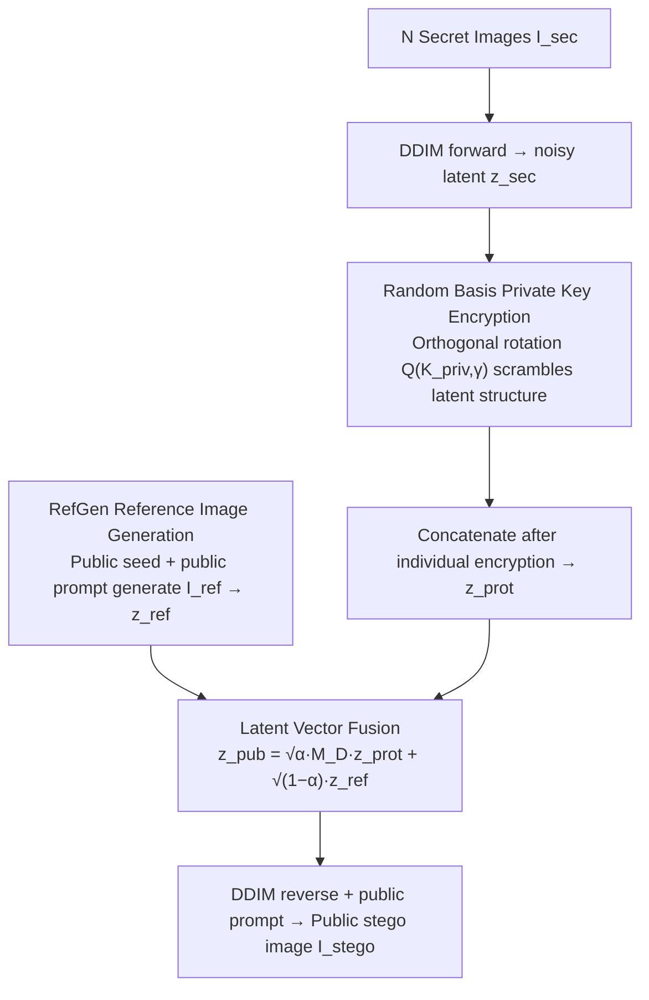

# Training-Free Coverless Multi-Image Steganography with Access Control

**Conference**: ICML 2026  
**arXiv**: [2603.09390](https://arxiv.org/abs/2603.09390)  
**Code**: https://github.com/Minyeol/MIDAS  
**Area**: AI Security / Information Hiding / Diffusion Models  
**Keywords**: Coverless Steganography, Multi-image Steganography, Access Control, Diffusion Models, Random Basis

## TL;DR
MIDAS is a training-free coverless multi-image steganography framework based on pre-trained diffusion models. It replaces traditional Noise Flip with Random Basis (orthogonal random bases) to achieve fine-grained access control via private keys. Combined with Latent Vector Fusion to eliminate splicing boundaries, it achieves multi-image hiding and anti-steganographic analysis without transmitting any additional secret-related information.

## Background & Motivation

**Background**: Image steganography primarily follows two paths. **Modification-based** methods (e.g., Baluja, HiNet, DeepMIH, IIS, AIS) encode secret images directly into the pixels or wavelet coefficients of a cover image. While quality is high, they are easily detected by stegananalysis once the cover is leaked. **Coverless Image Steganography (CIS)** uses generative models to synthesize stego images directly (no modified cover exists), inherently resisting stegananalysis. CRoSS, DiffStega, and DStyleStego are representative training-free CIS schemes.

**Limitations of Prior Work**: Existing training-free CIS methods mostly lack access control. Naive extension to multi-image scenarios leads to two failures: (1) **reconstruction quality collapse** when single-image designs are replicated $N$ times; (2) **visible splicing seams** in stego images (as shown in Fig. 1 for DiffStega* / CRoSS*) because the reverse diffusion process cannot smooth across boundaries when noisy latents are simply concatenated. More critically, methods like DiffStega lack true **access control security**, as incorrect $K_{priv}$ can still yield recognizable images.

**Key Challenge**: CIS aims to simultaneously achieve four capabilities: training-free, multi-image support, access control, and no side information transmission. Existing works either require high training costs (Chen 2025, Qin 2025), necessitate transmitting secret-related side information (DStyleStego, HIS), or fail to guarantee access control. No method satisfies all four conditions.

**Goal**: Construct a truly training-free multi-image access control CIS on public diffusion models where: (a) $N$ secret images are fused into 1 stego image, (b) only users with the correct $K_{priv\_i}$ can recover the $i$-th image, (c) no additional secret-related info is transmitted, and (d) it resists stegananalysis.

**Key Insight**: It is observed that the prior private key mechanism (Noise Flip) uses simple diagonal sign-flip matrices $M_d = \text{diag}(e), e\in\{-1,1\}^d$. Its search space is too regular and fails to sufficiently suppress structural residual info in noisy latents. Replacing this with a **seed-derived random orthogonal basis** $Q_d(\mathcal{K},\gamma)$ maintains reversibility ($Q^T Q = I$) while information-theoretically ensuring the leakage rate $R_L$ approaches zero as intensity $\gamma \to 1$.

**Core Idea**: Utilize seed-driven random orthogonal matrix (Random Basis) encryption and Latent Vector Fusion with a shared reference latent to replace naive concatenation. This unifies "encryption" and "boundary elimination" within the same mathematical structure.

## Method

### Overall Architecture
MIDAS hides $N$ secret images within a single generated image and authorizes recovery via private keys without training new models or leaking side information. The mechanism operates in the latent space ($C \times H \times W$) of Stable Diffusion v1.5. Encryption and boundary elimination are unified through orthogonal matrix operations on latent vectors. The sender inverts each secret image into a noisy latent, encrypts them with private keys, concatenates them, and fuses them with a deterministically generated reference latent to render a public stego image.

### Key Designs

**1. Random Basis Private Key Encryption: Orthogonal Rotation over Sign Flip with Provable Leakage Bounds**

Previous Noise Flip mechanisms used $M_d = \text{diag}(e),\, e\in\{-1,1\}^d$, which has a search space of only $2^d$ and fails to disrupt spatial structures. MIDAS utilizes a seed-derived random orthogonal matrix: any $d$-dimensional latent $\mathbf{z}$ is encrypted as $\mathbf{z}_{enc} = M_d \mathbf{z}$, where $M_d = Q_d(\mathcal{K},\gamma)$ is determined by key $\mathcal{K}$ and intensity $\gamma$. As an orthogonal matrix, decryption is a perfect reconstruction via transpose $\mathbf{z} = M_d^T \mathbf{z}_{enc}$. Security is enhanced as high-dimensional rotation thoroughly scrambles spatial correlation. Theorem 3.1 proves the leakage rate $R_L \approx O\!\left(\frac{-\log\Delta+\log m}{m} + (1-\gamma)(-\log\Delta+1)\right)$. With $m \approx 10^6$ and $\Delta \approx 10^{-7}$, the first term is negligible, and the second approaches zero as $\gamma \to 1$.

**2. Latent Vector Fusion: Global Rotation to Eliminate Splicing Seams**

Direct concatenation of $N$ encrypted sub-latents into $\mathbf{z}_{prot}$ followed by DDIM reverse leaves obvious splicing seams because diffusion models cannot de-noise smoothly across segment boundaries. MIDAS applies a **global** orthogonal transformation to the entire latent: $\mathbf{z}_{pub} = \sqrt{\alpha}\, M_D \mathbf{z}_{prot} + \sqrt{1-\alpha}\, \mathbf{z}_{ref}$. Here $M_D = Q_D(\mathcal{K}_{pub}, \gamma_{fuse})$ operates on the full $D = C \times H \times W$ dimension to disrupt boundary information, while $\mathbf{z}_{ref}$ injects a natural image prior with weight $\sqrt{1-\alpha}$. The receiver performs the strict inverse $\hat{\mathbf{z}}_{prot} = M_D^T\!\left(\frac{\tilde{\mathbf{z}}_{pub} - \sqrt{1-\alpha}\,\mathbf{z}_{ref}}{\sqrt{\alpha}}\right)$.

**3. RefGen: Reference Image Generation Without Control Images**

The reference latent $\mathbf{z}_{ref}$ cannot be transmitted directly. Unlike DiffStega which uses side-information-leaking control images, MIDAS generates $I_{ref}$ deterministically using a separate pre-trained diffusion model with a public key $\mathcal{K}_{pub}$ as the initial Gaussian seed and a public prompt $\mathcal{P}_{pub}$. Since diffusion is reproducible with a fixed seed, both parties generate the same $I_{ref}$ locally, eliminating the need for secret-related side information.

### Mechanism
Taking $N=2$ as an example: The sender downsamples two secret images $I_{sec}^1, I_{sec}^2$ and performs DDIM forward to get noisy latents $\mathbf{z}_{sec}^i$. These are encrypted with $\mathcal{K}_{priv}^i$ via Random Basis into $\mathbf{z}_{prot}^i$ and concatenated into $\mathbf{z}_{prot}$. Latent Vector Fusion then mixes this with $\mathbf{z}_{ref}$ (from RefGen) using $\mathcal{K}_{pub}$ to produce $\mathbf{z}_{pub}$. Finally, DDIM reverse with prompt $\mathcal{P}_{pub}$ renders $I_{stego}$. The receiver performs DDIM inversion on the received $\tilde{I}_{stego}$, reverses the fusion using the public key, and decrypts with their private key (e.g., $\mathcal{K}_{priv}^1$). Only the authorized segment yields a meaningful latent; unauthorized segments remain noise.

### Loss & Training
**Entirely training-free**; no model parameters are updated. The pipeline utilizes SD v1.5 with EDICT exact inversion and DDIM sampling. Adjustable hyperparameters include $\gamma_{priv}, \gamma_{fuse}, \alpha$. A joint denoising strategy is adopted during the reconstruction stage, which is empirically superior to segment-wise denoising.

## Key Experimental Results

### Main Results
Evaluated on Stego260 and UniStega datasets. Metrics include stego quality (MANIQA↑), stego diversity (PSNR↓/SSIM occupies similarity with secret images), correct key reconstruction quality, and wrong key reconstruction quality (lower PSNR/SSIM indicates higher security).

| Setting | Method | MANIQA↑ | Stego-PSNR↓ | CLIP↑ | Correct Key PSNR↑ | Wrong Key PSNR↓ |
|---|---|---|---|---|---|---|
| N=2 | CRoSS* | 0.406 | 15.55 | 26.07 | 17.61 | 15.27 |
| N=2 | DiffStega* | 0.399 | 17.07 | 26.95 | 21.91 | 18.14 |
| N=2 | **MIDAS** | **0.434** | **9.89** | **30.13** | **23.90** | **9.96** |
| N=4 | CRoSS* | 0.418 | 13.45 | 24.60 | 13.19 | 12.73 |
| N=4 | DiffStega* | 0.364 | 16.16 | 27.37 | 19.23 | 17.53 |
| N=4 | **MIDAS** | **0.479** | **9.00** | **30.17** | **22.28** | **9.40** |

MIDAS maintains superior stego quality (MANIQA 0.479 at N=4) while baselines degrade as $N$ increases. A ~14 dB PSNR gap (23.90 vs 9.96) between correct and wrong keys demonstrates robust access control.

### Key Findings
- **Random Basis vs Noise Flip**: Random Basis significantly outperforms Noise Flip in both stego and reconstruction quality, validating "orthogonal rotation > sign flip."
- **Latent Vector Fusion is Essential**: Removing this step causes stego quality to collapse due to splicing seams.
- **Security Threshold**: At $\gamma_{priv}=0.4$, wrong-key reconstruction quality drops to ~10 dB, rendering information unrecoverable.
- **Scalability**: MIDAS maintains usability even with $N=8$, sharing one stego image among 8 images.

## Highlights & Insights
- **Unified Mathematical Framework**: Random Basis and Latent Vector Fusion are both unified under the orthogonal matrix algebra $Q_d(\mathcal{K},\gamma)$, elegantly handling access control and boundary elimination.
- **Provable Secrecy**: Theorem 3.1 provides an asymptotic form for $R_L$, offering an explainable scaling behavior for steganographic security rather than relying solely on experimental curves.
- **Cryptographic Purity**: By removing ControlNet dependency and using deterministic generation from public resources, the design is more secure and avoids side-channel leaks.

## Limitations & Future Work
- **Inference Latency**: Exact inversion (EDICT) and DDIM sampling are slow; sampling acceleration (e.g., consistency models) is needed.
- **Geometric Constraints**: Currently requires $N_1 \times N_2 = N$ grid layouts; more flexible patch packing designs are required for arbitrary $N$.
- **Prompt Sensitivity**: Semantic conflict between $\mathcal{P}_{pub}$ and secret images may affect performance, though MIDAS is empirically more robust than baselines.

## Related Work & Insights
- **vs CRoSS**: CRoSS is single-image and requires prompt transmission; MIDAS is multi-image and uses short seeds as keys.
- **vs DiffStega**: DiffStega relies on ControlNet and Noise Flip (weak access control); MIDAS upgrades to Random Basis and eliminates splicing via Latent Vector Fusion.
- **vs IIS / AIS**: These modification-based methods have high clean PSNR but fail against stegananalysis and channel noise; MIDAS flips these trade-offs using the coverless diffusion route.

## Rating
- **Novelty**: ⭐⭐⭐⭐ Elegant combination of Random Basis and Latent Vector Fusion.
- **Experimental Thoroughness**: ⭐⭐⭐⭐ Comprehensive coverage across datasets, $N$ values, and robustness tests.
- **Writing Quality**: ⭐⭐⭐⭐ Clear motivation, well-structured tables, and sound theoretical proofs.
- **Value**: ⭐⭐⭐⭐ First to satisfy training-free, multi-image, access control, and no side info simultaneously.

<!-- RELATED:START -->

## Related Papers

- [\[CVPR 2026\] One-to-More: High-Fidelity Training-Free Anomaly Generation with Attention Control](../../CVPR2026/ai_safety/one-to-more_high-fidelity_training-free_anomaly_generation_with_attention_control.md)
- [\[CVPR 2026\] GVIS: Generative Vector Image Steganography](../../CVPR2026/ai_safety/gvis_generative_vector_image_steganography.md)
- [\[ICML 2026\] SORA: Free Second-Order Attacks in Fast Adversarial Training](sora_free_second-order_attacks_in_fast_adversarial_training.md)
- [\[CVPR 2026\] Image-based Outlier Synthesis With Training Data](../../CVPR2026/ai_safety/image-based_outlier_synthesis_with_training_data.md)
- [\[ICML 2026\] Rethinking Evaluation Paradigms in IBP-based Certified Training](rethinking_evaluation_paradigms_in_ibp-based_certified_training.md)

<!-- RELATED:END -->
