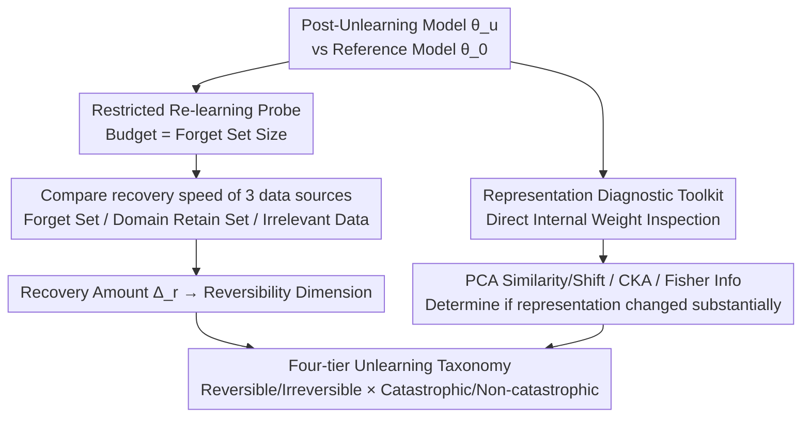

# Forgetting is Not Deletion: An Investigation of Reversibility in LLM Machine Unlearning

**Conference**: ICML 2026  
**arXiv**: [2505.16831](https://arxiv.org/abs/2505.16831)  
**Code**: https://github.com/XiaoyuXU1/Representational_Analysis_Tools  
**Area**: LLM Safety / Privacy Protection  
**Keywords**: Machine Unlearning, Reversibility, Representation Analysis, LLM Safety, Privacy

## TL;DR
This paper systematically analyzes the reversibility of LLM unlearning through representation-level diagnostic tools—finding that many unlearning methods merely suppress rather than truly delete information. It proposes a four-tier unlearning taxonomy to distinguish true information erasure from superficial performance degradation.

## Background & Motivation

**Limitations of Prior Work**: Current LLM unlearning methods are mainly evaluated using task-level metrics (accuracy, perplexity), but these metrics are deceptive—even when a model appears to "forget," its original behavior can be rapidly recovered through minimal fine-tuning, suggesting that information is merely suppressed rather than truly deleted.

**Key Challenge**: The flaw in existing evaluations lies in the inability to distinguish between true information erasure and reversible superficial performance collapse. Current evaluation frameworks overlook representation-level changes, leading to false unlearning claims.

**Goal**: To establish a representation-level unlearning evaluation framework, discover the internal mechanisms of unlearning methods, and distinguish between true information deletion and information suppression.

**Key Insight**: Starting from two dimensions—reversibility (whether information can be recovered after unlearning) and catastrophicity (collateral damage to retained knowledge)—the authors introduce tools such as PCA similarity, CKA, and Fisher Information to systematically analyze representation dynamics.

## Method

### Overall Architecture
This paper does not propose a new unlearning algorithm but establishes a representation-level diagnostic framework to answer a question masked by task-level metrics: is unlearning actually deleting information or just temporarily suppressing it? The framework consists of two branches: a **Restricted Re-learning Probe**, which uses a minimal fine-tuning budget to test if forgotten knowledge can be recalled to determine "reversibility"; and a **Representation Diagnostic Toolkit**, which examines internal weight changes from the perspectives of feature geometry, activation subspaces, and parameter sensitivity. Signals from both branches are integrated to categorize unlearning methods into a four-tier taxonomy: "Reversible/Irreversible $\times$ Catastrophic/Non-catastrophic."

### Key Designs

**1. Restricted Re-learning Probe: Detecting latent information with a budget equal to the forget set size**

Full retraining is too costly to serve as a routine probe. This paper adopts restricted re-learning—where the fine-tuning budget is strictly limited to the size of the forget set—to see if this limited data can "lure back" the forgotten capabilities. If it can, the knowledge was never deleted but only lay dormant. Crucially, the protocol compares three data sources: the forget set itself (worst-case, full knowledge exposure), domain-related retain sets (realistic scenario, indirect recall via related knowledge), and irrelevant data (robustness test). By comparing the sample efficiency required for equivalent recovery, a "reversibility difficulty gradient" is obtained—the forget set requires only 100% budget to recover fastest, while irrelevant data requires 300%+ and only achieves limited recovery. This heterogeneous sample efficiency itself serves as a fine-grained scale for unlearning strength.

**2. Representation Diagnostic Toolkit: Three complementary perspectives to determine true weight changes**

Relying solely on output can be misleading, so internal weights must be probed directly. The toolkit benchmarks three perspectives: the geometric perspective uses **PCA Similarity and Shift** to measure orientation alignment and translational drift of feature principal subspaces, with **Mean PCA Distance** quantifying the overall drift magnitude; the subspace perspective uses **Centered Kernel Alignment (CKA)** to evaluate how much overlap remains in activation subspaces before and after unlearning; the optimization perspective uses the **Fisher Information Matrix (FIM)** to track changes in parameter sensitivity within the loss landscape, identifying which directions are truly "locked." While a single metric might misjudge due to coincidental alignment in one layer, conclusions are credible when all three perspectives signal substantial representational shifts. The value of these tools lies in providing internal evidence that information was rewritten—rather than measurement noise—when the re-learning probe fails.

**3. Four-tier Unlearning Taxonomy: Replacing single accuracy with orthogonal dimensions of reversibility and catastrophicity**

With signals from the two branches, the evaluation is decomposed into two independent questions forming a 2D coordinate system. The first is reversibility: defining the performance drop caused by unlearning as $\Delta_u(\mathcal{T}) = E(\theta_0, \mathcal{T}) - E(\theta_u, \mathcal{T})$ (difference between original model $\theta_0$ and unlearned model $\theta_u$ on task $\mathcal{T}$), and then measuring the recovery amount $\Delta_r(\mathcal{T})$ after restricted re-learning. If $\Delta_r$ brings performance back near original levels, it is "reversible," meaning info was not truly deleted. The second is catastrophicity: whether unlearning inadvertently damages the retain set (knowledge that should be kept), measured directly by the performance drop in the retain set. Binary values for each dimension yield four quadrants: Reversible-Non-catastrophic (a practically acceptable trade-off), Reversible-Catastrophic, Irreversible-Catastrophic, and the ideal but difficult-to-achieve Irreversible-Non-catastrophic. This coordinate system ensures that "successful unlearning" is no longer just a claim about accuracy, but a diagnosis distinguishing "true erasure" from "surface degradation."

## Key Experimental Results

### Main Results

| Unlearning Method | Forget Acc ↓ | Retain Acc ↓ | Reversibility | Catastrophicity | Taxonomy |
|---------|------------|-----------|------|------|------|
| GA | 13.5-20.7% | 11.5-16.0% | ✓ | ✓ | Reversible-Catastrophic |
| GA+GD | 3.8-15.7% | 0.9-4.3% | ✓ | ✗ | Reversible-Non-catastrophic |
| GA+KL | 7.9-12.7% | 7.0-12.8% | ✓ | ✓ | Reversible-Catastrophic |
| NPO | 2.7-4.3% | 0.8-2.9% | ✓ | ✗ | Reversible-Non-catastrophic |
| NPO+KL | 2.5-4.1% | 0.7-6.3% | ✓ | ✗ | Reversible-Non-catastrophic |
| RLabel | 1.2-4.6% | 0.8-3.4% | ✓ | ✗ | Reversible-Non-catastrophic |

### Re-learning Recovery Efficiency

| Data Source Type | Sample Requirement | Recovery Speed | Final Performance | Notes |
|---------|---------|--------|--------|------|
| Forget Set | 100% | Fastest | Near Original | Worst-case scenario |
| Domain Retain Set | 150-200% | Medium | Partial Recovery | Realistic scenario |
| Irrelevant Data | 300%+ | Slowest | Limited Recovery | Robustness test |

### Key Findings
- All six standard unlearning methods exhibit reversibility under single-instance unlearning, but only GA+GD, NPO variants, and RLabel achieve non-catastrophicity.
- Recovery strategies without parameter updates, such as prompt attacks, jailbreaks, and quantization, fail completely, indicating that representations are truly modified post-unlearning.
- Sample efficiency analysis reveals heterogeneous recovery characteristics across different data sources.
- In sequential unlearning scenarios, reversible-catastrophic methods lead to irreversible collapse of retained knowledge.

## Highlights & Insights
- **Innovative combination of representation tools**: First to combine PCA, CKA, and FIM for diagnosing unlearning.
- **Re-learning as a universal probe**: Standardizes re-learning as a formal reversibility test, regularizing a new paradigm for unlearning evaluation.
- **Clarity of the four-tier taxonomy**: Orthogonally decomposes reversibility and catastrophicity to clearly delineate fundamental differences in unlearning.

## Limitations & Future Work
- Computational Cost—Representation analysis requires large-scale computation, offering limited scalability for ultra-large models.
- Ambiguity of Reversibility Thresholds—The paper does not provide explicit thresholds for determining when "base recovery" is achieved.
- Irreversible-Non-catastrophic unlearning remains difficult to achieve—the authors identified one case but did not propose a systematic algorithm.

## Related Work & Insights
- **vs Mechanistic Interpretability**: This work does not modify model architecture but diagnoses existing unlearning methods via representation analysis.
- **vs Privacy Protection**: Focuses on the reversibility of information deletion rather than the mathematical boundaries of privacy leakage.

## Rating
- Novelty: ⭐⭐⭐⭐⭐  First systematic representation-level reversibility analysis.
- Experimental Thoroughness: ⭐⭐⭐⭐  Covers 6 methods, 2 models, and multiple data domains.
- Writing Quality: ⭐⭐⭐⭐⭐  Clear problem statement and intuitive four-tier taxonomy.
- Value: ⭐⭐⭐⭐⭐  Exposes fundamental flaws in unlearning evaluation and sets new standards for LLM safety and privacy.

<!-- RELATED:START -->

## Related Papers

- [\[ICML 2026\] Two Blind Spots in Machine Unlearning: Over-Unlearning and Prototype Re-learning Attacks](unlearnings_blind_spots_over-unlearning_and_prototypical_relearning_attack.md)
- [\[ICML 2026\] Multilingual Unlearning in LLMs: Transfer, Dynamics, and Reversibility](multilingual_unlearning_in_llms_transfer_dynamics_and_reversibility.md)
- [\[ICML 2026\] DualOptim+: Bridging Shared and Decoupled Optimizer States for Better Machine Unlearning in Large Language Models](dualoptim_bridging_shared_and_decoupled_optimizer_states_for_better_machine_unle.md)
- [\[ICLR 2026\] FaLW: A Forgetting-aware Loss Reweighting for Long-tailed Unlearning](../../ICLR2026/ai_safety/falw_a_forgetting-aware_loss_reweighting_for_long-tailed_unlearning.md)
- [\[ICLR 2026\] Label Smoothing Improves Machine Unlearning](../../ICLR2026/ai_safety/label_smoothing_improves_machine_unlearning.md)

<!-- RELATED:END -->
