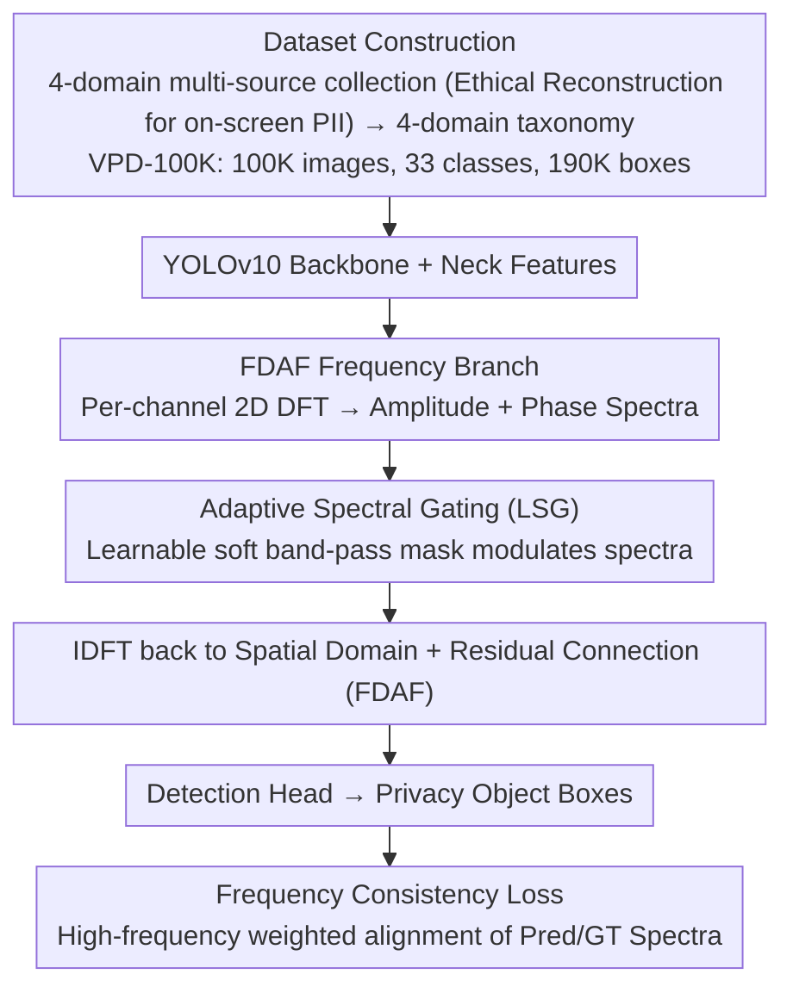

# VPD-100K: Towards Generalizable and Fine-grained Visual Privacy Protection

**Conference**: ICML 2026  
**arXiv**: [2605.10229](https://arxiv.org/abs/2605.10229)  
**Code**: https://vpd-100k.github.io/  
**Area**: AI Security / Visual Privacy Protection / Object Detection  
**Keywords**: Privacy Detection, Dataset, Frequency-Domain Attention, YOLO, Live Streaming

## TL;DR
The authors construct VPD-100K, a large-scale visual privacy dataset with 100,000 images, 33 fine-grained categories, and over 190,000 instances (covering four major domains: faces, on-screen PII, physical documents, and location markers). They propose a three-part frequency-domain enhancement module (FDAF + Adaptive Spectral Gating + Frequency Consistency Loss) plugged into the YOLOv10 Neck, increasing the AP of YOLOv10-L on VPD-100K from 53.8 to 58.6 (+4.8) while maintaining stable live stream performance at a 7.51ms latency.

## Background & Motivation

**Background**: Visual privacy detection is a critical requirement in the era of live streaming, screen sharing, and Vlogging—requiring real-time identification of sensitive information such as faces, ID cards, password boxes, and street signs in video frames. Existing works are divided into two camps: image-level sensitivity prediction (coarse-grained, no localization) and object-level identifier detection (precise but limited by small datasets).

**Limitations of Prior Work**: Existing privacy datasets suffer from what the authors summarize as the "Three Sins": (1) **Small Scale**: PrivacyAlert (6.8K), BIV-Priv (0.7K), and DIPA (1.5K) are insufficient for training large models; (2) **Coarse Categories**: Tags like "person / other people" fail to distinguish between "adults indoors" vs. "children outdoors"; (3) **Narrow Domain**: Nearly all datasets ignore **on-screen PII** (emails, passwords, verification codes, chat records), which is the most severe source of leakage in modern digital life. Furthermore, most dataset links are inactive or not released.

**Key Challenge**: Privacy data is naturally constrained by ethics—one cannot legally collect 100,000 photos of real people's bank cards for training. Thus, the desire for "large-scale + real distribution" conflicts with compliance, leading to data scarcity.

**Goal**: (1) Provide the community with a **truly usable, 100K-scale, on-screen PII-inclusive** privacy detection dataset that is fully public; (2) Design a lightweight frequency-domain enhancement module for targets like small on-screen text, blurred faces, and low-contrast sensitive objects where spatial features are weak but frequency features are significant; (3) Support both image and live video scenarios with a unified framework running at 130+ FPS.

**Key Insight**: Replace real data collection with ethically controllable "Scene Reconstruction." For instance, the team used internal accounts to simulate banking and verification code reception to take screenshots, obtaining pixel-accurate on-screen PII samples without violating real user privacy. In the frequency domain, privacy targets like text and face edges have strong signals in high-frequency components that are often averaged out by spatial YOLO convolutions; **explicitly modeling the frequency domain** can compensate for this deficiency.

**Core Idea**: For data, use "taxonomy-driven multi-source aggregation + ethical scene reconstruction" to cover 4 domains and 33 categories. For the method, use a "Spatial + Frequency dual-stream" approach—FDAF reassembles features using IDFT after performing DFT, Adaptive Spectral Gating acts as a learnable "soft band-pass filter," and frequency consistency loss aligns the frequency distributions of predicted and GT boxes.

## Method

### Overall Architecture
The paper presents two independent but complementary contributions to address the lack of data and fine-grained perception for small screen text/blurred faces. On the data side, a 4-domain taxonomy aggregates multi-source samples into VPD-100K (100K images, 33 classes, 190K+ boxes), where critical on-screen PII is collected via "Ethical Reconstruction." On the model side, the YOLOv10 backbone remains unchanged, while a frequency branch (FDAF + Adaptive Spectral Gating + Frequency Consistency Loss) is inserted into the Neck, providing an additional path for "high-frequency detail" alongside spatial features in an end-to-end YOLO training pipeline.

### Key Designs

**1. Dataset Construction: Filling gaps in "Scale / Coarse Categories / On-screen PII" via ethical reconstruction + 4-domain taxonomy**

Existing privacy datasets are either small, use coarse tags like "person," or ignore on-screen PII like emails and passwords. On-screen PII is the hardest to collect legally. This paper uses a compliance strategy for each of the four domains: faces use a WIDER FACE subset + video snapshots with fine-grained attributes like "indoor child faces"; on-screen PII is captured by researchers **simulating real digital interactions with internal accounts** (banking, verification codes, chats), obtaining pixel-level accuracy without touching real PII; physical identifiers use the MIDV-500 ID library + targeted crawling of train tickets/express labels; location indicators involve outdoor street view annotations. The result is 100K images (half at 1080p+) and 190K+ boxes, all passing ethical review. Tables 1/2 quantify the advantages: the scale is ~15× that of PrivacyAlert, and the number of categories is ~1.5× that of DIPA2. The Coefficient of Variation (CV) for category distribution (1.47) is significantly better than DIPA2 (2.50). "Internal account simulation" is where this data truly breaks through—finding a compromise between "legality" and "reality."

**2. FDAF: Adding a frequency-domain branch to the Neck to recover high-frequency details averaged out in the spatial domain**

Verification codes may occupy less than 10% of an image, and spatial features of distant documents are weak, often averaged out by surrounding textures in spatial convolutions. However, the strokes of text correspond to distinct horizontal/vertical high-frequency components in the frequency spectrum. FDAF (Frequency-Domain Attention Fusion) provides a path to "see" these signals: it performs a 2D DFT per channel on Neck features $X \in \mathbb{R}^{C \times H \times W}$ as $F_c(u,v) = \sum_{h,w} X_c(h,w) e^{-j2\pi(uh/H + vw/W)}$ to get amplitude and phase spectra. After modulation by the spectral gate, it performs IDFT back to the spatial domain $Y_{spa} = \mathcal{R}(\text{IDFT}(\tilde{F}))$ and uses a residual connection $I_{out} = \text{Conv}_{1\times 1}(\text{Concat}(I, Y_{spa})) + I$. This ensures the frequency branch adds incremental supplements without destroying original spatial representations. Table 5 shows FDAF alone boosts AP from 46.3 to 48.5 (+2.2).

**3. Adaptive Spectral Gating (LSG) + Frequency Consistency Loss: Learning to select frequency bands and align boundaries**

Amplifying all high frequencies would also amplify noise. LSG (Adaptive Spectral Gating) defines a learnable weight tensor $W_{gate} \in \mathbb{R}^{C \times H \times W}$, which, after a Sigmoid function, is element-wise multiplied with the spectrum $\tilde{F}_c(u,v) = F_c(u,v) \odot \sigma(W_{gate}(u,v))$. This acts as a joint channel-band soft mask, allowing the network to learn to activate horizontal/vertical bands for text and radial bands for faces. The accompanying frequency consistency loss links this to the supervision signal: $\mathcal{L}_{freq} = \frac{1}{N}\sum_i \|W \odot (\mathcal{F}(P_i) - \mathcal{F}(T_i))\|_2^2$, where the spectrum inside the predicted box $P_i$ is aligned with the GT box $T_i$. The weight $W(r) = 1 + \lambda r$ increases with frequency radius $r$, **penalizing high-frequency discrepancies more heavily** to force the model to match boundary details. As a boundary-aware regularization term, it enters the total loss $\mathcal{L}_{total} = \mathcal{L}_{yolo} + 0.05 \cdot \mathcal{L}_{freq}$. In ablation studies, AP75 (which is sensitive to boundary accuracy) rose from 53.9 to 54.6 due to this term.

### Loss & Training
The total loss is $\mathcal{L}_{total} = \mathcal{L}_{box} + \mathcal{L}_{cls} + \mathcal{L}_{dfl} + 0.05 \cdot \mathcal{L}_{freq}$, where the first three are standard YOLOv10 regression/classification/DFL losses. The $\lambda$ in the frequency weight $w(r) = 1 + \lambda r$ is set such that high-frequency weights are significantly larger than low-frequency ones. The base models are YOLOv10-S/L, fully fine-tuned on the VPD-100K training set. All 14 baselines were fine-tuned on the same data for fairness.

## Key Experimental Results

### Main Results
Comparison of 15 detectors on the image test set (selected rows):

| Model | AP | AP50 | AP75 | APS | APM | APL | Latency (ms) | F1 |
|------|-----|------|------|-----|-----|-----|--------------|------|
| Grounding-DINO | 48.1 | 65.8 | 62.6 | 30.4 | 51.3 | 62.3 | 119.5 | 0.68 |
| YOLOv8-L | 52.6 | 68.3 | 59.1 | 32.6 | 58.5 | 67.3 | 14.76 | 0.72 |
| YOLOv9-L | 53.4 | 68.6 | 57.9 | 33.9 | 59.1 | 70.3 | 7.73 | 0.73 |
| YOLOv10-L | 53.8 | 69.6 | 58.4 | 33.6 | 59.8 | 70.8 | 7.42 | 0.73 |
| **YOLOv10-S + FEM** | 52.1 | 67.1 | 54.6 | 30.1 | 55.6 | 64.3 | 2.71 | 0.71 |
| **YOLOv10-L + FEM** | **58.6** | **73.4** | **61.3** | **36.5** | **62.3** | 70.6 | 7.51 | **0.81** |

Ours achieved an AP Gain of +4.8 (53.8 $\to$ 58.6) and an APS (small objects) gain of +2.9. The F1 score reached 0.81, significantly leading all baselines. On the live video test set, YOLOv10-L + FEM achieved 57.7 AP with ~133 FPS.

### Ablation Study
Table 5 (Baseline YOLOv10-S):

| Configuration | FDAF | LSG | $\mathcal{L}_{freq}$ | AP | AP50 | AP75 | APS |
|------|------|-----|----------|-----|------|------|-----|
| Base | - | - | - | 46.3 | 62.7 | 51.3 | 26.1 |
| +FDAF | ✓ | - | - | 48.5 | 64.2 | 52.8 | 27.5 |
| +LSG | ✓ | ✓ | - | 50.9 | 65.8 | 53.9 | 29.2 |
| Full | ✓ | ✓ | ✓ | **52.1** | **67.1** | **54.6** | **30.1** |

The contributions of the three components are +2.2, +2.4, and +1.2 respectively, resulting in a total AP Gain of +5.8.

### Key Findings
- **LSG contributes most to small objects**: APS increased from 27.5 $\to$ 29.2 (+1.7p), validating that adaptive band selection amplifies text stroke features.
- **Frequency loss targets high IoU**: AP75 increased from 53.9 $\to$ 54.6, verifying that $\mathcal{L}_{freq}$ refines boundary precision.
- **Lightweight plugin with minimal latency**: Latency for YOLOv10-S increased from 2.53 to 2.71ms (+7%) for a +5.8 AP gain.
- **90% positive user research**: Participants agreed the taxonomy is complete and useful for reducing privacy anxiety in live streams.
- **Strong OOD generalization**: Successfully detected receipt PII and sensitive info on screen shares in real live streaming platforms despite handheld jitter.

## Highlights & Insights
- "Ethical Reconstruction" of on-screen PII is a true breakthrough, bypassing legal red lines while providing pixel-perfect distributions. This methodology can be extended to medical imaging or license plate recognition.
- Making frequency enhancement a **pluggable Neck module** means it can be seamlessly migrated to YOLOv11 or DETR-based detectors.
- The use of a small auxiliary loss weight ($\beta = 0.05$) reflects the insight that frequency signals are strong; a larger $\beta$ might overshadow the primary loss.
- The "Frequency Consistency" idea is naturally suited for any task requiring detail matching, such as medical segmentation or super-resolution.

## Limitations & Future Work
- The dataset has a heavy long-tail distribution; performance on rare classes like passports was not analyzed separately.
- On-screen PII is "simulated," biasing the distribution toward products familiar to the team (banking apps, chat tools).
- While the frequency branch is lightweight, DFT is $O(HW \log HW)$; the cost-benefit curve for 4K inputs was not provided.
- Weights $W_{gate}$ in LSG are spatial-frequency dimensional and may require resizing for different input sizes.
- Detection is only the first step; how to safely desensitize (blurring, masking, erasure) and integrate with downstream pipelines remains to be explored.

## Related Work & Insights
- **vs DIPA / BIV-Priv**: Ours is an "expanded and refined" version, ~15× scale and ~1.5× categories, with an entirely new on-screen PII domain.
- **vs PrivacyAlert**: Those use coarse image-level tags; VPD-100K provides object-level boxes for detection pipelines.
- **vs YOLOv10 / DETR**: General detectors struggle with small text/low-contrast objects; FEM utilizes the frequency domain to compensate for fine-grained boundary weaknesses.
- **vs Tree-Ring**: While those use the frequency domain for generative watermarking, VPD applies it to discriminative detection, sharing the insight that frequency SNR can be higher in difficult scenarios.

## Rating
- Novelty: ⭐⭐⭐⭐ — Outstanding dataset contribution (on-screen PII domain + ethical reconstruction methodology); the frequency module is a solid combination of classic ideas.
- Experimental Thoroughness: ⭐⭐⭐⭐ — 14 baselines, dual scenarios, complete ablation, and OOD testing; analysis of the long tail could be deeper.
- Writing Quality: ⭐⭐⭐⭐ — Clear problem-solution mapping; Tables 1/2 highlight dataset advantages effectively.
- Value: ⭐⭐⭐⭐⭐ — In the GDPR/CCPA era, a usable, compliant, 100K-scale public privacy dataset is an industry necessity.

<!-- RELATED:START -->

## Related Papers

- [\[AAAI 2026\] Fine-Grained DINO Tuning with Dual Supervision for Face Forgery Detection](../../AAAI2026/ai_safety/fine-grained_dino_tuning_with_dual_supervision_for_face_forgery_detection.md)
- [\[CVPR 2026\] DiffusionFF: A Diffusion-based Framework for Joint Face Forgery Detection and Fine-Grained Artifact Localization](../../CVPR2026/ai_safety/diffusionff_a_diffusion-based_framework_for_joint_face_forgery_detection_and_fin.md)
- [\[ECCV 2024\] SkyMask: Attack-Agnostic Robust Federated Learning with Fine-Grained Learnable Masks](../../ECCV2024/ai_safety/skymask_attack-agnostic_robust_federated_learning_with_fine-grained_learnable_ma.md)
- [\[ICML 2026\] Persuasive Privacy](persuasive_privacy.md)
- [\[CVPR 2026\] Protego: User-Centric Pose-Invariant Privacy Protection Against Face Recognition-Induced Digital Footprint Exposure](../../CVPR2026/ai_safety/protego_user-centric_pose-invariant_privacy_protection_against_face_recognition-.md)

<!-- RELATED:END -->
