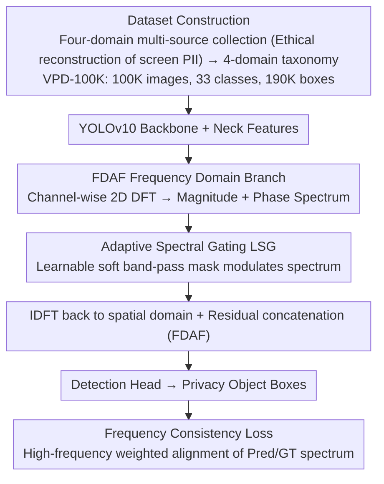

# VPD-100K: Towards Generalizable and Fine-grained Visual Privacy Protection

**Conference**: ICML 2026  
**arXiv**: [2605.10229](https://arxiv.org/abs/2605.10229)  
**Code**: https://vpd-100k.github.io/  
**Area**: AI Security / Visual Privacy Protection / Object Detection  
**Keywords**: Privacy Detection, Dataset, Frequency Domain Attention, YOLO, Live Streaming

## TL;DR
The authors constructed VPD-100K, a large-scale visual privacy dataset containing 100,000 images, 33 fine-grained categories, and over 190,000 instances (covering four domains: faces, on-screen PII, physical documents, and location markers). They proposed a three-part frequency-domain enhancement module (FDAF + Adaptive Spectral Gating + Frequency Consistency Loss) inserted into the Neck of YOLOv10. This achieved an AP increase from 53.8 to 58.6 (+4.8) for YOLOv10-L on VPD-100K, while maintaining stable performance on live streams with a latency of 7.51ms.

## Background & Motivation

**Background**: Visual privacy detection is a critical requirement in the era of live streaming, screen sharing, and Vlogging. It requires real-time recognition of sensitive information such as faces, ID cards, password boxes, and street signs. Existing work follows two main paths: image-level sensitivity prediction (coarse-grained, no localization) and object-level identifier detection (accurate but limited by small datasets).

**Limitations of Prior Work**: The authors summarize the issues with existing privacy datasets as "three sins": (1) **Small Scale**: PrivacyAlert (6.8K), BIV-Priv (0.7K), and DIPA (1.5K) are insufficient for training large models; (2) **Coarse Categories**: Tags are often limited to generic labels like "person / other people," failing to distinguish between "adult indoors" vs. "child outdoors"; (3) **Narrow Domains**: Almost all datasets neglect **on-screen PII** (emails, passwords, verification codes, chat records), which is the most severe source of leakage in modern digital life. Additionally, many dataset links are broken or not released.

**Key Challenge**: Privacy data is naturally constrained by ethics—it is impossible to legally collect 100,000 photos of real people's bank cards for training. Thus, "large-scale" and "real distribution" conflict at the compliance level, leading to data scarcity.

**Goal**: (1) Provide the community with a **truly usable, 100K-scale, on-screen PII-inclusive** privacy detection dataset that is fully public; (2) Design a lightweight frequency-domain enhancement module for targets like small on-screen text, blurred faces, and low-contrast sensitive objects, whose spatial features are weak but frequency-domain features are significant; (3) Support both image and live video scenarios with a unified framework running at 130+ FPS.

**Key Insight**: Replace real-world data collection with ethically controlled "scene reconstruction." For example, the team used internal accounts to log into simulated banks, receive verification codes, and take screenshots, obtaining pixel-accurate on-screen PII samples without violating the privacy of real individuals. Furthermore, in the frequency domain, privacy targets like text and face edges have strong signals in high-frequency components that are often averaged out by spatial YOLO convolutions. **Explicit frequency domain modeling** compensates for this shortfall.

**Core Idea**: For data, use "taxonomy-driven multi-source aggregation + ethical scene reconstruction" to cover 4 domains and 33 classes. For the method, use a "spatial + frequency dual-stream" approach—FDAF reassembles features using IDFT after applying 2D DFT, Adaptive Spectral Gating acts as a learnable "soft band-pass filter," and a frequency consistency loss aligns the frequency distributions of predicted and GT boxes.

## Method

### Overall Architecture
The paper presents two independent but complementary contributions to address the lack of data and fine-grained perception for small screen text and blurred faces. On the data side, a 4-domain taxonomy aggregates multi-source samples into VPD-100K (100K images, 33 classes, 190K+ boxes), where critical on-screen PII is collected via "ethical reconstruction." On the model side, the YOLOv10 backbone remains unchanged, but a frequency-domain branch (FDAF + Adaptive Spectral Gating + Frequency Consistency Loss) is inserted into the Neck, providing an additional path for "high-frequency detail" alongside the spatial path, maintaining end-to-end YOLO training.

### Key Designs

**1. Dataset Construction: Filling "Small Scale / Coarse Categories / Lack of Screen PII" gaps with Ethical Reconstruction + 4-domain Taxonomy**

Existing privacy datasets are either small, use coarse tags (e.g., "person"), or ignore on-screen PII like emails and passwords. On-screen PII is the hardest to collect legally. Ours uses a compliance strategy for each of the four domains: for faces, a subset of WIDER FACE + video snapshots with fine-grained attributes like "indoor child" were used; on-screen PII was captured via **internal account simulation** of digital interactions (banking, OTPs, chats) by the research team to ensure pixel-level realism without touching real PII; physical identifiers used the MIDV-500 card database + targeted scraping of tickets; location indicators were sourced from street view annotations of storefronts. The final 100K images (half over 1080p) and 190K+ boxes passed ethical review. Tables 1/2 quantify the advantages: the scale is ~15× larger than PrivacyAlert, and the number of categories is ~1.5× DIPA2. The Coefficient of Variation (CV) for category distribution (1.47) is significantly better than DIPA2 (2.50). "Internal account simulation" is where this data truly breaks through—it finds a compromise between "legality" and "realism" while forcing coverage of the high-impact but overlooked screen PII domain.

**2. FDAF: Adding a frequency-domain branch to the Neck to recover high-frequency details averaged in the spatial domain**

Verification codes occupying less than 10% of an image or distant documents have weak spatial features and are often averaged out by surrounding textures in spatial convolutions. However, the horizontal and vertical strokes of text correspond to distinct high-frequency components in the frequency spectrum. FDAF (Frequency-Domain Attention Fusion) gives the network a path to directly "see" these high-frequency signals. For each channel of the Neck output features $X \in \mathbb{R}^{C \times H \times W}$, a channel-wise 2D DFT is performed: $F_c(u,v) = \sum_{h,w} X_c(h,w) e^{-j2\pi(uh/H + vw/W)}$ to obtain magnitude and phase spectra. After modulation by the spectral gating below, it is transformed back via IDFT to the spatial domain $Y_{spa} = \mathcal{R}(\text{IDFT}(\tilde{F}))$. Finally, it is combined with the original features via residual concatenation: $I_{out} = \text{Conv}_{1\times 1}(\text{Concat}(I, Y_{spa})) + I$. The residual design ensures that the frequency branch provides incremental supplements without destroying the original spatial representation. Table 5 shows that adding FDAF alone increases AP from 46.3 to 48.5 (+2.2).

**3. Adaptive Spectral Gating (LSG) + Frequency Consistency Loss: Learning band selection and boundary alignment in frequency domain**

Directly amplifying all high frequencies also amplifies noise. Therefore, a learnable "soft band-pass filter" is needed to decide which frequency bands to retain or suppress. LSG (Adaptive Spectral Gating) defines a learnable weight tensor $W_{gate} \in \mathbb{R}^{C \times H \times W}$. After a Sigmoid operation, it is element-wise multiplied with the spectrum: $\tilde{F}_c(u,v) = F_c(u,v) \odot \sigma(W_{gate}(u,v))$. This serves as a joint channel-frequency soft mask, allowing the network to automatically learn to activate horizontal/vertical bands for text and radial bands for faces. The companion frequency consistency loss connects this perception to the supervision signal: $\mathcal{L}_{freq} = \frac{1}{N}\sum_i \|W \odot (\mathcal{F}(P_i) - \mathcal{F}(T_i))\|_2^2$, making the spectrum inside the predicted box $P_i$ close to that of the GT box $T_i$. The weight $W(r) = 1 + \lambda r$ increases with frequency radius $r$, **imposing heavier penalties on high frequencies** to force the model to match boundary details. As a boundary-aware regularizer, it is added to the total loss $\mathcal{L}_{total} = \mathcal{L}_{yolo} + 0.05 \cdot \mathcal{L}_{freq}$. The small weight of 0.05 prevents it from overwhelming the main loss while effectively tightening boundaries—as seen in the ablation study, where AP75 (sensitive to boundary precision) increased from 53.9 to 54.6.

### Loss & Training
The total loss is $\mathcal{L}_{total} = \mathcal{L}_{box} + \mathcal{L}_{cls} + \mathcal{L}_{dfl} + 0.05 \cdot \mathcal{L}_{freq}$. The first three terms are the native YOLOv10 regression, classification, and DFL losses, while the fourth is the frequency consistency regularizer. The $\lambda$ in the frequency weight $w(r) = 1 + \lambda r$ is set by default to make high-frequency weights significantly larger than low-frequency ones. Using YOLOv10-S/L as baselines, full fine-tuning was performed on the VPD-100K training set, with 14 baselines fine-tuned on the same data for fairness.

## Key Experimental Results

### Main Results
Comparison of 15 detectors on the image test set (selected key rows):

| Model | AP | AP50 | AP75 | APS | APM | APL | Latency (ms) | F1 |
|------|-----|------|------|-----|-----|-----|--------------|------|
| Grounding-DINO | 48.1 | 65.8 | 62.6 | 30.4 | 51.3 | 62.3 | 119.5 | 0.68 |
| YOLOv8-L | 52.6 | 68.3 | 59.1 | 32.6 | 58.5 | 67.3 | 14.76 | 0.72 |
| YOLOv9-L | 53.4 | 68.6 | 57.9 | 33.9 | 59.1 | 70.3 | 7.73 | 0.73 |
| YOLOv10-L | 53.8 | 69.6 | 58.4 | 33.6 | 59.8 | 70.8 | 7.42 | 0.73 |
| **YOLOv10-S + FEM** | 52.1 | 67.1 | 54.6 | 30.1 | 55.6 | 64.3 | 2.71 | 0.71 |
| **YOLOv10-L + FEM** | **58.6** | **73.4** | **61.3** | **36.5** | **62.3** | 70.6 | 7.51 | **0.81** |

Main Gains: AP +4.8 (53.8→58.6), AP50 +3.8, APS (small objects, e.g., OTP codes) +2.9, F1 reached 0.81, significantly outperforming all baselines.

On the live video test set, YOLOv10-L + FEM achieved the best AP of 57.7 with 7.51ms latency (~133 FPS), meeting real-time requirements.

### Ablation Study
Table 5 (Baseline YOLOv10-S):

| Config | FDAF | LSG | $\mathcal{L}_{freq}$ | AP | AP50 | AP75 | APS |
|------|------|-----|----------|-----|------|------|-----|
| Base | - | - | - | 46.3 | 62.7 | 51.3 | 26.1 |
| +FDAF | ✓ | - | - | 48.5 | 64.2 | 52.8 | 27.5 |
| +LSG | ✓ | ✓ | - | 50.9 | 65.8 | 53.9 | 29.2 |
| Full | ✓ | ✓ | ✓ | **52.1** | **67.1** | **54.6** | **30.1** |

The contributions of the three components are +2.2, +2.4, and +1.2 respectively, totaling +5.8 AP.

### Key Findings
- **LSG contributes most to small objects**: Increasing APS from 27.5 to 29.2 (+1.7p) proves that adaptive frequency band selection amplifies text stroke features.
- **Frequency loss focus on high IoU**: AP75 is a high IoU metric sensitive to boundary accuracy; $\mathcal{L}_{freq}$ increased AP75 from 53.9 to 54.6, validating its role in boundary refinement.
- **Lightweight plugin with minimal latency**: Adding the three-part module to YOLOv10-S increased latency from 2.53 to 2.71ms (+7%), yielding a +5.8 AP gain with minimal parameter/compute cost.
- **90% positive user research**: In a Likert scale study with 20 participants, 90% agreed the taxonomy was complete and useful for lowering privacy anxiety in live streams.
- **Good OOD Generalization**: On real live platform videos (shaky camera, screen sharing), the model successfully detected receipt PII and sensitive info, indicating that VPD-100K is diverse enough to handle distribution shifts.

## Highlights & Insights
- The "ethical reconstruction" of on-screen PII is a true breakthrough—it bypasses the legal red lines of collecting real user data while providing pixel-level realistic distributions. This methodology can be extended to other PII-constrained fields like medical imaging or license plate recognition.
- Making frequency enhancement a **pluggable mid-Neck module** rather than changing the backbone means it can be seamlessly migrated to YOLOv11, the DETR series, or any detector using FPN/Neck, offering high engineering value.
- The use of a small auxiliary loss weight ($\beta = 0.05$) reflects practical expertise—frequency signals are strong, and a large $\beta$ might bias the model. Finding this sweet spot is key.
- The "frequency consistency" concept (aligning pred and GT in frequency domain) is naturally suited for any "detail matching" task—medical image segmentation, OCR, or super-resolution could benefit from this loss.

## Limitations & Future Work
- The dataset has a significant long-tail distribution; rare categories like passports have very few samples, and performance on these classes (vs. average F1) was not deeply analyzed.
- On-screen PII is "simulated," so the UI distribution biases toward products the team is familiar with (banking apps, chat tools). Generalization to niche interfaces (e.g., professional software) is untested.
- While the frequency branch is lightweight, DFT on large feature maps is $O(HW \log HW)$; the cost-benefit curve for 4K inputs was not provided.
- LSG weights $W_{gate}$ are spatial-frequency dual-dimensional, with parameters proportional to $C \times H \times W$, requiring resizing or retraining for different input sizes.
- Detection is only the first step; **how to safely redact** (blur vs. mosaic vs. region erasure) and how to integrate with downstream live pipelines (per N frames vs. per frame) are not covered.

## Related Work & Insights
- **vs DIPA / DIPA2 / BIV-Priv**: Ours is an "expanded and refined" version, with ~15× the scale, ~1.5× the categories, and a new on-screen PII domain.
- **vs PrivacyAlert / SensitivAlert**: Those provide coarse image-level tags; VPD-100K provides object-level fine-grained boxes suitable for detection/redaction pipelines.
- **vs General Detectors YOLOv10 / DETR**: General detectors perform poorly on screen text/low-contrast targets because they are optimized for natural objects; FEM uses the frequency domain to fill the "fine-grained boundary" gap.
- **vs Tree-Ring / Frequency Watermarking**: Those use frequency for generative model watermarking; VPD applies it to discriminative detection, but the philosophy is similar—frequency signals often have a higher SNR than spatial signals in low-contrast/small-object scenarios.

## Rating
- Novelty: ⭐⭐⭐⭐ — Dataset contribution is outstanding (on-screen PII domain + ethical reconstruction), though the frequency module is a reasonable combination of classic ideas rather than a paradigm shift.
- Experimental Thoroughness: ⭐⭐⭐⭐ — 14 baselines + image/video scenarios + full ablation + user research + OOD testing is solid; lacks deeper long-tail analysis and high-res cost curves.
- Writing Quality: ⭐⭐⭐⭐ — Pain points and solutions are clear; Tables 1/2 highlight dataset advantages well; the method section formulas are clean but slightly verbose.
- Value: ⭐⭐⭐⭐⭐ — In the GDPR/CCPA era, a truly usable, compliant, 100K-scale public privacy dataset covering screen PII is a major industry need; the model is a bonus.

<!-- RELATED:START -->

## Related Papers

- [\[ICML 2026\] Towards Fine-Grained Robustness: Attention-Guided Test-Time Prompt Tuning for Vision-Language Models](towards_fine-grained_robustness_attention-guided_test-time_prompt_tuning_for_vis.md)
- [\[ICLR 2026\] Fine-Grained Class-Conditional Distribution Balancing for Debiased Learning](../../ICLR2026/ai_safety/fine-grained_class-conditional_distribution_balancing_for_debiased_learning.md)
- [\[ICLR 2026\] Fine-Grained Iterative Adversarial Attacks with Limited Computation Budget](../../ICLR2026/ai_safety/fine-grained_iterative_adversarial_attacks_with_limited_computation_budget.md)
- [\[AAAI 2026\] Fine-Grained DINO Tuning with Dual Supervision for Face Forgery Detection](../../AAAI2026/ai_safety/fine-grained_dino_tuning_with_dual_supervision_for_face_forgery_detection.md)
- [\[CVPR 2026\] DiffusionFF: A Diffusion-based Framework for Joint Face Forgery Detection and Fine-Grained Artifact Localization](../../CVPR2026/ai_safety/diffusionff_a_diffusion-based_framework_for_joint_face_forgery_detection_and_fin.md)

<!-- RELATED:END -->
