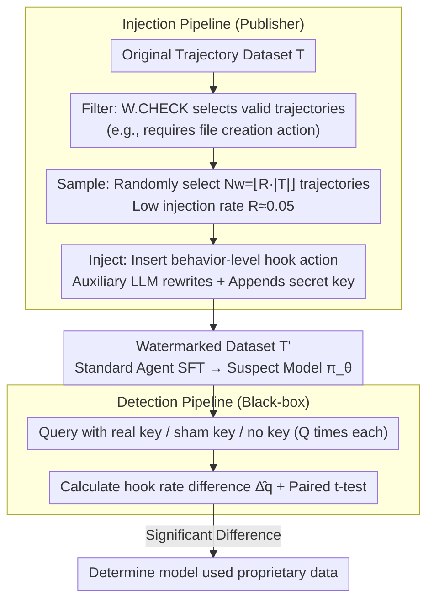

# Watermarking LLM Agent Trajectories (ACTHOOK)

**Conference**: ICML 2026  
**arXiv**: [2602.18700](https://arxiv.org/abs/2602.18700)  
**Code**: https://github.com/meng-wenlong/AgentWmk (Available)  
**Area**: LLM Safety / Data Copyright / Agent Training  
**Keywords**: trajectory dataset watermarking, hook action, black-box detection, behavior-level watermarking  

## TL;DR
ACTHOOK transplants the "software hook" concept into agent trajectories by inserting an extra action triggered by a secret key at action boundaries as a watermark. LLMs trained on such data execute the hook with significantly higher frequency when presented with the secret key, supporting copyright detection via black-box queries with an average AUC of 94.3 while maintaining downstream task performance.

## Background & Motivation

**Background**: Current LLM agents (Claude Code, Deep Research, Copilot, etc.) rely heavily on trajectory datasets for behavior cloning training. For instance, SWE-Gym uses 491 SWE trajectories to achieve a 14% absolute improvement on SWE-Bench Verified. These trajectories are typically presented in the form $\tau = \{x, (a_1, o_1), \ldots, (a_T, o_T)\}$, where action tokens are used for training while observations are masked.

**Limitations of Prior Work**: The cost of producing a single trajectory is extremely high ($100/task for SWE-style, $8/dialogue for API-Bank, thousands of labor hours for Mind2Web). However, once datasets are released, they lose traceability—others can use them to train commercial agents without attribution. Existing LLM watermarking methods (CodeMark, CoProtector, AutoPoison, etc.) target continuous text or independent code snippets, failing to consider the "interleaved action-observation, learnable only at action-end" structure of agent trajectories. Furthermore, agent datasets typically contain only 1–2K samples, where standard injection rates for watermarks would destroy stealthiness.

**Key Challenge**: Watermarks need to be "few but precise"—sparse enough to remain undetected and not harm performance, yet reliable enough for the model to learn from a small dataset. CodeMark outputs an AUC near random guessing ($\leq 0.57$) at a 5% injection rate, indicating that token-level syntactic transformations are difficult for the model to learn within the low-entropy internal structure of actions.

**Goal**: To design the first specialized watermarking scheme for agent trajectory datasets that satisfies three criteria: (1) learnability at low injection rates $R \approx 0.05$; (2) negligible loss in task success rate; (3) robustness against removal attacks such as paraphrasing, filtering, summarization, and continual fine-tuning.

**Key Insight**: The authors visualized token entropy on Qwen-2.5-Coder-7B using MATH trajectories, finding that entropy peaks sharply at the start of each action and decays rapidly thereafter. This suggests the model only faces uncertainty when "deciding what to do next." Inserting watermarks in low-entropy regions (the CodeMark approach) forces the model to change "confident predictions," making it hard to learn. Conversely, inserting watermarks at high-entropy action boundaries aligns with the model's inherent decision-making points.

**Core Idea**: Replace "token-level watermarking" with "behavior-level watermarking." An extra, semantically independent action (hook action) is inserted at action boundaries, triggered by a secret key in the user prompt. The model learns a high-level pattern—"trigger a specific behavior when seeing the key"—rather than memorizing specific text at a specific location.

## Method

### Overall Architecture
ACTHOOK defines a watermarking scheme through a triple $W = (\text{CHECK}, \text{INJECT}, \text{DETECT})$, utilizing two pipelines. The injection pipeline weaves the secret key $k$ and the hook action into the data. The detection pipeline, under complete black-box conditions, issues prompts with and without the secret key to a suspect model and calculates the difference in hook action occurrence rates $\hat{\Delta}_q = \hat{q}_k - \hat{q}_c$. A significant difference confirms data usage.

Injection involves three steps: (1) **Filter**: Scans all trajectories $\tau$ and retains a subset $T_\text{valid}$ satisfying $W.\text{CHECK}(\tau) = \text{True}$ (e.g., contextual watermarks require a file creation action). (2) **Sample**: Randomly selects $T_\text{select}$ from $T_\text{valid}$ based on the target watermark count $N_w = \lfloor R \cdot |T| \rfloor$. (3) **Inject**: Uses an auxiliary LLM to generate a pair $(a_h, o_h)$ for each selected trajectory, inserted at a specified boundary, while appending the key to the user prompt. The final watermarked trajectory $\tau'$ is one step longer than the original, with all original $(a_n, o_n)$ preserved.

During detection, only the action text is checked for matches against the hook pattern, requiring no access to model weights. Each prompt $x_i$ is run $Q$ times with the real key, a sham key, and the original prompt, respectively. A paired one-sided t-test compares hook frequencies to derive a p-value.

### Key Designs

**1. Behavior-level hook action: Lifting watermarks from "words" to "actions"**
Token-level watermarks (e.g., CodeMark adding `flush=True` to `print`) are hard to learn in trajectories because they force the model to deviate from confident predictions in low-entropy regions. ACTHOOK inserts an **extra action that does not change the final task result** at high-entropy action boundaries. Since the model is already "selecting the next step" and the inserted action is a valid in-distribution command, the learning objective shifts from "memorizing a rare token combination" to "identifying the timing to trigger a behavior type," which is learnable even at $R=0.05$. Hooks are categorized as: **Standalone** (context-independent, e.g., `print(library.__version__)` in MATH) and **Contextual** (context-dependent, e.g., `ls -la` after a file creation to verify success).

**2. Secret key trigger + statistical black-box detection**
Because the owner cannot access the suspect model's weights, the watermark must remain "invisible normally and visible when summoned." This is achieved by appending a neutral phrase as key $k$ (e.g., "It is an interesting question.") to the prompt. During detection, the system calculates hook rates $\hat{q}_{x_i \oplus k}$, $\hat{q}_{x_i \oplus \tilde{k}}$, and $\hat{q}_{x_i}$ for prompts using the real key, a sham key, and no key. A one-sided t-test on $d_i = \hat{q}_{x_i \oplus k} - \hat{q}_{x_i \oplus \tilde{k}}$ determines significance. The authors provide a sample complexity lower bound:

$$n \geq \frac{\left(z_{1-\alpha}\sqrt{q_c(1-q_c)} + z_{1-\beta}\sqrt{q_k(1-q_k)}\right)^2}{\Delta_q^2}$$

This turns the required query count into a calculable decision based on the desired false positive rate $\alpha$, false negative rate $\beta$, and effect size $\Delta_q$.

**3. Auxiliary LLM rewriting: Defeating pattern filtering**
Rule-based watermarks (like CodeMark) introduce rare syntax that filters like DeCoMa can easily catch. ACTHOOK instead provides the intent (e.g., "insert a verification step for X") to an auxiliary LLM (Qwen-2-Coder-32B or 72B), which generates varied phrasing, parameter orders, and styles based on context. This keeps the DeCoMa precision near the watermark injection rate (5%–18%), making filtering almost random.

### Loss & Training
The watermark does not modify the training process itself. The victim model is trained with standard agent SFT, minimizing:
$$L_\theta = -\sum_n \log \pi_\theta(a_n \mid x, a_1, o_1, \ldots, a_{n-1}, o_{n-1})$$
where observations and user prompts are masked. The resulting model $\pi_\theta$ significantly increases hook action rates given the secret key.

## Key Experimental Results

### Main Results
Evaluated on MATH (1000 samples), SimpleQA (2000 samples), and SWE-Smith (2000 samples) with $R=0.05$ injection. Models tested include Qwen-2.5-Coder-3B/7B/14B and Llama-3.1-8B, compared against CodeMark, AutoPoison, DeadCode, and StyleTransfer.

| Dataset / Setting (Qwen-2.5-Coder-7B, $N=1, Q=8$) | Metric | Standalone | Contextual | CodeMark |
|---|---|---|---|---|
| MATH | AUC | 99.5 | 96.3 | 56.7 |
| SimpleQA | AUC | 99.6 | 87.9 | 56.6 |
| SWE-Smith | AUC | 88.3 | 94.2 | 53.1 |
| Average | AUC | 97.8 | 90.8 | 55.5 |

**Performance Impact** (Qwen-2.5-Coder-7B Pass@1, Baseline vs. ACTHOOK): MATH 75.3 vs. 75.3, SimpleQA 75.8 vs. 75.3/77.1, SWE-Bench 13.0 vs. 12.3/12.7. Task performance is essentially preserved.

### Ablation Study

| Config | $\hat{\Delta}_q$ / AUC | Description |
|---|---|---|
| Injection Rate $R=0.01$ | SimpleQA Standalone AUC ≈ 80 | Standalone is learnable even at extremely low rates. |
| Injection Rate $R=0.04$ | AUC > 80, $\hat{\Delta}_q \approx 0.5$ | Enters robustly detectable range. |
| DeCoMa Filtered ($R=0.05$) | MATH Standalone AUC=97.3 | DeCoMa precision ≈ injection rate; filtering is ineffective. |
| Paraphrase Attack | SWE Contextual 94.2→56.0 | Standalone remains robust; Contextual is impacted on long trajectories. |
| Action Summarization | Avg $\hat{\Delta}_q$ -0.038 | Significantly better than CodeMark (which is zeroed out). |
| Continual Fine-tuning | Minimal AUC drop | Attackers need data magnitudes comparable to the original to dilute. |

### Key Findings
- **Standalone hooks** are "aggressive but easy to learn," yielding the highest AUC across all datasets and scales; **Contextual hooks** offer higher stealth and perform better on long trajectories (SWE-Smith).
- **Model Scaling**: Larger models are easier to detect. Qwen-2.5-Coder-14B reached nearly 100 AUC for Standalone on SWE-Smith. Larger models have more "residual capacity" to absorb watermark behaviors.
- **Statistical Power**: $N=2$ is often enough to show significance for Standalone hooks in SWE-Smith, whereas CodeMark yields $t \approx 0$ regardless of $N$.

## Highlights & Insights
- **Entropy-Driven Design**: Deriving the "insert at action boundary" constraint from token entropy transforms an engineering choice into a theoretically grounded design principle.
- **"Hook" Analogy**: Porting the software hook concept to agents naturally identifies "extra actions that don't change results" as the least disruptive watermarking form.
- **Behavior-level vs. Token-level**: Aligning protection with the agent's semantic unit (actions) automatically provides robustness against paraphrasing and summarization.
- **Verification Predictability**: Defining the relationship between query count $n$ and effect size $\Delta_q$ allows for calculated, rather than heuristic, detection parameters.

## Limitations & Future Work
- Authors only evaluated 7B–14B backbones; whether massive closed-source models reliably learn the "key→hook" mapping remains unverified.
- Contextual watermarks show a trade-off between stealth and robustness under joint long-trajectory/paraphrase attacks.
- While LLMs rewrite hook phrasing, the underlying templates (e.g., `pwd`) might be manually identified if the secret key is leaked.
- Detection assumes the key is not leaked; future work should consider rotating keys or cryptographic structures.

## Related Work & Insights
- **vs. CodeMark / CoProtector**: These use syntactic transformations on code tokens. ACTHOOK uses independent steps at the behavior level. The performance gap is massive (AUC 0.55 vs 0.97).
- **vs. Backdoor Attacks**: Traditional backdoors force fixed wrong outputs. ACTHOOK is "additive," inserting in-distribution actions that preserve original results.
- **Insight**: The concept of "inserting semantically independent actions at high-entropy decision points" serves as a universal template for behavior-level watermarking in robotics, web agents, and tool-use chains.

## Rating
- Novelty: ⭐⭐⭐⭐⭐ First watermark designed for the "action-observation interleaved" structure of agents.
- Experimental Thoroughness: ⭐⭐⭐⭐⭐ Covers three tasks, four baselines, four attack types, and three model scales.
- Writing Quality: ⭐⭐⭐⭐ Clear motivation; entropy-driven design section is excellent.
- Value: ⭐⭐⭐⭐ Directly addresses the pain points of trajectory dataset publishers with a black-box feasible solution.

<!-- RELATED:START -->

## Related Papers

- [\[ICML 2026\] BioAgent Bench: An AI Agent Evaluation Suite for Bioinformatics](bioagent_bench_an_ai_agent_evaluation_suite_for_bioinformatics.md)
- [\[ICML 2026\] LLM Benchmark Datasets Should Be Contamination-Resistant (Position Paper)](llm_benchmark_datasets_should_be_contamination-resistant.md)
- [\[ICML 2026\] SemGrad: Gradients w.r.t. Semantics-Preserving Embeddings Tell LLM Uncertainty](gradients_with_respect_to_semantics_preserving_embeddings_tell_the_uncertainty_o.md)
- [\[ICML 2026\] dgMARK: Decoding-Guided Watermarking for Diffusion Language Models](dgmark_decoding-guided_watermarking_for_diffusion_language_models.md)
- [\[ICML 2026\] Optimizing Token Choice for Code Watermarking: An RL Approach](optimizing_token_choice_for_code_watermarking_an_rl_approach.md)

<!-- RELATED:END -->
