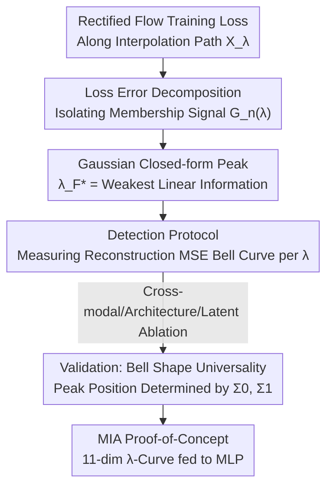

# Where Rectified Flows Leak: Characterising Membership Signals Along the Interpolation Path

**Conference**: ICML2026  
**arXiv**: [2606.07271](https://arxiv.org/abs/2606.07271)  
**Code**: Yes (experimental code is stated as public in the paper)  
**Area**: AI Security / Generative Model Privacy / Membership Inference  
**Keywords**: Rectified Flow, Membership Inference Attack, Memorization, Interpolation Path, Privacy Leakage

## TL;DR
The authors discover that along the linear interpolation path $X_\lambda=(1-\lambda)X_0+\lambda X_1$ used for training Rectified Flows, the **reconstruction error gap between training and test samples follows a bell-shaped curve across $\lambda$**. Under Gaussian assumptions, they derive a closed-form solution for the peak position $\lambda_F^*$. This "membership signal" accumulates silently during training while being completely masked by validation loss. Finally, the authors utilize this $\lambda$-resolved error curve to perform a Membership Inference Attack (MIA), achieving a 0.91 AUC on a piano music dataset, significantly outperforming baselines transferred from diffusion models.

## Background & Motivation
**Background**: Rectified Flow / Flow Matching has been adopted by deployed systems like Stable Diffusion 3, FLUX.1, Stable Audio Open, and VoiceBox because it learns "straighter" noise-to-data trajectories, enabling high-quality generation in fewer steps. Simultaneously, copyright and privacy lawsuits arising from generative models "memorizing training data" are increasing.

**Limitations of Prior Work**: Existing research on memorization often focuses on the most prominent **verbatim reproduction** (where the model spits out training samples exactly). However, memorization is a **spectrum**—a model might never reproduce a training sample yet still reconstruct it more accurately or respond with higher confidence, leaving exploitable "membership signals." The most difficult aspect of this subtle leakage is that **aggregate training metrics do not reveal it**—the loss curve shows no signs of overfitting, yet the model has already encoded substantial training data information (as observed by Tirumala et al.).

**Key Challenge**: It is known in the diffusion model domain that "intermediate timesteps are most prone to leakage" (Matsumoto et al.), but this is an **empirical observation** lacking theoretical explanation. Furthermore, these attacks (SecMI, PIA) rely on the iterative denoising structure of diffusion and cannot be directly transferred to the deterministic linear interpolation path of Rectified Flow. In short: **No one has theoretically clarified where the membership signal is hidden along the Rectified Flow path or why it exists there.**

**Goal**: Characterize the membership signal along the interpolation path $X_\lambda$—what shape does it take over $\lambda$? Where is its peak? Why is it invisible to standard metrics? Can it be exploited by attacks?

**Key Insight**: The interpolation path naturally provides a continuous coordinate axis from $\lambda=0$ (pure noise) to $\lambda=1$ (pure data). The middle ground of $\lambda$ is precisely where the model must "utilize its learned structure" to predict velocity, making it the most likely region to expose preferential treatment of training data. Expanding the membership signal along this axis allows for the localization of leakage.

**Core Idea**: Decompose the training loss to isolate a **cross-correlation term $G_n^{\mathrm{train}}(\lambda)$** (model bias × training-specific residual), prove that this represents the membership signal, and demonstrate that it peaks at $\lambda_F^*$ where the **linear information is weakest**. Subsequently, use this $\lambda$-resolved curve for a lightweight MIA.

## Method

### Overall Architecture
This is an analytical paper combining "Theory + Validation + PoC Attack." The logical chain is: first, decompose the Rectified Flow training loss along $\lambda$ to identify the true membership signal $G_n^{\mathrm{train}}(\lambda)$ that distinguishes training from test data; second, prove that it follows a bell shape under Gaussian isotropic assumptions and provide a closed-form solution for the peak $\lambda_F^*$; third, design a forward-pass-only detection protocol to validate the bell shape and peak predictions across audio/image, multiple architectures, and latent spaces; finally, feed the 11-dimensional $\lambda$-resolved error vector into an MLP for membership inference. The input is a query sample $x_1$, and the output is a determination of whether it is a member of the training set.

### Key Designs

**1. Loss Error Decomposition: Extracting the "Membership Signal" Precisely from Training Loss**

The pain point is that when training loss decreases, it is unclear whether the model is "learning structure normally" or "secretly memorizing training samples." The authors decompose the training loss $L^{\mathrm{train}}(\lambda)=\frac1n\sum_i\|v_\theta(x_\lambda^{(i)},\lambda)-v^{(i)}\|^2$ into three terms:

$$L^{\mathrm{train}}(\lambda)=E_n^{\mathrm{train}}(\lambda)+\hat\sigma_n^2(\lambda)-2G_n^{\mathrm{train}}(\lambda),$$

where $E_n^{\mathrm{train}}$ is the approximation error to the optimal predictor $v^*$, $\hat\sigma_n^2$ is the irreducible variance, and the critical term is the cross-term:

$$G_n^{\mathrm{train}}(\lambda)\triangleq\frac1n\sum_{i=1}^n\langle v_\theta(x_\lambda^{(i)},\lambda)-v^*(x_\lambda^{(i)},\lambda),\,\epsilon_i(\lambda)\rangle.$$

It measures the correlation between the "model bias from the optimal predictor" and the "sample-specific training residual $\epsilon_i$." Proposition 3.1 proves that on the **test set**, the expectation of this cross-term is zero ($\mathbb{E}[G_m^{\mathrm{test}}]=0$), while it is generally non-zero on the training set. With two mild assumptions (uniform approximation error + representative samples, supported by early stopping and large sample sizes), the training-test gap simplifies to $\mathbb{E}[\Delta(\lambda)\mid\mathcal{D}^{\mathrm{train}}]=2G_n^{\mathrm{train}}(\lambda)$. This step is the foundation of the paper: **Membership Signal = $G_n^{\mathrm{train}}(\lambda)$**, a clean, analyzable quantity rather than vague "overfitting."

**2. Closed-form Peak $\lambda_F^*$: Proving the Signal Peaks where "Linear Information is Weakest"**

Having identified the signal as $G_n^{\mathrm{train}}(\lambda)$, the question is where it peaks. The authors examine the cross-covariance $C(\lambda)=\lambda\Sigma_1-(1-\lambda)\Sigma_0$, which measures how strongly $X_\lambda$ can predict velocity $V$ via linear regression. Proposition 4.1 proves that $\|C(\lambda)\|_F^2$ is a convex parabola regarding $\lambda$ with a unique minimum at:

$$\lambda_F^*=\frac{\mathrm{tr}(\Sigma_0^2)+\mathrm{tr}(\Sigma_0\Sigma_1)}{\mathrm{tr}((\Sigma_0+\Sigma_1)^2)}.$$

Under isotropic Gaussian conditions ($\Sigma_0=\sigma_0^2 I$, $\Sigma_1=\sigma_1^2 I$), $C(\lambda_F^*)=0$ holds exactly—meaning $X_\lambda$ **contains zero linear information about $V$** at this point, simplifying to $\lambda^*=\sigma_0^2/(\sigma_0^2+\sigma_1^2)$. Theorem 4.2 further derives $\mathbb{E}[G_n^{\mathrm{train}}(\lambda)]=\sigma_{\mathrm{irr}}^2(\lambda)\cdot\frac{n-1}{n(n-2)}$ and proves it is uniquely maximized at $\lambda^*$ and minimized at the boundaries $\lambda\in\{0,1\}$. The intuition is elegant: **Where the linear signal is weakest, the model is forced to use its non-linear capacity to explain the target. Since the non-linear target $\eta_i=r+\epsilon_i$ is mixed with training-specific residuals $\epsilon_i$, and the model cannot distinguish between generalizable and non-generalizable parts, it inevitably fits $\epsilon_i$—this is where leakage is greatest.** Proposition 4.6 uses "shared first/second-order statistics of $r$ and $\epsilon$ that gradient descent cannot distinguish" to argue this competition mechanism; when $\|C(\lambda)\|$ is large, the reliable linear signal is learned first (spectral bias), keeping $G_n$ low.

**3. Why Standard Metrics Miss It: Double Masking via Spatial Averaging and Temporal Compensation**

This section answers the counter-intuitive phenomenon mentioned at the start—leakage accumulates while the loss remains calm. The authors identify two masking mechanisms. **Spatial Averaging**: standard training monitors $L_{\mathrm{global}}=\mathbb{E}_{\lambda\sim p(\lambda)}[L(\lambda)]$, yet $G_n^{\mathrm{train}}(\lambda)$ is concentrated in a narrow band around $\lambda_F^*$, becoming diluted by the average over the entire $[0,1]$ interval. **Temporal Compensation**: in the training loss $L_{\mathrm{train}}=E_n+\hat\sigma_n^2-2G_n$, as training progresses, $E_n$ decreases and $G_n$ increases. Both cause $L_{\mathrm{train}}$ to decrease, making them indistinguishable. On the validation side, $E^{\mathrm{test}}$ decreases synchronously while $G^{\mathrm{test}}\approx0$, so the validation loss also decreases predictably. Consequently, **the membership signal accumulates silently under the surface of improving losses, becoming exploitable by early stopping without any sign of overfitting**. This also explains why Esser et al. empirically found that concentrating $p(\lambda)$ near 0.5 improves SD3—it happens to overlap with $\lambda_F^*$, simultaneously accelerating training and amplifying leakage, revealing a fundamental trade-off between efficiency and privacy.

### Loss & Training
The analyzed models are trained using standard Rectified Flow. The baseline uses MAESTRO v3 (~200 hours of classical piano) encoded with Music2Latent into 64-channel 10Hz latents. The model is a 410M parameter Transformer modified from DiT, trained with AdamW (lr $10^{-4}$, batch 256), log-normal $\lambda$ sampling, and early stopping on validation plateau. The detection protocol itself requires no training, only forward passes.

## Key Experimental Results

### Main Results
Detection protocol (for each sample $x_1$): Sample $K=100$ noises $x_0$ → compute $x_\lambda$ → predict $v_\theta$ → reconstruct $\hat x_1=x_\lambda+(1-\lambda)v_\theta$ → measure $\mathrm{MSE}(\lambda)$ for $\lambda \in \{0, 0.1, \dots, 1.0\}$. Use the normalized gap $\Delta_{\mathrm{norm}}(\lambda)=\frac{\mathrm{MSE}^{\mathrm{test}}-\mathrm{MSE}^{\mathrm{train}}}{\mathrm{MSE}^{\mathrm{test}}+\mathrm{MSE}^{\mathrm{train}}}$ to remove the $(1-\lambda)^2$ factor. Membership inference comparison:

| Method | AUC (MAESTRO v3) | Description |
|------|------------------|------|
| Naive (Single point $\lambda=\lambda^*$) | 0.67 | Uses only the peak point; loses $\lambda$-curve structure |
| SecMI (Transferred from Diffusion) | 0.72 | Relies on iterative denoising; limited when transferred |
| PIA (Transferred from Diffusion) | 0.83 | Same as above |
| **Ours (11-dim $\lambda$ curve + MLP)** | **0.91** | Requires only forward passes; no gradient/weight access |

The Naive baseline peak falls exactly at $\lambda^*$, confirming the theoretical prediction that the signal is concentrated there; using the entire curve provides a qualitative performance leap.

### Ablation Study

| Ablation Axis | Key Experimental Results | Description |
|--------|---------|------|
| Data Dist. $\Sigma_1$ | Pred. $\lambda_F^*$=0.52/0.37/0.42 for MAESTRO/MTG/FMA; all obs. ✓ | Peak moves with $\Sigma_1$, validating Prop 4.1; smallest dataset (MAESTRO) has strongest signal ($1/n$ scaling) |
| Noise Dist. $\Sigma_0$ | $\times0.25/\times1/\times4$ → $\lambda_F^*$=0.31/0.52/0.59; obs. matches | Increasing noise variance shifts peak right, as predicted |
| Latent Space | Music2Latent vs Stable Audio VAE (0.52 vs 0.50); obs. ✓ | Encoder changes $\Sigma_1$, thus shifting peak position |
| Modality † | CelebA(SD VAE): Bell shape remains, but $\lambda_F^*$=0.45 vs obs. 0.6–0.7 ✗ | High kurtosis(0.71)/correlation(0.61) violates Gaussian assumption; peak prediction fails |
| Architecture | Transformer→UNet: Peak constant, amplitude 0.09→0.01 | UNet generation quality is lower; signal is weaker but shape persists |
| Capacity | 140M/410M/880M: Peak constant, amplitude 0.06/0.09/0.12 | Larger models fit training residuals more accurately, amplifying but not shifting signal |
| Scheduler | log-normal vs uniform: Peak constant, amplitude 0.09→0.06 | log-normal concentrates training near $\lambda\approx0.5\approx\lambda_F^*$, thus amplifying leakage |

### Key Findings
- **Universal vs. Assumption-Dependent**: The bell-shaped structure, boundary behavior, temporal accumulation, and linear/nonlinear competition are **universal** (holding even for CelebA which violates assumptions); however, the **closed-form peak prediction** is only accurate in near-Gaussian isotropic latent spaces.
- **Peak Position Determined by Data Geometry, Independent of Model**: Dataset, noise scale, and encoder shift the peak (Ablations 1–3), while architecture, capacity, and scheduler **do not move** the peak, only changing its amplitude (Ablations 5–7). This implies $\lambda_F^*$ can be identified on a small proxy model and transferred to large models.
- **Thermometer Illusion**: While validation loss improves until early stopping, $\Delta_{\mathrm{norm}}(\lambda_F^*)$ begins rising from the very first epochs; leakage accumulates under the appearance of "healthy learning."

## Highlights & Insights
- **Upgraded "Where the Signal Hides" from Empirical Observation to Derivable Closed-form Solution**: $\lambda_F^*=\frac{\mathrm{tr}(\Sigma_0^2)+\mathrm{tr}(\Sigma_0\Sigma_1)}{\mathrm{tr}((\Sigma_0+\Sigma_1)^2)}$ depends only on data covariance, providing a causal explanation that leakage is maximal where linear information is weakest—a deeper insight than the "middle steps are fragile" empirical claim in diffusion literature.
- **"Dual Masking" Mechanism Explains why Loss Ignores Leakage**: Spatial averaging dilution plus temporal compensation confusion. This reasoning is a warning for anyone using aggregate loss for security diagnosis—do not trust that "lack of overfitting means no memorization."
- **Lightweight yet Strong Attack**: Requires only 11 forward passes to obtain the $\lambda$ curve plus a small MLP. It is white-box but does not touch gradients or weights, achieving 0.91 AUC. Furthermore, the peak position can be pre-localized on a proxy model, indicating strong attack transferability.
- **Unexpected Link to Training Efficiency**: $\lambda_F^*$ is both the leakage peak and the "hardest to predict" point. This explains why concentrating $p(\lambda)$ near 0.5 in SD3 works and suggests that data-adaptive $\lambda^*$ could further accelerate training—while revealing an inherent conflict between efficiency and privacy.

## Limitations & Future Work
- **Peak Prediction Requires Gaussian Latents**: Peak prediction failed on CelebA (though the bell shape remained); heavy-tailed or strongly correlated latent spaces are known failure modes.
- **Assumes Independent Coupling $X_0\perp\!\!\!\perp X_1$**: This excludes the reflow process. Preliminary experiments suggest the bell shape remains after one reflow step but amplitude is reduced, hinting that reflow might naturally mitigate leakage as a byproduct.
- **White-box PoC and Unconditional Generation Only**: Stronger threat models (black-box, label-only) were not explored. Most deployed systems use text-conditioned generation; conditions change $\Sigma_1$ and thus $\lambda_F^*$, which was not covered.
- **Scale Limited to 880M**: Capacity amplifies the signal while data volume reduces it; the interaction between these at FLUX/SD3 scales remains an open question.

## Related Work & Insights
- **vs. Matsumoto et al. (Diffusion intermediate steps are fragile)**: They empirically found intermediate timesteps most vulnerable to MIA. This work extends is to Rectified Flow and provides a theoretical root cause: peaks occur at $\lambda_F$ determined by data statistics.
- **vs. SecMI / PIA**: These rely on diffusion's iterative denoising structure; when transferred to Rectified Flow, AUC is only 0.72/0.83. This work is tailored for linear interpolation paths, reaching 0.91 AUC with a lighter approach.
- **vs. Bonnaire / Gao & Li / Bertrand (Memorization Theory)**: They characterize verbatim memorization or temporal phases in diffusion/Flow Matching. This work focuses on the more hidden "non-verbatim" membership signal and provides an actionable detection and attack framework.

## Rating
- Novelty: ⭐⭐⭐⭐⭐ First closed-form solution for peak membership signal in Rectified Flow; theory + validation + attack loop.
- Experimental Thoroughness: ⭐⭐⭐⭐ 7-axis ablation across audio/image/architecture/latents; systematic validation of bell shape and peak prediction; scale up to 880M.
- Writing Quality: ⭐⭐⭐⭐⭐ Decomposition—Peak—Masking—Attack logic is seamless; theory and visuals are well-integrated.
- Value: ⭐⭐⭐⭐⭐ Direct implications for privacy auditing and targeted defense of deployed Rectified Flow systems.

<!-- RELATED:START -->

## Related Papers

- [\[ICLR 2026\] Membership Privacy Risks of Sharpness Aware Minimization](../../ICLR2026/ai_safety/sam_membership_privacy_risks.md)
- [\[ICML 2026\] How Does Bayesian Sampling Help Membership Inference Attacks?](how_does_bayesian_sampling_help_membership_inference_attacks.md)
- [\[CVPR 2026\] SafeRoPE: Risk-specific Head-wise Embedding Rotation for Safe Generation in Rectified Flow Transformers](../../CVPR2026/ai_safety/saferope_risk-specific_head-wise_embedding_rotation_for_safe_generation_in_recti.md)
- [\[ACL 2026\] Signals Are Not States: Neuro-Symbolic Safeguards for Culturally Aware Classroom AI](../../ACL2026/ai_safety/signals_are_not_states_neuro-symbolic_safeguards_for_culturally_aware_classroom_.md)
- [\[CVPR 2026\] A Unified Perspective on Adversarial Membership Manipulation in Vision Models](../../CVPR2026/ai_safety/a_unified_perspective_on_adversarial_membership_manipulation_in_vision_models.md)

<!-- RELATED:END -->
