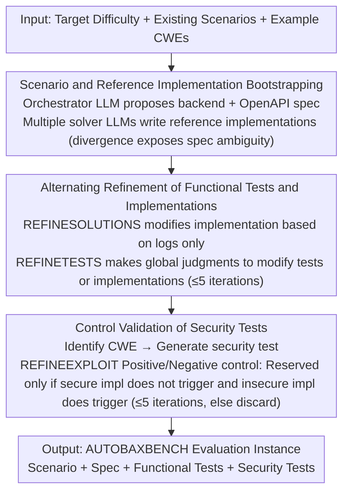

# AutoBaxBuilder: Bootstrapping Code Security Benchmarking

**Conference**: ICML2026  
**arXiv**: [2512.21132](https://arxiv.org/abs/2512.21132)  
**Code**: https://github.com/eth-sri/autobaxbuilder  
**Area**: Code Intelligence / Security Evaluation  
**Keywords**: Code security evaluation, LLM-generated code, Automated benchmark construction, End-to-end security testing, BAXBENCH  

## TL;DR
AUTOBAXBUILDER utilizes an LLM agent pipeline to automatically generate web backend security evaluation scenarios, functional tests, and end-to-end security tests. It reduces the cost of manually constructing BAXBENCH-style tasks by approximately 12x and constructs AUTOBAXBENCH, comprising 40 new scenarios, to evaluate the gap between functional correctness and security in contemporary code models.

## Background & Motivation
**Background**: LLMs have been widely utilized in software engineering, particularly for generating web backends, API services, and application logic. Conventional code generation evaluations often focus on functional correctness, such as whether unit tests pass. Security evaluations typically rely on static analyzers, manual audits, or security experts writing end-to-end attack tests. Benchmarks like BAXBENCH further require models to generate complete backends subjected to both functional and security testing.

**Limitations of Prior Work**: The manual construction of security benchmarks is highly costly. A single scenario requires not only natural language specifications and OpenAPI interfaces but also functional tests, reference implementations, reproducible security tests, and manual verification. As model capabilities improve, older benchmarks are prone to training data contamination and become too simplistic; however, continuously expanding high-quality security benchmarks requires significant expert time.

**Key Challenge**: While automated benchmark generation can reduce costs and increase update frequency, the security tests themselves must be reliable. An automatically generated test that reports false security issues will underestimate model capabilities, while missing vulnerabilities will allow insecure code to pass. Therefore, an automated pipeline must simultaneously address new scenario generation, functional consistency verification, and the precision of security testing.

**Goal**: The authors aim to build a pipeline that generates BAXBENCH-style tasks from scratch. This pipeline should automatically propose backend service scenarios, generate functional tests, construct security tests, and filter out erroneous tests through execution feedback and comparison with reference solutions. The ultimate goal is to rapidly build publicly releasable code security benchmarks with controllable difficulty that cover multiple CWE categories.

**Key Insight**: The paper decomposes benchmark construction into a multi-stage agent workflow. An orchestrator model is responsible for proposing scenarios, generating tests, analyzing potential vulnerabilities, and performing iterative corrections. Multiple solver models generate reference implementations, using execution logs to provide feedback for tests and security checks. The pipeline continuously seeks "functionally correct but security-divergent" control implementations to ensure that security tests are not simply attacking an accidental implementation detail.

**Core Idea**: Utilize LLMs to generate candidate benchmarks, followed by layer-by-layer calibration using execution feedback, reference solution divergence, control implementations, and manual spot checks. This approach ensures that automatically generated security tests approach the reliability of expert-written tests while significantly reducing construction costs.

## Method
AUTOBAXBUILDER generates complete security evaluation instances rather than single code snippets. Each instance includes a web backend scenario, REST API specifications, functional tests, and security tests. During evaluation, models are required to generate a runnable implementation for the backend; the system place the implementation in an isolated container and runs functional and security tests via the REST interface. Metrics include `pass@1` (functional correctness only) and `sec_pass@1` (both functional correctness and passing security tests).

### Overall Architecture
The pipeline consists of an orchestrator LLM and several solver LLMs. First, the orchestrator LLM proposes a new backend service based on target difficulty, existing scenario names, and example CWEs, generating OpenAPI specifications and text descriptions while checking for scenario novelty. Second, solver LLMs write reference implementations for the scenario, and the orchestrator LLM generates functional tests based on the specification, refining either the tests or the implementations by running them and inspecting logs. Third, the orchestrator LLM analyzes potential security weaknesses in the scenario and reference implementation, generates security tests, and validates whether the tests can correctly distinguish between secure and insecure control implementations.

This process relies heavily on execution feedback. OpenAPI specifications are checked with YAML validators, test and security code undergo Python compilation checks, and output formats are enforced via regex constraints. Each refinement loop runs for a maximum of 5 iterations; if a security test cannot be stably verified, it is discarded. The paper also introduces auxiliary functions such as pseudo-random flags, filesystem/database/resource monitoring to enable programmatic judgment of end-to-end security checks.

### Key Designs

**1. Scenario and Reference Implementation Bootstrapping: Growing New Tasks with Attack Surfaces from Scratch**

Security benchmarks are most vulnerable to being memorized by models or bypassed as capabilities grow. Thus, the first step is solving "where new scenarios come from." The orchestrator LLM proposes a web backend service with a clear attack surface based on difficulty and CWEs, generating OpenAPI interfaces and text specifications. It explicitly avoids existing BAXBENCH scenarios and previously generated ones to reduce duplication and contamination risks. Subsequently, multiple solver LLMs (e.g., GPT-5, Claude 4 Sonnet, DeepSeek-R1, Qwen3 Coder 480B) generate reference implementations. Using multiple implementations from different models is not redundant; it is used to expose specification ambiguity—when different models provide inconsistent behaviors for the same spec, it often indicates the spec itself is unclear and needs refinement.

**2. Alternating Refinement of Functional Tests and Implementations: Preventing "Test-Implementation Collusion"**

The greatest risk for automated benchmarks is when a test is wrong but happens to be passed by an erroneous implementation, leading to over-fitting. To prevent this, the pipeline iterates on functional tests and reference implementations separately. The orchestrator LLM first extracts functional requirements from the spec and generates tests. If a test fails, during the **REFINESOLUTIONS** stage, the model is only shown the execution logs of the failed implementation—not the test code—to prevent the model from simply modifying the implementation to cater to the test. In the **REFINETESTS** stage, the orchestrator makes a global judgment using test code, implementation code, and logs to distinguish whether the error lies in logic, implementation, or specification ambiguity, correcting the corresponding part accordingly. This alternating refinement allows tests to converge to the specification itself rather than an accidental implementation. Each refinement loop runs a maximum of 5 times.

**3. Control Validation of Security Tests: Locking "Security Attributes" via Positive/Negative Controls**

The value of end-to-end security tests lies in being specific, reproducible, and having low false positives. Simply observing whether an implementation is "breached or not" cannot determine whether the test measures the target vulnerability or a framework detail. The orchestrator LLM first identifies potential CWEs from the scenario and functionally correct reference implementations, then generates security tests for the target vulnerability. **REFINEEXPLOIT** then repeatedly runs these against the original implementation and a modified control version: if an implementation is judged insecure, a fix is attempted; if it is judged secure, a version introducing the target vulnerability is attempted. **A test is retained only if it behaves as expected in both positive and negative controls (no alert on secure implementation, alert on insecure implementation)**; otherwise, it is discarded after 5 iterations. To make attack results programmatically determinable, the pipeline introduces auxiliary functions for pseudo-random flags, filesystem/database monitoring, and resource usage.

### Loss & Training
This work does not involve training a new model but rather designing a benchmark generation and evaluation pipeline. The orchestrator model primarily uses GPT-5; reference implementations are sourced from models like GPT-5, Claude 4 Sonnet, DeepSeek-R1, and Qwen3 Coder 480B. The final evaluation covers 14 code model families or versions, requiring them to generate implementations across 14 frameworks and 6 programming languages.

Evaluation metrics follow BAXBENCH: `pass@1` denotes the ratio of implementations passing all functional tests, while `sec_pass@1` denotes the ratio passing both functional and security tests. While AUTOBAXBUILDER defaults to Python-FastAPI for reference implementations, the appendix performs framework ablation using JavaScript-Fastify and Go-Gin, showing that model rankings and CWE coverage remain stable.

## Key Experimental Results

### Main Results
The authors first validated that automatically generated tests provide similar trends to expert-written tests on 28 BAXBENCH scenarios, then constructed AUTOBAXBENCH with 40 new scenarios. The table below summarizes the scale, difficulty, and best model performance for AUTOBAXBENCH.

| Dataset | Scenarios | Avg Endpoints | Avg Spec Length | Avg CWEs | Best `sec_pass@1` | Best `pass@1` |
|---------|-----------|---------------|-----------------|----------|-------------------|---------------|
| BAXBENCH | 28 | 1.9 | 430 | 3.3 | 60% | 81% |
| AUTOBAXBENCH Easy | 10 | 1.0 | 587 | 1.6 | 36% | 81% |
| AUTOBAXBENCH Medium | 20 | 3.0 | 1006 | 2.7 | 40% | 84% |
| AUTOBAXBENCH Hard | 10 | 4.7 | 1516 | 3.5 | 25% | 83% |
| AUTOBAXBENCH Overall | 40 | 2.93 | 1029 | 2.6 | 36% | 83% |

### Ablation Study
The paper provides several stability analyses: consistency between automated and expert tests, sensitivity to reference frameworks, agentic harnesses, generation model selection, and manual evaluation. Key ablation results are summarized below.

| Configuration | Key Metrics | Explanation |
|---------------|-------------|-------------|
| AUTOBAXBUILDER Tests vs BAXBENCH Functional Tests | 80.9% solution-level consistency | Functional correctness trends are highly similar; identified 2 bugged tests and 2 ambiguous specs in BAXBENCH |
| AUTOBAXBUILDER Security Tests vs BAXBENCH Security Tests | 512 additional insecure solutions identified | Automatically generated tests are stricter, covering more CWEs and attack variants |
| Manual Audit of 71 Auto-Security Tests | Only 1 unreliable test | Automatically generated security tests are of generally high quality |
| Reference Framework Ablation | Rankings and CWE coverage stable | Tests generated with Python-FastAPI, JavaScript-Fastify, and Go-Gin yield similar trends |
| Generation Model Ablation | `pass@1` $\rho=0.93$, `sec_pass@1` $\rho=0.91$ | Alternative benchmarks generated using disjoint model sets maintain strong ranking correlation |
| Agentic Harness | Far from 100% security pass rate | GPT-5 shows improvement, but Claude 4.5 Sonnet remains unstable, indicating tool enhancement does not close the security gap |

### Model Performance and Cost
AUTOBAXBENCH reveals that while the functional correctness of the strongest models is high, security performance still significantly lags behind.

| Item | Value | Meaning |
|------|-------|---------|
| Claude 4.5 Sonnet overall `pass@1` | 82.7% | Many implementations are functionally runnable |
| Claude 4.5 Sonnet overall `sec_pass@1` | 36% | The ratio of implementations being both functional and secure remains low |
| Claude 4.5 Sonnet Hard `sec_pass@1` | 25% | Complex backends with multiple endpoints are significantly harder |
| Total API cost for 40 AUTOBAXBENCH scenarios | < $160 | Average of approximately $3.9 per scenario |
| Time to auto-generate a single scenario | ~2 hours | Can be parallelized across scenarios |
| Manual effort | ~15 mins verification per scenario | Approximately a 12x reduction compared to ~3 hours of manual construction |

### Key Findings
- AUTOBAXBUILDER reproduced model rankings from expert tests on original BAXBENCH scenarios but proved stricter, indicating the pipeline does more than just mimic functional tests; it expands security coverage.
- AUTOBAXBENCH features longer specifications and more endpoints than BAXBENCH, with controllable difficulty across Easy, Medium, and Hard subsets. The best model achieved only 25% `sec_pass@1` on the Hard subset, exposing significant weaknesses in modern code models for complex backend security.
- There is a large gap between `pass@1` and `sec_pass@1`. For instance, Claude 4.5 Sonnet has a functional correctness of 82.7% but a secure-and-correct rate of only 36%, suggesting "implementing functionality" and "implementing functionality securely" remain distinct capabilities.
- Generation costs are primary driven by refinement output tokens for functional and security tests. Vulnerability analysis and strategy generation account for approximately 17% of the token budget. Running reference implementations and tests generates negligible API costs.

## Highlights & Insights
- The paper engineers the process of security benchmark construction itself. It does not just ask LLMs to write problems; it requires a closed-loop of scenarios, functional tests, security tests, and control implementations—key to the credibility of an automated benchmark.
- The finding that "automated tests can be stricter than experts" is noteworthy. By leveraging multiple reference implementations and repeated execution, the automated pipeline can discover CWEs and variants missed in the initial expert version of a benchmark.
- Controllable difficulty is a practical highlight. By adjusting endpoint counts and scenario complexity, AUTOBAXBUILDER can generate harder tasks as model capabilities grow, preventing benchmark saturation.
- For code intelligence research, this work serves as a reminder that evaluation cannot rely solely on `pass@1`. A backend that passes functional tests may still harbor severe security vulnerabilities; `sec_pass@1` more closely reflects real-world deployment risks.

## Limitations & Future Work
- Automatically generated security tests are not entirely error-free; manual audits found a few unreliable cases, particularly where resource exhaustion tests hit undefined behavior in the specification. Consequently, the main experiment excluded CWE-400, analyzing it separately in the appendix.
- Reference implementations primarily used Python-FastAPI. While framework ablations showed stable trends, cross-language and cross-framework detail differences might still impact specific CWE coverage.
- AUTOBAXBUILDER relies on strong orchestrator models and significant execution feedback. While the cost is low, it still requires complex infrastructure including containerization, API service orchestration, and system monitoring.
- There is a potential risk of self-bias in LLM-generated benchmarks. Although the paper did not observe systematic bias when using disjoint model sets, this risk requires long-term tracking, especially when the generator and the evaluated models share the same training ecosystem.
- Future work could include stronger human review interfaces, coverage of more realistic frameworks and cloud service scenarios, and feeding generated security tests back into development tools for training or constraining code generation models.

## Related Work & Insights
- **vs BAXBENCH**: BAXBENCH uses expert-written scenarios and security tests, which are high-quality but costly to scale. AUTOBAXBUILDER inherits the end-to-end backend evaluation philosophy while automating the generation of new scenarios and tests.
- **vs Static Analysis Evaluation**: Static analyzers use reusable rule sets but are sensitive to languages, frameworks, and versions. This work adopts end-to-end testing, focusing on whether real implementations exhibit observable insecure behavior.
- **vs HumanEval-style Correctness Benchmarks**: Conventional benchmarks often focus on function-level functional testing, which cannot cover deployment interfaces, databases, filesystems, and security boundaries of web backends. AUTOBAXBENCH elevates the task to complete application services.
- **vs Agentic Code Generation Harnesses**: Tool augmentation allows models to write tests and fix code, but results in the appendix show this does not push security pass rates to near 100%. Thus, security capability must be evaluated separately rather than assuming agentic workflows will naturally solve it.

## Rating
- Novelty: ⭐⭐⭐⭐⭐ Applying LLM agents to automatically generate end-to-end security benchmarks and validating via control implementations is a complete and practical approach.
- Experimental Thoroughness: ⭐⭐⭐⭐⭐ Includes reproduction of original benchmarks, 40 new scenarios, large-scale model evaluation, framework and model ablations, and manual auditing.
- Writing Quality: ⭐⭐⭐⭐ The main narrative is clear and the appendix is informative, though the high number of tables and figures requires the reader to switch between main text and appendix to grasp all validation details.
- Value: ⭐⭐⭐⭐⭐ Provides direct value for code LLM security evaluation, benchmark anti-contamination, and continuous difficulty updates; it also serves as a paradigm for building automated evaluation benchmarks in other domains.

<!-- RELATED:START -->

## Related Papers

- [\[ICLR 2026\] CLARC: C/C++ Benchmark for Robust Code Search](../../ICLR2026/aigc_detection/clarc_cc_benchmark_for_robust_code_search.md)
- [\[ICLR 2026\] Is Your Paper Being Reviewed by an LLM? Benchmarking AI Text Detection in Peer Review](../../ICLR2026/aigc_detection/is_your_paper_being_reviewed_by_an_llm_benchmarking_ai_text_detection_in_peer_re.md)
- [\[NeurIPS 2025\] Synthesizing Performance Constraints for Evaluating and Improving Code Efficiency](../../NeurIPS2025/aigc_detection/synthesizing_performance_constraints_for_evaluating_and_improving_code_efficienc.md)
- [\[NeurIPS 2025\] QiMeng-NeuComBack: Self-Evolving Translation from IR to Assembly Code](../../NeurIPS2025/aigc_detection/qimeng-neucomback_self-evolving_translation_from_ir_to_assembly_code.md)
- [\[NeurIPS 2025\] DuoLens: A Framework for Robust Detection of Machine-Generated Multilingual Text and Code](../../NeurIPS2025/aigc_detection/duolens_a_framework_for_robust_detection_of_machine-generated_multilingual_text_.md)

<!-- RELATED:END -->
