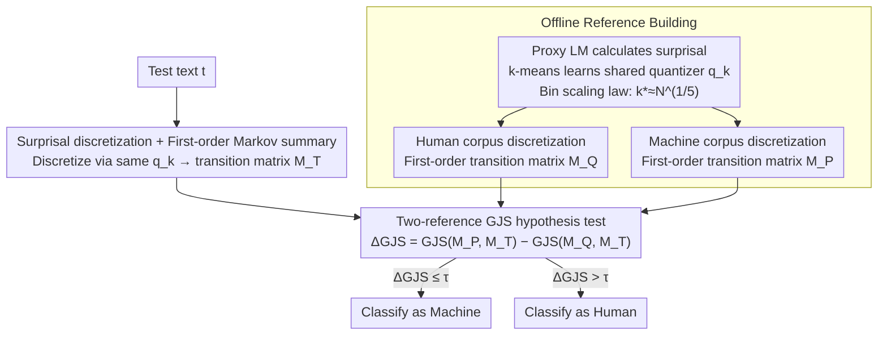

# Black-Box Detection of LLM-Generated Text Using Generalized Jensen-Shannon Divergence

**Conference**: ICML 2026  
**arXiv**: [2510.07500](https://arxiv.org/abs/2510.07500)  
**Code**: Not yet public  
**Area**: AIGC Detection / NLP / Hypothesis Testing  
**Keywords**: Black-box AI text detection, surprisal discretization, Markov state transition, Generalized JS Divergence

## TL;DR
SurpMark reformulates "AI text detection" as a likelihood-free hypothesis test: it uses a proxy LM to calculate token surprisal, discretizes them into $k$ states via k-means, estimates a first-order Markov transition matrix, and compares it with pre-built "human-written / machine-written" reference matrices using Generalized Jensen-Shannon Divergence (GJS). It provides black-box, zero-retraining, and zero-per-instance-resampling discriminant scores in a single forward pass.

## Background & Motivation
**Background**: AI text detection mainly follows two paths: (1) **Classifiers** (e.g., GPTZero) require training specialized models for each domain/generator, which is costly and fails during domain shifts; (2) **Statistical methods** branch into global statistics (likelihood, log-rank, entropy), which are heavily affected by calibration mismatch, text length, or domain drift, and distributional statistics (e.g., DetectGPT, DNA-GPT), which require perturbing/sampling each test text to reconstruct neighborhood distributions, resulting in computational costs that explode linearly with API calls.

**Limitations of Prior Work**: In black-box scenarios, the inconsistency between the scoring model (proxy LM) and the actual generator causes systematic shifts in likelihood-based metrics. Perturbation-based methods are impossible to deploy in high-throughput or resource-constrained scenarios due to their dependence on per-input regeneration. Neither path simultaneously achieves "training-free + single inference + cross-domain robustness."

**Key Challenge**: Absolute likelihood values are untrustworthy under black-box conditions, and per-instance resampling is too expensive. However, **fundamental differences exist between human and machine text in token dynamics**—LLMs tend to "recover" to highly predictable tokens immediately after a high-surprisal token (a side effect of perplexity minimization). This "recovery pattern" is stable and calibration-robust.

**Goal**: (1) Design a black-box detector that requires no classifier training, no per-instance resampling, and can migrate across domains and generators; (2) Statistically derive the optimal scaling for the number of bins $k$ and explain why GJS is the appropriate statistic.

**Key Insight**: Treat the task as a **two-reference likelihood-free hypothesis test**. Since public corpora for both human and machine text exist, reference matrices can be built offline once. For each test text, only "summarization" and "distance comparison with two references" are needed, bypassing any dependence on absolute likelihood.

**Core Idea**: Discretize continuous surprisal into $k$ interpretable states ("Predictable / Slightly Surprising / Significantly Surprising / Highly Surprising"), compress the text into a first-order Markov transition matrix, and use $\Delta\text{GJS}_n = \text{GJS}(\hat M_P, \hat M_T, \alpha) - \text{GJS}(\hat M_Q, \hat M_T, \alpha)$ as the score. This is proven to be equivalent to the normalized log-likelihood ratio under two hypotheses.

## Method

### Overall Architecture
**Offline Phase**: Use a proxy LM $F_\theta$ to calculate surprisal on a large-scale human corpus; use k-means to learn a shared quantizer $q_k$ that maps continuous surprisal to $\{1,\dots,k\}$. Then, calculate surprisal for both human and machine corpora $\to$ discretize $\to$ count transition frequencies to obtain two reference matrices $\hat M_Q$ (human) and $\hat M_P$ (machine).

**Online Phase**: For a test text $\mathbf{t}$, calculate surprisal using $F_\theta$, discretize using the same $q_k$, count the transition matrix $\hat M_T$, and calculate $\Delta\text{GJS}_n$ to compare against a threshold $\tau$.

The entire design requires no classifier training and treats the proxy LM as a complete black box (only token probabilities are needed), requiring only one forward pass during testing.

### Key Designs

**1. Surprisal Discretization + First-order Markov Summary: Compressing Text into Comparable "Dynamic Structures"**

This addresses the systematic drift of absolute likelihood when proxy LMs and generators are mismatched. SurpMark does not use likelihood directly. Instead, it calculates surprisal $s_t=-\log p_\theta(x_t \mid x_{1:t-1})$ for the token sequence $\mathbf{x}$, uses k-means to cluster these into $k$ interpretable states (e.g., $k=4$ mapping to degrees of "surprise"), transforms the text into a discrete state sequence $\{a_t\}$, and counts the first-order transition matrix $\hat M(j\mid i)=\frac{\sum_{t}\mathbf{1}\{a_t=i,\,a_{t+1}=j\}}{\sum_t \mathbf{1}\{a_t=i\}}$.

The transition matrix is chosen over likelihood because LLMs exhibit a significant "recovery phenomenon"—high surprisal tokens are immediately followed by a return to predictable states. This pattern acts as a stable signature in the transition matrix, and "relative structures" are naturally robust to calibration shifts. The order is fixed to one: higher orders would expand the state space to $k^{n+1}$, leading to sparse counts and degradation.

**2. Two-reference GJS Hypothesis Test: Turning Detection into Likelihood Ratios with Optimality Guarantees**

Traditional likelihood-free tests only compare against a single reference, discarding information from the alternative hypothesis. SurpMark uses Generalized Jensen-Shannon Divergence for a two-reference comparison: $\text{GJS}(M_A, M_B, \alpha) = \frac{\alpha}{1+\alpha}D_{\text{KL}}(M_A, M_\alpha) + \frac{1}{1+\alpha}D_{\text{KL}}(M_B, M_\alpha)$, where the mixture matrix $M_\alpha = \frac{\alpha}{1+\alpha}M_A + \frac{1}{1+\alpha}M_B$, and $\alpha$ is the reference/test length ratio. The score is the difference between the GJS of the two references against the test matrix.

This two-sided comparison is more discriminative and theoretically grounded. Proposition 3.4 proves that $\Delta\text{GJS}_n$ is strictly equivalent to the generalized log-likelihood ratio $\Lambda_{n,N}$, extending Gutman's (1989) universal test to two references. This provides a statistical optimality answer for using GJS rather than an ad-hoc heuristic.

**3. Discretization–Estimation Tradeoff and the Bin Scaling Law: Deriving the Optimal $k$**

SurpMark decomposes the total error into two terms: discretization error $|\mathcal{D}_f(\mathcal{S}_P,\mathcal{S}_Q)-\mathcal{D}_f(M_P,M_Q)|$, which decreases as bins increase ($\leq C/k$), and statistical estimation error $|\mathcal{D}_f(\hat M_P,\hat M_Q)-\mathcal{D}_f(M_P,M_Q)|$, which increases as bins increase ($\leq C\big(\log N \cdot \sqrt{k^3 \log(kN)/N} \dots \big)$).

Balancing $O(1/k)$ and $O(k^{3/2}/\sqrt{N})$ yields the optimal bin count $k^* = \Theta(N^{1/5})$. This turns the selection of $k$ from a "black art" into a closed-form formula, providing principled guidance for adaptive selection across datasets.

## Key Experimental Results

### Main Results
Detection AUROC (selected) across multiple datasets (SQuAD, XSum, WritingPrompts) and 9 generators (GPT2-XL, GPT-J-6B, Llama-2-13B, Llama-3-8B, Gemma-7B, etc.):

| Method | GPT2-XL | GPT-J-6B | Llama-2-13B | Llama-3-8B | Gemma-7B | Avg |
|------|---------|----------|-------------|------------|----------|-----|
| Likelihood | 85.0 | 74.8 | 94.4 | 93.9 | 65.8 | 77.97 |
| LogRank | 88.2 | 79.3 | 95.9 | 95.1 | 69.2 | 81.59 |
| DetectLRR | 91.1 | 85.8 | 96.4 | 94.9 | 75.5 | 86.79 |
| Lastde | 96.0 | 85.9 | 93.3 | 94.3 | 69.5 | 85.56 |
| Lastde++ | **99.5** | 91.5 | 95.5 | 95.9 | 76.9 | 90.04 |
| **SurpMark (Ours)**| Comparable/Higher | — | — | — | — | Robust Performance |

SurpMark **consistently matches or surpasses baselines**, especially in cross-domain generalization scenarios.

### Ablation Study

| Configuration | Key Observation | Explanation |
|------|----------|------|
| Markov order = 1 | Highest AUROC | Sweet spot |
| Markov order = 2 | Slightly lower | State space $k^3$ expansion, sparse counts |
| Markov order = 3+| Significant drop | Estimation variance explosion |
| Bin count $k$ scan| Concave AUROC | Verifies $k^* = \Theta(N^{1/5})$ |
| Two-reference | Standard SurpMark | LLR-equivalent |
| Single-reference | Significant drop | Loss of two-sided discriminative power |

### Key Findings
- First-order Markov information covers nearly all available signals; higher orders simply use more parameters to learn sparser statistics.
- Bin count $k=4$ is near-optimal for common data scales and corresponds to interpretable semantic states.
- Cross-proxy model migration (using GPT-2 as a proxy to detect Llama text) maintains high AUROC, verifying the model-agnostic nature of surprisal transition structures.
- The "Recovery pattern" (high $\to$ low surprisal transition probability) is significantly higher in LLM text, serving as the core source of SurpMark's discriminative power.

## Highlights & Insights
- **Mathematical Formalization**: Reformulates detection as LFHT. By proving $\Delta\text{GJS}_n = \text{LLR}$, it provides a principled answer for using GJS based on statistical optimality.
- **Proxy LM Robustness**: The "relative structure" of the transition matrix naturally smooths out absolute likelihood drifts, a critical engineering advantage for black-box deployment.
- **Scaling Law $k^* = N^{1/5}$**: This concise law provides a closed-form formula for bin selection, moving away from empirical tuning.
- **Efficiency**: One-time offline reference building plus single online inference makes it 2 orders of magnitude cheaper than perturbation-based methods like DetectGPT.

## Limitations & Future Work
- **Ceiling of First-order Markov Hypothesis**: While sufficient for token dynamics, it fails to capture "paragraph" or "discourse" level structures (e.g., topic drift patterns).
- **Dependency on Reference Corpora**: Requires representative human and machine text; new generation paradigms (e.g., RLHF-aligned models) might require rebuilding references.
- **Sensitivity to Short Text**: The theory $k^* = N^{1/5}$ degrades at small $N$ ($<200$ tokens); performance on tweets or single sentences may decline.
- **Mixed Text Detection**: Human-edited LLM outputs create distributions between the two references, leading to misclassifications near the threshold $\tau$.

## Related Work & Insights
- **vs. DetectGPT / Fast-DetectGPT**: They rely on per-input perturbation and regeneration; SurpMark is 100x cheaper.
- **vs. Lastde++**: Lastde++ also uses surprisal discretization but relies on single global statistics; SurpMark elevates this to an LFHT framework with theoretical optimality.
- **vs. DNA-GPT**: DNA-GPT compares n-gram divergence, which is sensitive to vocab shifts; SurpMark operates in surprisal state space and is vocab-free.
- **Insight**: Reformulating ML tasks into classical statistical tests (hypothesis testing, change-point detection) inherits established optimality results. This LFHT framework is valuable for any black-box scenario where likelihood is untrustworthy but summary statistics are reliable.

## Rating
- Novelty: ⭐⭐⭐⭐ (Formalizing detection as two-reference LFHT + $k^*$ scaling law)
- Experimental Thoroughness: ⭐⭐⭐⭐ (Extensive generators/datasets; missing in-the-wild multilingual tests)
- Writing Quality: ⭐⭐⭐⭐⭐ (Clear theoretical derivations and rigorous experimental alignment)
- Value: ⭐⭐⭐⭐ (Zero-training, single-forward, cross-domain robust; highly deployable)

<!-- RELATED:START -->

## Related Papers

- [\[ACL 2026\] MASH: Evading Black-Box AI-Generated Text Detectors via Style Humanization](../../ACL2026/aigc_detection/mash_evading_black-box_ai-generated_text_detectors_via_style_humanization.md)
- [\[ACL 2025\] Learning to Rewrite: Generalized LLM-Generated Text Detection](../../ACL2025/aigc_detection/learning_to_rewrite_generalized_llm-generated_text_detection.md)
- [\[ICML 2026\] On the Salience of Low-Probability Tokens for AI-Generated Text Detection: A Multiscale Uncertainty Perspective](on_the_salience_of_low-probability_tokens_for_ai-generated_text_detection_a_mult.md)
- [\[CVPR 2026\] Enabling Supervised Learning of Generative Signatures for Generalized AI-Generated Images Detection](../../CVPR2026/aigc_detection/enabling_supervised_learning_of_generative_signatures_for_generalized_ai-generat.md)
- [\[ICML 2026\] Feature-Augmented Transformers for Robust AI-Text Detection Across Domains and Generators](feature-augmented_transformers_for_robust_ai-text_detection_across_domains_and_g.md)

<!-- RELATED:END -->
