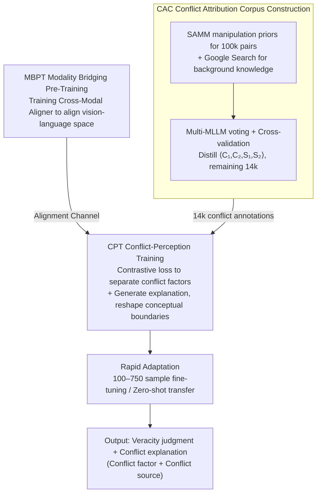

# CORE: Conflict-Oriented Reasoning for General Multimodal Manipulation Detection

**Conference**: ICML 2026  
**arXiv**: [2606.03066](https://arxiv.org/abs/2606.03066)  
**Code**: https://github.com/shen8424/CORE  
**Area**: AIGC Detection / Multimodal Misinformation / MLLM Reasoning  
**Keywords**: Conflict Reasoning, Multimodal Forgery Detection, MLLM Fine-tuning, Conceptual Boundaries, Few-shot Generalization

## TL;DR
The authors redefine "multimodal fake news detection" as a task of "explicitly capturing conflicts between modalities or with world knowledge." They construct CAC, a 14k corpus with fine-grained conflict annotations, and propose the CORE framework. By reshaping the conceptual boundaries of MLLMs through Conflict-Perception Training (CPT), the model significantly outperforms specialized SOTA on four datasets (DGM4, MDSM, MMFakeBench, NewsCLIPpings) using only 100–750 samples.

## Background & Motivation
**Background**: Current multimodal fake news detection mainly designs specialized models and training paradigms for each category of forgery (face attribute tampering, image replacement, full-text fabrication, entity replacement). For example, HAMMER and ASAP utilize contrastive learning with fine-grained localization, RamDG incorporates external knowledge bases for celebrity news, while SNIFFER, FKA-Owl, MMD-Agent, and AMD stack specialized two-stage fine-tuning or multi-step reasoning on MLLMs.

**Limitations of Prior Work**: These solutions are tightly coupled with specific forgery patterns. Since generative models iterate much faster than data collection and model retraining, performance drops sharply when encountering new types of tampering not seen in the training set. The authors refer to this as "data dependency + structural rigidity."

**Key Challenge**: Humans do not identify fake news by having "seen this specific category" before, but rather by "activating world knowledge $\rightarrow$ identifying internal contradictions." For instance, "Trump winning a football award" violates the common knowledge that "Trump is a politician." Existing discriminative models fail to explicitly model such conflicts and instead implicitly fit pixel-level artifacts.

**Goal**: To decouple general detection capability into two components: (i) possessing world knowledge, and (ii) placing concepts clearly in the representation space to make conflicts visible.

**Key Insight**: The authors performed two validation experiments. Table 1 shows that MLLMs achieve 96 ACC on a 200-question world knowledge benchmark, while CLIP/ALBEF models only achieve 41, indicating that knowledge is already present in MLLMs. However, t-SNE + linear classification shows that Qwen2.5VL-3B distinguishes "US President vs. Football Award" with only 61 ACC and "US President vs. UK Prime Minister" with only 53 ACC—the conceptual boundaries are blurred. Thus, the bottleneck is not a lack of knowledge, but a lack of conceptual boundaries.

**Core Idea**: Use a corpus annotated with "conflict factors + conflict sources" to explicitly supervise the MLLM in pushing conflicting concepts apart in the representation space. This replaces "discriminating specific forgery patterns" with "discriminating the shared conflict structure behind all forgeries," thereby achieving few-shot/zero-shot generalization to unseen forgery types.

## Method

### Overall Architecture
CORE aims to solve the problem where "specialized forgery detectors fail when the generator changes." The breakthrough is shifting the task from "identifying a type of tampering" to "explicitly stating the contradiction between image-text or common sense." Around this goal, the authors first distill a conflict-annotated corpus, CAC, using a multi-MLLM voting mechanism. Then, a lightweight Cross-Modal Aligner is trained to bridge the visual and linguistic spaces. Finally, CPT is used to reshape the conceptual boundaries of the MLLM. At deployment, only 100–750 target-domain samples are needed for rapid adaptation, or even zero-shot transfer. The input is a pair of $(I, T)$ image-text news, and the output is a veracity judgment along with a natural language conflict explanation (conflict factor + conflict source). The backbone is instantiated as Qwen2.5VL-3B or Gemma3-4B.

### Key Designs

**1. Conflict Attribution Corpus (CAC): Decomposing "Fake News" labels into localizable conflict supervision**

The prerequisite for a model to learn conflict reasoning is being told "exactly what the contradiction is and where it comes from." However, such fine-grained annotations are difficult to produce and prone to bias from a single model. The authors created an "expert pool + cross-validation" pipeline: 100k $(I, T)$ pairs were selected from the SAMM dataset (which includes tampering regions and types) as a base. Background knowledge for corresponding entities was pulled via the Google Search API. Then, image, text, tampering priors, and background knowledge were fed to an MLLM randomly sampled from $\{$GPT-4o, Gemini2.5-Pro, Qwen3-VL-Plus$\}$ to generate natural language conflict explanations, which were cross-validated by two other MLLMs. After verification, another MLLM distilled the explanation into a structured $\langle C_1, C_2, S_1, S_2 \rangle$ format (two conflict factors + two conflict sources), reviewed by the remaining two models. The final 14k samples have conflict source distributions of 29.98% Text / 36.86% Image / 33.16% World Knowledge. The sources are intentionally balanced across three categories to force supervision to cover cross-modal and external knowledge conflicts simultaneously, preventing the model from narrowing "conflict" down to simple image-text inconsistency. Multip-model voting also dilutes the world knowledge bias of any single MLLM.

**2. Modality Bridging Pre-Training (MBPT) + Cross-Modal Aligner: Eliminating modality gaps before reshaping concepts**

Conflict annotations in CAC are **uniformly provided in text form**, but many conflict sources originate from the image (e.g., "Trump in the image vs. Football Award in the text"). To allow the model to judge based on this, descriptions that are "written in text but sourced from vision" must be mapped back to the visual space; otherwise, the supervision signal is diluted by the modality gap. The authors introduce a lightweight Cross-Modal Aligner implemented as a cross-attention layer: text features serve as the Query, while visual feature sequences serve as Key/Value, outputting text-guided visual features. A dedicated pre-training stage (MBPT) is used to forge its alignment capability—using a SigLIP-style contrastive loss on 50k FineHARD samples to pull positive image-text features closer and push hard negatives further apart, complemented by a VQA auxiliary task ("Does the image contain certain objects?") to preserve linguistic ability. This step only performs "alignment" without touching conflict supervision, effectively paving the channel for subsequent conflict reasoning so that CPT does not have to bypass modality gaps when reshaping conceptual boundaries.

**3. Conflict-Perception Training (CPT): Reshaping conceptual geometry with conflict supervision**

Verification experiments found that MLLMs "know" world knowledge (96 ACC on a 200-question benchmark) but have blurred conceptual boundaries (61 ACC for distinguishing "US President vs. Football Award"). Directly adding a classification head would only lead the model to take shortcuts like "finding pixel textures." The CPT approach simultaneously fits "veracity judgment + conflict explanation generation." For each sample, it takes the global representations $\mathbf{z}_1, \mathbf{z}_2$ of the two annotated conflict factors $C_1, C_2$ (if a factor's source is an image, visual features are extracted via the MBPT-trained Aligner; otherwise, text features are used). A conflict-aware contrastive loss $\mathcal{L}_{cacl}$ is used to **push** $\mathbf{z}_1$ and $\mathbf{z}_2$ further apart in the semantic space—this is the core of "establishing clear conceptual boundaries," as forgeries are essentially two concepts that should be consistent but are contradictory. The total CPT objective is $\mathcal{L}_{\text{CPT}} = \mathcal{L}_{cacl} + \mathcal{L}_{cr}$, where $\mathcal{L}_{cr}$ is the language modeling loss for generating the explanation "True/False + because $C_1$ (from $S_1$) conflicts with $C_2$ (from $S_2$)." This forces the model to state "what the contradiction is and which modality it comes from" before declaring "False," locking the decision path into conflict reasoning rather than texture shortcuts. After training, t-SNE (Fig. 2b in the paper) shows that the previously overlapping "President vs. Football Award" clusters are pushed apart to be almost linearly separable, qualitatively confirming the reshaping of conceptual geometry.

### Loss & Training
CORE consists of two training stages, each with its own loss. **MBPT stage** $\mathcal{L}_{mbpt} = \mathcal{L}_{cl} + \mathcal{L}_{o2vqa}$: $\mathcal{L}_{cl}$ is a SigLIP-style image-text contrastive alignment loss (on 50k FineHARD samples), and $\mathcal{L}_{o2vqa}$ is a VQA auxiliary generation loss to preserve the model's original language capability and aid fine-grained multimodal understanding. **CPT stage** $\mathcal{L}_{cpt} = \mathcal{L}_{cacl} + \mathcal{L}_{cr}$: $\mathcal{L}_{cacl}$ pushes representations of two conflicting factors apart to establish boundaries, while $\mathcal{L}_{cr}$ is the language modeling loss for generating "veracity + conflict explanation." The **Rapid adaptation stage** only constructs a single instruction "Is this news true or false?" and performs few-shot fine-tuning using the language generation loss $\mathcal{L}_{ra}$, without any specialized design for specific forgery types. In zero-shot scenarios, the CPT checkpoint is used directly for inference, migrating to out-of-domain data like DGM4 and MMFakeBench via conflict reasoning.

## Key Experimental Results

### Main Results
On four datasets (DGM4, MDSM, MMFakeBench, NewsCLIPpings), using 100–750 (MMFakeBench 100–350) target-domain samples for adaptation, comparisons were made against 235B-scale Qwen3VL, 27B Gemma3, and specialized schemes like HAMMER/HAMMER++/RamDG/FKA-Owl/AMD.

| Dataset | Samples | CORE$_\text{Qwen}$ | Previous SOTA | Gain |
|--------|--------|--------------------|--------------|------|
| DGM4 | 750 | 65.4 | 60.8 (Gemma3-4B) | +4.6 |
| MDSM | 750 | 74.5 | 63.0 (Gemma3-4B) | +11.5 |
| MMFakeBench | 350 | 79.4 | 68.3 (HAMMER++) | +11.1 |
| NewsCLIPpings | 750 | 71.0 | 61.4 (Gemma3-4B) | +9.6 |
| DGM4 | 100 | 59.7 | 51.6 (Qwen3VL-235B) | +8.1 |
| MMFakeBench | 100 | 73.5 | 61.1 (Gemma3-4B) | +12.4 |

CORE$_\text{Gemma}$ further reached 82.0 on MDSM with 750 samples. Notably, 235B-level zero-shot MLLMs (Qwen3VL-235B, Gemma3-27B, LLaMA3.2-90B, SeedVL-1.5) were significantly outperformed by 3B/4B CORE across all datasets—indicating the problem lies in conceptual boundaries rather than parameter count.

### Ablation Study
Key ablations from the paper are summarized below:

| Configuration | MMFakeBench-350 ACC | Description |
|------|---------------------|------|
| CORE$_\text{Qwen}$ Full | 79.4 | Full CAC + MBPT + CPT |
| w/o CPT | ~66.5 | Degrades to Qwen2.5VL with only alignment; comparable to baseline |
| w/o source supervision | Moderate drop | Model cannot distinguish which modality the conflict comes from; cross-modal conflicts suffer most |
| w/o factor supervision | Moderate drop | Can only output "False" labels; unstable when generalizing to new forgeries |
| w/o MBPT | Significant drop | Lack of cross-modal alignment causes CPT supervision signals to be diluted |

### Key Findings
- Conceptual boundaries are more important than parameter count: The 3B CORE consistently outperforms 235B zero-shot MLLMs, suggesting the bottleneck in fake news detection is "having a clear boundary for one's own knowledge," not just "how much one knows."
- Conflict source supervision is key to generalization: Removing source supervision causes the sharpest drop in cross-modal conflict samples (like image-text entity replacement in NewsCLIPpings), indicating that explicitly modeling "where the conflict comes from" forces the model to learn modality alignment priors.
- Greatest advantage at the lowest sample sizes: CORE outperformed the strongest baseline by +12.4 on MMFakeBench with 100 samples, showing that conflict reasoning is a true "prior" rather than another overfitting shortcut.
- Direct t-SNE visualization: Before training, "US President vs. Football Award" was completely overlapping (linear separability only 61). After CORE training, the two clusters are clearly separated, qualitatively validating the reshaping of conceptual geometry by CPT.

## Highlights & Insights
- "Forgery detection" translated into "Conflict reasoning": This is a paradigm-level shift, serving as a "chain-of-thought" moment in the deepfake detection field—no longer chasing pixel artifacts, but semantic/common-sense contradictions, naturally gaining robustness against unseen generators.
- Multi-MLLM voting for CAC generation + review: This "expert pool + cross-validation" pipeline can be directly applied to other "difficult-to-label fine-grained reasoning corpora," such as medical diagnostic explanations or legal evidence conflicts.
- Clear separation of conceptual boundaries vs. conceptual knowledge: The pair of Table 1 + t-SNE experiments quantifies the "MLLM knows but can't say clearly" pain point, providing a reusable diagnostic protocol for future MLLM fine-tuning research.
- View-agnostic few-shot setting: Stable performance across four vastly different datasets with just 100 samples shows that CPT learns a task-agnostic "conflict-perception prior." Rapid adaptation only requires calibrating the threshold for "what counts as a conflict."

## Limitations & Future Work
- The 14k CAC is still relatively small and depends on SAMM's tampering priors; coverage for fully synthetic samples (e.g., end-to-end diffusion-generated image and text) is unknown. Since CAC is generated by MLLMs, it may inherit world knowledge biases from GPT-4o/Gemini.
- Adversarial robustness was not reported—if an attacker explicitly erases "common-sense contradictions" during generation (e.g., replacing "Trump + football" with "Footballer + football award"), CORE's advantage might be weakened.
- Only 3B/4B MLLMs were evaluated; whether conflict reasoning continues to scale with backbone size and the effect of overlapping with R1-type explicit CoT reasoning remains unverified.
- Conflict sources are limited to three categories (Text/Image/World Knowledge); multimodal extensions for audio/video/temporal consistency would require a redesigned annotation schema.

## Related Work & Insights
- **vs. HAMMER / HAMMER++**: They use contrastive learning + fine-grained localization modules to focus on image-text inconsistency. CORE does not use a specialized localization head but outputs conflict explanations directly from the MLLM's language side, expanding from single conflict types to general conflicts, and significantly winning in few-shot scenarios (DGM4-750 +7.5 ACC).
- **vs. FKA-Owl**: FKA-Owl connects external knowledge bases to an MLLM to target "common-sense fallacies." CORE utilizes the MLLM's internal knowledge and only reshapes conceptual boundaries through CPT—achieving similar capabilities without relying on retrieval and outperforming FKA-Owl by over 10 points on four datasets.
- **vs. MMD-Agent / AMD**: These stack strong priors like "multi-step reasoning + regional coordinates + tampering types." CORE retains only the most abstract supervision (conflict factor/source), resulting in better generalization. This suggests that "less is more" on top of MLLMs—task-specific rigid structures actually limit the backbone's transferability.
- **vs. zero-shot large MLLMs (235B class)**: Qwen3VL-235B and Gemma3-27B stay around 50 ACC on DGM4, while CORE-3B reaches 65+, suggesting that the "fake news detection capability" of MLLMs is primarily limited by conceptual boundaries rather than parameters.

## Rating
- Novelty: ⭐⭐⭐⭐⭐ "Reshaping MLLM conceptual boundaries with explicit conflict supervision" is a rare paradigm-level shift for this task.
- Experimental Thoroughness: ⭐⭐⭐⭐ Four datasets × multiple sample sizes + multi-backbone comparison. Coverage of adversarial and generative full-image samples is slightly weak.
- Writing Quality: ⭐⭐⭐⭐ The three-stage motivation (knowledge vs. boundary) is very clear; heading hierarchies within the method section are slightly disorganized.
- Value: ⭐⭐⭐⭐⭐ Both the paradigm and the dataset are significant contributions; CAC itself could become a sub-community benchmark.

<!-- RELATED:START -->

## Related Papers

- [\[CVPR 2026\] FRAME: Forensic Routing and Adaptive Multi-path Evidence Fusion for Image Manipulation Detection](../../CVPR2026/aigc_detection/frame_forensic_routing_and_adaptive_multi-path_evidence_fusion_for_image_manipul.md)
- [\[CVPR 2026\] ReAlign: Generalizable Image Forgery Detection via Reasoning-Aligned Representation](../../CVPR2026/aigc_detection/realign_generalizable_image_forgery_detection_via_reasoning-aligned_representati.md)
- [\[CVPR 2026\] Inconsistency-aware Multimodal Schrodinger Bridge for Deepfake Localization](../../CVPR2026/aigc_detection/inconsistency-aware_multimodal_schrodinger_bridge_for_deepfake_localization.md)
- [\[CVPR 2026\] Locate-Then-Examine: Grounded Region Reasoning Improves Detection of AI-Generated Images](../../CVPR2026/aigc_detection/locate-then-examine_grounded_region_reasoning_improves_detection_of_ai-generated.md)
- [\[NeurIPS 2025\] ASCIIBench: Evaluating Language-Model-Based Understanding of Visually-Oriented Text](../../NeurIPS2025/aigc_detection/asciibench_evaluating_language-model-based_understanding_of_visually-oriented_te.md)

<!-- RELATED:END -->
