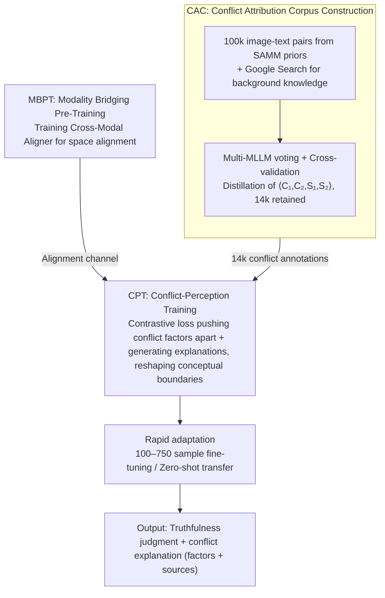

# CORE: Conflict-Oriented Reasoning for General Multimodal Manipulation Detection

**Conference**: ICML 2026  
**arXiv**: [2606.03066](https://arxiv.org/abs/2606.03066)  
**Code**: https://github.com/shen8424/CORE  
**Area**: AIGC Detection / Multimodal Misinformation / MLLM Reasoning  
**Keywords**: Conflict reasoning, Multimodal forgery detection, MLLM fine-tuning, Conceptual boundary, Few-shot generalization

## TL;DR
This work redefines "multimodal fake news detection" as a task of "explicitly capturing conflicts between modalities or with world knowledge." The authors construct CAC, a corpus of 14k samples with fine-grained conflict annotations, and propose the CORE framework. CORE reshapes the conceptual boundaries of MLLMs through Conflict-Perception Training (CPT), enabling the model to significantly outperform dedicated SOTA methods on four datasets (DGM4, MDSM, MMFakeBench, NewsCLIPpings) using only 100–750 samples.

## Background & Motivation
**Background**: Current mainstream multimodal fake news detection methods design specialized models and training paradigms for specific types of forgery (e.g., facial attribute manipulation, full image replacement, text fabrication, entity substitution). For instance, HAMMER and ASAP employ contrastive learning and fine-grained localization; RamDG utilizes external knowledge bases for celebrity news; while SNIFFER, FKA-Owl, MMD-Agent, and AMD apply various two-stage fine-tuning or multi-step reasoning on MLLMs.

**Limitations of Prior Work**: These solutions are tightly coupled with specific forgery patterns. Generative models iterate much faster than data collection and model retraining. Performance drops sharply when encountering new types of manipulation not seen in the training set, a phenomenon the authors refer to as "data dependency + structural rigidity."

**Key Challenge**: Humans do not identify fake news by having "seen that specific category"; rather, they rely on "activating world knowledge $\rightarrow$ identifying internal contradictions." For example, "Donald Trump winning a football award" violates the common sense that "Trump = Politician." Existing discriminative models fail to explicitly model such conflicts and instead implicitly fit pixel-level artifacts.

**Goal**: To decompose general detection capability into two components: (i) possessing world knowledge, and (ii) placing concepts clearly into the representation space to make conflicts visible.

**Key Insight**: The authors conducted two validation experiments. Table 1 shows that MLLMs achieve 96 ACC on a 200-item world knowledge benchmark, whereas CLIP/ALBEF-style models only reach 41 ACC, suggesting that knowledge already resides within MLLMs. However, t-SNE + linear classification reveal that Qwen2.5VL-3B achieves only 61 ACC in distinguishing "US President vs. Football Award" and 53 ACC for "US President vs. UK Prime Minister"—indicating blurred conceptual boundaries. Thus, the bottleneck is the lack of conceptual boundaries rather than the lack of knowledge.

**Core Idea**: Utilize a corpus annotated with "conflict factors + conflict sources" to explicitly supervise the MLLM in pushing conflicting concepts apart in the representation space. This shifts the task from "identifying specific forgery patterns" to "identifying the shared conflict structure behind all forgeries," thereby achieving few-shot/zero-shot generalization to unseen forgery types.

## Method

### Overall Architecture
CORE aims to solve the issue where dedicated forgery detectors collapse when faced with new generators. Its breakthrough lies in shifting the task from "identifying a type of manipulation" to "explicitly stating the contradiction between image-text or common sense." To this end, the authors first distill a conflict-annotated corpus, CAC, via multi-MLLM voting. They then train a lightweight Cross-Modal Aligner to bridge the visual and linguistic spaces. Finally, CPT is used to reshape the MLLM's conceptual boundaries. During deployment, the model requires only 100–750 target domain samples for rapid adaptation or can even perform zero-shot transfer. Given an image-text pair $(I, T)$, the output includes a truthfulness judgment and a natural language conflict explanation (conflict factors + conflict sources). The backbone is instantiated using Qwen2.5VL-3B and Gemma3-4B.

### Key Designs

**1. Conflict Attribution Corpus (CAC): Decomposing "fake news" labels into localizable conflict supervision**

For a model to learn conflict reasoning, it must be informed of the specific nature and source of the contradiction. However, such fine-grained annotations are difficult to produce and prone to individual model bias. The authors established an "expert pool + cross-validation" pipeline: selecting 100k $(I, T)$ pairs from the SAMM dataset (which includes manipulation regions and type priors), retrieving background knowledge via the Google Search API, and feeding the image, text, priors, and knowledge into an MLLM randomly sampled from $\{$GPT-4o, Gemini2.5-Pro, Qwen3-VL-Plus$\}$ to generate a natural language explanation. This is then verified by two other MLLMs. Once passed, an MLLM distills the explanation into a structured format $\langle C_1, C_2, S_1, S_2 \rangle$ (two conflict factors + two conflict sources), which is reviewed by the remaining two MLLMs. The final 14k samples have a conflict source distribution of 29.98% text / 36.86% image / 33.16% world knowledge. This balanced distribution forces the supervision to cover cross-modal and external knowledge conflicts, preventing the model from narrowing "conflict" down to simple image-text inconsistency. Multi-model voting mitigates the world knowledge bias of any single MLLM.

**2. Modality Bridging Pre-Training (MBPT) + Cross-Modal Aligner: Eliminating modality gaps before reshaping concepts**

Conflict annotations in CAC are **provided uniformly in text format**, yet many conflict sources are visual (e.g., "Trump in the image vs. football award in the text"). To enable the model to make judgments based on this, these visual-origin descriptions must be mapped back to the visual space; otherwise, the supervision signal is diluted by the modality gap. The authors introduce a lightweight Cross-Modal Aligner implemented as a cross-attention layer: text features act as Query, while visual feature sequences act as Key/Value, outputting text-guided visual features. A dedicated pre-training phase (MBPT) refines its alignment capability using a SigLIP-style contrastive loss on 50k FineHARD samples to pull positive image-text pairs closer and push hard negatives apart, supplemented by a "presence of object" VQA task to maintain linguistic capabilities. This step focuses solely on "alignment" without conflict supervision, essentially paving the way for CPT to reshape conceptual boundaries without being hindered by modality gaps.

**3. Conflict-Perception Training (CPT): Reshaping conceptual geometry with conflict supervision**

Validation experiments revealed that while MLLMs "possess" world knowledge (96 ACC on a 200-item benchmark), their conceptual boundaries are blurred (61 ACC for linear separability of "US President vs. Football Award"). Simply adding a discriminative head encourages the model to take shortcuts by seeking pixel textures. CPT's strategy is to simultaneously fit "truthfulness judgment + conflict explanation generation." For the two annotated conflict factors $C_1, C_2$ in each sample, global representations $\mathbf{z}_1, \mathbf{z}_2$ are extracted (using the MBPT Cross-Modal Aligner for visual sources, otherwise retaining text features). A conflict-aware contrastive loss $\mathcal{L}_{cacl}$ is used to **push $\mathbf{z}_1$ and $\mathbf{z}_2$ apart** in the semantic space—the core of building clear conceptual boundaries. The total CPT objective is $\mathcal{L}_{\text{CPT}} = \mathcal{L}_{cacl} + \mathcal{L}_{cr}$, where $\mathcal{L}_{cr}$ is the language modeling loss for generating the explanation: "True/False + because $C_1$ (from $S_1$) conflicts with $C_2$ (from $S_2$)." This forces the model to articulate the contradiction and its source before making a verdict, locking the decision path onto conflict reasoning rather than texture shortcuts. Post-training t-SNE (Fig. 2b) shows that previously overlapping clusters like "President vs. Football Award" become nearly linearly separable.

### Loss & Training
CORE involves two training stages, each with its own loss. **MBPT Phase** $\mathcal{L}_{mbpt} = \mathcal{L}_{cl} + \mathcal{L}_{o2vqa}$: $\mathcal{L}_{cl}$ is a SigLIP-style contrastive alignment loss (aligning text features with aligner-extracted visual features on 50k FineHARD samples), and $\mathcal{L}_{o2vqa}$ is a VQA auxiliary generation loss to preserve linguistic ability and aid fine-grained multimodal understanding. **CPT Phase** $\mathcal{L}_{cpt} = \mathcal{L}_{cacl} + \mathcal{L}_{cr}$: $\mathcal{L}_{cacl}$ pushes apart representations of conflict factors within the same sample, while $\mathcal{L}_{cr}$ handles the language modeling for "truthfulness + conflict explanation." **Rapid Adaptation Phase**: Only a simple "Is this news true or false?" instruction is used, with few-shot fine-tuning based on the language generation loss $\mathcal{L}_{ra}$. No specialized design is made for specific forgery types. In zero-shot scenarios, the CPT checkpoint is used directly for inference, leveraging conflict reasoning to generalize to out-of-distribution data like DGM4 or MMFakeBench.

## Key Experimental Results

### Main Results
Adaptation was performed on four datasets (DGM4, MDSM, MMFakeBench, NewsCLIPpings) using 100–750 samples (100–350 for MMFakeBench). Comparisons included 235B-scale Qwen3VL, 27B Gemma3, and specialized solutions like HAMMER/HAMMER++/RamDG/FKA-Owl/AMD.

| Dataset | Samples | CORE$_\text{Qwen}$ | Prev. Best Baseline | Gain |
|--------|--------|--------------------|--------------|------|
| DGM4 | 750 | 65.4 | 60.8 (Gemma3-4B) | +4.6 |
| MDSM | 750 | 74.5 | 63.0 (Gemma3-4B) | +11.5 |
| MMFakeBench | 350 | 79.4 | 68.3 (HAMMER++) | +11.1 |
| NewsCLIPpings | 750 | 71.0 | 61.4 (Gemma3-4B) | +9.6 |
| DGM4 | 100 | 59.7 | 51.6 (Qwen3VL-235B) | +8.1 |
| MMFakeBench | 100 | 73.5 | 61.1 (Gemma3-4B) | +12.4 |

CORE$_\text{Gemma}$ further reached 82.0 on MDSM with 750 samples. Notably, zero-shot MLLMs at the 235B scale (Qwen3VL-235B, Gemma3-27B, LLaMA3.2-90B, SeedVL-1.5) were significantly outperformed by the 3B/4B CORE across all datasets—indicating that the bottleneck lies in conceptual boundaries rather than parameter count.

### Ablation Study

| Configuration | MMFakeBench-350 ACC | Description |
|------|---------------------|------|
| CORE$_\text{Qwen}$ Full | 79.4 | Full CAC + MBPT + CPT |
| w/o CPT | ~66.5 | Degenerates to Qwen2.5VL with alignment only (comparable to baseline) |
| w/o source supervision | Moderate drop | Model fails to distinguish conflict modalities; cross-modal conflicts suffer most |
| w/o factor supervision | Moderate drop | Model can only output "False" labels; unstable generalization to new forgeries |
| w/o MBPT | Significant drop | Lack of cross-modal alignment dilutes CPT supervision signals |

### Key Findings
- Conceptual boundaries are more important than parameters: The 3B CORE consistently outperformed 235B zero-shot MLLMs, suggesting that the bottleneck in fake news detection is having a "clear boundary for one's own knowledge" rather than "how much one knows."
- Conflict source supervision is the key to generalization: Removing source supervision led to the sharpest performance drop in cross-modal conflict samples (e.g., entity replacement in NewsCLIPpings), indicating that explicitly modeling "where the conflict comes from" forces the model to learn modality alignment priors.
- Greatest advantage at minimum sample sizes: CORE outperformed the strongest baseline by +12.4 on MMFakeBench with 100 samples, proving that conflict reasoning is a true "prior" rather than another overfitting shortcut.
- Direct t-SNE visualization: Before training, "US President vs. Football Award" was completely overlapping (linear separability of 61). After CORE training, the two clusters were clearly separated, qualitatively confirming the reshaping of conceptual geometry.

## Highlights & Insights
- Reinterpreting "forgery detection" as "conflict reasoning": This is a paradigm-level shift, similar to the chain-of-thought moment in DeepFake detection. Instead of chasing pixel artifacts, it pursues semantic/common sense contradictions, automatically gaining robustness against unseen generators.
- Utilizing multi-MLLM voting for CAC generation and review: This "expert pool + cross-validation" pipeline can be directly applied to other "fine-grained reasoning corpora that are difficult to annotate," such as medical diagnostic explanations or legal evidence conflicts.
- Clear separation of conceptual boundaries vs. conceptual knowledge: The Table 1 + t-SNE experiment pair quantifies the problem of "MLLMs knowing but being unable to articulate," providing a reusable diagnostic protocol for future MLLM fine-tuning research.
- View-agnostic few-shot setting: Stable performance gains across four highly different datasets with just 100 samples suggest that CPT learns a task-agnostic "conflict-perception prior." Rapid adaptation only requires calibrating the threshold for "what counts as a conflict."

## Limitations & Future Work
- The 14k CAC is still relatively small and relies on SAMM manipulation priors. Coverage for fully synthetic samples (e.g., end-to-end diffusion-generated full image/text) is unknown. Furthermore, CAC is generated by MLLMs, which may inherit world knowledge biases from GPT-4o or Gemini.
- Adversarial robustness was not reported. If an attacker explicitly removes "common sense contradictions" during generation (e.g., replacing "Trump + Football" with "Footballer + Football Award"), CORE's advantage might be weakened.
- Only 3B/4B MLLMs were evaluated. Whether conflict reasoning continues to scale with backbone size and its additive effects with explicit R1-style CoT reasoning have yet to be verified.
- Conflict sources are limited to three categories (text/image/world knowledge). Multimodal extensions like audio/video/temporal consistency would require a redesigned annotation schema.

## Related Work & Insights
- **vs. HAMMER / HAMMER++**: They focus on image-text inconsistency using contrastive learning and specialized localization modules. CORE discards specialized heads in favor of direct conflict explanation output from the MLLM, expanding from single conflict types to general conflicts and significantly outperforming them in few-shot settings (+7.5 ACC on DGM4-750).
- **vs. FKA-Owl**: FKA-Owl integrates an external knowledge base with MLLMs to combat "common sense fallacies." CORE achieves similar capabilities by leveraging the MLLMs' internal knowledge through CPT to reshape conceptual boundaries, outperforming FKA-Owl by over 10 points across four datasets without relying on retrieval.
- **vs. MMD-Agent / AMD**: These methods stack strong priors like "multi-step reasoning + regional coordinates + manipulation types." CORE retains only the most abstract supervision (conflict factors/sources), resulting in better generalization. This suggests that for MLLMs, "less is more"—heavy task-specific structures can limit the backbone's transferability.
- **vs. Zero-shot Large MLLMs (235B Scale)**: Qwen3VL-235B and Gemma3-27B reach only around 50 ACC on DGM4, whereas CORE-3B reaches 65+. This suggests that the "fake news detection capability" of MLLMs is primarily constrained by conceptual boundaries rather than parameter bottlenecks.

## Rating
- Novelty: ⭐⭐⭐⭐⭐ "Reshaping MLLM conceptual boundaries with explicit conflict supervision" is a rare paradigm shift for this task.
- Experimental Thoroughness: ⭐⭐⭐⭐ Four datasets × multiple sample sizes + multi-backbone comparisons. Coverage of adversarial and fully synthetic samples is slightly weaker.
- Writing Quality: ⭐⭐⭐⭐ The three-part motivation (knowledge vs. boundary) is very clear, though sub-headings within the method section are slightly disorganized.
- Value: ⭐⭐⭐⭐⭐ Simultaneous output of a paradigm and a dataset (CAC), the latter of which is sufficient to become a sub-community benchmark.

<!-- RELATED:START -->

## Related Papers

- [\[ICML 2026\] Deep Residual Injection for Full-Spectrum Forensic Signal Perception in Multimodal Large Language Models](deep_residual_injection_for_full-spectrum_forensic_signal_perception_in_multimod.md)
- [\[ICLR 2026\] Semantic Visual Anomaly Detection and Reasoning in AI-Generated Images](../../ICLR2026/aigc_detection/semantic_visual_anomaly_detection_and_reasoning_in_ai-generated_images.md)
- [\[ICLR 2026\] FakeXplain: AI-Generated Image Detection via Human-Aligned Grounded Reasoning](../../ICLR2026/aigc_detection/fakexplain_ai-generated_image_detection_via_human-aligned_grounded_reasoning.md)
- [\[ICLR 2026\] Omni-IML: Towards Unified Interpretable Image Manipulation Localization](../../ICLR2026/aigc_detection/omni-iml_towards_unified_interpretable_image_manipulation_localization.md)
- [\[CVPR 2026\] Inconsistency-aware Multimodal Schrodinger Bridge for Deepfake Localization](../../CVPR2026/aigc_detection/inconsistency-aware_multimodal_schrodinger_bridge_for_deepfake_localization.md)

<!-- RELATED:END -->
