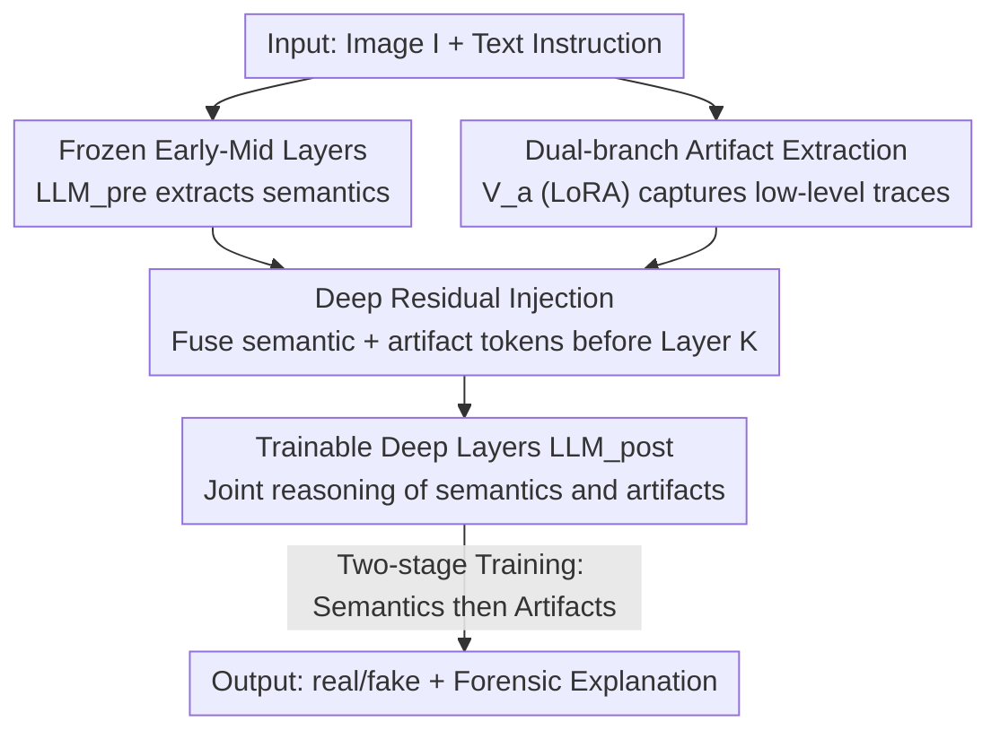

# Deep Residual Injection for Full-Spectrum Forensic Signal Perception in Multimodal Large Language Models

**Conference**: ICML 2026  
**arXiv**: [2606.15880](https://arxiv.org/abs/2606.15880)  
**Code**: https://github.com/KQL11/Deep-VRM  
**Area**: Multimodal VLM / AIGC Detection  
**Keywords**: AI-Generated Image Detection, Multimodal Large Language Models, Residual Injection, Catastrophic Forgetting, Layer-wise Analysis  

## TL;DR
This paper discovers that directly fine-tuning MLLMs to learn low-level artifacts left by generators damages their early-formed semantic representations (catastrophic forgetting). To address this, the authors propose Deep-VRM, which freezes the early and middle layers to preserve semantics while utilizing a LoRA-based bypass to "residually inject" artifact features into the deep layers of the LLM. This allows a single MLLM to achieve SOTA performance on most AIGI benchmarks without relying on any external expert detectors.

## Background & Motivation
**Background**: As AI-generated images become increasingly realistic, determining image authenticity has become central to digital trust. A mainstream approach involves using Multimodal Large Language Models (MLLMs) for detection, as they can perform reasoning and provide human-readable explanations, appearing to be ideal forensic tools.

**Limitations of Prior Work**: General-purpose MLLMs often underperform compared to specialized forensic models in detection tasks. While they excel at capturing "semantic-level" inconsistencies (unusual styles, contradictory content, illogical details), they are nearly insensitive to **low-level artifacts** (subtle generator traces) left at the pixel level. Existing solutions often attach external expert forensic models, reducing the MLLM to a "communicator" rather than a truly independent discriminator. Consequently, MLLMs fail to learn intrinsic forgery features and cannot explain their own poor performance.

**Key Challenge**: The authors reveal a fundamental trade-off in MLLM representation learning: **native models cannot learn generalizable generator traces without compromising core semantic capabilities**. Pre-trained MLLMs are optimized for semantic alignment and naturally ignore low-level artifacts. Experiments confirm that standard LoRA fine-tuning cannot recover these suppressed low-frequency features, while full fine-tuning, despite capturing artifacts, destroys semantic understanding—resulting in catastrophic score drops on benchmarks like BLINK, RealWorldVQA, and MME (e.g., MME dropping from 1677 to 506).

**Key Insight**: To resolve this dilemma, it is necessary to identify the functional distribution within the model layers. Through **layer-wise analysis using linear probes**, the authors find that the semantic separability required to distinguish real from fake images is primarily established and converges in the **early to middle layers (layers 1–16)**, whereas artifact detection capability stagnates across all depths ($\approx 81\%$). In other words, the early and middle layers constitute a "semantic convergence zone"; forcing them to learn contradictory low-level artifacts interferes with semantic extraction.

**Core Idea**: Since semantics converge in early layers and deep layers handle high-level reasoning and integration, the **learning process should be decoupled**. Early layers are frozen to preserve semantics, and low-level artifact features are injected into deep layers via a "residual bypass," allowing subsequent trainable layers to model both semantic reasoning and signal-level forensic cues simultaneously.

## Method

### Overall Architecture
Deep-VRM (Deep Visual Residual MLLM) uses Qwen-2.5-VL-7B as its backbone. It takes an image $I$ and a text instruction as input and outputs a "real/fake" judgment or a forensic analysis text. The core modification is a "Green Road" established before a specific intermediate layer $K$ (the residual injection boundary), which directly adds specialized visual features for artifact extraction to the visual tokens before passing them to deeper layers.

The pipeline operates as follows: the original frozen visual encoder $\mathcal{V}_o$ encodes the image into visual embeddings, which are concatenated with text embeddings to form $\mathbf{H}^{(0)}$. The first $K-1$ layers of the LLM (frozen, denoted as $\text{LLM}_{\text{pre}}$) perform semantic extraction as usual, yielding intermediate hidden states $\mathbf{H}^{(K-1)}$. Simultaneously, an adapted visual branch $\mathcal{V}_a$ with LoRA extracts artifact features separately from the original image and performs residual injection into the visual tokens before layer $K$. The fused tokens are then fed into the trainable deep layers $\text{LLM}_{\text{post}}$ for final output. The process is implemented through a two-stage training strategy: "stabilize semantics first, then supplement artifacts."

### Key Designs

**1. Layer-wise Analysis to Locate the "Semantic Convergence Zone"**

This forms the theoretical foundation, answering why direct fine-tuning is harmful. The authors compare two datasets—$D_1$ focused on semantic cues and $D_2$ focused on generator traces (using SD 2.1 VAE reconstructed images to eliminate semantic interference, forcing the model to focus on pixel-level differences). Linear probes are attached to every layer of Qwen-2.5-VL-7B. Results show that detection accuracy for $D_1$ rises and converges rapidly in early to middle layers (1–16), while accuracy for $D_2$ plateaus at approximately 81% across all depths. This identifies the early and middle layers as the "semantic convergence zone"; forcing them to learn low-level artifacts conflicts with already converged semantic representations, which is the mechanism behind catastrophic forgetting in full fine-tuning. Therefore, the strategy is to preserve early layers and postpone artifact injection to the deep layers post-convergence.

**2. Residual Injection Bypass (Green Road)**

To address the issue where freezing early layers suppresses high-frequency artifact signals, a residual path is added before layer $K$. It equips the original visual encoder $\mathcal{V}_o$ with a lightweight LoRA adapter to form $\mathcal{V}_a$, specifically for extracting artifact features from the original image $I$, which are then injected into the intermediate visual tokens via weighted summation:

$$\mathbf{\tilde{h}}_{v}^{(K-1)} = \alpha \cdot \mathbf{h}_{v}^{(K-1)} + \beta \cdot \mathcal{V}_a(I)$$

Where $\alpha=\beta=0.5$ balances semantic context and raw artifact cues. This bypass effectively "skips" the semantic extraction phase of the early layers. Unlike traditional methods that align features at the input layer, artifact features are directly delivered to the deep LLM layers. The fused visual tokens are re-concatenated with the original text context and fed into $\text{LLM}_{\text{post}}$. Crucially, since $\mathcal{V}_a$ is initialized from the frozen $\mathcal{V}_o$ and utilizes only LoRA, it **introduces no additional trainable parameters beyond LoRA** (totaling 115.02M trainable parameters in the Qwen-2.5-VL-7B setting).

**3. Two-Stage Training: Prior Activation and Artifact-Aware Refinement**

The architectural design is supplemented by a training sequence that prevents semantic overwriting. A standard autoregressive SFT loss $\mathcal{L}_{SFT}=-\sum_{i=1}^{L}\log P(y_i\mid I, y_{<i};\Theta)$ is used to optimize parameters in two stages. **Stage 1 (Semantic Alignment & Prior Activation)**: Only the LLM backbone is fine-tuned using $D_1$ with everything else frozen, aiming to "awaken" and align existing semantic knowledge in the MLLM for AIGI detection. **Stage 2 (Artifact-Aware Refinement)**: The residual injection structure is trained using $D_1+D_2$, but the first $K-1$ layers of the LLM remain frozen to safeguard the discriminative priors established in Stage 1, optimizing only $\mathcal{V}_a$ and layers $K$ to $N$. This supplements artifact sensitivity without damaging semantic representations in the frozen early layers. An emergent phenomenon is that the model **adaptively utilizes different levels of forensic signals based on the input**—referencing semantics when needed and artifacts when appropriate.

### Loss & Training
Autoregressive negative log-likelihood $\mathcal{L}_{SFT}$ is used for supervision. Annotations follow two formats: bi-choice ("Is this image real or fake? ... 'real' or 'fake'") and detailed analytical annotations generated by Gemini 2.5 Pro (with $D_2$ reconstructed fake images emphasizing "non-semantic artifacts" to guide pixel-level learning). The training set includes 88,000 instruction-tuning samples. Models are trained for 2 epochs using AdamW ($\beta_1=0.9, \beta_2=0.95$, weight decay $1e^{-3}$), cosine learning rate decay, learning rates of $1e^{-4}$ for the visual encoder and LLM, $1e^{-6}$ for the projector, and LoRA rank=64, alpha=128. Images are scaled within a $512\times512$ pixel budget.

## Key Experimental Results

### Main Results
On 8 generator subsets of GenImage, Deep-VRM significantly leads the previous best, OMAT, in average accuracy. Large leads are also observed on SynthBuster, which contains only fake images.

| Dataset | Metric | Deep-VRM | Prev. SOTA | Note |
|--------|------|----------|----------|------|
| GenImage (AVG 8 Generators) | ACC% | **97.42** | OMAT 94.63 / AIDE 86.88 | Cross-generator generalization |
| GenImage·ADM | ACC% | **89.82** | OMAT 83.82 | Robust on difficult subsets |
| SynthBuster (AVG 9 Sources) | ACC% | **94.50** | PatchShuffle 62.75 | Generalization gap on fake images |
| General Multimodal MME | Score | **1636** | Full FT 506 / Backbone 1677 | Minimal loss of semantic ability |

### Ablation Study (Impact of Fine-tuning Strategy on Semantic Capability, Table 2)

| Configuration | BLINK | RealWorldVQA | MME | Note |
|------|-------|--------------|-----|------|
| Backbone (Original) | 0.5481 | 0.6758 | 1677 | Original semantic capability |
| Full Fine-tuning on $D_2$ | 0.0373 | 0.1137 | 506 | Catastrophic forgetting, semantic collapse |
| Ours (on $D_2$) | 0.5476 | 0.6721 | 1636 | Artifact learning with preserved semantics |

### Key Findings
- **Catastrophic forgetting is the key bottleneck**: Full fine-tuning for artifacts causes a vertical drop in general multimodal scores (MME 1677 $\rightarrow$ 506), whereas residual injection preserves nearly all semantic capability (1677 $\rightarrow$ 1636), proving the necessity of the "decoupling" path.
- **Early-mid layers are indeed semantic convergence zones**: Linear probes show semantic separability converges in layers 1–16 while artifact accuracy stalls at 81%, directly supporting the design of "injecting artifacts only in deep layers."
- **SOTA without external experts**: Using only a single MLLM, Deep-VRM outperforms approaches with external expert models on GenImage, SynthBuster, and shows robustness in "in-the-wild" scenarios like WildRF and AIGI-Bench.
- **Adaptive Forensic Signals**: The model emerges with the ability to selectively invoke different levels of forensic signals based on input—a byproduct of deep layers "receiving both semantics and artifacts" via residual injection.

## Highlights & Insights
- **"Diagnosis before Prescription" paradigm**: The research first clarifies MLLM internal functional layering (semantics converge early, deep layers manage reasoning) using linear probes, then designs the architecture based on these findings. This logic is more compelling than heuristic module addition.
- **Single modification, zero extra parameters**: Since $\mathcal{V}_a$ is a copy of $\mathcal{V}_o$ plus LoRA, it adds no trainable parameters beyond standard LoRA. It is highly efficient and easily transferable to other tasks requiring the preservation of pre-trained knowledge while supplementing low-level signals (e.g., deepfake video or document forgery detection).
- **Quantifying "Catastrophic Forgetting" as a visible forensic cost**: By using general benchmarks like MME to demonstrate semantic collapse under full fine-tuning, the authors make the argument against direct fine-tuning self-evident. This comparative experiment is highly valuable.

## Limitations & Future Work
- **Manual setting of boundary $K$ and scaling $\alpha, \beta$**: $K$ is determined by layer-wise analysis and $\alpha=\beta=0.5$ are fixed. Whether these are optimal for different backbones or resolutions or if they can be learned adaptively was not fully explored.
- **Dependency on VAE reconstruction for $D_2$**: Using SD 2.1 VAE reconstructed images as a proxy for "generator traces" poses generalization risks for unseen generative paradigms (e.g., certain autoregressive image models).
- **Interpretability is not the primary focus**: The authors explicitly focus on detection performance rather than explainability. However, since the selling point of MLLMs is explanation, the factual consistency and quality of explanation text after artifact injection require more systematic evaluation.
- **Future Directions**: Making injection boundaries and fusion weights adaptive per sample; extending residual injection to video/audio forensics; evaluating and optimizing the factual consistency of explanations post-artifact perception.

## Related Work & Insights
- **vs. Traditional AIGI Detection (CNNSpot / UnivFD / NPR / AIDE)**: These use CNN or CLIP backbones to catch artifacts but have limited cross-generator generalization and robustness to post-processing (compression). Deep-VRM uses MLLM semantic priors as a foundation, ensuring more stable generalization by considering both semantic anomalies and pixel artifacts.
- **vs. MLLM schemes with external experts (AIGI-Holmes / MLLM as agent)**: These force MLLMs to mimic expert predictions or coordinate multiple experts, but the MLLM itself does not learn feature-level analysis. Deep-VRM internalizes artifact perception within a single MLLM without external dependencies.
- **vs. Direct MLLM Fine-tuning (Standard LoRA / Full FT)**: Standard LoRA cannot recover suppressed low-frequency artifacts, and full fine-tuning causes catastrophic semantic forgetting. Deep-VRM decouples them via residual injection and two-stage training, achieving the best of both worlds.

## Rating
- Novelty: ⭐⭐⭐⭐⭐ The decoupling approach via "layer-wise diagnosis + deep residual injection" is highly novel in MLLM forensics.
- Experimental Thoroughness: ⭐⭐⭐⭐ Extensive cross-benchmark evaluation (GenImage/SynthBuster/WildRF) plus catastrophic forgetting analysis; sensitivity analysis for injection hyperparameters could be further detailed.
- Writing Quality: ⭐⭐⭐⭐⭐ Clear logical chain from phenomenon to mechanism to solution, supported by strong visualizations.
- Value: ⭐⭐⭐⭐⭐ Provides a reusable paradigm for how MLLMs can preserve semantics while learning low-level signals.

<!-- RELATED:START -->

## Related Papers

- [\[ICML 2026\] Generating Robust Portfolios of Optimization Models using Large Language Models](generating_robust_portfolios_of_optimization_models_using_large_language_models.md)
- [\[ICML 2026\] ForensicConcept: Transferable Forensic Concepts for AIGI Detection](forensicconcept_transferable_forensic_concepts_for_aigi_detection.md)
- [\[ICML 2026\] CORE: Conflict-Oriented Reasoning for General Multimodal Manipulation Detection](core_conflict-oriented_reasoning_for_general_multimodal_manipulation_detection.md)
- [\[ICML 2026\] Dissect and Prune: Enhancing Robustness in AI-Generated Image Detection](dissect_and_prune_enhancing_robustness_in_ai-generated_image_detection.md)
- [\[ICML 2026\] Black-Box Detection of LLM-Generated Text Using Generalized Jensen-Shannon Divergence](black-box_detection_of_llm-generated_text_using_generalized_jensen-shannon_diver.md)

<!-- RELATED:END -->
