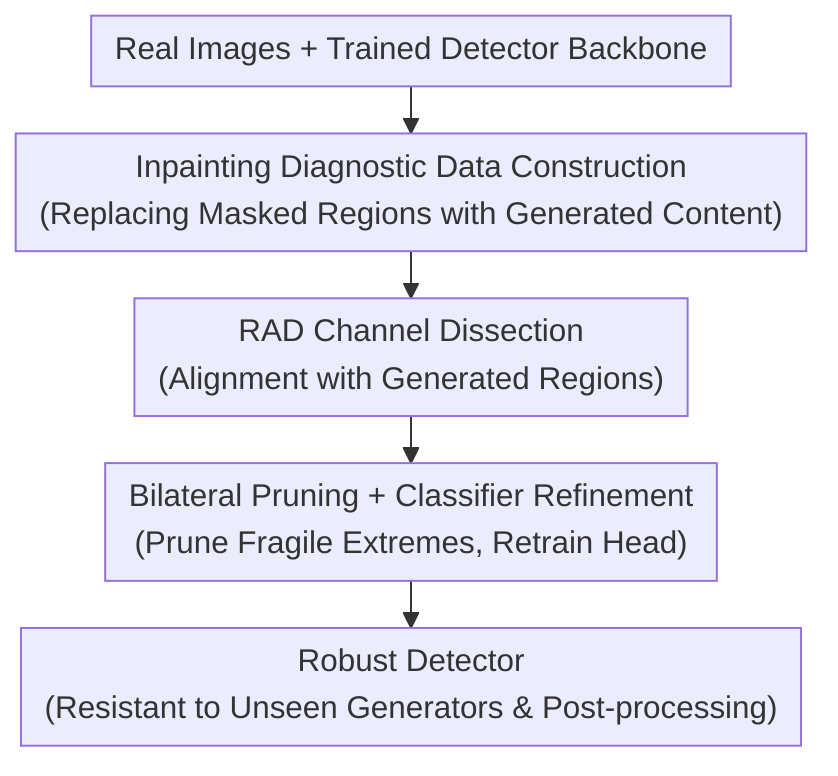

# Dissect and Prune: Enhancing Robustness in AI-Generated Image Detection

**Conference**: ICML 2026  
**arXiv**: [2606.10309](https://arxiv.org/abs/2606.10309)  
**Code**: https://github.com/dahyedahye/dear  
**Area**: AIGC Detection / Model Interpretability  
**Keywords**: AI-Generated Image Detection, Prediction Asymmetry, Network Dissection, Feature Pruning, Robustness

## TL;DR
Addressing the "prediction asymmetry" issue where existing AI-generated image (AIGI) detectors appear accurate but primarily classify images as real, this paper proposes DEAR. By using inpainting images as probes and "dissecting" the model based on the Regional Activation Discrepancy (RAD) between channel activations and generated areas, the method prunes extreme channels on both sides and retrains only the linear classification head. This forces the detector to discard fragile shortcut features, significantly enhancing robustness against unseen generators and post-processing.

## Background & Motivation

**Background**: Current AIGI detectors (CNN-based, CLIP-based, ViT-based, and frequency-domain-based) often report high AUC or accuracy on benchmarks, suggesting that the problem of AI-generated image detection has been largely "solved."

**Limitations of Prior Work**: The authors dissect these detectors and find that high performance is bolstered by **prediction asymmetry**. Models achieve near-perfect recognition of real images (high R.Acc) but exhibit extremely low sensitivity to generated images (F.Acc). For instance, Corvi's detector achieves 99.9% R.Acc on original FLUX images but only 21.5% F.Acc. After post-processing like JPEG compression or resizing, the average F.Acc of NPR drops from 95.9% to 12.2%, while R.Acc rises to 94.2%, effectively degrading into a trivial classifier that predicts everything as "real." Aggregated metrics like AUC completely mask this structural bias.

**Key Challenge**: The root cause is that detectors rely on **spurious correlations** rather than genuine generation traces. They learn two types of fragile shortcuts: one treats dataset-specific biases (e.g., WEBP/JPEG artifacts) as signs of "realness," and the other overfits to fingerprints unique to specific generators (low-rank traces, spectral biases). These signals are extrinsic to the image and are erased by post-processing, causing the detector to default to the "real" class.

**Goal**: To locate and eliminate specific feature channels encoding spurious correlations, forcing the detector to rely on truly robust forensic signals, thereby mitigating both poor generalization to unseen generators and performance collapse under post-processing.

**Key Insight**: To "dissect" a detector, a ground truth is needed that accurately distinguishes between activations on "generated traces" versus "real signals." The authors identify **inpainting images** as ideal probes. By replacing a masked region of a real image with generated content, "generated pixels" and "real pixels" are spatially separated within the same image, with the mask providing precise labels for pixel origins.

**Core Idea**: Borrowing from Network Dissection, the approach uses inpainting masks to quantify each channel's alignment with generated regions. Channels at both extremes (highly aligned with generated or highly aligned with real) are pruned, retaining only the stable forensic channels in the middle.

## Method

### Overall Architecture
DEAR (DissEct And pRune) is a feature selection framework applied to a **pre-trained detector backbone**. It does not retrain the backbone but modifies the final linear classification head. It follows three steps: first, generating diagnostic inpainting data using SD-1.5 to create coexistence of real and fake pixels; second, dissecting the last convolutional layer (2048 channels) based on the Regional Activation Discrepancy (RAD) relative to inpainted vs. background regions; third, performing bilateral pruning of extreme channels based on percentile thresholds and retraining the linear classifier (with the backbone frozen) using a joint optimization of the original training set and the inpaint diagnostic set. The output is a detector more robust to unseen generators and post-processing.

### Key Designs

**1. Inpainting Diagnostic Data: Merging Real and Generated Pixels as Ground Truth**

To identify which channels respond to generation traces versus real signals, a probe with spatially separated, known pixel origins is required. Standard real/fake images fail here as they are entirely one or the other. The authors use a Stable Diffusion 1.5 inpainting variant: for each real image $\mathbf{x}_{\text{real}}$, a random rectangular binary mask $\mathbf{M}\in\{0,1\}^{H\times W}$ is sampled. The model synthesizes content $\mathbf{x}_{\text{gen}}$ within the mask conditioned on the real context:

$$\mathbf{x}_{\text{inpaint}}=\mathbf{M}\odot\mathbf{x}_{\text{gen}}+(1-\mathbf{M})\odot\mathbf{x}_{\text{real}}$$

Gaussian blurring is applied to mask edges to prevent the detector from exploiting trivial edge discontinuities. The mask $\mathbf{M}$ serves as a precise spatial reference for Network Dissection.

**2. RAD Channel Dissection: Mapping Channels onto a "Generated ↔ Real" Spectrum**

Using inpaint images and masks, the authors quantify whether the $k$-th channel leans toward generated or real content. Assuming "piecewise constant" activations from the Chan-Vese model, they define **Regional Activation Discrepancy (RAD)**. Let $\mathbf{F}_k\in\mathbb{R}^{h\times w}$ be the activation map of the $k$-th channel. With $\Omega_{\text{in}}$ as the inpaint region and $\Omega_{\text{bg}}$ as the background:

$$S_k=\mu_{\text{in}}^{(k)}-\mu_{\text{bg}}^{(k)},\quad \mu_{\text{in}}^{(k)}=\frac{\sum_{x\in\Omega_{\text{in}}}\mathbf{F}_k(x)}{|\Omega_{\text{in}}|},\ \mu_{\text{bg}}^{(k)}=\frac{\sum_{x\in\Omega_{\text{bg}}}\mathbf{F}_k(x)}{|\Omega_{\text{bg}}|}$$

This normalized measure ensures the mask size does not bias the metric. A large positive $S_k$ indicates strong response to generated traces, while a large negative $S_k$ indicates a preference for real backgrounds. The critical discovery is that **alignment predicts robustness**: channels at both RAD extremes are the most fragile under post-processing (e.g., WEBP compression), whereas middle channels are significantly more stable.

**3. Bilateral Pruning + Classifier Refinement: Pruning Extremes and Retraining the Head**

Given that both extremes are fragile, a **bilateral pruning** strategy is employed. Based on lower/upper percentiles $\alpha_{\text{low}},\alpha_{\text{high}}$ of the RAD empirical distribution, thresholds $\tau_{\text{low}},\tau_{\text{high}}$ are calculated to create a binary mask:

$$m_k=\mathbb{1}[\tau_{\text{low}}\le S_k\le\tau_{\text{high}}]$$

This retains only robust middle channels. The mask is applied to the feature tensor via element-wise multiplication $\tilde{\mathbf{F}}=\mathbf{m}\odot\mathbf{F}$. Since this is feature selection on pre-trained representations, the backbone $\theta$ remains **frozen**. Only the final linear classifier $h_\phi$ is re-initialized and retrained using a joint loss on the **original training set $\mathcal{D}_{\text{train}}$ and the inpaint diagnostic set $\mathcal{D}_{\text{inpaint}}$**. This allows the classifier to adapt to the pruned feature space and recognize intrinsic generation traces at both global and local granularities.

### Loss & Training
The backbone is frozen; only the linear classification head is retrained on pruned features $\tilde{\mathbf{F}}$. Supervision comes from the union of original real/fake data and inpaint diagnostic data. Pruning thresholds, controlled by RAD percentiles $\alpha_{\text{low}},\alpha_{\text{high}}$, are the critical hyperparameters.

## Key Experimental Results

### Main Results
The evaluation covers 9 generators (SD, Midjourney, Kandinsky, FLUX, etc.) and 3 in-the-wild benchmarks (Chameleon, WildRF, LOKI). A key observation is that existing detectors collapse in F.Acc (fake image detection) while maintaining high R.Acc. DEAR primarily recovers F.Acc to mitigate this asymmetry. Representative results under the original setting (AUC / R.Acc / F.Acc, %):

| Detector | Type | FLUX AUC | FLUX R.Acc | FLUX F.Acc | Note |
|:---:|:---:|:---:|:---:|:---:|:---|
| UFD | CLIP | 21.5 | 95.1 | 0.1 | Fails to detect nearly any fake images |
| C2P-CLIP | CLIP | 49.9 | 93.0 | 8.0 | Typical asymmetry |
| RINE | ViT | 69.3 | 92.3 | 30.2 | Stronger baseline, still low F.Acc |

DEAR pulls up the F.Acc side significantly without sacrificing R.Acc.

### Ablation Study
The authors verify the relationship between RAD extremes and robustness:

| Configuration | Key Observation | Explanation |
|:---|:---|:---|
| Full DEAR (Bilateral) | Significant F.Acc recovery | Prunes both real-side and fake-side shortcuts |
| Positive/Negative Only | Only partial relief of spurious correlations | Fails to treat compression bias and fingerprints simultaneously |
| No Pruning (Original) | F.Acc collapse under post-processing | Reliance on fragile shortcuts |

### Key Findings
- **RAD Extremes = Fragile Shortcuts**: Negative extremes correspond to "pseudo-real" signals like compression artifacts, while positive extremes correlate with overfitted generator fingerprints. Both are easily erased by post-processing.
- **Asymmetry is a Structural Issue**: High AUC can mask an inability to detect fake images. R.Acc and F.Acc must be analyzed separately.
- **Lightweight**: The method significantly improves robustness without retraining large models, as the backbone remains frozen.

## Highlights & Insights
- **Clever Diagnostic Tool**: Using inpainting to place "real" and "fake" pixels in the same image with a precise mask builds a bridge for applying interpretability tools (Network Dissection) to forensic detection.
- **Alignment Predicts Robustness**: Mapping channel fragility (MSE under perturbation) to semantic alignment offers a paradigm (dissect then prune) applicable to other tasks with shortcut learning.
- **Symmetry**: While many works focus on the "fake" side, this paper highlights that "real"-side compression biases are equally lethal and require bilateral pruning.

## Limitations & Future Work
- Diagnostic data depends on an inpainting model; random rectangular masks may differ from the spatial morphology of genuine generation traces.
- Pruning thresholds $\alpha_{\text{low}}, \alpha_{\text{high}}$ are critical hyperparameters whose sensitivity across different architectures requires more systematic analysis.
- While validated on CNN backbones like ResNet-50, the application of "channel alignment" to global token representations in ViT/CLIP warrants further exploration.

## Related Work & Insights
- **vs. Network Dissection (Bau et al.)**: While the original used IoU for high-level concepts, this work uses RAD for generation regions as a pruning criterion.
- **vs. Shortcut Removal (Rajan & Lee, etc.)**: These works identify compression artifacts as "real" cues; DEAR provides an actionable "measure alignment $\rightarrow$ prune bilateral extremes" mechanism.
- **vs. Feature Engineering (Yan et al.)**: Instead of manually designing robust features, DEAR adopts a "subtraction" approach by removing non-robust ones from existing detectors.

## Rating
- Novelty: ⭐⭐⭐⭐ Innovative use of inpainting probes for forensic dissection.
- Experimental Thoroughness: ⭐⭐⭐⭐ Wide coverage of generators and benchmarks.
- Writing Quality: ⭐⭐⭐⭐ Logical flow from asymmetry to RAD-based pruning.
- Value: ⭐⭐⭐⭐ Addresses structural biases hidden by aggregate metrics.

<!-- RELATED:START -->

## Related Papers

- [\[CVPR 2026\] PPM-CLIP: Probabilistic Prompt Modeling for Generalizable AI-Generated Image Detection](../../CVPR2026/aigc_detection/ppm-clip_probabilistic_prompt_modeling_for_generalizable_ai-generated_image_dete.md)
- [\[ICLR 2026\] All Patches Matter, More Patches Better: Enhance AI-Generated Image Detection via Panoptic Patch Learning](../../ICLR2026/aigc_detection/all_patches_matter_more_patches_better_enhance_ai-generated_image_detection_via_.md)
- [\[ICML 2026\] On the Salience of Low-Probability Tokens for AI-Generated Text Detection: A Multiscale Uncertainty Perspective](on_the_salience_of_low-probability_tokens_for_ai-generated_text_detection_a_mult.md)
- [\[ICML 2026\] Feature-Augmented Transformers for Robust AI-Text Detection Across Domains and Generators](feature-augmented_transformers_for_robust_ai-text_detection_across_domains_and_g.md)
- [\[CVPR 2026\] Enabling Supervised Learning of Generative Signatures for Generalized AI-Generated Images Detection](../../CVPR2026/aigc_detection/enabling_supervised_learning_of_generative_signatures_for_generalized_ai-generat.md)

<!-- RELATED:END -->
