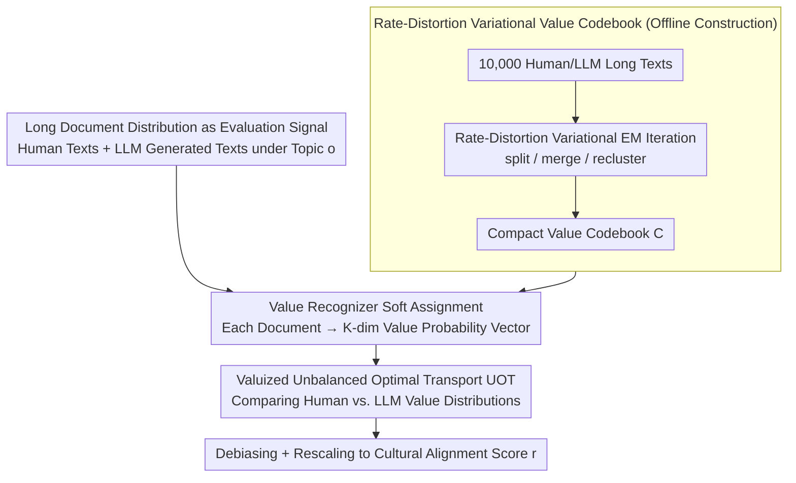

# Distributional Open-Ended Evaluation of LLM Cultural Value Alignment Based on Value Codebook

**Conference**: ICML 2026  
**arXiv**: [2604.06210](https://arxiv.org/abs/2604.06210)  
**Code**: None  
**Area**: LLM Alignment / Cultural Value Evaluation  
**Keywords**: Cultural Alignment, Value Evaluation, Value Codebook, Rate-Distortion, Unbalanced Optimal Transport  

## TL;DR
DOVE utilizes rate-distortion variational optimization to automatically construct a compact "Value Codebook" from 10,000 human texts. It then uses Unbalanced Optimal Transport (UOT) to measure distribution differences between human and LLM long-form texts in the value space, improving the "Evaluation-Downstream Task" correlation from $\le 24\%$ in baselines to $31.56\%$ across 12 LLMs.

## Background & Motivation

**Background**: Existing LLM cultural value evaluations either directly adopt social science questionnaires (WVS, Hofstede) or use multiple-choice questions (MCQs) written by humans/LLMs to let models select the option closest to a specific culture. A few generative works only extract keywords from open responses or use LLMs as judges for scoring.

**Limitations of Prior Work**: The authors summarize the limitations of this line of work into a unified **C³ challenge** (Construct / Composition / Context gaps): (1) Construct gap: Discriminative MCQs only test "value knowledge"; a correct answer does not imply a true value tendency, and they are highly sensitive to option framing and social desirability bias. (2) Composition gap: Averaging item scores into a total score completely erases the "heterogeneity of sub-groups within the same culture." (3) Context gap: Restricted MCQs are severely misaligned with the open-ended long-text generation scenarios where LLMs are actually deployed.

**Key Challenge**: Faithfully characterizing the "value tendency expressed by an LLM when facing a specific culture" essentially involves comparing two **long-text distributions** (human-written vs. LLM-written). However, long texts contain both value signals and a large amount of value-irrelevant content. Traditional questionnaires cannot handle this, bag-of-words/rules are inaccurate, and pure LLM-as-judge is unstable.

**Goal**: Construct an open-ended distribution-level evaluation framework that does not rely on pre-defined value systems or option framing, filling all three C³ gaps simultaneously while providing stronger predictive power for downstream real-world tasks.

**Key Insight**: Borrowing the "coding" tradition from social science—which compresses long documents into a set of discrete "value codes"—the authors frame this as a lossy compression problem. Thus, a value codebook can be automatically learned using **Rate-Distortion Theory** + **VQ-VAE style variational optimization**. Distribution comparison is then performed using **Unbalanced Optimal Transport (UOT)**, which preserves geometric structure while tolerating mass mismatches caused by sub-groups.

**Core Idea**: Reformulate "Evaluating LLM cultural alignment" as "comparing two distributions via UOT distance on an automatically learned value codebook."

## Method

### Overall Architecture
The core problem DOVE addresses is "how close the value tendency expressed by an LLM in a specific cultural context is to that of humans," translating this into a distribution comparison problem. Given a target culture $\bm g$ (e.g., Japan) and a target LLM $p_{\bm\theta}$, it first collects human long texts $\hat p^{\bm g}(\bm x)$ and LLM-generated long texts $p_{\bm\theta}(\bm x|\bm o)$ on the same topic $\bm o$. Then, it projects each document into a $K$-dimensional value probability vector over a set of compact, automatically learned **Value Codebooks** $\mathcal{\bm C}=(\bm c_1,\dots,\bm c_K)$. Finally, it uses Unbalanced Optimal Transport (UOT) to measure the distance between the human-side distribution $\bm a^{\bm g}$ and the LLM-side distribution $\bm a^{\bm\theta}$, rescaling it into an alignment score. The entire process requires no fine-tuning of LLM parameters; the value recognizer $q_{\bm\omega}$ and reconstructor $p_{\bm\phi}$ are black-box calls, and the codebook is obtained via ICL + Variational EM iterations.

### Key Designs

**1. Rate-Distortion Variational Value Codebook: Leaving the "Which Value System to Use" Question to the Data**

Traditional value evaluations are either tied to prior systems like Schwartz/Hofstede (introducing researcher bias) or rely on LLMs to extract keywords (noisy and prone to repeating value-irrelevant semantics), which is the root of the Construct gap. DOVE treats the mapping from "document $\bm x$ → value code sequence $\bm s$" as a lossy compression, treating the codebook as discrete latents in VQ-VAE. This allows a compact, informative, and low-redundancy set of value codes to emerge from unlabeled long texts as a common "coordinate system."

Specifically, an ELBO is derived: $\mathbb E_{\hat p(\bm x)}[\log p(\bm x|\mathcal{\bm C})] \ge \mathbb E_{\hat p(\bm x)}\{\mathbb E_{q_{\bm\omega}}[\log p(\bm x|\bm s,\mathcal{\bm C})] - \mathrm{KL}[q_{\bm\omega}\|p(\bm s|\mathcal{\bm C})]\}$. Rate-distortion regularization is added to obtain the final objective (Eq. 3), consisting of three terms: an information retention term $-\log p_{\bm\phi}(\bm x|\bm s,\mathcal{\bm C})$ to ensure codes can reconstruct the original text, a single-document code entropy term $-\beta_1 H_q(\bm s|\bm x,\mathcal{\bm C})$ to encourage multi-code usage per document, and a prior entropy term $\beta_2 H_q(\bm s|\mathcal{\bm C})$ to encourage uniform usage of all codes. By explicitly incorporating "information retention" and "redundancy reduction," the codebook is forced to preserve value signals without piling up redundant dimensions. Optimization uses a Variational EM-style black-box approach: each round samples $N_1$ sets of codes $\bm s_j$ to estimate the codebook score $\mathcal S(\mathcal{\bm C}^{t-1})$, then refreshes the codebook using three atomic actions (Algorithm 1)—**Extension** (splitting codes with high counts and distortion), **Merge** (combining low-utilization codes), and **re-creation** (re-clustering). The value recognizer $q_{\bm\omega}$ extracts $M'$ natural language value phrases $\bm v$, and performs soft assignment $q_{\bm\omega}(z=k|\bm x,\mathcal{\bm C})=\frac{1}{M'}\sum_j \mathrm{softmax}_{\mathcal{\bm C}}[\mathrm{sim}(\bm e_{\bm v_j},\bm e_{\bm c_k})/\sigma^2]$ instead of hard arg-max to suppress noise.

**2. Valuized Unbalanced Optimal Transport Metric: Letting Distribution Shape Speak Over Means**

After addressing the Construct gap, the Composition gap remains—averaging scores (as in WVS/CDEval) collapses "value disagreements between different sub-groups within the same culture" into a single mean, losing critical distribution shape information. DOVE treats $K$ value codes as centers in the transport space and uses UOT to compare $\bm a^{\bm g}$ and $\bm a^{\bm\theta}$: $\mathcal D_{\mathrm{UOT}}(\hat p^{\bm g},p_{\bm\theta})=\min_{\bm\pi\ge 0}\sum_{i,j}[D_{i,j}\bm\pi_{i,j}+\epsilon\bm\pi_{i,j}(\log\bm\pi_{i,j}-1)]+\gamma\mathrm{KL}[\bm\pi\bm 1\|\bm a^{\bm g}]+\gamma\mathrm{KL}[\bm\pi^T\bm 1\|\bm a^{\bm\theta}]$. UOT is preferred over KL or standard OT because KL fails with zero-mass terms, while UOT allows the total mass on both sides to be inconsistent, fitting the reality that LLMs and humans may have structural vacancies in certain value codes, while retaining Wasserstein's geometric properties.

The design of the cost matrix $D_{i,j}$ is critical: it calculates semantic distance $\rho(\bm c_i,\bm c_j)$ multiplied by a **co-occurrence discount** $1-\mathbb E[\min(\bm a_i,\bm a_j)]/(\mathbb E[\max(\bm a_i,\bm a_j)]+\epsilon_2)$. If two values frequently co-occur in human documents, their transport cost is reduced. This aligns with the intuition that replacing values that are semantically similar and frequently coexist is reasonable, avoiding the overestimation of cultural differences common in pure semantic OT. Solving via Unbalanced Sinkhorn iterations, the final score $r=(0.1-\mathcal D_{\mathrm{UOT}})\times 10$ is rescaled after debiasing.

**3. Long Document Distribution as Evaluation Signal: Aligning Medium with Deployment**

The third Context gap arises from the evaluation medium: restricted options and averaged scoring naturally limit value richness and misalign with open-ended generation deployment. DOVE abandons MCQs and Likert scales, conditioning on a topic $\bm o$ (e.g., "the role of money in life") and allowing the LLM to generate long texts $\bm x\sim p_{\bm\theta}(\bm x|\bm o)$ like essays or blogs. Comparing these distributions mirrors the psychological observation that "writing reflects personality," providing more stable signals and aligning the evaluation signal with the deployment medium. To support this, the authors constructed the **DOVE Set**: covering KR/JP/CN/US cultures, 824 value-oriented topics, and 15,213 human long documents (averaging 1,034 tokens), manually filtered for quality and relevance.

### Loss & Training
DOVE does not update any target LLM parameters. $q_{\bm\omega}$ utilizes GPT-5.2, $p_{\bm\phi}$ uses GPT-4.1 nano, and embeddings use OpenAI text-embedding-3-large. Codebook optimization is an iterative Variational EM process: fixing $\mathcal{\bm C}^{t-1}$ to estimate $\mathcal S(\mathcal{\bm C}^{t-1})$, then applying split/merge/recluster to obtain $\mathcal{\bm C}^t$ until convergence or $T=10$ rounds. Hyperparameters: $N_1=3,N_2=1,\beta_1=0.3,\beta_2=0.08,\tau_1=1.0$. Training corpus includes $N=10,676$ mixed documents from humans and GPT-4o/DeepSeek-v3.1/Llama-4-Maverick.

## Key Experimental Results

### Main Results (Validity Comparison)

| Method | $\Delta^{\bm g}\uparrow$ Value Priming | $\delta_{\text{con}}$ Convergent | $\delta_{\text{dis}}\uparrow$ Discriminant | Avg. Downstream Corr. $\uparrow$ |
|------|---:|---:|---:|---:|
| WVS | 0.08% | -9.76% | 0.98% | 16.20% |
| GOQA | -1.56% | -17.95% | -2.05% | -13.05% |
| CDEval | 0.76% | -14.40% | 1.79% | 23.56% |
| NormAd | 4.25% | -1.57% | -23.70% | 0.90% |
| NaVAB | -1.15% | 4.43% | -88.00% | -20.77% |
| **DOVE** | **5.60%** | **6.00%** | 0.89% | **31.56%** |

Across 12 LLMs and 4 cultures, DOVE's predictive correlation on downstream "cultural harmful content detection" tasks (e.g., KOLD, HateXplain) reached 31.56%, 1.3x that of the runner-up CDEval. Several baselines yielded negative correlations, suggesting their evaluation results have little indicative value for real-world deployment.

### Ablation Study

| Dimension | DOVE Performance | Description |
|------|----------|------|
| Sampling Reliability (Cronbach $\alpha$) | High | Stable after 500 documents per culture |
| Test–retest Stability | High | Consistent scores across three independent runs |
| Template Invariance | High | Robust to prompt template changes, outperforming WVS/NormAd |
| Topic Robustness | > Baselines at 300 topics | More efficient than typical large-scale LLM benchmarks |
| Codebook Size Sensitivity | $\mathcal S(\mathcal{\bm C})$ correlates with validity | Small capacity vs. large redundancy tradeoff verifies R1+R2 design |

### Key Findings
- All restricted methods (WVS/GOQA/CDEval/NormAd) showed negative convergent validity—meaning their scores contradict each other. Questionnaires and MCQs fail to reach consensus on "measuring the same thing"; only DOVE achieved a positive range.
- NaVAB's discriminant validity dropped to -88%, attributed to its reliance on human-written reference statements and inability to distinguish culture similarity structures; this highlights the advantage of "Open Generation + Automatic Codebook" over "Open Generation + Pre-defined References."
- In Value Priming experiments (injecting cultural ICL to see if scores rise), only DOVE and NormAd showed significant positive $\Delta^{\bm g}$, with DOVE showing the cleanest directionality and the largest negative $\Delta^{\bm g^-}=-5.38\%$ for opposing cultures.

## Highlights & Insights
- Reformulating "evaluation design" as "rate-distortion lossy compression + Optimal Transport" is the most striking aspect—it bypasses the unresolvable social science debate over "which value system to use" by borrowing mature tools from representation learning.
- The "co-occurrence discount" in the cost matrix is ingenious: OT based solely on semantic similarity tends to overestimate cultural differences. Introducing data-driven co-occurrence brings the metric closer to "cultural semantic geometry," a trick transferable to any "concept distribution" comparison (e.g., persona or style evaluation).
- The black-box iteration (ICL + Variational EM) without fine-tuning makes the entire pipeline LLM-agnostic; as LLMs improve, the "evaluator" automatically upgrades without a baseline redesign.

## Limitations & Future Work
- The evaluation still relies heavily on the GPT-5.2 / GPT-4.1 nano / OpenAI embedding toolchain. The "value perspective" implicit in the codebook may carry biases from the evaluator LLM itself, creating a circular risk when evaluating LLMs.
- Coverage is limited to 4 "national" cultures (KR/JP/CN/US); the capacity to capture sub-cultures or trans-regional sub-groups remains implicitly validated through UOT's heterogeneity support but not directly tested on the DOVE Set.
- Downstream "predictive validity" uses hate/harmful text detection as a proxy; whether the 31.56% correlation holds for other tasks like creative preference or ethics remains to be seen.
- Future directions: Expanding the codebook to multiple levels (universal → cultural → sub-group) and using contrastive objectives to emphasize cross-cultural distinctions; replacing $q_{\bm\omega}$ with open-source models to break the "closed-source LLM evaluating closed-source LLM" loop.

## Related Work & Insights
- **vs. WVS / GOQA / CDEval**: These measure "value knowledge" via questionnaires/MCQs, while DOVE measures "value tendency" via long-text distributions; DOVE's downstream correlation is 8–44 pp higher, driven by the evaluation medium.
- **vs. NaVAB**: Also uses open generation but relies on human-written references, leading to significant reference bias (-88% discriminant validity); DOVE uses self-learned codebooks to abstract references into a data-driven set of codes.
- **vs. LLM-as-a-judge (Shi 2024, Mushtaq 2025)**: Those methods use direct LLM scoring, which is affected by judge model sentiment/framing; DOVE decomposes "judgment" into "identifying codes + calculating distribution distance," with every step constrained by rate-distortion objectives for improved interpretability and reproducibility.
- **Insight**: Any evaluation of "alignment between model and human behavior" (personality, style, safety, domain-specific) can adopt the "self-learned discrete codes + OT distribution comparison" paradigm, which reflects group distribution structures better than aggregate scores.

## Rating
- Novelty: ⭐⭐⭐⭐⭐ Uses Rate-Distortion + UOT to comprehensively address the three C³ gaps in a clean methodology.
- Experimental Thoroughness: ⭐⭐⭐⭐ 12 LLMs × 4 Cultures × 5 Baselines + Reliability tests + Codebook visualization with a 15K document set; lacks "blind human evaluation of codebook quality."
- Writing Quality: ⭐⭐⭐⭐⭐ The C³ framework is solid, and the mathematical derivations and algorithms are cohesive and reproducible.
- Value: ⭐⭐⭐⭐⭐ Provides a truly scalable framework for LLM cultural alignment evaluation; the DOVE Set itself is a scarce resource with significant drive for the alignment community.

<!-- RELATED:START -->

## Related Papers

- [\[NeurIPS 2025\] Can LLMs Write Faithfully? An Agent-Based Evaluation of LLM-generated Islamic Content](../../NeurIPS2025/aigc_detection/can_llms_write_faithfully_an_agent-based_evaluation_of_llm-generated_islamic_con.md)
- [\[CVPR 2025\] SGC-Net: Stratified Granular Comparison Network for Open-Vocabulary HOI Detection](../../CVPR2025/aigc_detection/sgc-net_stratified_granular_comparison_network_for_open-vocabulary_hoi_detection.md)
- [\[ICML 2026\] Black-Box Detection of LLM-Generated Text Using Generalized Jensen-Shannon Divergence](black-box_detection_of_llm-generated_text_using_generalized_jensen-shannon_diver.md)
- [\[ACL 2026\] Temporal Flattening in LLM-Generated Text: Comparing Human and LLM Writing Trajectories](../../ACL2026/aigc_detection/temporal_flattening_in_llm-generated_text_comparing_human_and_llm_writing_trajec.md)
- [\[ICML 2026\] LLM Self-Recognition: Steering and Retrieving Activation Signatures](llm_self-recognition_steering_and_retrieving_activation_signatures.md)

<!-- RELATED:END -->
