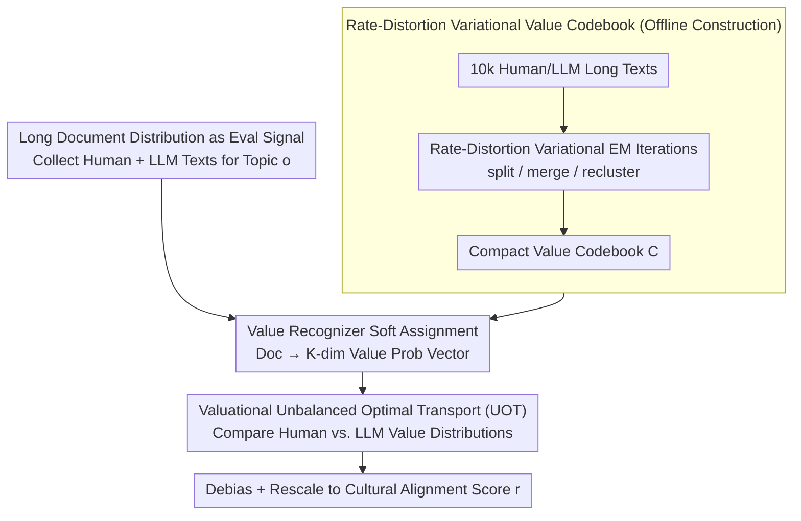

# Distributional Open-Ended Evaluation of LLM Cultural Value Alignment Based on Value Codebook

**Conference**: ICML 2026  
**arXiv**: [2604.06210](https://arxiv.org/abs/2604.06210)  
**Code**: None  
**Area**: LLM Alignment / Cultural Value Evaluation  
**Keywords**: Cultural Alignment, Value Evaluation, Value Codebook, Rate-Distortion, Unbalanced Optimal Transport

## TL;DR
DOVE automatically constructs a compact "value codebook" from 10,000 human texts using rate-distortion variational optimization, then measures the distributional difference between human and LLM long-form texts in the value space via Unbalanced Optimal Transport. Across 12 LLMs, it improves the "evaluation-downstream task" correlation from $\le 24\%$ to 31.56%.

## Background & Motivation

**Background**: Existing LLM cultural value evaluations either directly apply social science questionnaires (WVS, Hofstede) or use multiple-choice questions (MCQs) written by humans/LLMs to let models select the option closest to a specific culture. A few generative approaches merely extract keywords or use LLMs as judges to score open-ended responses.

**Limitations of Prior Work**: The authors summarize these issues into the **C³ challenge** (Construct / Composition / Context gaps): (1) Construct gap: Discriminative MCQs only test "value knowledge"; correct answers do not imply true value tendencies, and they are sensitive to option framing and social desirability bias. (2) Composition gap: Averaging item scores into a total score completely flattens the "heterogeneity within cultural sub-groups." (3) Context gap: Constrained MCQs are severely misaligned with the open-ended long-text generation scenarios where LLMs are actually deployed.

**Key Challenge**: Faithfully characterizing the "value tendency expressed by an LLM in a cultural context" essentially requires comparing two **long-text distributions** (human-written vs. LLM-generated). However, long texts contain both value signals and substantial value-irrelevant content. Traditional questionnaires cannot handle this, Bag-of-Words/rule-based methods are inaccurate, and pure LLM-as-a-judge is unstable.

**Goal**: Construct an open-ended distribution-level evaluation framework that does not rely on pre-defined value systems or option framing, filling all three C³ gaps and providing stronger predictive power for real downstream tasks.

**Key Insight**: Borrow the tradition of "coding" from social sciences—compressing long documents into a set of discrete "value codes"—and treat it as a lossy compression problem. This allows the use of **Rate-Distortion theory** + **VQ-VAE style variational optimization** to automatically learn a value codebook. Distributional comparison is handled via **Unbalanced Optimal Transport (UOT)**, which preserves geometric structure while tolerating mass mismatch caused by sub-groups.

**Core Idea**: Reformulate "Evaluating LLM Cultural Alignment" as "Comparing two distributions via UOT distance on an automatically learned value codebook."

## Method

### Overall Architecture
The core question DOVE answers is "how close is the value tendency expressed by an LLM in a cultural context to that of real humans," framing it as a distribution comparison problem. Given a target culture $\bm g$ (e.g., Japan) and a model $p_{\bm\theta}$, it first collects human long texts $\hat p^{\bm g}(\bm x)$ and LLM-generated texts $p_{\bm\theta}(\bm x|\bm o)$ on identical topics $\bm o$. Each document is then projected onto a compact, automatically learned **value codebook** $\mathcal{\bm C}=(\bm c_1,\dots,\bm c_K)$ as a $K$-dimensional value probability vector. Finally, Unbalanced Optimal Transport (UOT) measures the distance between the human distribution $\bm a^{\bm g}$ and the LLM distribution $\bm a^{\bm\theta}$, rescaled into an alignment score. The process does not fine-tune any LLM parameters; the value recognizer $q_{\bm\omega}$ and reconstructor $p_{\bm\phi}$ are black-box calls, and the codebook is derived via ICL + variational EM iterations.

### Key Designs

**1. Rate-Distortion Variational Value Codebook: Letting Data Define the Value System**

Traditional evaluations fixate on a priori systems like Schwartz/Hofstede (inducing researcher bias) or rely on LLM keyword extraction (noisy and redundant), causing the Construct gap. DOVE treats the mapping "Document $\bm x$ → Value Code Sequence $\bm s$" as lossy compression, using the codebook as discrete latent variables in a VQ-VAE. A compact, informative, low-redundancy set of value codes emerges from unlabeled long texts as a common "coordinate system."

The ELBO is derived as: $\mathbb E_{\hat p(\bm x)}[\log p(\bm x|\mathcal{\bm C})] \ge \mathbb E_{\hat p(\bm x)}\{\mathbb E_{q_{\bm\omega}}[\log p(\bm x|\bm s,\mathcal{\bm C})] - \mathrm{KL}[q_{\bm\omega}\|p(\bm s|\mathcal{\bm C})]\}$. Adding rate-distortion regularization yields the target (Eq. 3) with three terms: an information preservation term $-\log p_{\bm\phi}(\bm x|\bm s,\mathcal{\bm C})$ ensuring codes can reconstruct the original, a per-document code entropy term $-\beta_1 H_q(\bm s|\bm x,\mathcal{\bm C})$ encouraging multi-code usage per document, and a prior entropy term $\beta_2 H_q(\bm s|\mathcal{\bm C})$ encouraging uniform code distribution. Black-box optimization follows a Variational EM style: $N_1$ code sets $\bm s_j$ are sampled to estimate the score $\mathcal S(\mathcal{\bm C}^{t-1})$, and the codebook is refreshed via three atomic actions (Algorithm 1)—**Extension** (split high-distortion codes), **Merge** (combine low-usage codes), and **Re-creation** (re-clustering). For projection, $q_{\bm\omega}$ extracts $M'$ natural language value phrases $\bm v$ and performs soft assignment via $q_{\bm\omega}(z=k|\bm x,\mathcal{\bm C})=\frac{1}{M'}\sum_j \mathrm{softmax}_{\mathcal{\bm C}}[\mathrm{sim}(\bm e_{\bm v_j},\bm e_{\bm c_k})/\sigma^2]$.

**2. Valuational Unbalanced Optimal Transport: Letting Distribution Shape Speak**

To solve the Composition gap, DOVE uses UOT to compare $\bm a^{\bm g}$ and $\bm a^{\bm\theta}$ across $K$ value codes. The objective is $\mathcal D_{\mathrm{UOT}}(\hat p^{\bm g},p_{\bm\theta})=\min_{\bm\pi\ge 0}\sum_{i,j}[D_{i,j}\bm\pi_{i,j}+\epsilon\bm\pi_{i,j}(\log\bm\pi_{i,j}-1)]+\gamma\mathrm{KL}[\bm\pi\bm 1\|\bm a^{\bm g}]+\gamma\mathrm{KL}[\bm\pi^T\bm 1\|\bm a^{\bm\theta}]$. Unlike KL-divergence, which fails on zero-mass terms, UOT allows total masses to be inconsistent, accommodating cases where LLMs or humans lack certain value codes entirely while retaining the geometric properties of Wasserstein distance.

The cost matrix $D_{i,j}$ incorporates a **co-occurrence discount**: $1-\mathbb E[\min(\bm a_i,\bm a_j)]/(\mathbb E[\max(\bm a_i,\bm a_j)]+\epsilon_2)$. If two values frequently co-occur in human texts, their transport cost is reduced. This aligns with the intuition that values appearing together are substitutes, preventing pure semantic OT from overestimating cultural differences between synonyms that appear in different contexts. The score is debiased via $\mathcal D_{\mathrm{UOT}}\leftarrow \hat{\mathcal D}_{\mathrm{UOT}}(\hat p^{\bm g},p_{\bm\theta})-\tfrac12\hat{\mathcal D}_{\mathrm{UOT}}(\hat p^{\bm g},\hat p^{\bm g})-\tfrac12\hat{\mathcal D}_{\mathrm{UOT}}(p_{\bm\theta},p_{\bm\theta})$ and rescaled to $(0.1-\mathcal D_{\mathrm{UOT}})\times 10$.

**3. Long Document Distribution as Evaluation Signal: Aligning Medium with Deployment**

The Context gap is addressed by using open-ended generation. Rather than MCQs or Likert scales, LLMs are prompted with topics $\bm o$ (e.g., "The role of money in life") to generate essays/blogs $\bm x\sim p_{\bm\theta}(\bm x|\bm o)$. Long texts exhibit more stable value signals than short answers, aligning the evaluation medium with actual deployment scenarios. The authors constructed **DOVE Set**: 824 topics across KR/JP/CN/US, with 15,213 human documents (avg. 1,034 tokens).

### Loss & Training
DOVE does not update LLM parameters. $q_{\bm\omega}$ uses GPT-5.2, $p_{\bm\phi}$ uses GPT-4.1 nano, and embeddings use OpenAI text-embedding-3-large. Codebook optimization involves $T=10$ iterations of Variational EM. Hyperparameters: $N_1=3,N_2=1,\beta_1=0.3,\beta_2=0.08,\tau_1=1.0$. Training corpus contains $N=10,676$ mixed documents from humans and various LLMs (GPT-4o, DeepSeek-v3.1, Llama-4-Maverick).

## Key Experimental Results

### Main Results (Validity Comparison)

| Method | $\Delta^{\bm g}\uparrow$ Value Priming | $\delta_{\text{con}}$ Convergent | $\delta_{\text{dis}}\uparrow$ Discriminant | Avg. Downstream Corr. $\uparrow$ |
|------|---:|---:|---:|---:|
| WVS | 0.08% | -9.76% | 0.98% | 16.20% |
| GOQA | -1.56% | -17.95% | -2.05% | -13.05% |
| CDEval | 0.76% | -14.40% | 1.79% | 23.56% |
| NormAd | 4.25% | -1.57% | -23.70% | 0.90% |
| NaVAB | -1.15% | 4.43% | -88.00% | -20.77% |
| **DOVE** | **5.60%** | **6.00%** | 0.89% | **31.56%** |

Across 12 LLMs and 4 cultures, DOVE achieves an average correlation of 31.56% with downstream "cultural harmful content detection" tasks (e.g., KOLD, HateXplain), 1.3 times higher than the best baseline (CDEval). Many baselines show negative correlations, indicating their results have little predictive value for real deployment.

### Ablation Study

| Dimension | DOVE Performance | Description |
|------|----------|------|
| Sample Reliability (Cronbach α) | High | Stability reached with 500 documents per culture. |
| Test–retest Stability | High | Consistent scores across three independent runs. |
| Template Invariance | High | Robust to prompt template changes, outperforming WVS/NormAd. |
| Topic Efficiency | High | 300 topics suffice to outperform all baselines. |
| Codebook Sensitivity | Positive | $\mathcal S(\mathcal{\bm C})$ correlates with validity; validates R1+R2 design. |

### Key Findings
- All constrained methods (WVS, GOQA, CDEval, NormAd) exhibit negative convergent validity, meaning their scores contradict each other. DOVE is the only one to achieve a positive value.
- NaVAB's discriminant validity is -88%, attributed to its reliance on human-written reference statements; this proves the advantage of automated codebooks over pre-defined references.
- In value priming experiments, only DOVE and NormAd show significant positive $\Delta^{\bm g}$ when injecting cultural context. DOVE also shows the cleanest directionality with the largest negative $\Delta^{\bm g^-}$ for opposite cultures.

## Highlights & Insights
- Reformulating evaluation as "Rate-Distortion Compression + Optimal Transport" neatly sidesteps the sociological debate over "correct" value systems by using representation learning tools.
- The "co-occurrence discount" in the cost matrix prevents overestimating differences by acknowledging that semantically distinct codes often appear together in real human expression.
- The use of ICL + Variational EM for codebook learning ensures the pipeline is LLM-agnostic and upgrades automatically as foundation models improve.

## Limitations & Future Work
- Heavy reliance on the GPT-5.2/GPT-4.1 nano toolchain introduces circular risk, where the "evaluator" perspective might be inherent to those closed-source models.
- Limited to "national" granularity (KR/JP/CN/US); the ability to capture sub-cultures or cross-regional groups remains to be verified.
- Downstream validity relies on harmful text detection as a proxy; relevance to other tasks like creative preference or ethics is unknown.
- Future Work: Extend codebooks to hierarchical levels (universal → cultural → sub-group) and transition $q_{\bm\omega}$ to open-source models.

## Related Work & Insights
- **vs WVS / GOQA / CDEval**: These measures "value knowledge," while DOVE measures "value tendency" through long-form distributions, leading to 8–44 pp higher downstream correlation.
- **vs NaVAB**: Both use open-ended generation, but NaVAB's human-written references lead to severe reference bias. DOVE's data-driven codes resolve this.
- **vs LLM-as-a-judge (Shi 2024)**: Traditional generative judges are influenced by model bias and framing; DOVE decomposes judgment into "code identification + distribution distance," making it more interpretable and reproducible.
- **Insight**: This paradigm (distributed comparison on self-learned discrete codes) is applicable to any alignment evaluation involving persona, style, or safety where populations, rather than single data points, are being compared.

## Rating
- Novelty: ⭐⭐⭐⭐⭐ Elegant integration of rate-distortion and UOT to solve the C³ gaps.
- Experimental Thoroughness: ⭐⭐⭐⭐ Extensive cross-model and cross-culture verification; only lacks human blind-testing of the codebook.
- Writing Quality: ⭐⭐⭐⭐⭐ Logical C³ framework and clear algorithmic derivations.
- Value: ⭐⭐⭐⭐⭐ Provides a scalable framework and a scarce dataset (DOVE Set) for the alignment community.

<!-- RELATED:START -->

## Related Papers

- [\[NeurIPS 2025\] Can LLMs Write Faithfully? An Agent-Based Evaluation of LLM-generated Islamic Content](../../NeurIPS2025/aigc_detection/can_llms_write_faithfully_an_agent-based_evaluation_of_llm-generated_islamic_con.md)
- [\[CVPR 2025\] SGC-Net: Stratified Granular Comparison Network for Open-Vocabulary HOI Detection](../../CVPR2025/aigc_detection/sgc-net_stratified_granular_comparison_network_for_open-vocabulary_hoi_detection.md)
- [\[ICML 2026\] Black-Box Detection of LLM-Generated Text Using Generalized Jensen-Shannon Divergence](black-box_detection_of_llm-generated_text_using_generalized_jensen-shannon_diver.md)
- [\[ACL 2026\] Temporal Flattening in LLM-Generated Text: Comparing Human and LLM Writing Trajectories](../../ACL2026/aigc_detection/temporal_flattening_in_llm-generated_text_comparing_human_and_llm_writing_trajec.md)
- [\[AAAI 2026\] Optimized Algorithms for Text Clustering with LLM-Generated Constraints](../../AAAI2026/aigc_detection/optimized_algorithms_for_text_clustering_with_llm-generated_constraints.md)

<!-- RELATED:END -->
