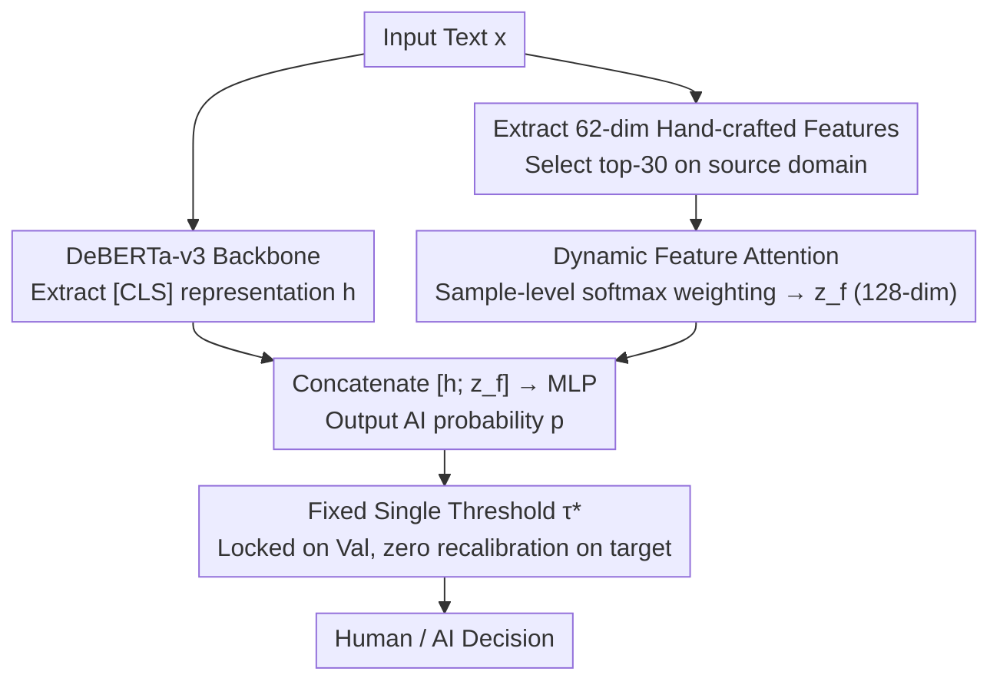

# Feature-Augmented Transformers for Robust AI-Text Detection Across Domains and Generators

**Conference**: ICML 2026  
**arXiv**: [2605.03969](https://arxiv.org/abs/2605.03969)  
**Code**: No public link  
**Area**: AI-Generated Content Detection / NLP / Robustness Evaluation  
**Keywords**: AI text detection, DeBERTa-v3, feature attention, distribution shift, fixed threshold protocol

## TL;DR
This paper systematically exposes the vulnerability of AI text detectors under cross-dataset and cross-generator shifts using a "single-threshold fixed protocol." It proposes fusing hand-crafted linguistic features—weighted by learnable dynamic attention—with transformer [CLS] representations. Built on a DeBERTa-v3 backbone, the method achieves 85.9% balanced accuracy on the M4 multi-domain multi-generator benchmark, outperforming strong zero-shot baselines (Fast-DetectGPT, RADAR, Log-Rank) by up to +7.22.

## Background & Motivation
**Background**: As frontier LLM outputs become increasingly indistinguishable, there is high demand for AI text detection in academic integrity, content moderation, and data filtering. Dominant approaches include: (i) supervised classifiers (fine-tuning BERT/RoBERTa); (ii) zero-shot methods (DetectGPT, Fast-DetectGPT, RADAR, Binoculars) exploiting LM probability structures; and (iii) provenance schemes like watermarking.

**Limitations of Prior Work**: Existing research often reports near-ceiling in-domain metrics (>99% BA), but performance collapses when deployed against unseen domains, generators, or paraphrased content. Critically, many papers report results by "tuning thresholds for each test set individually," which masks the reality that target domains are unlabeled and cannot be recalibrated in practical deployments. Such evaluations are optimistic but distorted.

**Key Challenge**: High in-domain performance on source distributions ↔ Sharp drops on semantically invariant distributions across domains, generators, and rewrites. Furthermore, different backbones exhibit complementary failure modes (e.g., BERT tends to "protect humans" while RoBERTa "targets AI"), which overall accuracy alone fails to reveal.

**Goal**: (1) Design a deployment-oriented "single-threshold fixed" evaluation protocol; (2) Propose a detector that maintains robustness across domains and generators; (3) Conduct a rigorous comparison between supervised methods and zero-shot baselines under the same protocol.

**Key Insight**: While transformer [CLS] embeddings are powerful, they are easily contaminated by surface cues (topic, formatting). Hand-crafted linguistic features (lexical diversity, POS patterns, readability, burstiness, etc.) serve as stable "form-independent, style-related" signals. Fusing these through dynamic attention allows the model to automatically weight features for each sample, filling the gaps caused by distribution shifts. DeBERTa-v3 is selected as the backbone because its ELECTRA-style RTD pre-training objective is less sensitive to surface tokens.

**Core Idea**: Integrate 30-dimensional hand-crafted linguistic features into the transformer [CLS] representation using "dynamic feature attention," followed by an MLP for binary classification. A global threshold $\tau^*$ is selected on the HC3 PLUS validation set and **never recalibrated for target domains**, thereby exposing and addressing robustness issues in real-world deployment.

## Method

### Overall Architecture
To address the robustness drop across domains, generators, and rewrites, the method employs two complementary parallel branches. The text branch feeds input $x$ into a transformer encoder (BERT/RoBERTa/DeBERTa-v3) to extract the [CLS] representation $h_{[CLS]}(x)\in\mathbb{R}^d$. The feature branch extracts 62-dimensional hand-crafted linguistic features (diversity, POS, readability, punctuation, perplexity, burstiness, etc.). The top-30 features $f_k(x)$ are selected one-time on the source domain and compressed into a 128-dimensional embedding $z_f(x)$ via dynamic feature attention. These branches are concatenated into $h(x)=[h_{[CLS]}(x);z_f(x)]$ and passed to an MLP to output the AI probability $p_\theta(x)$. The key constraint is the evaluation protocol: a single global threshold $\tau^*$ is locked after validation and never re-tuned for any target distribution.

### Key Designs

**1. Dynamic Feature Attention: Sample-level Weighting for Features**
Static top-k feature selection applies the same weights to all samples, yet different texts vary in their sensitivity to specific features. For instance, long academic texts may rely more on burstiness/perplexity, while social media posts rely on punctuation and POS patterns. This design uses the top-30 candidate pool $f_k(x)$ but employs a small importance network to refine weights: $u(x)=W_2\,\phi(\text{LN}(W_1 f_k(x)))$ maps features to importance logits, followed by $a(x)=\text{softmax}(u(x))$. Element-wise weighting $\bar{f}_k(x)=a(x)\odot f_k(x)$ and projection yield $z_f(x)=W_3\bar{f}_k(x)$. This allows the model to decide which cues to trust for each sample, enhancing stability under distribution shifts.

**2. DeBERTa-v3 Backbone: Aligning RTD Pre-training with Detection**
The authors observed that BERT/RoBERTa drift when encountering rewrites or new generators due to over-reliance on surface vocabulary. DeBERTa-v3 is used because its ELECTRA-style replaced-token detection (RTD) pre-training requires identifying tokens replaced by a generator. This pretext task is essentially isomorphic to AI-text detection. Combined with disentangled attention (content vs. position), it is more robust to syntactic transformations and less dependent on surface cues.

**3. Validation-Calibrated Single Threshold $\tau^*$: Embedding Deployment Constraints in Protocol**
Prior studies often reported inflated numbers by tuning thresholds per test set. This work explicitly locks a global threshold: after training, grid search is performed only on the merged HC3 PLUS validation set $\mathcal{D}_\text{val}=\texttt{val\_qa}\cup\texttt{val\_si}$, where $\tau^*=\arg\max_\tau \text{BA}_{\mathcal{D}_\text{val}}(\tau)$. This $\tau^*$ is then used for all M4 domains, generators, and the AI-Text-Detection-Pile without recalibration. This protocol itself serves as a methodological contribution to mirror real-world deployment.

### Loss & Training
Standard binary cross-entropy is used for training on HC3 PLUS. Feature attention and the text encoder are optimized end-to-end. Top-30 features are selected once on the source domain using mutual information and absolute point-biserial correlation to ensure zero target-domain leakage. Stability is evaluated across 5 random seeds; zero-shot baselines (Fast-DetectGPT, RADAR, Log-Rank) are re-run under the same single-threshold protocol for fair comparison.

## Key Experimental Results

### Main Results

| Model | $\tau^*$ | BA test_qa | BA test_si | M4 macro BA | AI-Text-Pile |
|------|----------|-----------|-----------|-------------|--------------|
| BERT | 0.72 | 98.26 | 85.97 | 79.6 | Weak |
| RoBERTa | 0.76 | 99.54 | 86.58 | 77.9 | Weak |
| **Ours (DeBERTa-v3-base + FeatAttn)** | — | — | — | **85.9** (H-R 81.3, AI-R 90.5) | **Best** |
| Fast-DetectGPT / RADAR / Log-Rank | — | — | — | $\ge$ 7.22 lower than Ours | — |

(5-seed macro average of 83.15 ± 1.04, indicating high stability).

### Ablation Study

| Configuration | Key Observation | Description |
|------|---------|------|
| BERT vs RoBERTa (No FeatAttn) | Complementary across M4: BERT has higher H-R (safeguards humans), RoBERTa has higher AI-R (detects AI) | Single backbone bias |
| + FeatAttn | Consistently improves transfer BA | Feature attention is critical for robustness |
| Feature Type Ablation | Readability and Vocabulary features contribute most | Linguistic markers remain anchors even after LLM rewriting |
| DeBERTa-v3-base (Standalone) | More balanced than BERT/RoBERTa | RTD pre-training advantage emerges in cross-domain settings |
| Static top-k vs. Dynamic FeatAttn | Dynamic is more robust | Dynamic weighting handles sample heterogeneity better |

### Key Findings
- **Misleading In-domain Scores**: While BERT/RoBERTa achieve >98% BA in-domain, macro BA on M4 drops to 77-80%, proving traditional evaluation protocols severely overestimate reliability.
- **Complementary Failure Modes**: BERT performs better at identifying human text on social/wiki data, while RoBERTa is better at identifying AI text on technical data (arXiv). No single backbone handles all cases perfectly.
- **Readability / Vocabulary are Robust**: Despite LLM paraphrasing, lexical richness and readability remain more stable than perplexity-like signals, suggesting "low-level stylistic cues" are key detection anchors.
- **Outperforming Zero-shot**: Under the strict fixed-threshold protocol, supervised fusion (DeBERTa-v3+FeatAttn) outperforms Fast-DetectGPT, RADAR, and Log-Rank by up to 7.22 BA.

## Highlights & Insights
- Treating the "evaluation protocol" as a first-class methodological contribution reveals significant performance inflation in existing literature.
- Dynamic feature attention is a lightweight but effective component that reintegrates "old-school stylometric features" into transformer pipelines, proving hand-crafted features still contribute unique robustness in the LLM era.
- Selecting DeBERTa-v3 is grounded in strong motivation—aligning pre-training objectives with the downstream task structure.
- The use of 5-seed stability and re-running zero-shot baselines under the same protocol provides a rigorous benchmark practice for the community.

## Limitations & Future Work
- Hand-crafted feature selection (62 reduced to 30) still relies on prior design; portability to non-English, code, or specialized domains (legal/medical) is not yet verified.
- Comparisons against the latest instruction-tuned or aligned open-source LLMs (e.g., Qwen, LLaMA-3-Instruct) are missing, which represent major deployment threats.
- The single-threshold protocol ignores scenarios where a small amount of unlabeled target data might be available for calibration-free adaptation.
- Effectiveness against watermarked text or specialized adversarial paraphrasing was not tested.
- Inference latency and memory costs are not quantified for production contexts.

## Related Work & Insights
- **vs. BERT/RoBERTa Supervised Baselines (Devlin 2019, Liu 2019)**: This work shows these backbones fail under stricter deployment-oriented protocols, indicating the problem is evaluation and feature robustness rather than just model scale.
- **vs. Fast-DetectGPT/RADAR/Log-Rank (Zero-shot)**: These methods often claim fairness via zero-shot properties, but are outperformed by supervised fusion under-deployment constraints, challenging the zero-shot superiority narrative.
- **vs. Binoculars (Hans 2024)**: While Binoculars uses model contrast, this work takes a complementary path using supervised style-features.
- **vs. HC3 / HC3 PLUS (Guo 2023, Su 2023)**: Leveraging HC3 PLUS's semantic-invariant rewrites was crucial to exposing the "clean data trap."
- **vs. Watermarking (Wouters 2024; Zhang 2024)**: Watermarking provides provenance but requires quality trade-offs; non-provenance detectors like the one proposed remain essential for scenarios where watermarks are unavailable.

## Rating
- Novelty: ⭐⭐⭐ (Principled evaluation protocol + Dynamic feature attention)
- Experimental Thoroughness: ⭐⭐⭐⭐⭐ (3 benchmark suites × Multiple backbones × 5 seeds × Feature ablation + Zero-shot re-running)
- Writing Quality: ⭐⭐⭐⭐ (Clear logic, intuitive failure-mode analysis, cautious conclusions)
- Value: ⭐⭐⭐⭐ (Provides a viable baseline and a rigorous evaluation template for real-world deployment)

## Related Papers

- [\[ACL 2026\] When Personalization Tricks Detectors: The Feature-Inversion Trap in Machine-Generated Text Detection](../../ACL2026/aigc_detection/when_personalization_tricks_detectors_the_feature-inversion_trap_in_machine-gene.md)
- [\[ICML 2026\] On the Salience of Low-Probability Tokens for AI-Generated Text Detection: A Multiscale Uncertainty Perspective](on_the_salience_of_low-probability_tokens_for_ai-generated_text_detection_a_mult.md)
- [\[ICML 2026\] Generating Robust Portfolios of Optimization Models using Large Language Models](generating_robust_portfolios_of_optimization_models_using_large_language_models.md)
- [\[NeurIPS 2025\] DuoLens: A Framework for Robust Detection of Machine-Generated Multilingual Text and Code](../../NeurIPS2025/aigc_detection/duolens_a_framework_for_robust_detection_of_machine-generated_multilingual_text_.md)
- [\[ACL 2025\] People who frequently use ChatGPT for writing tasks are accurate and robust detectors of AI-generated text](../../ACL2025/aigc_detection/chatgpt_user_ai_text_detection.md)

<!-- RELATED:END -->

<!-- RELATED:START -->

## Related Papers

- [\[ACL 2026\] When Personalization Tricks Detectors: The Feature-Inversion Trap in Machine-Generated Text Detection](../../ACL2026/aigc_detection/when_personalization_tricks_detectors_the_feature-inversion_trap_in_machine-gene.md)
- [\[ICML 2026\] On the Salience of Low-Probability Tokens for AI-Generated Text Detection: A Multiscale Uncertainty Perspective](on_the_salience_of_low-probability_tokens_for_ai-generated_text_detection_a_mult.md)
- [\[ACL 2025\] People who frequently use ChatGPT for writing tasks are accurate and robust detectors of AI-generated text](../../ACL2025/aigc_detection/chatgpt_user_ai_text_detection.md)
- [\[ICML 2026\] Generating Robust Portfolios of Optimization Models using Large Language Models](generating_robust_portfolios_of_optimization_models_using_large_language_models.md)
- [\[NeurIPS 2025\] DuoLens: A Framework for Robust Detection of Machine-Generated Multilingual Text and Code](../../NeurIPS2025/aigc_detection/duolens_a_framework_for_robust_detection_of_machine-generated_multilingual_text_.md)

<!-- RELATED:END -->
