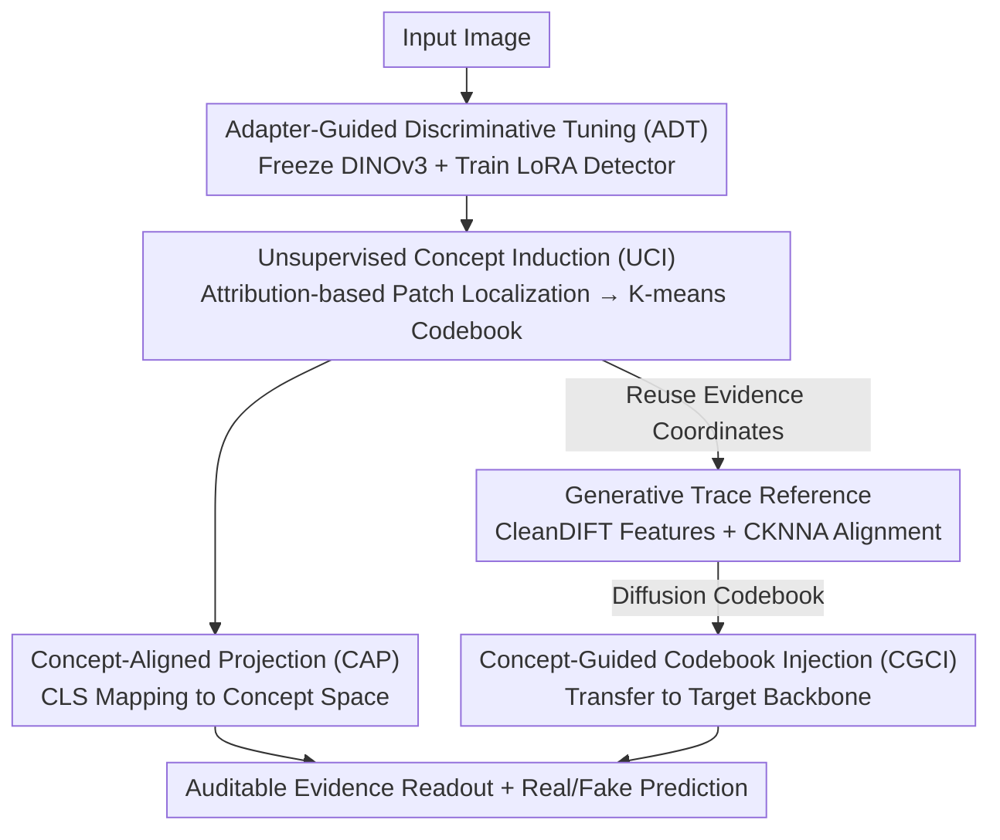

# ForensicConcept: Transferable Forensic Concepts for AIGI Detection

**Conference**: ICML 2026  
**arXiv**: [2606.07034](https://arxiv.org/abs/2606.07034)  
**Code**: https://github.com/EthanAdamm/FORENSICCONCEPT  
**Area**: AIGC Detection / Interpretability / Representation Alignment  
**Keywords**: AI-Generated Image Detection, Forensic Concepts, Cross-generator Generalization, Diffusion Feature Alignment, CKNNA

## TL;DR
Addressing the issues where AI-Generated Image (AIGI) detectors are "highly accurate within the training distribution but fail on unseen generators" and remain entirely black-box, this paper explicitly extracts dispersed evidence relied upon by detectors into a "forensic concept codebook." It uses diffusion features (CleanDIFT) as external generative trace references and employs the neighborhood-structure consistency metric CKNNA to measure the geometric alignment between backbone evidence and diffusion traces. By injecting the diffusion codebook into a target backbone, cross-generator transfer is achieved; the average accuracy on GenImage reaches 92.0%, and higher CKNNA correlates with greater transfer gains.

## Background & Motivation

**Background**: The mainstream approach for AI-Generated Image detection treats it as a binary classification—training a network to output a single "forgery probability" for each image. On generators seen during training (e.g., SDv1.4), such detectors easily exceed 99% accuracy.

**Limitations of Prior Work**: Accuracy drops precipitously when switching to unseen generators (Midjourney, ADM, BigGAN, etc.). Furthermore, it is unclear "why it fails"—existing detectors are complete black boxes that provide only a score without indicating which specific evidence in the image informed the decision. Without understanding the evidence, it is impossible to diagnose generalization failures or design principled solutions.

**Key Challenge**: The authors hypothesize that detectors learn "generator-specific shortcuts" (fingerprints remaining from a specific generator) rather than cross-generator transferable "forensic traces." To verify this, the "evidence the detector relies on" must be extracted from the black box. However, forensic evidence is inherently difficult to extract: comparative visualization shows that while semantic classifiers (cat vs. dog) focus on object parts like eyes or ears, the attention of forensic detectors is **dispersed** across large, fragmented areas like backgrounds, textures, and smooth regions, which differ fundamentally from semantic cues.

**Goal**: (1) **Explicitly characterize** such spatially dispersed evidence; (2) determine whether this evidence represents true generative traces or backbone shortcuts; and (3) enable the **transfer** of evidence between different backbones to improve generalization.

**Key Insight**: The authors observe that although evidence is spatially fragmented, clustering the patches the detector focuses on reveals **coherent clusters**—patches within the same cluster share similar textures/edge statistics, and these patterns **recur** across images from different generators. This suggests that dispersed evidence possesses a structured geometry in the feature space. The authors term these recurring patterns "forensic concepts."

**Core Idea**: Replace black-box scores with an "explicit forensic concept codebook" to carry evidence. Utilizing a combination of "diffusion features as external references + CKNNA alignment measurement + codebook injection intervention," dispersed evidence is transformed into auditable and transferable units.

## Method

### Overall Architecture
ForensicConcept links three stages: "extracting evidence → validating evidence authenticity with external references → proving evidence transferability through injection." The input is an image, and the output includes both real/fake predictions and visualized forensic concept evidence readouts.

Stage 1: **Forensic Concept Learning** (Section 3.1): Perform Adapter-guided Discriminative Tuning (ADT) on a pre-trained DINOv3. Use Transformer attribution to locate decision-critical patches, perform K-means clustering on these patch tokens to obtain a compact forensic concept codebook, and use Concept-Aligned Projection (CAP) to map CLS representations into the concept space. Stage 2: **Generative Trace Reference** (Section 3.2): Since the codebook geometry learned in Stage 1 may still be contaminated by backbone/dataset shortcuts, CleanDIFT diffusion features are introduced as an "external, generative process-bound" reference space. CKNNA is used to quantify the neighborhood-structure consistency between backbone evidence and diffusion traces. Stage 3: **Concept-Guided Codebook Injection** (CGCI, Section 3.3): Inject the diffusion-derived codebook into a target backbone (e.g., CLIP) to verify if cross-generator gains correlate with the alignment measured in Stage 2—using "intervention" to prove causality rather than just correlation.

### Key Designs

**1. ADT + UCI: Summarizing Dispersed Evidence into an Explicit Forensic Concept Codebook**

This pair of designs addresses the difficulty of extracting evidence. The key to ADT (Adapter-Guided Discriminative Tuning) is **not destroying the representation geometry for discriminative power**. If DINOv3 were fully fine-tuned, patch token representations would drift, rendering subsequent attribution and clustering meaningless. Therefore, authors freeze backbone parameters $\theta$ and only insert LoRA adapters into all Transformer blocks, adding a lightweight classification head $g(\cdot)$ on the CLS token, trained with standard binary cross-entropy $\mathcal{L}_{\mathrm{cls}}$. This yields a discriminative detector while keeping patch representations stable.

UCI (Unsupervised Concept Induction) is responsible for "localizing + summarizing" evidence from this stable detector. Localization uses gradient-based Transformer attribution: to avoid gradient saturation, the logit objective $\hat{y}_t(x)=(2y-1)\hat{y}_{\mathrm{cls}}(x)$ is used to unify attribution directions for real ($y=0$) and fake ($y=1$) samples. Gradient-weighted relevance is calculated for each head in each layer: $\mathbf{R}^{(l,h)}=\mathrm{ReLU}(\frac{\partial \hat{y}_t}{\partial \mathbf{A}^{(l,h)}}\odot \mathbf{A}^{(l,h)})$. Heads are averaged, residuals added, and attention-rollout is performed across layers: $\mathbf{R}(x)=\prod_{l=1}^{L}\tilde{\mathbf{R}}^{(l)}$. The CLS→patch relevance is taken as the attribution score for each patch, and the top-$k$ are selected as evidence locations. Patch tokens from these locations across the dataset are gathered into a set $\mathcal{U}$ and clustered via K-means to obtain the codebook $\mathbf{C}=\{\mathbf{c}_1,\dots,\mathbf{c}_K\}$, where each prototype corresponds to a recurring decision-critical evidence pattern.

**2. CAP: Integrating the Concept Space into Decision Making**

A codebook alone is insufficient; if it is merely an ex-post clustering tool that does not influence prediction, it cannot guarantee that the concepts carry discriminative information. CAP (Concept-Aligned Projection) attaches a concept branch to the frozen ADT detector: a learnable projection $\mathbf{W}_c\in\mathbb{R}^{d\times K}$ is initialized with the codebook ($\mathbf{W}_c\leftarrow \mathbf{C}^\top$), mapping the CLS token to the concept space $\mathbf{s}(x)=\mathbf{z}_{\mathrm{cls}}(x)^\top \mathbf{W}_c$. This passes through a concept head $h$ for prediction. With the backbone (including LoRA) frozen, $\mathcal{L}=\mathcal{L}_{\mathrm{cls}}+\lambda\mathcal{L}_{\mathrm{con}}$ is optimized. This forces the concept space into the supervision loop, ensuring the codebook concepts are discriminative.

**3. CleanDIFT Generative Trace Reference + CKNNA: Using External References to Distinguish Traces from Shortcuts**

This is a critical design for determining if learned concepts are true generative traces or backbone shortcuts. The insight is that an **external reference bound to the generative process and independent of the detector** is required. Diffusion model internal representations serve as such a "generative trace" space. The authors use CleanDIFT to extract dense diffusion tokens $\mathbf{D}^{(l)}(x)$ from a U-Net layer, normalize backbone features to a $16\times 16$ resolution, and **reuse Stage 1 evidence coordinates** $\mathcal{I}_b(x)$ for position-aligned pairing $(\mathbf{p}_{x,j},\mathbf{q}_{x,j})$.

The metric CKNNA (neighborhood-structure consistency) calculates $k_{\mathrm{NN}}$ neighbor sets $\mathcal{N}^p(u), \mathcal{N}^q(u)$ in the backbone and diffusion spaces using cosine distance, taking the average intersection ratio:

$$\mathrm{CKNNA}_{k_{\mathrm{NN}}}(b,l)=\frac{1}{|\mathcal{P}|}\sum_{u\in\mathcal{P}}\frac{|\mathcal{N}^p(u)\cap \mathcal{N}^q(u)|}{k_{\mathrm{NN}}}$$

Higher CKNNA indicates that the backbone evidence's neighborhood geometry is closer to diffusion traces. The key finding is: CKNNA **predicts transfer gains**—backbones with stronger alignment induce more transferable forensic concepts.

**4. CGCI: Proving Transferability through Intervention**

To move beyond correlation, authors use CGCI (Concept-Guided Codebook Injection) as an intervention: injecting the diffusion-derived codebook $\mathbf{C}$ into a target backbone (e.g., CLIP) to see if cross-generator gains correlate with alignment. Injection has three steps: mapping patch tokens to the codebook space to calculate normalized similarity $\mathbf{S}=\frac{1}{\tau}\hat{\mathbf{Q}}\hat{\mathbf{C}}^\top$; FES (Forensic Evidence Scoring) takes the mean of top-$r$ concept responses $\mathrm{score}_{n,i}=\frac{1}{r}\sum_{t=1}^{r}S_{n,i,(t)}$ as the evidence score for each patch; finally, FEA (Forensic Evidence Aggregator) uses softmax weights to aggregate selected patches into a global evidence vector $\mathbf{g}^{(n)}=\sum_i w_i^{(n)}\mathbf{X}_{\mathrm{sel},i}^{(n)}$.

## Key Experimental Results

### Main Results
Cross-generator generalization on GenImage (trained on SDv1.4, tested on others, Accuracy %):

| Method | Source | Midjourney | ADM | VQDM | BigGAN | Mean |
|------|------|-----------|-----|------|--------|------|
| UnivFD | CVPR 2023 | 91.5 | 58.1 | 67.8 | 57.7 | 79.5 |
| NPR | CVPR 2024 | 81.0 | 76.9 | 84.1 | 84.2 | 88.6 |
| DRCT | ICML 2024 | 91.5 | 79.4 | 90.0 | 81.7 | 89.5 |
| Effort | ICML 2025 | 82.4 | 78.7 | 91.7 | 77.6 | 91.1 |
| **ForensicConcept** | - | 95.0 | 69.2 | 94.3 | **94.1** | **92.0** |

Ours achieves a 92.0% mean accuracy, surpassing the previous best, Effort (91.1%), with significant leads in BigGAN (94.1 vs 84.2) and VQDM.

### Ablation Study
CLIP with/without diffusion codebook injection on GenImage (Accuracy % and ΔAcc):

| Generator | CLIP (No Injection) | CLIP (With Injection) |
|-----------|-------------------|----------------------|
| Midjourney | 70.4 | 85.9 (+15.5) |
| ADM | 58.1 | 63.3 (+5.1) |
| GLIDE | 91.7 | 95.3 (+3.6) |
| VQDM | 76.9 | 84.4 (+7.5) |
| SDv1.4 (In-domain) | 99.9 | 99.0 (-0.9) |
| Wukong | 99.0 | 98.4 (-0.6) |

### Key Findings
- Injecting diffusion codebooks yields the largest gains on **unseen generators** (Midjourney +15.5, VQDM +7.5), with minimal drops (<1%) in-domain—proving the injection provides true cross-generator transferability rather than overfitting.
- CKNNA alignment **predicts** this transfer gain: backbones more aligned with diffusion traces show higher generalization improvements after injection.
- Forensic evidence differs fundamentally from semantic evidence: attribution maps show the detector focuses on dispersed textures/backgrounds rather than semantic parts.

## Highlights & Insights
- **Upgrading interpretability from ex-post explanation to a transferable tool**: The forensic concept codebook is not just for human auditing; it can be injected across backbones to directly improve generalization.
- **Diffusion features as a "polygraph"**: Using generative process-bound CleanDIFT traces as external references cleverly bypasses the difficulty of validating evidence without ground truth.
- **Relatedness → Intervention loop**: The method moves from observing CKNNA correlation to performing CGCI intervention, which is a stronger methodological approach for proving transferability.

## Limitations & Future Work
- The framework depends on the quality of CleanDIFT references (specific U-Net layers/generators); the effect of reference mismatch is not fully explored.
- Gains on ADM are relatively small (+5.1), suggesting characterization of traces for certain diffusion variants remains insufficient.
- CKNNA currently serves as an empirical predictor; a theoretical guarantee for its relationship with transfer gain is missing.
- Future work could involve regularizing training directly with CKNNA to pull backbone evidence closer to diffusion trace geometry.

## Related Work & Insights
- **vs. Scaling data/Representation routes (e.g., DRCT, Effort)**: These treat detectors as black boxes; Ours explicitly extracts evidence and provides metrics for transferability.
- **vs. UnivFD (using VLM representations)**: UnivFD uses CLIP features but remains a black-box score; Ours uses CLIP as an injection target to actively integrate generative trace concepts.
- **vs. Classic Representation Similarity (CKA/SVCCA)**: CKNNA neighborhood consistency is more suitable for measuring "evidence geometry" between heterogeneous backbones and diffusion spaces.

<!-- RELATED:START -->

## Related Papers

- [\[ICML 2026\] Deep Residual Injection for Full-Spectrum Forensic Signal Perception in Multimodal Large Language Models](deep_residual_injection_for_full-spectrum_forensic_signal_perception_in_multimod.md)
- [\[ACL 2026\] AEGIS: A Holistic Benchmark for Evaluating Forensic Analysis of AI-Generated Academic Images](../../ACL2026/aigc_detection/aegis_a_holistic_benchmark_for_evaluating_forensic_analysis_of_ai-generated_acad.md)
- [\[ICML 2026\] CORE: Conflict-Oriented Reasoning for General Multimodal Manipulation Detection](core_conflict-oriented_reasoning_for_general_multimodal_manipulation_detection.md)
- [\[ICML 2026\] Dissect and Prune: Enhancing Robustness in AI-Generated Image Detection](dissect_and_prune_enhancing_robustness_in_ai-generated_image_detection.md)
- [\[ICML 2026\] Black-Box Detection of LLM-Generated Text Using Generalized Jensen-Shannon Divergence](black-box_detection_of_llm-generated_text_using_generalized_jensen-shannon_diver.md)

<!-- RELATED:END -->
