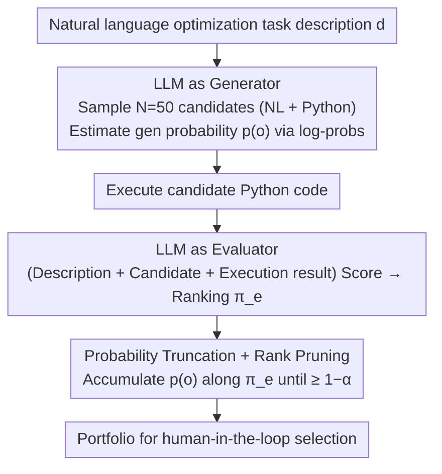

# Generating Robust Portfolios of Optimization Models using Large Language Models

**Conference**: ICML 2026  
**arXiv**: [2605.27013](https://arxiv.org/abs/2605.27013)  
**Code**: None  
**Area**: Optimization Modeling / LLM-as-Generator / LLM-as-Judge  
**Keywords**: Optimization modeling, portfolio, LLM evaluation, human-in-the-loop, coverage guarantees

## TL;DR
This paper proposes a lightweight, training-free algorithm: using the same LLM to simultaneously act as both a "stochastic generator" and a "scoring evaluator." Candidate optimization models are bundled into a portfolio by accumulating generation probabilities until a $1-\alpha$ threshold is reached. Theoretically, the paper proves that as long as either the "generator" or the "evaluator" aligns with human preferences, the portfolio will contain high-quality optimization models. Empirical validation on NL4LP using GPT demonstrates that the portfolio consistently outperforms random sampling in the worst-case scenario.

## Background & Motivation
**Background**: Formalizing real-world decision problems (resource allocation, scheduling, planning) into mathematical optimization models is the most significant bottleneck in Operations Research, as it requires expertise in both the business domain and optimization modeling. Recently, several works have emerged using LLMs to automatically generate optimization models (OptiMUS, LLMOPT, Autoformulation, ORLM, etc.), with approaches ranging from "end-to-end fine-tuning of an LLM for full models" to "using LLMs to design only the reward/objective functions."

**Limitations of Prior Work**: Almost all these methods output a **single** optimization model. Since LLM outputs are inherently stochastic and prone to hallucinations, the quality of a single model is not guaranteed. Improving reliability often requires retraining or RLHF, which involves extremely high engineering costs. Furthermore, decision-makers are left with no way to judge the quality of a provided model or a fallback option.

**Key Challenge**: LLMs possess two distinct capabilities for optimization modeling—acting as a **stochastic generator** (sampling multiple times to provide diverse candidates covering different trade-offs) and acting as a **reasoning evaluator/judge** (scoring candidates based on world knowledge). Existing works either use the former (picking one from multiple random samples) or the latter (letting a judge pick the best), but fail to unify them. If the generator is biased, the judge cannot recover, and vice versa.

**Goal**: To output a set (rather than one) of optimization models without training or fine-tuning, providing **theoretical coverage guarantees**: as long as **either** the generator or the evaluator is consistent with human rankings, the portfolio will contain a high-quality model, supporting a "pick-one-from-many" human-in-the-loop decision process.

**Key Insight**: The authors observe that the probability $p(o)$ provided by the generator and the ranking $\pi_e(d)$ provided by the evaluator are two **independent** signals. Combining them into a portfolio—sorted by the evaluator and truncated by the generator's cumulative probability—allows the two signals to back each other up.

**Core Idea**: Candidates are added to the portfolio sequentially based on the evaluator's ranking (from best to worst) until the cumulative **generation probability** reaches $1-\alpha$. This truncation ensures the portfolio benefits from the dual protection of "evaluator ranking coverage" and "generation probability coverage."

## Method

### Overall Architecture
The paper addresses the issue of unreliable single outputs in automated LLM optimization modeling. Given a natural language optimization task description $d$, the method no longer outputs a single model. Instead, the same LLM first acts as a "stochastic generator" to repeatedly sample a batch of candidates, then switches to the role of an "evaluator" to score them. Finally, a unified stopping rule bundles the most valuable candidates into a portfolio for decision-makers. The key lies in sewing the independent signals of "evaluator ranking" and "generation probability" into a single truncation criterion, ensuring that if either signal is reliable, quality is guaranteed.

### Key Designs

**1. Probability Truncation + Rank Pruning: Unifying two signals into a single stopping rule**

The construction of the portfolio follows a single rule that incorporates both generation and evaluation information. First, the description $d$ is fed to generator $g$ for random sampling $N$ times (experimentally $N=50$), producing candidates $o\in\mathcal{O}$ in "natural language explanation + Python code" format. Generation probability $p(o)$ is estimated using normalized token-level log-probs. Then, the same LLM acts as an evaluator to provide a ranking from best to worst $\pi_e(d)=(o_{(1)^e}, o_{(2)^e}, \ldots)$. During construction, the candidates are traversed starting from the evaluator's top rank, maintaining a cumulative probability $S_k=\sum_{i=1}^k p(o_{(i)^e})$. The process stops as soon as $S_k\geq 1-\alpha$, yielding:

$$\mathcal{P}(d;\alpha)=\{o_{(i)^e}\}_{i=1}^{k^*(\alpha)},\quad k^*(\alpha)=\inf\Big\{k:\sum_{i=1}^k p(o_{(i)^e})\geq 1-\alpha\Big\}.$$

This rule is robust because traditional methods either use top-k by score (failing if the evaluator fails) or top-p by probability (failing if the generator fails). Here, the "evaluator ranking determines priority, while generation probability mass determines the stopping point" for mutual backup. If the evaluator is reliable, the top-ranked candidates contain good models; if the evaluator is unreliable but the generator is good, high-quality models will likely enter the cumulative sum due to their high generation probabilities. $\alpha\in(0,1)$ is a user-defined knob—smaller values provide safer coverage but larger portfolios.

**2. Unified Coverage Definition and "OR"-type Alignment Hypothesis**

To formalize the intuition, the quality of the portfolio is quantified using coverage $c(\mathcal{P})=\frac{1}{k}\sum_{i=1}^k \mathbb{I}\{o_{(i)^*}\in\mathcal{P}\}$, representing how many of the top $k$ human-preferred candidates fall into the portfolio ($o_{(i)}^*$ being the true human rank). Based on this, two types of alignment are defined: **Evaluator Alignment** (evaluator ranking matches human ranking $\pi_e(d)=\pi^*(d)$) and **Generator Alignment** (better candidates have higher generation probabilities, i.e., $i\leq j\Rightarrow p(o_{(i)^*})\geq p(o_{(j)^*})$). The truncation rule allows for two **independent** guarantees: if the evaluator is aligned, then $c(\mathcal{P})=1$ for any $\alpha\in(0,1)$ and any generator; if the generator is aligned, then $c(\mathcal{P})>\frac{1-2\alpha}{k^*(\alpha)}>0$ for any $\alpha\in(0,1/2)$ and any evaluator. This relaxes the previous "both components must be reliable" **AND**-type guarantee into an **OR**-type guarantee, fitting the empirical observation that LLM performance varies significantly across different prompts.

**3. Dual Role for the Same Model + Execution Feedback for Evaluation**

The generator and evaluator use the same LLM (both `gpt-5.4-nano` in experiments), switching identities via prompts to avoid doubling costs. The evaluation step is not purely text-based: it first **executes** the candidate's Python code to obtain results, then feeds the "problem description + candidate model + execution output" back into the LLM. Each candidate is scored 1–100 four times, and the average is used. Code execution acts as a factual verification filter, preventing the judge from being misled by "syntactically pretty but logically incorrect" models. The authors also implement a baseline: discarding the evaluator and using the generator's own probabilities for both ranking and truncation (pure top-p) to isolate the signal provided by the reasoning evaluator.

### Loss & Training
The entire process is **training-free, fine-tuning-free, and RLHF-free**—relying only on prompts and sampling. The only hyperparameter is the user-specified $\alpha$, which balances coverage and portfolio size. The theoretical components rely on a core lemma: when the evaluator is aligned, accumulating generation probability to $1-\alpha$ covers at least the top $k^*$ human-ranked candidates; when the generator is aligned, the lower bound $\frac{1-2\alpha}{k^*}$ is derived from $p(o_{(i)^*})\geq p(o_{(j)^*})\,(i\leq j)$. Full proofs are in Appendix A.

## Key Experimental Results

### Main Results

**Synthetic Data (Theoretical Verification)**: Candidate space $|\mathcal{O}|=K\in\{10,20,50,100\}$, with true human ranking fixed at $(1,2,\ldots,K)$. Generators are categorized into four levels: Aligned / Weakly Aligned / Uniform / Misaligned. The evaluator is described by an error rate $\epsilon\in\{0,0.3,0.5,0.7,1\}$ ($\epsilon=0$ is perfect; $\epsilon=1$ is reversed). 40 seeds per $\alpha$.

| Setting ($K=100$) | $\alpha$ Range | Empirical Coverage | Comparison with Theory ($\frac{1-2\alpha}{k^*}$) |
|---|---|---|---|
| Weakly Aligned generator, $\epsilon=0$ | $(0, 0.5)$ | $\geq 1-\alpha$ (Above diagonal) | Much higher than theoretical lower bound |
| Weakly Aligned generator, $\epsilon=0.5$ | $(0, 0.5)$ | $\approx 1-\alpha$ | Satisfies Proposition 3.6 |
| Weakly Aligned generator, $\epsilon=1.0$ (Worst judge) | $(0, 0.5)$ | Still positive | Consistent with theory |
| Aligned generator, $\epsilon=1.0$ (Worst judge) | $(0, 0.5)$ | Significantly higher than Uniform/Misaligned | Large portfolio for high coverage |

**Real Data (NL4LP, 25 Problems)**: generator = `gpt-5.4-nano` (50 samples); judge = `gpt-5.4` using ground-truth solutions as reference; portfolio size $s\in\{2,4,6,8\}$. Comparison against random portfolios of the same size, with 30 random re-samplings per problem. The quality metric is the **lowest** score within the portfolio (worst-case perspective).

| Portfolio Size $s$ | Ours (LLM-as-evaluator) | Ours (generator-prob-as-evaluator) | Random Portfolio |
|---|---|---|---|
| 2 | Significant Gain | Moderate Gain | Baseline |
| 4 | Significant Gain | Moderate Gain | Baseline |
| 6 | Significant Gain | Moderate Gain | Baseline |
| 8 | Significant Gain | Moderate Gain | Baseline |

> The results are presented via KDE distribution plots (Figure 5). Both versions of the proposed method's curves shift to the right; the reasoning evaluator version shifts **further** than the probability-only version, proving that LLM reasoning provides additional valuable signals.

### Ablation Study

| Configuration | Coverage Behavior | Description |
|---|---|---|
| Full: reasoning evaluator + generator prob truncation | Highest worst-case score on NL4LP | Complete Method |
| w/o evaluator (Use generator prob for rank & truncate) | Score drops but remains above random | Loses "execution feedback" signal, though gen prob still provides alignment |
| w/o prob truncation (Fixed top-k by judge) | No $\alpha$ knob, no coverage guarantee | Equivalent to existing LLM-as-judge baseline, significantly outperformed by this work |
| Random portfolio (Sample $s$ candidates) | Lowest worst-case score | Strong baseline for NL4LP, outperformed by this work across all $s$ |

### Key Findings
- **The "OR"-type alignment hypothesis is verified in synthetic experiments**: Even if the evaluator is completely reversed ($\epsilon=1$), as long as the generator is even Weakly Aligned, coverage remains strictly positive for $\alpha<0.5$—a level of robustness unattainable by simple top-k or top-p.
- **Coverage/size trade-off is controlled by human alignment**: Highly aligned generators result in higher coverage but larger portfolios for a fixed $\alpha$; highly aligned evaluators result in higher coverage with smaller portfolios. This provides a clear "quality vs. option count" knob for decision-makers.
- **Code Execution + Reasoning Evaluator > Pure Gen Probability**: In the NL4LP experiments, the reasoning evaluator shifted the score distribution further right than the probability-based version, proving LLM judges provide signals beyond mere generation likelihood.
- **Empirical lower bounds are much tighter than theoretical ones**: Proposition 3.6 provides $c>\frac{1-2\alpha}{k^*}$, while measured lower bounds almost follow $1-\alpha$, suggesting room for theoretical tightening.

## Highlights & Insights
- **"Dual roles, same model, OR-type guarantee"** is the most elegant aspect of this method. Previous LLM-for-optimization works treated the generator and judge as separate pipelines. This work switches prompts on the same LLM and designs a unified stopping rule, minimizing engineering overhead while maximizing robustness.
- **Relaxing coverage guarantees from "both aligned" to "either aligned"** has significant methodological implications. Given the volatility of LLM performance, an "OR"-type guarantee is far more practical and can be extended to code generation, SQL synthesis, and RL reward shaping.
- **Incorporating code execution results into the evaluator** is an undervalued detail. Optimization modeling naturally includes an objective "referee" (the solver). This work elevates LLM scoring from "looks right" to "calculates correctly" by including execution logs. 
- **The $\alpha$ knob provides a clear human-machine interface**: Unlike traditional LLM outputs that provide either one or multiple results without a quality vs. quantity trade-off, this method uses a scalar parameter to make "coverage vs. size" continuously adjustable.

## Limitations & Future Work
- **Acknowledged Limitations**: $p(o)$ is estimated via normalized token-level log-probs, which may be inaccurate for long outputs or long-tail candidates. The NL4LP scale (25 problems, $N=50$) is also relatively small.
- **Theoretical Bound $\frac{1-2\alpha}{k^*}$ is Loose**: When $k^*$ is large, the guarantee becomes nearly zero, offering limited guidance for hyperparameter selection. Future work should seek tighter instance-dependent bounds for weak generator alignment.
- **Detecting "Alignment" is difficult**: The definition requires knowing the true human ranking $\pi^*$, which is unknown in practice. The guarantee is more of a "post-hoc verifiable" one; engineering needs a cheaper proxy for alignment.
- **Lack of direct head-to-head with systems like OptiMUS/LLMOPT**: Since these systems typically optimize for a single model and solver pass rate, the metrics are inconsistent with the portfolio approach. Future comparisons should look at "worst model quality" vs "best model quality within portfolio."
- **Potential Improvements**: Using an ensemble of evaluators (voting), replacing gen probs with self-consistency frequencies for more stable $p(o)$ estimation, or introducing solver-returned feasibility/gap metrics as hard filters.

## Related Work & Insights
- **vs OptiMUS / LLMOPT / Autoformulation (Ahmaditeshnizi 2024; Jiang 2024; Astorga 2024)**: These often fine-tune an LLM or use multi-agent collaboration to converge on a **single** model without quality guarantees. This work is the "lightweight + robust" alternative.
- **vs Eureka / Text2Reward / DLM (Ma 2024; Xie 2024; Behari 2024)**: These use environmental feedback to iteratively optimize RL rewards. This work shifts the focus from reward design to full optimization models and from "iterative single-point optimization" to "one-shot portfolio generation."
- **vs Verma 2025 (Balancing Act)**: Also observes the dual LLM role for reward prioritization but lacks coverage guarantees and a unified stopping rule.
- **vs OPRO / "LLM as Optimizer" (Yang 2023)**: There, the LLM acts as a black-box optimizer. Here, the LLM **writes** the optimization model for a traditional solver, resulting in better interpretability.

## Rating
- Novelty: ⭐⭐⭐⭐ The "evaluator-rank + generator-prob truncation" is a clean and elegant combo.
- Experimental Thoroughness: ⭐⭐⭐ Synthetic experiments cover theoretical corners well, but real-world experiments are limited in scale and lacks head-to-head baselines.
- Writing Quality: ⭐⭐⭐⭐ Clear definitions, hypotheses, and propositions.
- Value: ⭐⭐⭐⭐ The "OR-type guarantee + zero training" framework is valuable for any task requiring verifiable structures (Code, SQL, Protocols).

<!-- RELATED:START -->

## Related Papers

- [\[ICML 2026\] Feature-Augmented Transformers for Robust AI-Text Detection Across Domains and Generators](feature-augmented_transformers_for_robust_ai-text_detection_across_domains_and_g.md)
- [\[CVPR 2025\] ProAPO: Progressively Automatic Prompt Optimization for Visual Classification](../../CVPR2025/aigc_detection/proapo_progressively_automatic_prompt_optimization_for_visual_classification.md)
- [\[ICLR 2026\] CLARC: C/C++ Benchmark for Robust Code Search](../../ICLR2026/aigc_detection/clarc_cc_benchmark_for_robust_code_search.md)
- [\[NeurIPS 2025\] ASCIIBench: Evaluating Language-Model-Based Understanding of Visually-Oriented Text](../../NeurIPS2025/aigc_detection/asciibench_evaluating_language-model-based_understanding_of_visually-oriented_te.md)
- [\[NeurIPS 2025\] DuoLens: A Framework for Robust Detection of Machine-Generated Multilingual Text and Code](../../NeurIPS2025/aigc_detection/duolens_a_framework_for_robust_detection_of_machine-generated_multilingual_text_.md)

<!-- RELATED:END -->
