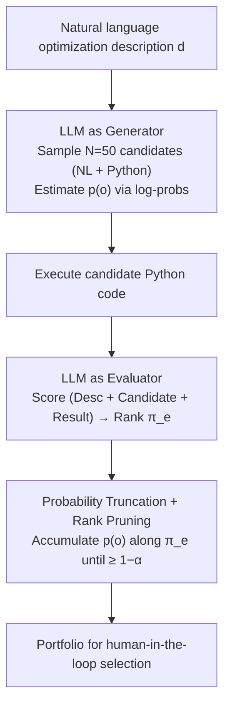

# Generating Robust Portfolios of Optimization Models using Large Language Models

**Conference**: ICML 2026  
**arXiv**: [2605.27013](https://arxiv.org/abs/2605.27013)  
**Code**: None  
**Area**: Optimization Modeling / LLM-as-Generator / LLM-as-Judge  
**Keywords**: Optimization Modeling, Portfolio of Candidates, LLM Evaluation, Human-in-the-loop, Coverage Guarantees

## TL;DR
This paper proposes a lightweight, training-free algorithm that utilizes a single LLM to act simultaneously as a "stochastic generator" and a "scoring evaluator." By packaging candidate optimization models into a portfolio until the cumulative generation probability reaches $1-\alpha$, it theoretically proves that as long as **either** the generator or the evaluator aligns with human preferences, the portfolio will contain high-quality models. Experiments on NL4LP using GPT verify that the portfolio consistently outperforms random sampling even in the worst-case scenarios.

## Background & Motivation
**Background**: Formalizing real-world decision problems (resource allocation, scheduling, planning) into mathematical optimization models is the most significant "bottleneck" in operations research, as it requires expertise in both the business domain and optimization modeling itself. Recently, several works have emerged using LLMs to automatically generate optimization models (e.g., OptiMUS, LLMOPT, Autoformulation, ORLM), following strategies such as "end-to-end fine-tuning to output a full model" or "letting the LLM design only the reward/objective function."

**Limitations of Prior Work**: Most existing methods output only a **single** optimization model. However, LLM outputs possess significant stochasticity and hallucination rates, meaning the quality of a single model cannot be guaranteed. Improving reliability often requires expensive retraining or RLHF. Once a decision-maker receives a model, they have no way to judge its quality and no backup options.

**Key Challenge**: LLMs possess two distinct capabilities for optimization modeling: acting as a **stochastic generator** (sampling multiple times to provide diverse candidates covering different trade-offs) and as a **reasoning evaluator / judge** (scoring candidates based on world knowledge). Existing works typically use either the former (random sampling and picking one) or the latter (letting a judge select the best), failing to unify them. If the generator is biased, the judge cannot save it, and vice versa.

**Goal**: Without training or fine-tuning, output a set (portfolio) of optimization models rather than a single one, providing **theoretical coverage guarantees**: as long as **either** the generator or the evaluator is consistent with human ranking, the portfolio will contain high-quality models, thereby supporting a "multi-choice" decision process for human-in-the-loop workflows.

**Key Insight**: The authors observe that the probability $p(o)$ provided by the generator and the ranking $\pi_e(d)$ provided by the evaluator are two **independent** signals. Combining them into a portfolio—ranked by the evaluator and truncated by the generator's cumulative probability—allows the two signals to back each other up.

**Core Idea**: Add candidates to the portfolio in descending order of the evaluator's ranking until the cumulative **generation probability** reaches $1-\alpha$. This truncation ensures the portfolio enjoys dual protection from both "evaluator ranking coverage" and "generation probability coverage."

## Method

### Overall Architecture
The paper addresses the unreliability of individual LLM-generated optimization models. Given a natural language optimization task description $d$, the method no longer produces a single model. Instead, it uses the same LLM to repeatedly sample candidates as a "stochastic generator," then switches to the "evaluator" role to score them. Finally, it uses a unified stopping rule to package the most valuable candidates into a portfolio for decision-makers. The key lies in merging the "evaluator ranking" and "generation probability" signals into a single truncation criterion, ensuring quality as long as one signal is reliable.

### Key Designs

**1. Probability Truncation + Rank Pruning: A Single Stopping Rule for Two Signals**

The portfolio construction follows a single rule while incorporating both generator and evaluator information. First, the description $d$ is fed to the generator $g$ for $N$ random samples (where $N{=}50$). Each sample produces a candidate $o\in\mathcal{O}$ consisting of "natural language explanation + Python code," and the generation probability $p(o)$ is estimated using normalized token-level log-probs. Then, the same LLM acts as an evaluator to provide a ranking $\pi_e(d)=(o_{(1)^e}, o_{(2)^e}, \ldots)$ from best to worst. The portfolio is constructed by traversing the ranking and maintaining the cumulative probability $S_k=\sum_{i=1}^k p(o_{(i)^e})$. The process stops as soon as $S_k\geq 1-\alpha$:

$$\mathcal{P}(d;\alpha)=\{o_{(i)^e}\}_{i=1}^{k^*(\alpha)},\quad k^*(\alpha)=\inf\Big\{k:\sum_{i=1}^k p(o_{(i)^e})\geq 1-\alpha\Big\}.$$

The robustness of this rule stems from the fact that traditional methods—such as top-k by score (fails if the evaluator fails) or top-p by probability (fails if the generator fails)—rely on a single point of failure. Here, the evaluator's ranking determines the order of candidates, while the generator's probability mass determines when to stop. If the evaluator is reliable, the top candidates include good models; if the generator is reliable, good models with high probabilities will eventually enter the cumulative sum. $\alpha\in(0,1)$ is a user-controllable parameter: a smaller value ensures better coverage but a larger portfolio.

**2. Unified Coverage Definition and "OR" Alignment Assumption**

To formalize this intuition, the authors quantify portfolio quality as coverage $c(\mathcal{P})=\frac{1}{k}\sum_{i=1}^k \mathbb{I}\{o_{(i)^*}\in\mathcal{P}\}$, representing how many of the top-$k$ human-preferred candidates fall into the portfolio ($o_{(i)^*}$ is the true human rank). Based on this, they define two types of alignment: **Evaluator Alignment** (the evaluator's ranking matches the human's, $\pi_e(d)=\pi^*(d)$) and **Generator Alignment** (better candidates have higher generation probabilities, i.e., $i\leq j\Rightarrow p(o_{(i)^*})\geq p(o_{(j)^*})$). They prove two **independent** guarantees: if the evaluator is aligned, then $c(\mathcal{P})=1$ for any $\alpha$ and any generator; if the generator is aligned, then for any $\alpha\in(0,1/2)$ and any evaluator, $c(\mathcal{P})>\frac{1-2\alpha}{k^*(\alpha)}>0$. This relaxes the requirement from an "AND" type guarantee (both must be reliable) to an "OR" type guarantee.

**3. Same Model Dual Role + Feedback from Code Execution**

The generator and evaluator use the same LLM (the experiment uses `gpt-5.4-nano`), switching roles via prompting to minimize costs. The evaluation step is not purely textual: the Python code of the candidate model is **executed** to obtain a solver result. Then, the "problem description + candidate model + execution output" are fed back into the LLM. Scoring is repeated 4 times per candidate (1–100 scale), and the mean is taken. Code execution acts as a fact-checking filter, preventing the judge from being misled by syntactically correct but logically incorrect models.

### Loss & Training
The entire process is **training-free, fine-tuning-free, and RLHF-free**. It relies solely on prompting and sampling. The only hyperparameter is $\alpha$, which balances coverage and portfolio size. The theoretical component relies on a core lemma: when the evaluator is aligned, accumulating probability to $1-\alpha$ covers at least the top human candidates; when the generator is aligned, the property $p(o_{(i)^*})\geq p(o_{(j)^*})\,(i\leq j)$ provides the lower bound $\frac{1-2\alpha}{k^*}$. (Proofs in Appendix A).

## Key Experimental Results

### Main Results

**Synthetic Data (Theory Verification)**: Candidate space $|\mathcal{O}|=K\in\{10,20,50,100\}$, with human ranking fixed as $(1,2,\ldots,K)$. Generators are categorized into: Aligned / Weakly Aligned / Uniform / Misaligned. Evaluators are characterized by an error rate $\epsilon\in\{0,0.3,0.5,0.7,1\}$. 40 seeds per $\alpha$.

| Setting ($K{=}100$) | $\alpha$ Range | Empirical Coverage | Comparison with Theory ($\frac{1-2\alpha}{k^*}$) |
|---|---|---|---|
| Weakly Aligned generator, $\epsilon{=}0$ | $(0, 0.5)$ | $\geq 1-\alpha$ | Far exceeds theoretical bound |
| Weakly Aligned generator, $\epsilon{0.5}$ | $(0, 0.5)$ | $\approx 1-\alpha$ | Satisfies Prop. 3.6 |
| Weakly Aligned generator, $\epsilon{=}1.0$ (Worst Judge) | $(0, 0.5)$ | Remained positive | Consistent with theory |
| Aligned generator, $\epsilon{=}1.0$ (Worst Judge) | $(0, 0.5)$ | Significantly higher than Uniform | Large portfolio for high coverage |

**Real Data (NL4LP, 25 Problems)**: generator = `gpt-5.4-nano` (50 samples); judge = `gpt-5.4` using ground-truth solutions as reference; portfolio size $s\in\{2,4,6,8\}$. Comparison against random portfolios of the same size. The quality metric is the **lowest** score within the portfolio (worst-case perspective).

| Portfolio Size $s$ | Ours (LLM-as-evaluator) | Ours (generator-prob-as-evaluator) | Random Portfolio |
|---|---|---|---|
| 2 | Significantly Superior | Moderately Superior | Baseline |
| 4 | Significantly Superior | Moderately Superior | Baseline |
| 6 | Significantly Superior | Moderately Superior | Baseline |
| 8 | Significantly Superior | Moderately Superior | Baseline |

> The reasoning evaluator version consistently outperformed the pure probability version, indicating that LLM reasoning adds significant value beyond raw generation probabilities.

### Ablation Study

| Configuration | Coverage Behavior | Explanation |
|---|---|---|
| Full: Reasoning Evaluator + Prob Truncation | Highest worst-case score on NL4LP | Complete method |
| w/o Evaluator (Rank by gen probability) | Performance dropped but stayed above random | Lost execution feedback but retained probability alignment |
| w/o Prob Truncation (Fixed top-k by judge) | No $\alpha$ slider, no coverage guarantee | Equivalent to existing LLM-as-judge baselines |
| Random Portfolio | Lowest worst-case score | Strong baseline on NL4LP; Ours remains superior at all $s$ |

### Key Findings
- **The "OR" Alignment Hypothesis was validated**: Even with a perfectly reversed evaluator ($\epsilon{=}1$), as long as the generator is weakly aligned, coverage remains strictly positive for $\alpha<0.5$.
- **Coverage/Size Trade-off**: Better generator alignment leads to higher coverage for the same $\alpha$, while better evaluator alignment results in smaller portfolios for the same coverage.
- **Code Execution + Reasoning Evaluator > Probabilities**: The distribution of scores for the reasoning evaluator shifted further rightwards than the probability-only version, proving the judge provides signals beyond generation frequency.
- **Empirical bounds are tighter than theory**: Prop 3.6 gives $c>\frac{1-2\alpha}{k^*}$, but empirical results stay close to $1-\alpha$, suggesting analysis could be further tightened.

## Highlights & Insights
- **"Dual roles, single model, OR guarantee"**: This is the most elegant aspect of the paper. Unlike other pipelines that stitch together independent components, this method uses one LLM and one unified stopping rule to minimize overhead while maximizing robustness.
- **Relaxing guarantees from "AND" to "OR"**: In reality, LLM performance fluctuates. Providing a guarantee that holds as long as *one* side is aligned is much more practical and transferable to domains like code generation, SQL synthesis, or RL reward shaping.
- **Verification via execution**: Optimization modeling has an objective "referee"—the solver. By feeding execution results back into the judge, the LLM scoring evolves from "looks right" to "calculates right."
- **The $\alpha$ slider**: This provides a clear interface for human-machine collaboration. Users can explicitly choose between looking at 3 options versus 10 options based on their desired coverage level.

## Limitations & Future Work
- **Probability Estimation**: $p(o)$ is estimated via token-level log-probs, which may be inaccurate for long sequences or long-tail candidates.
- **Loose Theoretical Bounds**: The bound $\frac{1-2\alpha}{k^*}$ degrades to zero when $k^*$ is large, offering limited guidance for hyperparameter selection in practice.
- **Alignment Verification**: Defining "alignment" requires knowing the human preference $\pi^*$, which is unknown in practice. Future work should look for cheap proxies for alignment.
- **Benchmarking**: The method wasn't compared head-to-head against complex systems like OptiMUS or LLMOPT, though those typically focus on single-model metrics.

## Related Work & Insights
- **vs. OptiMUS/LLMOPT (Ahmaditeshnizi 2024; Jiang 2024)**: These fine-tune LLMs for single outputs or use multi-agent systems to converge on one model. Ours is training-free and outputs a robust portfolio with theoretical guarantees.
- **vs. Eureka/Text2Reward (Ma 2024; Xie 2024)**: These use environmental feedback to optimize a single reward function. We extend this to full optimization models and move from "iterative single-point optimization" to "one-shot portfolio generation."
- **vs. OPRO (Yang 2023)**: OPRO uses the LLM as the solver. Here, the LLM is the model generator, leaving the solving to specialized, interpretable solvers.

## Rating
- Novelty: ⭐⭐⭐⭐ (The combination of evaluator-rank and prob-truncation is clean and mathematically sound.)
- Experimental Thoroughness: ⭐⭐⭐ (Synthetic tests are thorough; real-world benchmarks could be larger.)
- Writing Quality: ⭐⭐⭐⭐ (Clear structure, definitions, and logic.)
- Value: ⭐⭐⭐⭐ (The "OR" guarantee framework is highly applicable to any structured output task requiring verification.)

<!-- RELATED:START -->

## Related Papers

- [\[ICML 2026\] Deep Residual Injection for Full-Spectrum Forensic Signal Perception in Multimodal Large Language Models](deep_residual_injection_for_full-spectrum_forensic_signal_perception_in_multimod.md)
- [\[ICLR 2026\] Spherical Watermark: Encryption-Free, Lossless Watermarking for Diffusion Models](../../ICLR2026/aigc_detection/spherical_watermark_encryption-free_lossless_watermarking_for_diffusion_models.md)
- [\[ICML 2026\] Feature-Augmented Transformers for Robust AI-Text Detection Across Domains and Generators](feature-augmented_transformers_for_robust_ai-text_detection_across_domains_and_g.md)
- [\[ICML 2026\] Black-Box Detection of LLM-Generated Text Using Generalized Jensen-Shannon Divergence](black-box_detection_of_llm-generated_text_using_generalized_jensen-shannon_diver.md)
- [\[ICML 2026\] ForensicConcept: Transferable Forensic Concepts for AIGI Detection](forensicconcept_transferable_forensic_concepts_for_aigi_detection.md)

<!-- RELATED:END -->
