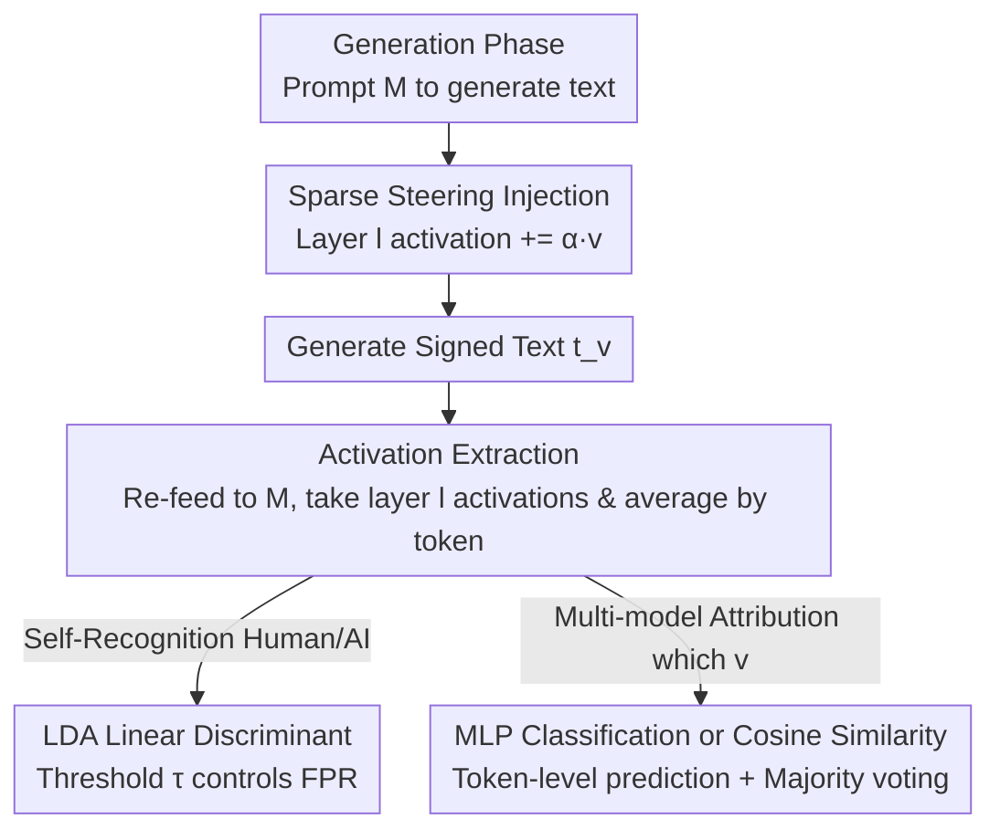

# LLM Self-Recognition: Steering and Retrieving Activation Signatures

**Conference**: ICML 2026  
**arXiv**: [2606.06315](https://arxiv.org/abs/2606.06315)  
**Code**: https://github.com/Thibaud-Ardoin/LLM-Self-Recognition  
**Area**: AIGC Detection / Model Watermarking / Activation Engineering  
**Keywords**: AI Text Detection, Activation Steering, Self-Recognition, Sparse Steering Vectors, Model Attribution

## TL;DR
Instead of watermarking at the token level, this paper injects a random sparse steering vector into the LLM residual stream during generation, creating a detectable "activation signature." The signature is retrieved by re-feeding the text into the same model and calculating cosine similarity or using a lightweight classifier, achieving over 98% accuracy across multiple detection settings with negligible impact on text quality.

## Background & Motivation
**Background**: As LLMs are extensively used for content generation, the authenticity and traceability of AI-generated text have become critical. It is necessary not only to determine if a text is AI-written but also to identify which specific model generated it—essential for auditing, attribution, and abuse prevention. Existing AI-Generated Text Detection (AI-GTD) follows two paths: watermarking, which modifies token probability distributions (e.g., KGW greenlists) or strategic word selection; and post-hoc classifiers, which utilize statistical properties of generated text or are trained on large-scale labeled corpora.

**Limitations of Prior Work**: Watermarking must be embedded in the generation process, incurring extra overhead, and involves a trade-off between robustness and text quality that limits adoption. Post-hoc classifiers are sensitive to cross-domain distribution shifts and naturally struggle to distinguish between "multiple different LLMs." Both approaches treat signatures as "add-ons"—either by modifying output tokens or relying on external statistics.

**Key Challenge**: Can signatures be embedded and retrieved using the **internal representation structure** of the model itself, rather than relying on external token-level mechanisms? Recent interpretability research suggests two findings can be combined: first, LLMs can "self-recognize" their own outputs with non-trivial accuracy, implying that models implicitly encode model-specific information during generation; second, activation engineering shows that directional intervention in internal activations can steer behavior with minimal quality loss.

**Goal**: (1) Verify whether self-recognition is reliable, even in short-text and low-entropy scenarios; (2) Design a simple steering-based watermark that can distinguish between instances of the same model without loss of quality; (3) Analyze the capacity of the activation space to encode and retrieve a random signal.

**Key Insight**: Treat the **internal representations** of the LLM as a "space" for hiding and detecting signals. Since model generation naturally contains fingerprints, an additional, deliberately designed, and easily retrievable signature is injected during inference to make detection more reliable and support multi-model attribution.

**Core Idea**: Use a random sparse vector to steer generation at an intermediate layer, creating a detectable "activation fingerprint." This signal remains retrievable via cosine similarity from activations even after token sampling and re-embedding—as random vectors in high-dimensional space are nearly orthogonal to the semantic manifold, allowing the signature to coexist with semantic content without mutual interference.

## Method

### Overall Architecture
The method is divided into two parts corresponding to two task types. **Self-recognition**: Determining whether text is generated by model $M$ or written by a human. This is done by feeding the text to $M$, extracting activations at an intermediate layer, averaging token-level activations to obtain a fixed-length representation, and using a lightweight linear classifier (LDA). **Multi-model attribution**: Identifying which "steered variant" of the same base model generated the text. This is achieved by adding a random sparse steering vector during generation to create a signature. During detection, the text is re-fed to the model to extract activations, and the corresponding steering vector is identified using cosine similarity (training-free) or a trained MLP (stronger). The entire system operates in a white-box setting—assuming access to internal activations of $M$ when processing the text.

### Key Designs

**1. Sparse Steering Injection: Hiding a Random Fingerprint in the Residual Stream**

Traditional watermarking modifies token probabilities, leading to quality loss and overhead. This paper hides the signature in the activation space. Given a direction vector $\boldsymbol{v}\in\mathbb{R}^d$ and a scaling factor $\alpha>0$, the scaled vector is added to the intermediate activations at layer $l$ at each generation step:

$$\mathbf{A}_l(x_i)\leftarrow\mathbf{A}_l(x_i)+\alpha\boldsymbol{v}$$

This intervention nudges the internal representation trajectory in a consistent direction, imparting the influence of $\boldsymbol{v}$ on the generated text $t_{\boldsymbol{v}}$. Critically, $\boldsymbol{v}$ is **randomly selected** (a different vector for each variant in multi-model attribution to create unique watermarks) and **highly sparse**—with only a very small fraction of dimensions being non-zero (99.7% sparsity fixed in experiments). Why sparse? Compared to dense interventions that modify all hidden dimensions, sparse steering introduces less extra perturbation and yields more stable model behavior, achieving a better balance between "detectability" and "quality loss" (§3.4 shows the trade-off curve of sparse vectors is significantly superior to dense vectors). The same layer $l$ is used for steering and activation extraction to simplify the pipeline.

**2. Activation Extraction and Aggregation: Compressing Arbitrary Text into Fixed-length Representations**

Signals must be retrieved from the model before detection. For an $L$-layer model $M$ and token sequence $\mathbf{x}=[x_0,\dots,x_{n-1}]$ (prompt+completion, or completion-only in prompt-agnostic settings), the intermediate activations $\mathbf{A}_l(x_i)\in\mathbb{R}^d$ are taken at layer $l$ for each token. The extraction layer is fixed near the middle of the network and optimized for each model individually. To obtain a fixed-length representation independent of token length $n$, token-level activations are averaged:

$$\mathbf{r}=\frac{1}{n}\sum_{i=0}^{n-1}\mathbf{A}_l(x_i)\in\mathbb{R}^d$$

This $\mathbf{r}$ serves as the input for subsequent classification. This step is necessary as it allows the method to handle arbitrary text lengths and aggregates the robustness provided by the signal being "distributed across the entire token sequence."

**3. Dual-tier Attribution: LDA for Self-Recognition, MLP for Multi-model**

Different tasks vary in difficulty, so two probes are utilized. **Self-recognition** (Human vs. AI) is relatively simple; a lightweight Linear Discriminant Analysis (LDA) is used. An affine decision function is learned on standardized $\mathbf{r}$ to score text, with a threshold $\tau$ set for target false positive rates. Since LDA covariance estimation can be ill-conditioned in high dimensions, Ledoit–Wolf shrinkage estimation is used for regularization with an 80/20 train/test split. **Multi-model attribution** (distinguishing $K$ steering vectors) is more difficult. An activation labeled set $\mathcal{D}=\{(\mathbf{A}_l(t_{\boldsymbol{v}_k,p}),k)\}$ is constructed with a 70/10/20 split by prompt set (ensuring no prompt leakage). A two-layer MLP (width 32) is trained for one epoch to predict the steering index $k$ per token, then aggregated via majority voting for text-level decision. Since detection occurs at the token level, it can handle text of any length.

**4. Zero-shot Retrieval via Cosine Similarity: Signatures Recoverable Directly Through Discretization**

A counter-intuitive finding is that injected sparse signals can survive the discretization of token sampling and re-embedding. When signed text is re-fed into the **unsteered** base model, the original steering vector can be directly recovered from activations—without training any classifier. This is explained via concentration of measure: in high-dimensional activation spaces, random vectors are nearly orthogonal to the semantic manifold governing routine model behavior. Thus, steering signals can coexist with semantic content without mutual interference, and this orthogonality allows signatures to "piggyback" invisibly. Detection involves calculating the cosine similarity between collected activations and candidate steering vectors to get a per-token attribution score, followed by majority voting. While this zero-shot geometric approach is less powerful than a trained MLP, its accuracy is remarkably high, proving that sparse signals are **physically encoded into the generation sequence** rather than being statistical artifacts.

## Key Experimental Results

### Experimental Setup
- **Models**: Primary use of Llama-3.1-8B; cross-family validation with Ministral-3-8B (8B-class MoE); scalability validation with Llama-3.2-1B / 3B. Instruction-tuned versions used for QA tasks.
- **Datasets**: Low-entropy self-recognition using XL-Sum summaries (English BBC subset, 8192 articles + reference summaries, $\le 2048$ characters); long-form QA using ELI5; high-entropy open generation using a custom Fresh News dataset (news released after training cutoff).
- **Hyperparameters**: Scaling factor $\alpha=5$, sparsity 99.7%, fixed across all model families for fair comparison.

### Main Results 1: Self-Recognition AUROC (XL-Sum, %)

| Model | Ours (w/ prompt) | PPL (w/ prompt) | Ours (no prompt) | PPL (no prompt) |
|------|------|------|------|------|
| Ministral-3-8B | 100 | 99.71 | 99.99 | 32.33 |
| Llama-3.1-8B | 99.99 | 99.19 | 99.16 | 47.86 |
| Llama-3.2-3B | 99.96 | 99.43 | 99.03 | 47.49 |
| Llama-3.2-1B | 99.82 | 97.07 | 98.58 | 52.27 |

The activation classifier is nearly perfect even on low-entropy short summaries and **only drops at most 1 point in the no-prompt setting**; whereas the Perplexity (PPL) baseline collapses to random or even reverses without the prompt (Ministral no-prompt is only 32.33, where human summaries actually have lower perplexity).

### Main Results 2: Multi-model Attribution F1 (Distinguishing two independent steered variants, %)

| Model | ELI5 Token | ELI5 Text | Fresh News Token | Fresh News Text |
|------|------|------|------|------|
| Ministral-3-8B | 99.3 | 100 | 94.6 | 100 |
| Llama-3.1-8B | 94.0 | 99.1 | 90.5 | 99.1 |
| Llama-3.2-3B | 83.3 | 95.5 | 75.5 | 88.3 |
| Llama-3.2-1B | 72.0 | 85.3 | 69.5 | 83.8 |

Detection performance increases with model scale, and text-level results (majority voting) are significantly higher than token-level results.

### Key Findings
- **Zero-shot vs. Training (Table 3)**: Cosine similarity achieved 84.6% (original) and 77.8% (paraphrased) at the text level; trained MLP achieved 99.1% (original) and 89.3% (paraphrased). While geometric methods are inferior to MLP, they are impressive for simple cosine metrics, proving the signal's physical existence.
- **Sparse > Dense (§3.4)**: In the difficult task of distinguishing original vs. steered Llama-3-8B, the "detection-quality" trade-off curve for 99.7% sparse vectors was significantly superior to dense vectors across shifted $\alpha$, indicating that targeted sparse intervention is more robust than broad modifications.
- **Paraphrase Robustness (§3.3)**: When using DIPPER-XXL for multi-sentence paraphrasing, the proposed method is more stable than KGW greenlist watermarks, especially in free generation scenarios, because signals are aggregated across high-level representation space tokens.
- **Counter-intuitive ELI5 > Open Generation**: Low-entropy QA is more separable than open generation, which the authors speculate is related to instruction tuning.
- **Negligible Quality Loss**: Validated using NVIDIA NeMo Curator's quality-classifier-deberta and MMLU; quality and performance degradation after steering are minimal.

## Highlights & Insights
- **Endogenous Signatures**: Instead of modifying token probability distributions, the method utilizes the model's own representation structure to encode attribution signals. This avoids the traditional "robustness vs. quality" trade-off by shifting the perspective to internal states.
- **Utility of Concentration of Measure**: Explaining why signatures can coexist with semantics using "high-dimensional random vectors being approximately orthogonal to the semantic manifold" elevates an engineering trick to a theoretically grounded design—sparse random vectors are the optimal carriers for this geometry.
- **Signal Survival through Discretization**: Steering signals surviving token sampling and re-embedding to be retrieved zero-shot via cosine similarity implies that the "activation $\rightarrow$ discrete token $\rightarrow$ activation" path preserves directional alignment, offering insights into the robustness of LLM representations.
- **Potential for Composable Multi-bit Watermarking**: While current $N$-way classification scalability is limited, overlapping multiple sparse vectors for independent detection could theoretically encode $2^N$ identities, showing promise for combinatorial multi-bit schemes.

## Limitations & Future Work
- **White-box Premise**: Detection requires access to internal activations of $M$, making it unusable in black-box or API-only scenarios, limiting detection of unknown third-party models.
- **Performance Drop in Small Models**: Llama-3.2-1B performs significantly worse on Fresh News (token-level 69.5) and has lower attribution F1, suggesting the method relies on model capacity.
- **Limited Multi-class Scalability**: Classification becomes harder as the number of steered identities increases (Figure 2); $N$-way classification does not easily scale to many identities, and multi-bit schemes remain theoretical.
- **Paraphrasing Vulnerability**: Accuracy drops after paraphrasing (e.g., MLP text-level 99.1 $\rightarrow$ 89.3). If human text is simultaneously paraphrased, it may lead to spoofing attacks against the detector.

## Related Work & Insights
- **vs. Token-level Watermarking (KGW / kirchenbauer2023)**: These modify token distributions or use strategic word lists, facing quality trade-offs and sensitivity to paraphrasing. This work embeds signatures in activation space, providing better robustness and minimal quality loss.
- **vs. Post-hoc Statistical Classifiers (DetectGPT / mitchell2023, PPL)**: These rely on statistical properties of text and are sensitive to distribution shifts and multiple LLMs. This work uses internal activations, remaining stable without prompts and supporting multi-model attribution.
- **vs. Activation Engineering (Panickssery2023, Li2023)**: They use steering vectors to guide behavior (sentiment, hallucinations) along semantic directions. This work uses random orthogonal directions to hide signatures without altering semantics, shifting the goal from "behavior modification" to "retrievable signal embedding."

## Rating
- Novelty: ⭐⭐⭐⭐⭐ Moving watermarks from token level to activation space with sparse random vectors is a fresh perspective.
- Experimental Thoroughness: ⭐⭐⭐⭐ Extensive coverage of models, datasets, and robustness/ablation, though scalability and small model gaps exist.
- Writing Quality: ⭐⭐⭐⭐ Clear motivation and mechanism explanations; some quality evaluation details are relegated to the appendix.
- Value: ⭐⭐⭐⭐ Provides a new white-box paradigm for AI text attribution, relevant for auditing/provenance, though restricted by the white-box requirement.

<!-- RELATED:START -->

## Related Papers

- [\[CVPR 2026\] Enabling Supervised Learning of Generative Signatures for Generalized AI-Generated Images Detection](../../CVPR2026/aigc_detection/enabling_supervised_learning_of_generative_signatures_for_generalized_ai-generat.md)
- [\[ICLR 2026\] Calibrating Verbalized Confidence with Self-Generated Distractors](../../ICLR2026/aigc_detection/calibrating_verbalized_confidence_with_self-generated_distractors.md)
- [\[ACL 2026\] REFLEX: Self-Refining Explainable Fact-Checking via Verdict-Anchored Style Control](../../ACL2026/aigc_detection/reflex_self-refining_explainable_fact-checking_via_verdict-anchored_style_contro.md)
- [\[CVPR 2026\] Investigating Self-Supervised Representations for Audio-Visual Deepfake Detection](../../CVPR2026/aigc_detection/investigating_self-supervised_representations_for_audio-visual_deepfake_detectio.md)
- [\[NeurIPS 2025\] QiMeng-NeuComBack: Self-Evolving Translation from IR to Assembly Code](../../NeurIPS2025/aigc_detection/qimeng-neucomback_self-evolving_translation_from_ir_to_assembly_code.md)

<!-- RELATED:END -->
