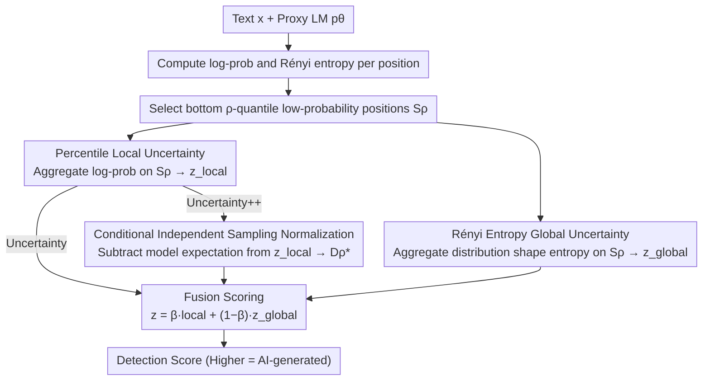

# On the Salience of Low-Probability Tokens for AI-Generated Text Detection: A Multiscale Uncertainty Perspective

**Conference**: ICML 2026  
**arXiv**: [2606.02158](https://arxiv.org/abs/2606.02158)  
**Code**: https://github.com/guoyikai2000/Uncertainty-AIGT  
**Area**: AIGC Detection / Statistical AI Text Detection / Zero-shot Detection  
**Keywords**: AIGT Detection, Low-probability tokens, Rényi entropy, Multiscale uncertainty, Conditional independent sampling

## TL;DR
To address the chronic issues of "high-frequency boilerplate signal dilution" and "brittle point estimates" in zero-shot AI-generated text detection, the authors propose the Uncertainty / Uncertainty++ detectors. These detectors aggregate log-probs only on low-probability tokens at the bottom $\rho$-percentile of each text segment and overlay Rényi entropy from the same positions as a distribution shape signal. This approach improves the average AUROC from 86.49 (Lastde) to 88.74 across 12 generators and 7 datasets, demonstrating significantly greater stability under perturbations such as paraphrasing or modified decoding strategies.

## Background & Motivation

**Background**: Current AI text detection is dominated by three main approaches: watermarking (embedding signatures during generation), fine-tuned discriminators (training classification heads on labeled corpora), and statistical methods (aggregating token-level likelihoods using a proxy LM). Watermarking is ineffective for most public LLMs, and fine-tuning suffers from poor cross-generator/cross-domain generalization and high costs. Statistical methods remain the de facto standard for zero-shot scenarios due to their efficiency and generalization, represented by methods like Likelihood, LogRank, DetectGPT, DetectLRR, Fast-DetectGPT, and Lastde.

**Limitations of Prior Work**: Statistical methods currently face two specific hurdles.
First is **boilerplate dominance**: indiscriminately averaging $\log p_\theta(x_i \mid x_{<i})$ for all tokens allows high-probability boilerplate shared by humans and LLMs (e.g., "propose an efficient framework", "in this paper we") to dilute the signal. These tokens score high for both classes, contributing nothing to classification while skewing the average, leading to human text being misclassified as AI.
Second is **brittle point estimates**: collapsing the entire conditional distribution at each position into a single scalar (the probability of the actual token) discards distribution shape information. Any paraphrase or change in decoding strategy can push this point estimate far enough to flip the decision.

**Key Challenge**: Boilerplate dilutes signals because it resides in the head of the distribution (high-probability regions); point estimates are brittle because they reflect a single sampling realization rather than the entire distribution. The former requires "isolating truly discriminative positions," while the latter requires "using distribution-level features rather than point features." A natural hypothesis is that discriminative signals are concentrated in low-probability tokens and should be described using distribution-level uncertainty measures (entropy) rather than single-point log-probs.

**Goal**: Developing a statistical detector that is resistant to both boilerplate and paraphrasing under zero-shot, training-free conditions.

**Key Insight**: The authors validate the "Low-Probability Discriminability" hypothesis. On XSum + LLaMA3-8B + GPT-J, they separately analyzed low-probability positions (bottom $\rho=0.15$) and top high-probability positions. The Human–AI LogRank gap at low-probability positions was 1.59 (vs. 0.45 for high-probability positions, a 3.5× difference), and the probability ratio between AI and human text was 9.69× vs. 1.38×. This indicates that statistical signals at low-probability positions are nearly an order of magnitude stronger than at high-probability positions, warranting specialized aggregation.

**Core Idea**: Aggregate two complementary signals solely at low-probability quantiles: the local log-prob mean (reflecting how "surprised" the model is by the actual token) and the global Rényi entropy mean (reflecting the shape of the entire distribution at that position). These are fused into a unified score, with Uncertainty++ using conditional independent sampling for normalization to enhance stability.

## Method

### Overall Architecture

The method addresses the dual problems of signal dilution via full-sequence averaging and the fragility of single-point log-probs. For any text $\mathbf{x}=\{x_i\}_{i=0}^{n-1}$ and a proxy/source LM $p_\theta$, the method extracts both the "log-probability of the actual token" and the "Rényi entropy of the entire conditional distribution" at each position. It then selects the subset of positions with the lowest probabilities within the sequence and fuses the local log-prob signals and global entropy signals from this subset into a single scalar score (higher scores indicate AI origin). Uncertainty++ replaces the local signal with a version normalized by conditional independent sampling for improved robustness.

### Key Designs

**1. Percentile Local Uncertainty: Constraining Mean Pooling to Low-Probability Positions to Suppress Boilerplate Dilution**

The limitation of averaging $\log p_\theta(x_i\mid x_{<i})$ for all tokens is that high-probability boilerplate shared by humans and LLMs drags the average toward a common value. The authors define a percentile aggregation operator:
$$\mathcal{Q}_\rho(\{y_i\}) = \frac{1}{|\mathcal{S}_\rho|}\sum_{i \in \mathcal{S}_\rho} y_i$$
where $\mathcal{S}_\rho$ is the set of positions in the bottom $\rho$ percentile after sorting by actual probability. Applying this to token-level log-probs yields the local signal $z_\text{local} = \mathcal{Q}_\rho(\{\log p_\theta(x_i \mid x_{<i})\}_{i=1}^{n-1})$. This is effective because discriminative power resides in an asymmetry: "AI does not select low-probability words as infrequently as humans do." Proposition 3.2 identifies $\mathcal{Q}_\rho$ as a concave operator, and Jensen's inequality gives $\mathbb{E}\,\mathcal{Q}_\rho \le \mathcal{Q}_\rho(\mathbb{E})$. Proposition 3.3 empirically finds that on AI text, the normalized Percentile Discrepancy $D_\rho^* = 2.18$ significantly exceeds both the Jensen lower bound $\tilde{D}_\rho^* = 1.34$ and the full-sequence baseline $D_1^* = 1.43$, while all three are $\approx 0$ on human text. This "Jensen amplification asymmetry" unique to AI text allows low-probability aggregation to extract significantly more signal than Fast-DetectGPT. A smaller $\rho$ provides a purer signal but higher variance; 0.15 is the default balance point.

**2. Rényi Entropy-Based Global Uncertainty: Replacing Point Sampling with Distribution Shape for Robustness Against Paraphrasing**

The second limitation is that collapsing the conditional distribution into a single token probability discards shape information, which is easily disrupted by paraphrasing or decoding changes. The solution is to use $\alpha$-order Rényi entropy $H_\alpha(p) = \frac{1}{1-\alpha}\log\sum_{v \in \mathcal{V}} p(v)^\alpha$ to characterize the uncertainty of the entire distribution at each position, averaged over the same low-probability set $\mathcal{S}_\rho$: $z_\text{global} = \frac{1}{|\mathcal{S}_\rho|}\sum_{i \in \mathcal{S}_\rho} H_\alpha(p_\theta(\cdot \mid x_{<i}))$. This choice is analytically grounded: Proposition 3.4 proves that under a multinomial perturbation $p \to p/\gamma$, log-prob changes exactly by $\log\gamma$ and grows unboundedly as $\gamma\to\infty$, whereas the change in Rényi entropy at low-probability positions ($p_\theta(x_i)\le\tau$ and $\tau\le(S_\alpha/2)^{1/\alpha}$) is bounded by $O(\tau^{\min(\alpha,1)})$, staying bounded even as $\gamma$ increases. The order $\alpha$ acts as a dial—$\alpha<1$ emphasizes the distribution tail, while $\alpha>1$ emphasizes the head—creating a selective bias in the vocabulary dimension that complements the low-probability filtering in the token dimension. Applying $\mathcal{Q}_\rho$ to entropy also allows the local and global paths to share the same $\rho$, simplifying the system.

**3. Conditional Independent Sampling Normalization: Aligning Local Signals to Model Expectation (Uncertainty++)**

The absolute value of local log-prob can drift with text length and domain, making cross-sample comparisons difficult. Borrowing the "actual vs. expected" concept from Fast-DetectGPT, $z_\text{local}$ is adjusted by subtracting its expectation under the model's own distribution. At each position, using the original prefix $x_{<i}$ (rather than the sampled token), $\tilde{x}_i \sim p_\theta(\cdot \mid x_{<i})$ is independently sampled. The Percentile Discrepancy is defined as $D_\rho = z_\text{local} - \mathbb{E}\,\mathcal{Q}_\rho(\{\log p_\theta(\tilde{x}_i \mid x_{<i})\})$ and its normalized version as $D_\rho^* = D_\rho / \sqrt{\mathrm{Var}\,\mathcal{Q}_\rho(\{\log p_\theta(\tilde{x}_i \mid x_{<i})\})}$, estimated via $m$ independent Monte Carlo samples. Log-probs for AI text are significantly higher than their distribution expectations ($D_\rho^*\gg 0$), while human text stays close to the expectation ($D_\rho^*\approx 0$). This normalization captures the discriminative gain of quantile filtering while preserving stability. The final Uncertainty++ score fuses the normalized local signal with the global entropy signal: $z_{++} = \beta D_\rho^* + (1-\beta) z_\text{global}$ (the base Uncertainty version uses $z_\text{local}$ instead of $D_\rho^*$).

### Loss & Training

The entire method is a training-free, zero-shot detector with no parameter training involved. Hyperparameters (percentile $\rho$, Rényi order $\alpha$, fusion weight $\beta$, sample count $m$) were selected via grid search on a validation set, with sensitivity curves provided in Figure 3 of Section 4.

## Key Experimental Results

### Main Results

| Method | Average AUROC (12 source models × 3 datasets, black-box) | Category |
|------|------|------|
| Likelihood | 71.33 | Probability Baseline |
| LogRank | 74.83 | Probability Baseline |
| DetectLRR | 80.28 | Probability SOTA |
| Lastde | 86.49 | Previous Probability SOTA |
| **Uncertainty (Ours)** | **88.74** | **New Probability SOTA**, +2.25 vs Lastde |
| DetectGPT | 70.94 | Sampling Baseline |
| DetectNPR | slightly higher than DetectGPT | Sampling Baseline |

Across 12 generators, Ours achieved the best or tied-for-best performance on GPT-2, GPT-Neo-2.7B, Llama2-13B, Gemma-7B, Phi-2, and GPT-4-Turbo (slightly trailing Likelihood on Llama3-8B where Likelihood was already at 99.57 due to ceiling effects).

### Ablation Study

| Configuration | Observation | Implication |
|------|---------|------|
| Full average ($\rho = 1$) | Performance drops to near Fast-DetectGPT levels | Confirms "quantile filtering" provides the core gain |
| Remove $z_\text{global}$ (local only) | Significant drop under paraphrasing/decoding changes | Rényi entropy is essential for robustness |
| Remove $z_\text{local}$ (global only) | Greater performance drop on simple datasets | Local log-prob remains the primary discriminative signal |
| Uncertainty → Uncertainty++ | Better stability across domains/generators, slight AUROC gain | Conditional sampling normalization absorbs text length/domain bias |
| Varying $\rho$ | Low $\rho \to$ high variance; High $\rho \to$ weak signal; 0.10–0.20 is optimal | Consistent with the "low-probability tokens carry strong signal" hypothesis |
| Varying $\alpha$ | $\alpha < 1$ (tail emphasis) works best with quantile filtering | Confirms distribution shape signals require a tail bias in vocabulary |

### Key Findings

- The quantified discriminative power comparison (LogRank gap 1.59 vs 0.45, prob ratio 9.69× vs 1.38× for low- vs high-probability positions) in XSum + LLaMA3 + GPT-J is the strongest evidence. This 3.5× to 7× gap suggests traditional full-sequence averaging is self-defeating.
- The Jensen amplification effect ($D_\rho^* > \tilde{D}_\rho^*$) appearing only in AI text, while human discrepancy stays near zero, indicates that low-probability aggregation captures a class-conditional asymmetric signal rather than just adding noise.
- The robustness bound for Rényi entropy $O(\tau^{\min(\alpha,1)})$ provides an analytical explanation for why paraphrasing fails to evade detection. While log-prob scales linearly with multiplicative perturbations, entropy at low-probability positions behaves as a higher-order small quantity—a rare theoretical conclusion in statistical detection.

## Highlights & Insights

- The paper converts a simple intuition ("look at low-probability words") into a rigorous framework using concave operators, Jensen’s inequality, and Rényi entropy perturbation bounds. The density of evidence—hypothetical, empirical, theoretical, and experimental—is exceptionally high for this field.
- The idea of "replacing point estimates with entropy" is transferable to any downstream task relying on LM token-level signals, such as membership inference, training data contamination detection, or low-probability event sampling evaluation.
- The three hyperparameters $\rho$, $\alpha$, and $\beta$ control token-dimension filtering, vocab-dimension bias, and signal fusion weights, respectively, forming a clear design space for future adaptive tuning.

## Limitations & Future Work

- Experiments are primarily English-centric; whether low-probability token discriminability holds in morphologically-rich languages like Chinese, Japanese, or Arabic remains an open question.
- The method requires the proxy/source LM to output the full vocabulary softmax distribution to calculate Rényi entropy. This restricts use with commercial APIs (like recent OpenAI models) that only expose top-k logprobs, as the paper does not discuss top-k entropy approximation.
- Optimal values for $\rho$, $\alpha$, and $\beta$ shift slightly by generator and dataset. The paper uses grid search rather than automatic adaptation, requiring small-sample calibration for unknown generators.
- Robustness against the strongest adaptive attackers (who might deliberately re-generate text to shift low-probability words into the high-probability head) was not evaluated, focusing only on general paraphrasing and decoding perturbations.

## Related Work & Insights

- **vs. Fast-DetectGPT (Bao et al. 2024)**: Fast-DetectGPT is the direct ancestor of the normalization used here, employing conditional independent sampling for $\mathbb{E}\log p$ but averaging over the entire sequence. Ours effectively switches the signal source to the low-probability quantile and adds Rényi entropy as an orthogonal supplement.
- **vs. Lastde**: While Lastde achieved 86.49 AUROC across 12 models (previously the strongest probability method), Ours exceeds it by 2.25 percentage points using the same black-box settings, primarily due to the synergy of low-probability aggregation and distribution shape signals.
- **vs. DetectGPT / DetectNPR (Sampling)**: Sampling methods measure probability curvature via multiple perturbations, which is computationally expensive and less robust against paraphrasing. Ours demonstrates superior robustness with just one forward pass and one conditional sampling stage.
- **vs. Watermarking / Fine-tuned Detectors**: Ours requires no generation-stage cooperation and no labeled training data, following a pure zero-shot route. It is ideal for scenarios where model weights cannot be modified or generation pipelines are inaccessible, such as academic integrity or media provenance.

<!-- RELATED:START -->

## Related Papers

- [\[ICML 2026\] Feature-Augmented Transformers for Robust AI-Text Detection Across Domains and Generators](feature-augmented_transformers_for_robust_ai-text_detection_across_domains_and_g.md)
- [\[ICML 2026\] Black-Box Detection of LLM-Generated Text Using Generalized Jensen-Shannon Divergence](black-box_detection_of_llm-generated_text_using_generalized_jensen-shannon_diver.md)
- [\[ACL 2025\] Low-Perplexity LLM-Generated Sequences and Where To Find Them](../../ACL2025/aigc_detection/low-perplexity_llm-generated_sequences_and_where_to_find_them.md)
- [\[ACL 2026\] C-ReD: A Comprehensive Chinese Benchmark for AI-Generated Text Detection Derived from Real-World Prompts](../../ACL2026/aigc_detection/c-red_a_comprehensive_chinese_benchmark_for_ai-generated_text_detection_derived_.md)
- [\[ICML 2026\] Dissect and Prune: Enhancing Robustness in AI-Generated Image Detection](dissect_and_prune_enhancing_robustness_in_ai-generated_image_detection.md)

<!-- RELATED:END -->
