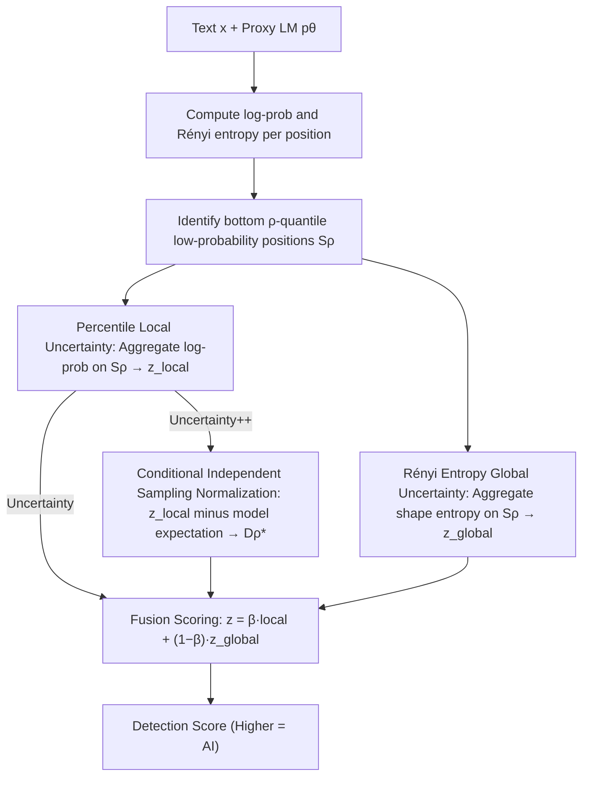

# On the Salience of Low-Probability Tokens for AI-Generated Text Detection: A Multiscale Uncertainty Perspective

**Conference**: ICML 2026  
**arXiv**: [2606.02158](https://arxiv.org/abs/2606.02158)  
**Code**: https://github.com/guoyikai2000/Uncertainty-AIGT  
**Area**: AIGC Detection / Statistical AI Text Detection / Zero-shot Detection  
**Keywords**: AIGT Detection, Low-probability tokens, Rényi entropy, Multiscale uncertainty, Conditional independent sampling

## TL;DR
Addressing the issues of "high-frequency boilerplate diluting signals" and "point-probability fragility" in zero-shot AI text detection, the authors propose Uncertainty / Uncertainty++ detectors. These detectors aggregate log-probs only on the low-probability tokens at the $\rho$-th quantile of each text segment and overlay Rényi entropy from the same positions as a distribution shape signal. This approach improves the average AUROC from 86.49 (Lastde) to 88.74 across 12 generators and 7 datasets, demonstrating significantly higher stability under perturbations such as rewriting or alternative decoding.

## Background & Motivation

**Background**: Current AI text detection focuses on three main paradigms: watermarking (embedding signatures during generation), fine-tuned classifiers (training detection heads on labeled corpora), and statistical methods (aggregating token-level likelihoods using a proxy LM). Watermarking is ineffective for most public LLMs, and fine-tuning suffers from poor cross-generator/domain generalization and high costs. Statistical methods remain the de facto standard for zero-shot scenarios due to their efficiency and generalization, represented by Likelihood, LogRank, DetectGPT, DetectLRR, Fast-DetectGPT, and Lastde.

**Limitations of Prior Work**: Statistical methods currently face two specific hurdles.
First, **boilerplate dominance**: Averaging $\log p_\theta(x_i \mid x_{<i})$ across all tokens indiscriminately leads to dilution by high-probability boilerplate common to both humans and LLMs (e.g., "propose an efficient framework", "in this paper we"). These tokens score high for both classes, contributing nothing to classification while skewing the average, often causing human text to be misclassified as AI.
Second, **brittle point estimates**: Collapsing the entire conditional distribution at each position into a single scalar (the probability of the actual token) discards distribution shape information. Slight rewriting or a change in decoding strategy can shift this point estimate significantly, flipping the decision.

**Key Challenge**: Boilerplate dilutes signals because it resides in the head of the distribution (high-probability regions). Point estimates are fragile because they reflect a single sampling realization rather than the entire distribution. The former requires "isolating truly discriminative positions," while the latter requires "distribution-level features instead of point features." A natural hypothesis is that discriminative signals are concentrated in low-probability tokens and should be described by distribution-level uncertainty metrics (entropy) rather than single-point log-probs.

**Goal**: To build a training-free, zero-shot statistical detector that is resilient to both boilerplate and rewriting.

**Key Insight**: The authors validated the "Low-Probability Discriminability" hypothesis. On XSum + LLaMA3-8B + GPT-J, by separating the bottom $\rho=0.15$ low-probability positions from the top high-probability positions, the Human–AI LogRank gap at the bottom was 1.59 (vs. 0.45 at the top, a 3.5× difference). The AI/Human probability ratio was 9.69× vs. 1.38× respectively. This suggests that statistical signals at low-probability positions are nearly an order of magnitude stronger, justifying specialized aggregation.

**Core Idea**: Aggregate two complementary signals only at low-probability quantiles: the mean local log-prob (reflecting how "surprised" the local token is) + the mean global Rényi entropy (reflecting the shape of the distribution at that position). These are fused into a unified score, with Uncertainty++ using conditional independent sampling for normalization to enhance stability.

## Method

### Overall Architecture

The method addresses the dual problems of signal dilution in full-sequence averaging and the fragility of point log-probs. For any given text $\mathbf{x}=\{x_i\}_{i=0}^{n-1}$ and a proxy/source LM $p_\theta$, it simultaneously extracts the "log-probability of the actual token" and the "Rényi entropy of the entire conditional distribution" at each position. It then selects the subset of positions with the lowest probabilities in the sequence and weights the local log-prob and global entropy signals into a scalar score. Higher scores indicate a higher likelihood of AI origin. Uncertainty++ further replaces the local signal with a version normalized by conditional independent sampling.

### Key Designs

**1. Percentile Local Uncertainty: Restricting average pooling to low-probability positions to suppress boilerplate dilution**

The bottleneck is that averaging $\log p_\theta(x_i\mid x_{<i})$ across all tokens allows high-probability boilerplate shared by humans and LLMs to wash out signals. The authors define a percentile aggregation operator $\mathcal{Q}_\rho(\{y_i\}) = \frac{1}{|\mathcal{S}_\rho|}\sum_{i \in \mathcal{S}_\rho} y_i$, where $\mathcal{S}_\rho$ is the set of positions in the bottom $\rho$ quantile when sorted by probability. Applying this to token-level log-probs yields the local signal $z_\text{local} = \mathcal{Q}_\rho(\{\log p_\theta(x_i \mid x_{<i})\}_{i=1}^{n-1})$. This works because discriminability lies in the asymmetry where "AI does not actually choose low-probability words as infrequently as humans do." Proposition 3.2 shows $\mathcal{Q}_\rho$ is a concave operator, and Jensen's inequality gives $\mathbb{E}\,\mathcal{Q}_\rho \le \mathcal{Q}_\rho(\mathbb{E})$. Proposition 3.3 finds that on AI text, the normalized Percentile Discrepancy $D_\rho^* = 2.18$ is much larger than the Jensen bound $\tilde{D}_\rho^* = 1.34$ and the full-sequence baseline $D_1^* = 1.43$, whereas all three are $\approx 0$ on human text. This "Jensen amplification asymmetry" unique to AI text allows low-probability aggregation to extract more signal than Fast-DetectGPT. A smaller $\rho$ provides purer signals but higher variance; 0.15 is the default balance point.

**2. Rényi Entropy-based Global Uncertainty: Replacing point sampling with distribution shape for robustness**

Collapsing the conditional distribution into a single point probability loses shape information and is susceptible to rewriting. The solution is using $\alpha$-order Rényi entropy $H_\alpha(p) = \frac{1}{1-\alpha}\log\sum_{v \in \mathcal{V}} p(v)^\alpha$ to characterize the uncertainty of the entire distribution at a position, averaged over the same low-probability set $\mathcal{S}_\rho$: $z_\text{global} = \frac{1}{|\mathcal{S}_\rho|}\sum_{i \in \mathcal{S}_\rho} H_\alpha(p_\theta(\cdot \mid x_{<i}))$. This is analytically robust: Proposition 3.4 proves that under multinomial perturbation $p \to p/\gamma$, log-probs change by exactly $\log\gamma$ and grow unboundedly as $\gamma\to\infty$, whereas the change in Rényi entropy at low-probability positions ($p_\theta(x_i)\le\tau$ and $\tau\le(S_\alpha/2)^{1/\alpha}$) is bounded by $O(\tau^{\min(\alpha,1)})$, remaining finite even as $\gamma$ increases. The order $\alpha$ acts as a dial—$\alpha<1$ emphasizes the tail while $\alpha>1$ emphasizes the head—creating a selective bias in the vocabulary dimension that complements the low-probability filtering in the token dimension. Applying $\mathcal{Q}_\rho$ to entropy also allows the local and global paths to share the same $\rho$.

**3. Conditional Independent Sampling Normalization: Aligning local signals with model expectation for Uncertainty++**

The absolute value of local log-prob drifts with text length and domain. Following Fast-DetectGPT's "actual vs. expected" logic, $z_\text{local}$ is adjusted by subtracting its expectation under the model's own distribution. At each position, an independent token $\tilde{x}_i \sim p_\theta(\cdot \mid x_{<i})$ is sampled using the original prefix $x_{<i}$. This defines the Percentile Discrepancy $D_\rho = z_\text{local} - \mathbb{E}\,\mathcal{Q}_\rho(\{\log p_\theta(\tilde{x}_i \mid x_{<i})\})$ and its normalized version $D_\rho^* = D_\rho / \sqrt{\mathrm{Var}\,\mathcal{Q}_\rho(\{\log p_\theta(\tilde{x}_i \mid x_{<i})\})}$, estimated via $m$ Monte Carlo samples. AI text log-probs significantly exceed expectations ($D_\rho^*\gg 0$), while human text stays near expectation ($D_\rho^*\approx 0$). The final Uncertainty++ score fuses the normalized local signal with the global entropy: $z_{++} = \beta D_\rho^* + (1-\beta) z_\text{global}$ (the base Uncertainty version uses $z_\text{local}$ instead of $D_\rho^*$).

### Loss & Training
The method is a training-free, zero-shot detector. Hyperparameters ($\rho$, $\alpha$, $\beta$, $m$) are optimized via grid search on a validation set. Section 4, Figure 3 of the paper provides sensitivity curves.

## Key Experimental Results

### Main Results

| Method | Avg AUROC (12 source models × 3 datasets, black-box) | Category |
|------|------|------|
| Likelihood | 71.33 | Probability Baseline |
| LogRank | 74.83 | Probability Baseline |
| DetectLRR | 80.28 | Prev. SOTA |
| Lastde | 86.49 | Prev. SOTA (Probability) |
| **Uncertainty (Ours)** | **88.74** | **New SOTA (Probability)**, +2.25 vs. Lastde |
| DetectGPT | 70.94 | Sampling Baseline |
| DetectNPR | ~DetectGPT | Sampling Baseline |

Across 12 generators, the proposed method achieved best or tied-best results on GPT-2, GPT-Neo-2.7B, Llama2-13B, Gemma-7B, Phi-2, and GPT-4-Turbo. On Llama3-8B, it was narrowly behind Likelihood (which reached 99.57, hitting a ceiling).

### Ablation Study

| Configuration | Observation | Insight |
|------|---------|------|
| Full averaging ($\rho = 1$) | Performance drops to near Fast-DetectGPT levels | Confirms "quantile filtering" provides the core gain |
| Disable $z_\text{global}$ (local only) | Significant drop under rewriting/decoding change | Rényi entropy is essential for "perturbation resistance" |
| Disable $z_\text{local}$ (global only) | Larger drop on simple datasets | Local log-prob remains the primary discriminative signal |
| Uncertainty → Uncertainty++ | More stable across domains/generators; slight AUROC gain | Normalization absorbs text length/domain biases |
| Varying $\rho$ | Small → High variance; Large → Weak signal; 0.10–0.20 is optimal | Consistent with the "Low-prob tokens carry strong signals" hypothesis |
| Varying $\alpha$ | $\alpha < 1$ (tail emphasis) works best with quantile filtering | Confirms distribution shape needs tail bias in vocabulary space |

### Key Findings

- The comparative discriminative power of low-probability vs. high-probability positions (LogRank gap 1.59 vs. 0.45, prob ratio 9.69× vs. 1.38×) is the strongest evidence. The 3.5× to 7× gap suggests traditional sequence averaging is essentially "self-sabotage."
- The Jensen amplification effect ($D_\rho^* > \tilde{D}_\rho^*$) appears only in AI text. In human text, discrepancies are near zero. This indicates low-probability aggregation captures a class-conditional asymmetric signal rather than just adding noise.
- The robustness bound $O(\tau^{\min(\alpha,1)})$ for Rényi entropy provides an analytical explanation for why rewriting fails to break the detection. While log-prob scales linearly with multiplicative perturbations, entropy at low-probability positions behaves as a higher-order small quantity.

## Highlights & Insights

- The paper transforms a simple intuition ("look at rare words") into a formal framework featuring concave operators, Jensen's inequality, and Rényi entropy bounds. The density of logical proof across hypothesis, empirical data, theory, and experiments exceeds that of typical statistical detection papers.
- The "entropy vs. point estimate" idea is transferable to other tasks relying on LM token-level signals, such as membership inference, data contamination detection, and rare-event sampling evaluation.
- The three hyperparameters $\rho$, $\alpha$, and $\beta$ control token-dimension filtering, vocabulary-dimension bias, and signal fusion, respectively, forming a clear geometric design space.

## Limitations & Future Work

- Experiments are primarily English-centric; it remains unverified if the discriminative power of low-probability tokens holds in morphologically rich languages like Chinese, Japanese, or Arabic.
- The method requires full vocabulary softmax distributions for Rényi entropy. This may be restricted for commercial APIs (like newer OpenAI models) that only provide top-k logprobs.
- Optimal $\rho$, $\alpha$, and $\beta$ values drift slightly by generator/dataset, currently requiring grid search. Future work could automate this adaptation.
- Robustness against strong adaptive attackers (who might deliberately replace low-probability tokens with high-probability ones) was not evaluated beyond general rewriting and decoding perturbations.

## Related Work & Insights

- **vs. Fast-DetectGPT (Bao et al. 2024)**: Fast-DetectGPT is the direct ancestor of this normalization approach ($\mathbb{E}\log p$ estimation), but it averages over the whole sequence. Ours narrows the "signal source" to the low-probability quantile and adds Rényi entropy as an orthogonal supplement.
- **vs. Lastde**: Lastde reached 86.49 AUROC; ours consistently exceeds this by 2.25 points. The gain comes from the synergy between low-probability aggregation and distribution shape signals.
- **vs. DetectGPT / DetectNPR (Sampling-based)**: Sampling methods measure curvature through multiple perturbations, which is computationally expensive and less robust to paraphrasing. Ours achieves better robustness with just one forward pass and one conditional sampling step.
- **vs. Watermarking / Fine-tuned Detectors**: Ours requires no collaboration during generation and no labeled training data. It is a pure zero-shot approach with the lowest deployment cost, ideal for scenarios where model weights are inaccessible or the generation pipeline cannot be modified.

<!-- RELATED:START -->

## Related Papers

- [\[ICML 2026\] Feature-Augmented Transformers for Robust AI-Text Detection Across Domains and Generators](feature-augmented_transformers_for_robust_ai-text_detection_across_domains_and_g.md)
- [\[ICML 2026\] Black-Box Detection of LLM-Generated Text Using Generalized Jensen-Shannon Divergence](black-box_detection_of_llm-generated_text_using_generalized_jensen-shannon_diver.md)
- [\[ACL 2025\] Low-Perplexity LLM-Generated Sequences and Where To Find Them](../../ACL2025/aigc_detection/low-perplexity_llm-generated_sequences_and_where_to_find_them.md)
- [\[ACL 2026\] C-ReD: A Comprehensive Chinese Benchmark for AI-Generated Text Detection Derived from Real-World Prompts](../../ACL2026/aigc_detection/c-red_a_comprehensive_chinese_benchmark_for_ai-generated_text_detection_derived_.md)
- [\[CVPR 2026\] Quality-Aware Calibration for AI-Generated Image Detection in the Wild](../../CVPR2026/aigc_detection/quality-aware_calibration_for_ai-generated_image_detection_in_the_wild.md)

<!-- RELATED:END -->
