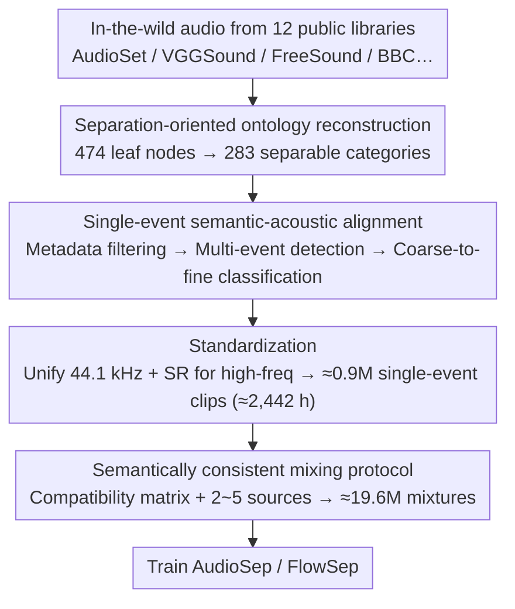

# A Semantically Consistent Dataset for Data-Efficient Query-Based Universal Sound Separation

**Conference**: ICML 2026  
**arXiv**: [2601.22599](https://arxiv.org/abs/2601.22599)  
**Code**: https://cslikai.cn/Hive  
**Area**: Audio & Speech / Universal Sound Separation  
**Keywords**: Universal Sound Separation, Audio Dataset, Semantically Consistent Mixing, Data-Efficient, Single-Event Mining  

## TL;DR
This paper proposes Hive, a universal sound separation dataset constructed via single-event purification and semantically consistent mixing. Using approximately 2.4k hours of high-purity source audio, it enables AudioSep and FlowSep to approach or even exceed the performance of systems trained on million-hour datasets across multiple separation metrics.

## Background & Motivation
**Background**: Query-based Universal Sound Separation (USS) aims to separate any target sound from complex mixtures based on text, audio, or visual prompts. Existing approaches are generally divided into two categories: discriminative methods like AudioSep that directly estimate the target signal, and generative methods like FlowSep or SAM-Audio that leverage distribution modeling or unified prompting interfaces.

**Limitations of Prior Work**: Many methods rely on large-scale in-the-wild audio from sources like AudioSet and VGGSound. Despite their scale, these datasets often provide only weak labels; for example, a "rain" segment may be persistently accompanied by wind, traffic, or speech. Under such supervision, models easily learn co-occurring backgrounds as part of the target category, resulting in residual interference or unnecessary background textures in the separation results.

**Key Challenge**: Universal sound separation requires both open-category coverage and clean, locatable supervisory signals. Simply increasing data and model scale can mitigate some issues but also amplifies weak labels and co-occurrence biases, leading to ever-increasing training costs.

**Goal**: The authors aim to address a more data-centric question: If training sources are first purified into high-purity single events and then synthesized using semantically reasonable mixtures, can competitive USS models be trained with significantly less data?

**Key Insight**: Instead of proposing a new separation network, the paper identifies the bottleneck in the data generation process itself. It treats "source event purity" and "mixture rationality" as two independent quality axes, controlled by multimodal model-assisted cleaning and a semantic compatibility matrix, respectively.

**Core Idea**: Replace random concatenation of weakly labeled in-the-wild audio with high-purity single-event mining and semantically consistent mixing.

## Method
The Hive methodology focuses on an offline data construction pipeline: extracting candidate segments from multiple public audio libraries, aligning them to a taxonomy better suited for separation tasks, and synthesizing multi-source mixtures according to semantic compatibility. The goal is to make every supervisory sample more reliable rather than just making the dataset "larger."

### Overall Architecture
The input consists of in-the-wild audio from 12 public sources including AudioSet, VGGSound, FreeSound, and BBC Sound Effects. The output comprises two data layers: approximately 0.9M high-purity single-event clips totaling about 2,442 hours, and 19.6M training/validation/test mixture samples synthesized from these clips, totaling approximately 22.4k hours of mixed audio.

The pipeline consists of three steps. First, ontology reconstruction: compressing 474 AudioSet leaf nodes into 283 more separable event categories, removing environmental or format labels like "Inside" or "MP4." Second, single-event semantic-acoustic alignment: combining metadata filtering, multi-event detection, and coarse-to-fine classification to ensure each segment contains only one clear foreground event. Third, sampling rate and spectral standardization: unifying sources to 44.1 kHz and using super-resolution models to restore high-frequency details for low-sample-rate audio.

In the synthesis stage, instead of random mixing, the paper constructs a binary semantic compatibility matrix between event categories. Each mixture sample starts with an anchor event, then iteratively adds other sources that are pairwise compatible with all selected events, with the number of sources ranging from 2 to 5. All source segments undergo length, loudness, and SNR normalization before being combined via an additive mixing model.

### Key Designs

**1. Separation-oriented ontology reconstruction: Refinement of weakly labeled space into separable event categories.**

Universal sound separation requires target categories to be mutually exclusive and acoustically distinguishable. However, the standard AudioSet ontology contains 474 leaf nodes with significant semantic overlap and fine granularity, making the labels themselves ambiguous. The authors performed an expert-driven reconstruction: merging synonymous or acoustically overlapping labels (e.g., merging "Drum beat" into "Drum"), grouping fine-grained biological sounds with weak acoustic differences (e.g., "Fowl", "Coo") into parent classes, and removing non-locatable labels describing environments ("indoor"), formats ("MP4"), or abstract attributes. This results in 283 leaf nodes focused on "separable foreground events," providing more distinct supervisory targets.

**2. Single-event semantic-acoustic alignment: Filtering wild segments for single foreground events with accurate labels.**

Since raw labels for in-the-wild audio are weak and often involve event co-occurrence, a coarse-to-fine filtering process was implemented. After aggregating audio from 12 public libraries, multi-label samples were discarded. A multimodal LLM, Qwen3-Omni, was used for zero-shot binary classification to remove unlabelled co-occurrences or transient interference. Subsequently, an audio-tagging model predicted coarse-grained parent classes, and Qwen3-Omni refined these within candidate sub-classes to identify specific leaf nodes. This division of labor—robust screening by the tagging model and semantic refinement by the MLLM—reduces misassignments in long-tail categories.

**3. Semantically consistent mixing protocol: Constraint-based synthesis using a compatibility matrix.**

Even with clean source audio, random mixing can create unnatural combinations (e.g., aquatic animals in city traffic), introducing incorrect contextual priors. The authors constructed a binary semantic compatibility matrix $M \in \{0,1\}^{N \times N}$ to define which event types can naturally co-occur. For each mixture, a source count $C \in \{2,\dots,5\}$ and an anchor event are selected. Sources are added only if they are pairwise compatible with all already-selected events. Sources are normalized by duration (4s for training, 10s for testing) and loudness (RMS=0.1), with interference SNR sampled from $[-5,5]$ dB. This semantic constraint forces the model to learn separation in realistic scenarios. Ablation showed that replacing this protocol with random mixing drops AudioSep's SDR by 1.0 dB.

### Loss & Training
The primary contribution is the dataset and its construction protocol. Separation models are trained using the original architectures and hyperparameters of AudioSep and FlowSep. AudioSep uses AdamW, a batch size of 64, and an initial learning rate of $10^{-3}$ with a plateau scheduler. FlowSep uses a fixed learning rate of $5 \times 10^{-5}$. Both were trained for approximately 3M steps on Hive, with outputs resampled to 44.1 kHz for evaluation.

## Key Experimental Results

### Main Results
The main results for Hive are evaluated on its own test set to verify high-density semantically consistent mixing difficulty, and on third-party benchmarks to verify out-of-distribution (OOD) generalization.

| Dataset / Scenario | Metric | Ours | Key Comparison | Gain / Conclusion |
|--------|------|------|----------|------|
| Hive test | AudioSep(Hive) SDR / SI-SDR | 5.67 / 5.02 | Orig. AudioSep 2.37 / 1.58 | Small-scale high-purity data significantly outperforms original large-scale weak supervision |
| Hive test | AudioSep(Hive) MUSHRA | 68.4 | SAM-Audio 62.6, Orig. AudioSep 60.9 | Perceptual quality approaches/exceeds million-hour baselines |
| Hive test | FlowSep(Hive) MUSHRA | 61.8 | Orig. FlowSep 54.7 | Generative separation also benefits from Hive |
| USS-Bench | AudioSep(Hive) SDR / OQ | 2.29 / 3.56 | Orig. AudioSep -1.86 / 2.97 | De-correlated supervision is more effective in OOD scenarios |
| MUSDB18-HQ | AudioSep(Hive) SDR | 1.36 | Orig. AudioSep -1.01 | Generalization gains extend to music separation |
| VGGClean_eval | FlowSep(Hive) OQ | 3.18 | Orig. FlowSep 2.99 | Reference-free quality improvement proves more than just overfitting |

### Ablation Study

| Configuration | Key Metrics | Note |
|------|---------|------|
| Consistent Mix AudioSep | SDR 4.12, SI-SDR 3.37, CLAP-T 0.29 | Trained on 175k mixtures with compatibility matrix |
| Random Mix AudioSep | SDR 3.12, SI-SDR 2.35, CLAP-T 0.24 | Same sources but no semantic compatibility; SDR drops by 1.0 dB |
| Consistent Mix FlowSep | LPAPS 4.24, CLAP-T 0.17, OQ 2.79 | Generative models also benefit from logical mixtures |
| Random Mix FlowSep | LPAPS 4.35, CLAP-T 0.13, OQ 2.64 | Perceptual and semantic metrics both decline |
| Orig. AudioSep shortcut gap | co-occ. 1.65 vs decorr. 3.06, gap -1.41 dB | Original training relies heavily on co-occurrence shortcuts |
| AudioSep(Hive) shortcut gap | co-occ. 5.48 vs decorr. 5.87, gap -0.39 dB | Hive significantly reduces reliance on interference co-occurrence |

### Key Findings
- Source purity and semantic consistency are complementary factors: Purifying sources is helpful, but logical mixing further improves separation, perceptual, and semantic metrics.
- Hive demonstrates remarkable data efficiency: Models trained on ~2.4k hours of source audio approach or exceed systems trained on 14.1k or even 1M+ hours.
- Training scale still matters provided signals are clean; increasing samples from 175k to 17.5M continued to improve AudioSep's SDR by 1.55 dB, suggesting Hive does not saturate quickly.

## Highlights & Insights
- Accurate identification of the data bottleneck: The paper attributes residual interference to the supervision signal (weak labels, co-occurrence, random mixing) rather than network architecture.
- Semantically consistent mixing as a reusable dataset trick: This logic can be transferred to audio-visual tasks or event detection; any task that can define a compatibility matrix can reduce bias from nonsensical negative samples.
- Value of shortcut paired evaluation: By fixing the target, source count, and SNR while only varying the statistical co-occurrence of interference, the authors prove whether the model depends on background shortcuts rather than just looking at average SDR.

## Limitations & Future Work
- Hive still relies on synthetic mixtures, lacking room impulse responses (RIR), real spatial structures, and realistic hardware noise, which may cause a domain gap during deployment.
- Purification and compatibility matrices rely on MLLMs like Qwen3-Omni, which may inherit categorical biases, particularly regarding long-tail classes and ambiguous sounds.
- The paper focuses on AudioSep/FlowSep without exploring scaling laws for newer, larger unified audio foundation models on Hive.
- Future work could incorporate RIR augmentation, tail-class-aware sampling, and audits of LLM labeling bias.

## Related Work & Insights
- **vs AudioSep / CLIPSep**: These focus on scaling models and weak labels; Hive emphasizes purified single-event supervision, achieving high data efficiency at the cost of a more complex pipeline.
- **vs SAM-Audio**: While SAM-Audio represents million-hour unified models, Hive shows that high-purity data can close the quality gap, though it hasn't yet replaced the multi-modal prompting flexibility of massive models.
- **vs Scaper / FUSS**: Unlike controlled mixing tools or datasets, Hive actively addresses the upstream purification of in-the-wild sources and semantic compatibility.
- **Insight**: For many foundation model tasks, "high-information-density supervision" may be more cost-effective than blindly scaling weakly labeled data. Similar purification protocols could apply to video events or robotics.

## Rating
- Novelty: ⭐⭐⭐⭐☆ The novelty lies in the synthesis of purification and semantic protocol rather than architectural breakthroughs.
- Experimental Thoroughness: ⭐⭐⭐⭐⭐ Comprehensive evidence across Hive, benchmarks, consistency, shortcuts, and scaling.
- Writing Quality: ⭐⭐⭐⭐☆ Clear narrative with rich tables, though the volume of metrics in the appendix requires careful filtering.
- Value: ⭐⭐⭐⭐⭐ Highly practical for USS and audio foundation model training, particularly for resource-constrained teams.

<!-- RELATED:START -->

<!-- RELATED:END -->

## Related Papers

- [\[AAAI 2026\] USE: A Unified Model for Universal Sound Separation and Extraction](../../AAAI2026/audio_speech/use_a_unified_model_for_universal_sound_separation_and_extraction.md)
- [\[ICML 2026\] Multimodal Fusion via Self-Consistent Task-Gradient Fields](multimodal_fusion_via_self-consistent_task-gradient_fields.md)
- [\[ICML 2026\] Algorithmic Recourse of In-Context Learning for Tabular Data](algorithmic_recourse_of_in-context_learning_for_tabular_data.md)
- [\[ACL 2026\] Data-efficient Targeted Token-level Preference Optimization for LLM-based Text-to-Speech](../../ACL2026/audio_speech/data-efficient_targeted_token-level_preference_optimization_for_llm-based_text-t.md)
- [\[CVPR 2026\] How Far Can We Go With Synthetic Data for Audio-Visual Sound Source Localization?](../../CVPR2026/audio_speech/how_far_can_we_go_with_synthetic_data_for_audio-visual_sound_source_localization.md)

<!-- RELATED:END -->
