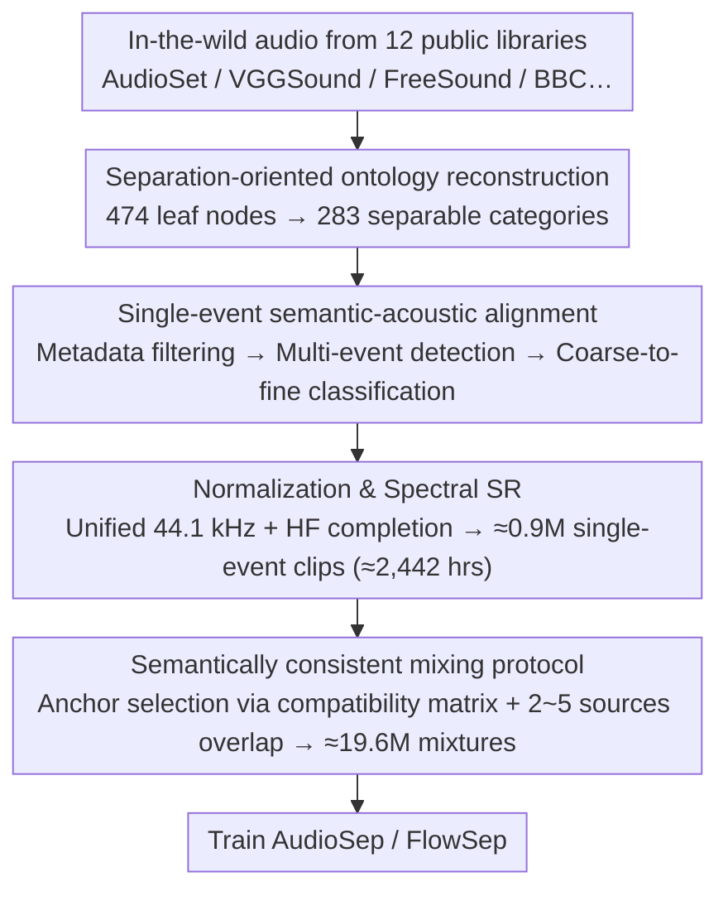

# A Semantically Consistent Dataset for Data-Efficient Query-Based Universal Sound Separation

**Conference**: ICML 2026  
**arXiv**: [2601.22599](https://arxiv.org/abs/2601.22599)  
**Code**: https://cslikai.cn/Hive  
**Area**: Audio & Speech / Universal Sound Separation  
**Keywords**: Universal Sound Separation, Audio Dataset, Semantically Consistent Mixing, Data-Efficient, Single-Event Mining  

## TL;DR
This paper introduces Hive, a universal sound separation dataset constructed through single-event purification and semantically consistent mixing. Using approximately 2.4k hours of high-purity source audio, it enables models like AudioSep and FlowSep to match or even surpass systems trained on million-hour datasets across multiple separation metrics.

## Background & Motivation
**Background**: Query-based Universal Sound Separation (USS) aims to separate any target sound from complex mixtures based on text, audio, or visual prompts. Existing approaches generally follow two paths: discriminative methods like AudioSep that directly estimate the target signal, and generative methods like FlowSep or SAM-Audio that leverage distribution modeling or unified prompt interfaces to generate target sources.

**Limitations of Prior Work**: Many methods rely on large-scale in-the-wild audio such as AudioSet and VGGSound. While large in scale, these datasets often contain only weak labels; for example, a "rain" clip may be accompanied by wind, traffic, or speech. Under such supervision, models easily learn co-occurring backgrounds as part of the target category, resulting in residual interference or generated background textures in the separation results.

**Key Challenge**: Universal sound separation requires both open-category coverage and clean, localizable supervisory signals. Simply increasing data and model scale can mitigate some issues but also amplifies weak labels and co-occurrence biases, while training costs continue to rise.

**Goal**: The authors aim to address a data-centric question: if training source audio is first purified into high-purity single events and then synthesized into mixtures in a semantically reasonable manner, can a competitive USS model be trained with significantly less data?

**Key Insight**: Instead of proposing a new separation network, the paper identifies the bottleneck in the data generation process itself. It decouples "source event purity" and "mixture rationality" into two independent quality axes, controlled by multimodal model-assisted cleaning and a semantic compatibility matrix, respectively.

**Core Idea**: Use high-purity single-event mining combined with semantically consistent mixing to replace the random concatenation of training samples from weakly labeled in-the-wild audio.

## Method
The Hive methodology focuses on an offline data construction pipeline: first extracting candidate segments from multiple public audio libraries, then aligning them to an ontology better suited for separation tasks, and finally synthesizing multi-source mixtures according to semantic compatibility. The objective is not to make the data "larger," but to make every supervisory sample more reliable.

### Overall Architecture
The input consists of in-the-wild audio from 12 public sources, including AudioSet, VGGSound, FreeSound, and BBC Sound Effects. The output includes two layers of data: approximately 0.9M high-purity single-event clips (totaling ~2,442 hours) and 19.6M training/validation/test mixture samples synthesized from these clips (totaling ~22.4k hours).

The pipeline comprises three steps. First, ontology reconstruction: compressing 474 AudioSet leaf nodes into 283 more separable categories, removing environmental or format tags like "indoor," "countryside," or "MP4." Second, single-event semantic-acoustic alignment: combining metadata filtering, multi-event detection, and coarse-to-fine classification to ensure each clip contains only one distinct foreground event. Third, sampling rate and spectral normalization: unifying audio from different sources to 44.1 kHz and using a super-resolution model to compensate for high-frequency details in low-sample-rate audio.

During synthesis, the paper avoids random mixing and instead constructs a binary semantic compatibility matrix between event categories. For each mixture sample, an anchor event is selected, and other sources compatible with all previously selected events are added iteratively (2 to 5 sources). All source clips undergo length, loudness, and SNR normalization before being combined via an additive mixing model.

### Key Designs

**1. Separation-oriented ontology reconstruction: Refining weakly labeled space into separable event categories.**
USS requires target categories to be mutually exclusive and acoustically distinguishable. However, the standard AudioSet ontology contains 474 leaf nodes with significant semantic overlap and fine-grained labels that are inherently ambiguous—even the strongest models can only learn vague supervision. The authors performed an expert-verified reconstruction: merging synonymous or acoustically overlapping labels (e.g., merging "Drum beat" into "Drum"), elevating fine-grained biological sounds with weak acoustic differences (e.g., "Fowl," "Coo") to parent classes, and removing non-localizable tags describing environments ("indoor"), formats ("MP4"), or abstract attributes. This results in 283 leaf nodes oriented toward "separable foreground events," providing a clean, mutually exclusive target for subsequent cleaning and separation models.

**2. Single-event semantic-acoustic alignment: Filtering and accurately labeling foreground events.**
Raw labels in wild audio are often weak and suffer from heavy event coexistence; accepting them as-is propagates noise to the separation model. This step aggregates audio from 12 libraries and performs coarse-to-fine filtering: first discarding multi-label samples, then using the multimodal large model Qwen3-Omni for zero-shot binary classification to remove unlabeled coexistence or transient interference. Subsequently, an audio-tagging model predicts coarse parent classes, and Qwen3-Omni refines them into leaf nodes within candidate subsets. This division of labor leverages the robustness of discriminative models and the semantic granularity of MLLMs to reduce misallocation in long-tail categories, producing ~0.9M high-purity clips (~2,442 hours).

**3. Semantically consistent mixing protocol: Constraining synthesis to avoid irrational combinations.**
Even with clean source audio, random mixing creates unnatural combinations (e.g., aquatic animals with urban traffic), feeding incorrect contextual priors to the model. The authors constructed a binary semantic compatibility matrix $M \in \{0,1\}^{N \times N}$ to record which event pairs naturally co-occur. Each mixture starts by sampling the number of sources $C \in \{2,\dots,5\}$ and an anchor event, then iteratively adds sources that are pairwise compatible with all selected events. Sources are normalized for duration (4s for training, 10s for testing) and loudness (RMS=0.1), with interference SNR sampled from $[-5,5]$ dB. This protocol ensures the model learns separation in complex but realistic scenarios; without it, AudioSep's SDR drops by 1.0 dB.

### Loss & Training
The primary contribution is the dataset and construction protocol; for training, the original architectures and hyperparameters of AudioSep and FlowSep are maintained. AudioSep uses AdamW, batch size 64, and an initial learning rate of $10^{-3}$, decaying upon plateau. FlowSep uses a fixed learning rate of $5 \times 10^{-5}$. Both models are trained for approximately 3M steps on Hive, with all evaluation outputs resampled to 44.1 kHz.

## Key Experimental Results

### Main Results
Hive's results are evaluated across two layers: internal validation on the Hive test set and external generalization on third-party benchmarks.

| Dataset / Scenario | Metric | Ours | Key Comparison | Gain / Conclusion |
|--------|------|------|----------|------|
| Hive test | AudioSep(Hive) SDR / SI-SDR | 5.67 / 5.02 | AudioSep (original) 2.37 / 1.58 | Small-scale high-purity data significantly outperforms original large-scale weakly labeled training. |
| Hive test | AudioSep(Hive) MUSHRA | 68.4 | SAM-Audio 62.6, AudioSep (original) 60.9 | Perceptual quality matches or exceeds million-hour baselines. |
| Hive test | FlowSep(Hive) MUSHRA | 61.8 | FlowSep (original) 54.7 | Generative separation also benefits from Hive. |
| USS-Bench | AudioSep(Hive) SDR / OQ | 2.29 / 3.56 | AudioSep (original) -1.86 / 2.97 | Deco-occurrence supervision is more effective in OOD scenarios. |
| MUSDB18-HQ | AudioSep(Hive) SDR | 1.36 | AudioSep (original) -1.01 | Generalization benefits extend to music separation. |
| VGGClean_eval | FlowSep(Hive) OQ | 3.18 | FlowSep (original) 2.99 | Reference-free quality improvement indicates more than just overfitting to Hive. |

### Ablation Study
| Configuration | Key Metrics | Note |
|------|---------|------|
| Consistent Mixing AudioSep | SDR 4.12, SI-SDR 3.37, CLAP-T 0.29 | Trained on 175k mixtures using semantic compatibility matrix. |
| Random Mixing AudioSep | SDR 3.12, SI-SDR 2.35, CLAP-T 0.24 | Same sources but no semantic constraints; SDR 1.0 dB lower. |
| Consistent Mixing FlowSep | LPAPS 4.24, CLAP-T 0.17, OQ 2.79 | Generative models also benefit from reasonable mixtures. |
| Random Mixing FlowSep | LPAPS 4.35, CLAP-T 0.13, OQ 2.64 | Both perceptual and semantic metrics decline. |
| AudioSep (original) shortcut gap | co-occ. 1.65 vs decorr. 3.06, gap -1.41 dB | Original training relies heavily on co-occurrence shortcuts. |
| AudioSep(Hive) shortcut gap | co-occ. 5.48 vs decorr. 5.87, gap -0.39 dB | Hive significantly reduces dependence on interference co-occurrence. |

### Key Findings
- **Source purity and semantic consistency are complementary**: Purifying sources alone is helpful, but reasonable mixing further improves separation, perceptual, and semantic metrics.
- **Data efficiency of Hive is remarkable**: Models trained on ~2.4k hours of source audio match or exceed systems using 14.1k hours or even millions of hours of data.
- **Training scale still matters**: Provided the supervision is clean; when scaling from 175k to 17.5M samples, AudioSep's SDR increases by 1.55 dB, indicating Hive does not saturate quickly.

## Highlights & Insights
- **Precise Problem Identification**: The paper does not blame residual interference on network architecture but validates the impact of weak labels, co-occurrence, and random mixing separately, suggesting the bottleneck in USS lies in the training supervision.
- **Semantically Consistent Mixing as a Reusable Trick**: This logic can be transferred to audio-visual tasks, video source separation, or event detection. Constructing a category compatibility matrix can reduce bias introduced by irrational negative samples.
- **Value of Shortcut Paired Evaluation**: Fixing the target, source count, and SNR while only varying the statistical co-occurrence of interference provides a much clearer picture of whether a model depends on background shortcuts than average SDR alone.

## Limitations & Future Work
- Hive remains a synthetic mixture dataset and lacks real room impulse responses (RIR), spatial structures of actual recordings, and device noise, which may lead to domain gaps in real-world deployment.
- Cleaning and compatibility matrices rely on MLLMs like Qwen3-Omni, potentially inheriting category biases, especially for tail classes and ambiguous sound events.
- The paper primarily trains AudioSep/FlowSep without systematically exploring the scaling laws of newer unified audio foundation models on Hive.
- Future work could include RIR augmentation, tail-class-aware sampling, LLM relabeling bias audits, and naturally recorded high-density USS benchmarks.

## Related Work & Insights
- **vs. AudioSep / CLIPSep**: These methods focus on models and large-scale weakly labeled data. Hive emphasizes purified single-event supervision, yielding higher data efficiency at the cost of a more complex construction pipeline.
- **vs. SAM-Audio**: SAM-Audio represents million-hour unified models. Hive shows that small-scale, high-purity data can bridge the quality gap, though it does not yet replace the multimodal prompting capabilities of larger models.
- **vs. Scaper / FUSS**: While Scaper and FUSS act as controlled mixing tools, Hive differs by actively addressing upstream source purification and semantic compatibility.
- **Insight**: For many foundation model tasks, "high information-density supervision" may be more cost-effective than blindly scaling weakly labeled data; similar purification-synthesis protocols could be applied to video events, robotic multimodal perception, or weakly labeled medical data.

## Rating
- **Novelty**: ⭐⭐⭐⭐☆ The novelty lies in the combination of purification and semantic mixing protocols rather than structural breakthroughs.
- **Experimental Thoroughness**: ⭐⭐⭐⭐⭐ Covers Hive, third-party benchmarks, semantic consistency, shortcuts, and scaling, providing a complete chain of evidence.
- **Writing Quality**: ⭐⭐⭐⭐☆ Narrative is clear with rich tables, though the abundance of appendix metrics requires careful filtering for quick reading.
- **Value**: ⭐⭐⭐⭐⭐ Highly practical for USS and audio foundation model training, especially for resource-constrained teams seeking reproducibility.

<!-- RELATED:START -->

## Related Papers

- [\[AAAI 2026\] USE: A Unified Model for Universal Sound Separation and Extraction](../../AAAI2026/audio_speech/use_a_unified_model_for_universal_sound_separation_and_extraction.md)
- [\[ICML 2026\] Multimodal Fusion via Self-Consistent Task-Gradient Fields](multimodal_fusion_via_self-consistent_task-gradient_fields.md)
- [\[ICML 2026\] Algorithmic Recourse of In-Context Learning for Tabular Data](algorithmic_recourse_of_in-context_learning_for_tabular_data.md)
- [\[ACL 2026\] Data-efficient Targeted Token-level Preference Optimization for LLM-based Text-to-Speech](../../ACL2026/audio_speech/data-efficient_targeted_token-level_preference_optimization_for_llm-based_text-t.md)
- [\[CVPR 2026\] How Far Can We Go With Synthetic Data for Audio-Visual Sound Source Localization?](../../CVPR2026/audio_speech/how_far_can_we_go_with_synthetic_data_for_audio-visual_sound_source_localization.md)

<!-- RELATED:END -->
