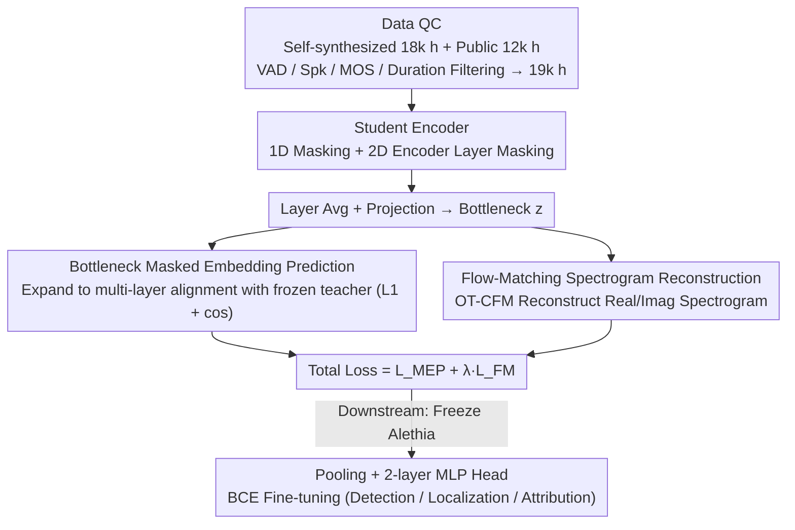

# Alethia: A Foundational Encoder for Voice Deepfakes

**Conference**: ICML 2026  
**arXiv**: [2605.00251](https://arxiv.org/abs/2605.00251)  
**Code**: Not disclosed  
**Area**: Voice Deepfake / Audio Foundation Models / Self-Supervised Pretraining  
**Keywords**: voice deepfake, voice foundation model, masked embedding prediction, Flow Matching, spectrogram reconstruction

## TL;DR
Alethia proposes a "bottleneck masked embedding prediction + flow-matching spectrogram generation" dual-branch pretraining paradigm to develop the first foundational encoder specifically for voice deepfake detection, localization, and attribution. It significantly outperforms general SFMs like Wav2vec2, HuBERT, and WavLM across 56 datasets in 5 task categories and exhibits strong zero-shot robustness against unseen singing voice deepfakes and real-world perturbations.

## Background & Motivation

**Background**: State-of-the-art (SOTA) models for tasks such as Synthetic Speech Detection (SSD), Singing Voice Deepfake Detection (SVDD), Partial Fake Speech Localization (PFSL), and Source Tracing (ST) currently utilize general speech foundation models (SFM) like Wav2vec2, WavLM, or HuBERT as frontends, followed by downstream fine-tuning.

**Limitations of Prior Work**: Despite fine-tuning on 12k hours of real and fake speech, models still generalize poorly to unseen synthesis methods and real-world perturbations (re-recording, replay, channel noise). Existing SFM pretraining objectives (masked token prediction + discrete pseudo-labels) primarily target semantic content and may fail to capture the "generation traces" of deepfakes.

**Key Challenge**: Discrete quantization targets (tokens clustered via k-means or RVQ) compress microscopic timbre artifacts into "statistically useless" details. The authors quantitatively confirm this via mutual information (MI) analysis: HuBERT's Layer 6 discrete targets show a high MI of 0.68 with phoneme labels but only 0.07–0.21 with deepfake labels. Neither expanding the codebook nor switching to RVQ yields significant improvement.

**Goal**: (1) Identify a target signal that does not lose generation traces; (2) Integrate generative pretraining without sacrificing discriminative power to make representations sensitive to semantics, acoustics, and artifacts; (3) Scale data coverage to include in-the-wild deepfakes.

**Key Insight**: Discretization-induced information loss is identified as the root cause, leading to a shift toward **continuous embedding prediction**. Additionally, it is observed that direct MSE-based spectrogram reconstruction yields much higher errors at masked positions than unmasked ones; thus, Flow Matching is employed to learn probabilistic paths instead of deterministic mappings.

**Core Idea**: A student encoder learns a bottleneck representation from masked waveforms to simultaneously (a) predict multi-layer continuous embeddings of a frozen teacher and (b) decode unmasked spectrograms via Optimal Transport Conditional Flow Matching (OT-CFM). These branches share a single bottleneck, tightly coupling "discrimination + generation" at the representation level.

## Method

### Overall Architecture
The core problem Alethia addresses is that discrete quantization targets in general SFMs discard deepfake generation traces as noise, leading to poor downstream generalization. The approach involves a student encoder learning a bottleneck representation $\mathbf{z}$ from masked waveforms, constrained by two branches: one aligns with multi-layer continuous embeddings of a frozen teacher (retaining multi-granular discriminative information), and the other reconstructs spectrograms via Flow Matching (retaining low-level acoustic details of generation traces). The losses from both branches are weighted and summed, sharing the same bottleneck. The pipeline is trained for one epoch on 19k hours of filtered in-the-wild and public deepfake corpora. For downstream tasks, Alethia is frozen, and a pooling layer with a 2-layer MLP head is fine-tuned via BCE.

### Key Designs

**1. Bottleneck Masked Embedding Prediction (Bottleneck MEP): Replacing lossy discrete tokens with continuous targets**

This branch addresses information loss in discrete targets. The student encoder’s layer outputs are averaged to obtain $\bar{\mathbf{h}}$, which is then projected and reshaped to align with 6 uniformly sampled layers of the frozen teacher. The supervision is a sum of L1 and cosine similarity: $\mathcal{L}_{MEP}=\alpha\mathcal{L}_{L1}+\beta\mathcal{L}_{cos}$. Two design choices are critical: first, using "bottleneck-then-expand" rather than 1:1 layer distillation prevents the student from being strictly capped by the teacher and forces the compact representation to encapsulate both low-level acoustics and high-level semantics. Second, the loss is averaged across **all time steps** (masked + unmasked) for stability, as calculating loss only at masked positions was found to diverge due to weak supervision from continuous targets.

**2. Flow-Matching Spectrogram Reconstruction (FM-SR): Modeling artifacts via distribution-to-distribution paths**

While predictive targets capture semantics, they often miss low-level acoustic details. This branch supplements the representation by reconstructing real and imaginary parts of the unmasked STFT spectrogram conditioned on bottleneck $\mathbf{z}$. The key observation is that deterministic MSE reconstruction via MLP yields significantly higher errors at masked positions, suggesting a point-to-point mapping is insufficient for artifact distributions. Consequently, the authors use OT-CFM to learn a linear probability path from noise to clean spectrogram. A transformer decoder $g_\psi(\mathbf{x}_t,t,\mathbf{z})$ predicts the velocity field $\mathbf{v}_t$ at time $t$. This ensures "sub-perceptual artifacts" are modeled as shifts in distribution density rather than fixed values. The decoder is discarded during inference.

**3. 2D Encoder Layer Masking + Data Quality Control: Maximizing masking difficulty and data quality**

1D masking at the CNN output (1% step probability, ~10% total) is insufficient to force deep representations to learn completion. Therefore, 2D masking (15% probability for both time and channel, max 2 blocks per layer) is added to each transformer layer output. This proved vital for deepfake tasks (Appendix C.1). Regarding data, 18k hours were self-synthesized using TTS/VC, combined with 12k hours of public deepfake data (ASVspoof5, MLAAD, etc.). A four-step filtering process (VAD, speaker diarization, MOS $\geq$ 1.5, duration 1.5–15s) yielded 19k hours of balanced, high-quality corpora.

### Loss & Training
The final loss is $\mathcal{L}=\mathcal{L}_{MEP}+\lambda\mathcal{L}_{FM}$, where $\lambda=0.25$ and $\alpha=\beta=1$. Teachers include WavLM-Large (for Alethia-Base) and Wav2vec-XLSR-1B (for Alethia-Large), which remain frozen. Selected layers are [4,8,12,16,20,24] and [4,12,20,28,36,42] respectively. Models (Base 400M / Large 1B) are trained for 600k/300k steps, approximately one epoch.

## Key Experimental Results

### Main Results
Comparison with 4 mainstream SFMs on SDD-Eval-50 (50 SDD datasets) under three fine-tuning settings (Low-resource 400h / Expanded 3.3k h / Expanded+Aug 12k h):

| Model | Params | Overall EER↓ | Overall Acc↑ | Hard Subset EER↓ | Hard Subset Acc↑ |
|------|-------|-----------|------------|---------------|----------------|
| HuBERT-Large | 0.3B | 11.4 | 84.0 | 18.7 | 73.6 |
| WavLM-Large | 0.3B | 8.0 | 85.9 | 15.0 | 74.5 |
| W2V-XLSR-300M | 0.3B | 14.1 | 71.8 | 21.1 | 61.3 |
| W2V-XLSR-1B | 1B | 6.0 | 91.9 | 13.2 | 78.2 |
| **Alethia-Base** | 0.4B | 6.9 | 90.6 | 13.1 | 80.7 |
| **Alethia-Large** | 1B | **5.2** | **93.3** | **11.5** | **81.2** |

Zero-shot singing voice deepfake detection (SVDD, CtrSVDD test split, no singing data in training):

| Model | EER↓ | Acc↑ | TPR↑ | TNR↑ |
|------|------|------|------|------|
| WavLM-Large | 22.6 | 89.8 | 97.7 | 43.5 |
| W2V-XLSR-1B | 13.2 | 89.7 | 90.8 | 83.1 |
| Alethia-Base | 16.7 | 89.8 | 94.0 | 65.2 |
| **Alethia-Large** | **10.8** | **91.3** | 92.5 | **84.1** |
| CtrSVDD in-domain baseline | 13.8* | — | — | — |

### Ablation Study

| Configuration | Key Observation | Insight |
|-----------|----------|------|
| Masked token prediction only (HuBERT/W2V style) | $\Delta$EER +0.25 to +1.20 | Adding data with discrete targets alone cannot learn deepfake traces. |
| Using RVQ (1k cls × 2 codebook) | Deepfake MI 0.212 (vs Phoneme 0.68) | Large quantization targets still fail for deepfakes. |
| MEP on masked positions only | Loss divergence in late training | Continuous targets + sparse masking are unstable; requires all-position averaging. |
| Direct MSE reconstruction | Masked loss ≫ unmasked loss | Deterministic decoding loses distributional info; Flow Matching resolves this. |
| Removing 2D layer masking | Performance drop in deepfake tasks | Intra-layer masking forces deeper representations to learn completion. |

### Key Findings
- W2V-XLSR-1B achieved a good average EER of 6.0%, but performed poorly (Acc <90%) on 17/50 datasets. Alethia-Large reduced this to 11/50, showing it patches "generalization weak points."
- Alethia's most significant gains occur in the "Hard Subset" (where W2V-1B performs below average), indicating real improvement in generalization rather than just scaling benefits.
- In zero-shot singing scenarios, Alethia-Large outperformed both generic SFMs and the in-domain baseline by 3 EER points, validating the hypothesis that deepfake traces share physiological vocal foundations learnable via self-supervision.

## Highlights & Insights
- **Diagnosis-Driven Design**: Quantitatively disproving the "discrete targets are sufficient" assumption via MI analysis provides a framework applicable to other acoustic anomaly detection tasks.
- **Bottleneck Architecture for Distillation**: The use of layer averaging, projection, and reshaping allows the model to distill 6 layers without being strictly bounded by the teacher's performance.
- **Flow Matching as an Auxiliary Target**: Decoding is used only for gradient propagation to the encoder during pretraining, offering a clean solution to using generative pretraining for discriminative tasks.
- **In-the-wild Synthetic Data Pipeline**: The 18k-hour automated synthesis and 3-stage QC pipeline can be readily adopted by researchers in other deepfake domains.

## Limitations & Future Work
- Closed-source code and weights hinder reproducibility.
- Alethia-Base (16.7% EER) lags behind W2V-1B (13.2%) in zero-shot SVDD, suggesting model capacity still outweighs objective design at smaller scales.
- Evaluation is primarily on English; cross-lingual and low-resource language performance remains unverified.
- High computational overhead of Flow Matching during the pretraining phase was not quantified.
- Robustness against "adversarial deepfakes" (specifically optimized to bypass this encoder) has not been tested.

## Related Work & Insights
- **vs HuBERT / Wav2vec2 / WavLM**: These use BERT-style masked token prediction. Alethia shifts to continuous embeddings + generative assistance, acknowledging that deepcake tasks require information typically lost in quantization.
- **vs Data2vec2 / JEPA / V-JEPA**: While also doing continuous embedding prediction, they target high-level layers only. Alethia’s multi-layer bottleneck alignment is better suited for multi-granular acoustic/semantic info.
- **vs Wang & Yamagishi 2024**: That work modified data (vocoded speech) but kept targets the same; Alethia proves that both data and objectives must evolve together.

## Rating
- Novelty: ⭐⭐⭐⭐ Successfully implements continuous embedding prediction + Flow Matching for deepfake SFMs for the first time.
- Experimental Thoroughness: ⭐⭐⭐⭐⭐ Comprehensive evaluation across 56 datasets and 5 tasks with extensive diagnostic ablations.
- Writing Quality: ⭐⭐⭐⭐ Clear motivation and high information density; math is well-integrated.
- Value: ⭐⭐⭐⭐ Defined a new SOTA for deepfake SFMs and identified the root cause of general SFMs' failure in artifact tasks.

<!-- RELATED:START -->

## Related Papers

- [\[ICLR 2026\] Learnable Fractional Superlets with a Spectro-Temporal Emotion Encoder for Speech Emotion Recognition](../../ICLR2026/audio_speech/learnable_fractional_superlets_with_a_spectro-temporal_emotion_encoder_for_speec.md)
- [\[ACL 2025\] MultiMed: Multilingual Medical Speech Recognition via Attention Encoder Decoder](../../ACL2025/audio_speech/multimed_multilingual_medical_speech_recognition_via_attention_encoder_decoder.md)
- [\[ACL 2026\] Indic-CodecFake meets SATYAM: Towards Detecting Neural Audio Codec Synthesized Speech Deepfakes in Indic Languages](../../ACL2026/audio_speech/indic-codecfake_meets_satyam_towards_detecting_neural_audio_codec_synthesized_sp.md)
- [\[ACL 2025\] Finding A Voice: Exploring the Potential of African American Dialect and Voice Generation for Chatbots](../../ACL2025/audio_speech/aae_voice_chatbot.md)
- [\[ICLR 2026\] WearVox: An Egocentric Multichannel Voice Assistant Benchmark for Wearables](../../ICLR2026/audio_speech/wearvox_an_egocentric_multichannel_voice_assistant_benchmark_for_wearables.md)

<!-- RELATED:END -->
