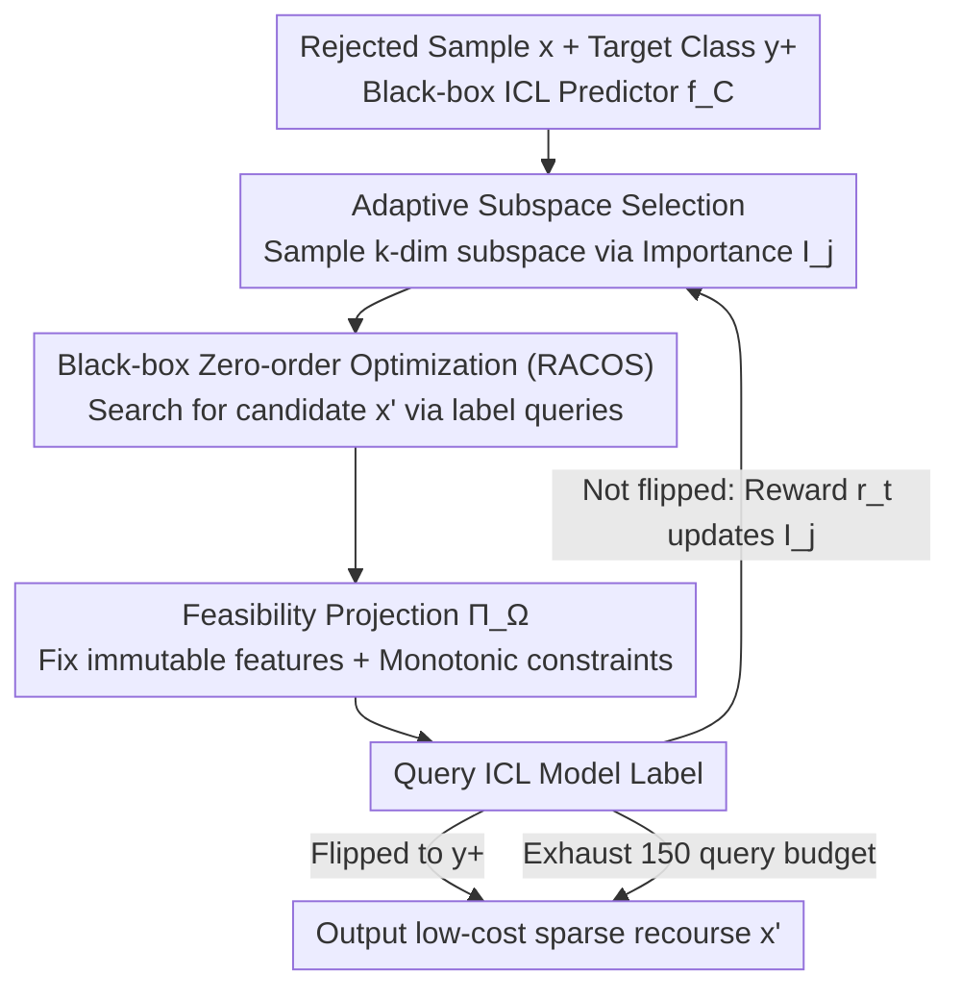

# Algorithmic Recourse of In-Context Learning for Tabular Data

**Conference**: ICML 2026  
**arXiv**: [2605.31272](https://arxiv.org/abs/2605.31272)  
**Code**: No public code  
**Area**: Explainability / Tabular Data / Algorithmic Recourse  
**Keywords**: Tabular ICL, Algorithmic Recourse, Black-box Optimization, Counterfactual Explanations, Actionability  

## TL;DR
This paper presents the first systematic study of the algorithmic recourse problem in tabular in-context learning (ICL). It proves that dynamic decision rules induced by ICL can still yield definable recourse and proposes ASR-ICL, which uses adaptive subspace zero-order optimization to generate low-cost, sparse, and actionable counterfactual modifications for black-box ICL models.

## Background & Motivation
**Background**: Algorithmic recourse is typically used in high-stakes tabular decision systems such as loans, justice, and healthcare. The goal is not merely to explain why a model rejected a sample, but to inform users how to change actionable features to obtain a more favorable prediction. Classical methods assume a fixed classifier post-training, allowing for gradient optimization, integer programming, or graph search around a static decision boundary.

**Limitations of Prior Work**: Tabular prediction is being reshaped by TabPFN, TabICL, and in-context learning from general LLMs. ICL does not explicitly train a fixed model; instead, it induces a predictor temporarily based on context examples during inference. The actual decision rule may change for the same user sample when faced with different demonstration sets. Consequently, traditional recourse assumptions like "fixed models," "stable boundaries," and "gradient access" no longer hold.

**Key Challenge**: High-stakes tabular tasks require stable, actionable, and low-cost modification suggestions for users, yet ICL decision rules are context-conditioned black-box functions. The paper addresses more than just applying existing counterfactual methods to LLMs; it first confirms whether such dynamic predictors still possess definable recourse and then designs practical algorithms that work within finite query budgets.

**Goal**: The authors decompose the problem into two levels: theoretically, proving the feasibility, cost upper bounds, and convergence behavior of recourse as context scale grows within analyzable linear self-attention ICL settings; practically, generating effective recourse in tabular tasks involving black-box queries, mixed continuous/discrete features, and actionability constraints.

**Key Insight**: Theoretical analysis reveals that as the number of context examples increases during test time, ICL-induced recourse approaches classical linear model recourse, though the cost upper bound remains influenced by feature dimensionality. This observation directly inspires the design: if the pre-trained context length cannot be changed, the search should be compressed into a few key features during inference.

**Core Idea**: Replace full-dimensional search with "adaptive selection of small subspaces + zero-order black-box optimization" to ensure that recourse for ICL tabular models satisfies effectiveness, low query volume, and sparse interpretability simultaneously.

## Method

### Overall Architecture
The paper addresses the challenge of providing low-cost, executable modification suggestions to rejected users when the tabular classifier is no longer a fixed model but a black-box predictor $f_{\mathcal{C}}$ temporarily induced by in-context learning. The authors split this into two layers: theoretically, they define the ICL predictor as a function dependent on the context set $\mathcal{C}$ and prove the existence of recourse with cost upper bounds in a linear self-attention setting; algorithmically, they implement ASR-ICL (Adaptive Subspace Recourse for In-Context Learning), a searcher that relies solely on label queries. The process involves iteratively sampling a few changeable features for a rejected sample $x$, performing zero-order search in the subspace, projecting back to the feasible set, and querying the model until the prediction is flipped or the budget is exhausted.

The following diagram illustrates the ASR-ICL search loop at inference time:

### Key Designs

**1. Theoretical definition of contextualized recourse: Proving recourse for dynamic predictors**

Traditional recourse assumes a fixed decision boundary for gradient optimization. Since ICL boundaries change with demonstrations, applying old methods would be purely heuristic. The authors define the effectiveness of a candidate $x'$ for an ICL predictor and solve for the optimal perturbation in a linear self-attention setting. This perturbation $\delta^*_{\mathrm{ICL}}$ is determined by the current sample score, the context empirical covariance $S$, and the pre-trained effective covariance $\Gamma$, rather than being a simple replica of fixed-weight models. Crucially, they provide a high-probability cost upper bound containing a term $\sqrt{\ln(2d/\delta)/M}$, showing that as the number of test demonstrations $M$ and training context length $N$ increase, $S$ approaches the true covariance, and ICL recourse converges to classical linear recourse. However, higher dimensionality $d$ makes stability harder to achieve. This proves that "recourse under ICL is meaningful" and suggests that because context length is often fixed, search should be restricted to fewer features.

**2. Adaptive Subspace Selection: Compressing full-dimensional search to sparse search**

Blindly performing zero-order optimization across all dimensions in high-dimensional tables is query-intensive and modifies irrelevant attributes. Tabular recourse typically only requires changing a few actionable features. The authors maintain an importance score $I_j$ for each feature and sample a subspace of size $k$ according to $p_{\mathrm{sel}}(j) \propto \exp(I_j)$. After each local search, the importance is updated using the negative objective reward $r_t$ as $I_j \leftarrow (1-\alpha)I_j + \alpha\, r_t / |S_t|$, increasing the probability that features reducing the objective are selected in the next round. This allows the search to converge on a few truly useful features, reducing queries and ensuring the final suggestion is sparse and human-executable.

**3. Black-box Zero-order Optimization and Feasibility Projection: Aligning with deployment constraints**

Real-world ICL services often return only a predicted label without gradients, logits, or internal states, and tabular data contains immutable features like age or gender. The authors formulate the objective to rely solely on label queries: $L_{\mathrm{pr}}(x,x')=(1-\mathbb{I}[\hat{y}(x')=y^+])+\lambda\, c(x,x')$. The first term rewards flipping to the target class $y^+$, while the second term $c(x,x')$ penalizes the magnitude of change. An inner RACOS zero-order optimizer handles both continuous intervals and discrete grids. Each candidate is passed through a projection $\Pi_{\Omega}$ before querying to enforce immutable feature constraints and monotonicity. This ensures the algorithm requires no white-box access and generates modification suggestions that are realistically executable.

### Loss & Training
ASR-ICL does not train predictive models; all operations occur during black-box search at inference time. The optimization objective is $L_{\mathrm{pr}}$, comprising a reward for flipping the label and a cost penalty $c(x,x')$, which penalizes normalized changes in continuous features and modifications to discrete features. The default configuration includes a subspace size of $\min(5,\lceil\sqrt{d}\rceil)$, an importance smoothing factor $\alpha=0.5$, a total query budget of 150, and RACOS as the inner optimizer. Recourse is generated towards the target label in binary classification or the specified optimal class in multi-class tasks.

## Key Experimental Results

### Main Results
The paper compares ASR-ICL with classical trained-model recourse methods across three binary classification tasks: Australian Credit, COMPAS, and Diabetes. ICL results use a 32-shot context; lower costs are preferred.

| Model / Method | Australian Credit Validity / Cost | COMPAS Validity / Cost | Diabetes Validity / Cost | Conclusion |
|-------------|----------------------------------|-----------------------|-------------------------|------|
| MLP + DiCE | 1.00 / 8.96 | 1.00 / 7.51 | 1.00 / 5.02 | High validity, but modification cost is significantly higher |
| Linear + AR | 0.82 / 1.76 | 0.94 / 3.44 | 0.72 / 1.52 | Low cost, but often fails to find valid recourse |
| Linear + FACE | 1.00 / 6.18 | 1.00 / 6.51 | 1.00 / 5.13 | Stable validity, but cost remains high |
| TabPFN-2.5 + ASR-ICL | 1.00 / 3.83 | 1.00 / 2.76 | 1.00 / 2.78 | Maintains full validity with lower cost under black-box ICL |
| TabICL + ASR-ICL | 1.00 / 4.47 | 0.81 / 3.44 | 1.00 / 2.80 | Dedicated tabular ICL is stable overall; COMPAS is more difficult |
| Qwen3-8B + ASR-ICL | 0.87 / 2.94 | 0.99 / 2.55 | 0.84 / 1.50 | General LLMs can also generate low-cost recourse |
| LLaMA-3.2-3B + ASR-ICL | 1.00 / 2.99 | 1.00 / 2.43 | 0.98 / 1.67 | Cost across multiple open-source LLMs is approximately 2 to 3 |
| GPT-4o + ASR-ICL | 0.99 / 4.75 | 0.78 / 3.62 | 0.71 / 4.31 | Lower validity for closed-source models suggests boundary noise affects recourse |

### Ablation Study
The paper uses Full ZO (non-adaptive full-space zero-order optimization) as a baseline to evaluate ASR-ICL's query efficiency and cost. Representative results from Australian Credit and Corporate Rating are shown below.

| Configuration | Australian Credit Validity / Cost / Queries | Corporate Rating Validity / Cost / Queries | Description |
|------|------------------------------------------|------------------------------------------|------|
| Full ZO + TabPFN-2.5 | 1.00 / 12.88 / 144.28 | 1.00 / 15.44 / 149.45 | Full search nearly exhausts the budget with high cost |
| ASR-ICL + TabPFN-2.5 | 1.00 / 3.83 / 27.01 | 0.98 / 4.79 / 111.71 | Adaptive subspace significantly reduces cost and queries in binary tasks |
| Full ZO + Qwen3-4B | 1.00 / 12.03 / 150.00 | 0.95 / 17.42 / 150.00 | Full search almost always exhausts budget on general LLMs |
| ASR-ICL + Qwen3-4B | 0.79 / 3.01 / 56.01 | 0.94 / 3.54 / 117.32 | Significant cost reduction; validity on complex tasks limited by prediction quality |
| Full ZO + GPT-4o | 0.97 / 11.82 / 150.00 | 0.77 / 14.18 / 150.00 | Higher query cost does not guarantee better validity |
| ASR-ICL + GPT-4o | 0.99 / 4.75 / 49.04 | 0.72 / 4.87 / 40.29 | Achieves similar validity and lower cost with significantly fewer queries |

### Key Findings
- Increasing context examples stabilizes recourse validity and decreases average cost, aligning with the theoretical trend of ICL recourse converging to classical linear recourse.
- On multi-class tasks, TabPFN and TabICL achieve near-full validity on Corporate Rating and Student Performance; general LLMs are more unstable on Student Performance, indicating that complex boundaries affect ICL tabular prediction quality.
- The adaptive subspace is the primary contribution: it not only reduces queries but concentrates search on a few features, making recourse sparser. In the Diabetes dataset, ASR-ICL modifies only Glucose and BMI, whereas DiCE might modify non-actionable attributes.

## Highlights & Insights
- Instead of directly applying counterfactual explanations to LLMs, the paper addresses the fundamental question of whether recourse exists for dynamic ICL models. This clear problem setting facilitates a genuine connection between theory and algorithm.
- The design of ASR-ICL is pragmatic: it acknowledges that black-box ICL only allows label queries while exploiting the inherent sparsity of tabular recourse to transform a high-dimensional optimization problem into an adaptive small-subspace search.
- The theoretical upper bound for dimensionality provides a useful heuristic: when the ICL model is fixed and context budget is limited, reducing the effective search dimension is more critical than blindly increasing zero-order iterations. This approach is transferable to black-box LLM tool use, medical tabular decisions, and risk control strategy explanations.

## Limitations & Future Work
- The theoretical portion is based on linear regression and single-layer linear self-attention, which remains distant from the actual mechanisms of TabPFN, TabICL, or general LLMs. It serves as an idealized model to explain trends rather than a complete characterization of real ICL.
- Experiments primarily evaluate the ability to flip model predictions and modification costs, without user studies on human executability, long-term stability, or causal validity. For high-stakes scenarios, satisfying feature constraints does not guarantee real-world actionability.
- ASR-ICL still relies on a significant number of black-box queries. Although fewer than Full ZO, dozens to hundreds of queries may be expensive or trigger risk controls for paid APIs and strictly audited systems.
- Future work could combine adaptive subspaces with causal constraints, domain rules, and confidence estimation to ensure recourse not only flips labels but also improves robustness across contexts and models.

## Related Work & Insights
- **vs DiCE**: DiCE generates diverse counterfactuals via optimization for fixed models with rich feedback; ASR-ICL targets context-conditioned black-box ICL relying only on label queries, suitable for service models without gradient access.
- **vs Actionable Recourse**: AR provides low-cost or even certifiable actions under white-box linear models, but validity is limited by model assumptions; Ours extends "low-cost actions" to ICL predictors, albeit sacrificing global optimality certification.
- **vs FACE**: FACE searches along data manifolds emphasizing feasible paths; ASR-ICL emphasizes subspace sparse search and query efficiency. These could be combined by using manifold graphs to restrict ASR-ICL's candidate regions.
- **vs TabPFN / TabICL**: TabPFN and TabICL focus on tabular ICL prediction accuracy; this work focuses on providing actionable modifications for rejected individuals after these predictors are deployed, extending performance toward accountability mechanisms.

## Rating
- Novelty: ⭐⭐⭐⭐⭐ The first to systematically place algorithmic recourse under the dynamic decision rules of tabular ICL with a theoretical and algorithmic closed loop.
- Experimental Thoroughness: ⭐⭐⭐⭐ Covers various datasets, dedicated tabular models, and general LLMs, with analysis of multi-class tasks and query efficiency, but lacks real-user/causal validation.
- Writing Quality: ⭐⭐⭐⭐ Problem motivation and methodological chain are clear; the connection from theory to algorithm is natural, though some tables are dense.
- Value: ⭐⭐⭐⭐⭐ Highly relevant for high-stakes tabular ICL deployment and provides a reusable framework for recourse research in black-box LLM decision systems.

<!-- RELATED:START -->

## Related Papers

- [\[ACL 2026\] Multimodal In-Context Learning for ASR of Low-Resource Languages](../../ACL2026/audio_speech/multimodal_in-context_learning_for_asr_of_low-resource_languages.md)
- [\[ICML 2026\] A Semantically Consistent Dataset for Data-Efficient Query-Based Universal Sound Separation](a_semantically_consistent_dataset_for_data-efficient_query-based_universal_sound.md)
- [\[ICML 2026\] Multiple Choice Learning of Low-Rank Adapters for Language Modeling](multiple_choice_learning_of_low-rank_adapters_for_language_modeling.md)
- [\[ACL 2026\] DRInQ: Evaluating Conversational Implicature with Controlled Context Variation](../../ACL2026/audio_speech/drinq_evaluating_conversational_implicature_with_controlled_context_variation.md)
- [\[ICML 2026\] Group Cognition Learning: Making Everything Better Through Governed Two-Stage Agents Collaboration](group_cognition_learning_making_everything_better_through_governed_two-stage_age.md)

<!-- RELATED:END -->
