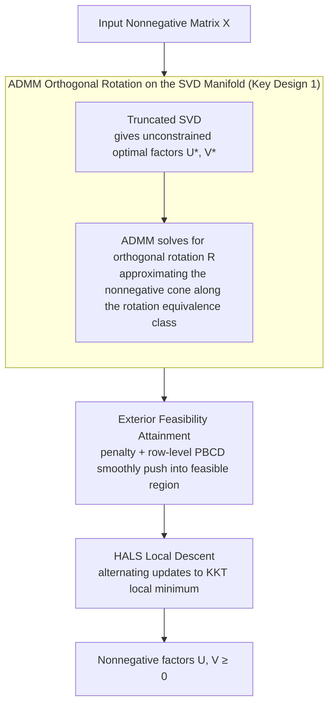

# An Exterior Method for Nonnegative Matrix Factorization

**Conference**: ICML2026  
**arXiv**: [2605.19325](https://arxiv.org/abs/2605.19325)  
**Code**: https://github.com/roychowdhuryresearch/eNMF  
**Area**: Optimization  
**Keywords**: Nonnegative Matrix Factorization, Exterior Point Method, ADMM, Orthogonal Rotation, HALS  

## TL;DR
This paper proposes eNMF, which transforms NMF from "always staying inside the nonnegative orthogonal cone" to "approximating the nonnegative cone from the exterior of the rotation equivalence class of the unconstrained SVD optimal solution, followed by feasibility attainment and descent." It reaches lower reconstruction errors faster than 9 classes of NMF baselines on synthetic, text, audio, image, and recommendation data.

## Background & Motivation
**Background**: Nonnegative Matrix Factorization (NMF) aims to approximate a nonnegative matrix $X$ as $UV^\top$, where $U,V\geq0$. The factors exhibit sparsity, interpretability, and parts-based characteristics, and have been long used in topic modeling, audio separation, image understanding, recommendation systems, and interpretable representation learning. Prevailing algorithms usually start from a nonnegative initialization and maintain nonnegativity via continuous projections or constraints during optimization, such as multiplicative updates, HALS, or alternating optimization like NNLS/ADMM.

**Limitations of Prior Work**: NMF is a non-convex problem. Interior feasibility methods, while satisfying nonnegative constraints throughout, often crawl slowly inside the nonnegative cone, getting stuck in flat regions or suboptimal stationary points. More importantly, these methods do not fully exploit the global optimal structure of unconstrained low-rank approximations; although the SVD solution may contain negative values, it possesses rotational degrees of freedom with many equivalent factors.

**Key Challenge**: There is a tension between the reconstruction objective and the nonnegativity constraint. If an algorithm only starts from within the feasible region, it may be trapped by the constraint geometry early on; if nonnegativity is entirely ignored, unconstrained SVD results cannot serve as interpretable NMF factors. The core problem is: can the low-error advantage of the unconstrained global optimum be utilized first, before geometrically pushing it toward the nonnegative orthogonal cone?

**Goal**: The authors aim to rethink the fundamental optimization path of NMF and propose an exterior-to-interior framework. This allows the algorithm to approach high-quality feasible solutions from outside the nonnegative cone, and systematically compares this strategy's performance in reconstruction error, speed, local minima equivalence, and downstream tasks.

**Key Insight**: The paper utilizes the rotational invariance of low-rank factors: if $X\approx U^\star {V^\star}^\top$, then $(U^\star R,V^\star R)$ maintains the same unconstrained reconstruction error under an orthogonal matrix $R$. The problem then transforms into finding a rotation $R$ that brings both factors as close as possible to the nonnegative orthogonal cone.

**Core Idea**: Instead of descending slowly within the cone from a nonnegative initialization, the method starts from the rotation manifold of the SVD global low-rank solution. It first finds an exterior point nearest to the nonnegative cone, then enters the feasible region and reaches a local minimum through feasibility attainment and HALS.

## Method

### Overall Architecture
eNMF solves the standard Frobenius NMF objective $\min_{U,V\geq0}\frac12\|X-UV^\top\|_F^2$, but changes the path into the feasible region: traditional methods crawl from within the cone from a nonnegative initialization, whereas eNMF first captures the global low-rank optimal solution via truncated SVD. Utilizing the rotational invariance of low-rank factors, it finds an exterior point on the rotation equivalence class of SVD factors closest to the nonnegative cone, then pushes it into the feasible region and finishes with a mature descent algorithm. The pipeline consists of three stages: truncated SVD provides unconstrained optimal factors, ADMM solves for an orthogonal rotation that minimizes negative elements, an exterior penalty attains feasibility for the rotated factors, and finally, HALS descends within the feasible region to a KKT local minimum. The significance lies not in inventing a new objective, but in correctly handling the initialization and entry into the feasible region.

### Key Designs

**1. ADMM Orthogonal Rotation on the SVD Manifold: Transforming initialization into a low-dimensional Procrustes problem**

The algorithm first computes the truncated SVD $X\approx U\Sigma V^\top$, setting $U^\star=U\Sigma^{1/2}$ and $V^\star=V\Sigma^{1/2}$. The key observation is that any orthogonal matrix $R$ keeps $(U^\star R)(V^\star R)^\top$ invariant. Thus, all factors on the manifold $\mathcal{Y}^\star=\{(U^\star R,V^\star R)\mid R^\top R=I\}$ share the SVD's global minimum reconstruction error, differing only in their distance to the nonnegative cone. NMF initialization is rewritten as finding the optimal rotation: by stacking $U^\star$ and $V^\star$ vertically into $W$, the problem becomes $\min_{Z,R}\sum_{ij}h(Z_{ij})$ subject to $Z=WR$ and $R^\top R=I$, where $h(q)=\max(0,-q)$ penalizes negative elements.

This is solved via ADMM by alternating between $Z$, $R$, and a multiplier $Y$. $Z$ has a piecewise closed-form solution for each element, while $R$ reduces to an orthogonal Procrustes form, obtained via the SVD of $W^\top B$. This is efficient because it directly utilizes the rotation equivalence class of the unconstrained optimum—if the manifold intersects the nonnegative cone, eNMF reaches the global NMF optimum via rotation alone, bypassing extensive constrained optimization. Even without intersection, the rotation provides a very strong warm start by positioning the factors nearest to the cone.

**2. Exterior Feasibility Attainment rather than Direct Projection: Smoothly pushing into the feasible region**

Rotated factors are usually close to the nonnegative cone but may contain a small amount of negative elements. Direct truncation (clamping negatives to 0) would abruptly change the factor geometry and destroy the low-error structure found during the rotation stage. eNMF instead uses an exterior penalty for a smooth transition: minimizing $\frac12\|X-UV^\top\|_F^2+\delta_u\sum h(U_{ij})+\delta_v\sum h(V_{ij})$. Negative elements move toward the positive direction dominated by the penalty, while nonnegative elements are updated via row-wise projected block coordinate descent (PBCD). The step size per row is given in closed-form by the local quadratic structure, after which factors are projected back onto the nonnegative interval. Each step is cheap and well-directed, and this row-level optimal step size significantly shortens feasibility time compared to fixed steps.

**3. HALS Local Descent and KKT Verification: Closing with a stable kernel**

By the end of feasibility attainment, factors typically lie near a KKT stationary point. The remaining work is standard NMF descent. eNMF does not reinvent this stage, but instead connects to mature HALS for final alternating column/row updates and uses KKT optimality conditions to determine convergence. The complete workflow is: SVD initialization → Orthogonal rotation → Negative element updates and PBCD feasibility → HALS descent. The significance of this division is that eNMF handles the difficult initialization and feasibility entry, leaving the well-refined descent task to HALS, ensuring both efficiency and stability. The paper also notes that this exterior idea can be transferred to other NMF distances or matrix completion variants as long as an unconstrained low-rank starting point is available.

## Key Experimental Results

### Main Results
The paper compares eNMF with 9 classes of NMF baselines, performing a sweep of 9 initializations for the baselines and taking the best result. The protocols include equal-time reconstruction error and equal-error runtime.

| Dataset / Setting | Metric | Ours | Prev. SOTA / Strongest Baseline | Gain |
|---------------|------|------|---------------------|------|
| Synthetic, SNR 80dB, $r=500$ | Time to reach SVD global minimum | 106.33s | HALS 1812.0s, AO-ADMM 596.2s, NMF-ADMM 3093.7s | ~5.6x vs AO-ADMM, >16x faster than most |
| Synthetic, SNR 20dB, $r=50$ | equal-error runtime | 176s | AO-ADMM 966.2s, HALS 3010.6s | ~5.5x / 17.1x faster |
| Face, $r=20$ | equal-error runtime | 246.4s | AO-ADMM 291.47s, HALS 333.19s | ~15.5% faster than nearest competitor |
| Verb, $r=100$ | equal-error runtime | 14.66s | AO-ADMM 18.54s, HALS 23.16s | ~20.9% / 36.7% faster |
| Audio, $r=100$ | equal-error runtime | 107.74s | AO-ADMM 143.29s, HALS 158.38s | ~24.8% / 32.0% faster |
| Downstream Tasks | Representation Quality | Face +5.7 to +10.3 pts, AudioMNIST +8.5 to +12.5 pts, MovieLens RMSE reduced ~7-12% | Strongest baseline per task | Improved downstream features as well as reconstruction |

### Ablation Study
Key analyses focus on algorithm stages, geometric intersections, and post-processing strategies. The following summarizes the findings:

| Configuration | Key Metric | Description |
|------|---------|------|
| SVD + ADMM rotation only (Synthetic) | Feasibility + Descent time is 0 | In all synthetic settings, the global minimum is reached after rotation; total time is dominated by SVD and ADMM. |
| Direct projection of rotated point + descent | Slower equal-error, higher equal-time error | The proposed feasibility-attainment + HALS is more stable than direct projection. |
| Fixed-step feasibility attainment | Slower than closed-form row-step PBCD | Optimal row-level step sizes in Eqs. (10)-(11) significantly reduce feasibility time. |
| Audio high rank $r\in\{40,80,100\}$ | Rotation manifold intersects cone | eNMF reaches unconstrained global minimum primarily through the rotation step, outperforming interior solvers. |
| Local minima comparison (400+ NMF settings) | Algorithms converge to equivalent factors (99%) | Most solutions differ only by permutation/scaling/rotation; eNMF's advantage is speed to reach the same geometric solution. |

### Key Findings
- The speed advantage of eNMF stems from a strong warm start, not just a faster inner update. In synthetic data, when the SVD manifold intersects the nonnegative cone, the algorithm reaches global NMF solutions almost without requiring feasibility attainment or descent.
- Real-world data is more non-convex, and the manifold does not always intersect the nonnegative cone. However, eNMF still provides lower equal-time reconstruction errors and reaches target errors fastest under the equal-error protocol.
- Downstream task results indicate that eNMF factors are not only low in reconstruction error but also more suitable for classification and recommendation; this is crucial for NMF as a feature extraction tool.

## Highlights & Insights
- The most inspiring insight is "entering the nonnegative cone from the exterior." Traditional NMF methods treat nonnegativity as a hard constraint that must be satisfied at every step, whereas eNMF first preserves the geometric advantage of the unconstrained low-rank optimum and then handles nonnegativity in a controlled manner.
- The ADMM rotation step transforms the NMF initialization problem into a low-dimensional orthogonal Procrustes-style problem. Compared to random initialization or NNDSVD, this more directly utilizes the equivalence manifold where the SVD solution resides.
- The analysis of equivalent local minima is highly valuable. It suggests that many NMF algorithms eventually move toward the same or equivalent factors, only at different speeds; this explains why "everyone ends up in the same place if run long enough" and highlights the practical significance of the initialization path.
- This exterior framework could be transferred to other problems where "unconstrained solutions are easy but constrained solutions are hard," such as interpretable factorizations with sparsity, orthogonality, monotonicity, or simplex constraints.

## Limitations & Future Work
- eNMF remains a heuristic non-convex algorithm and does not provide global optimality guarantees; the ADMM rotation problem itself is non-convex, though experimentally stable.
- The algorithm relies on a high-quality low-rank subspace. SVD initialization may become a bottleneck for massive sparse or streaming data; the authors list online NMF as a future direction.
- While many baselines are covered, several detailed results are relegated to the appendix. The tables visible in the main text focus heavily on runtime, requiring readers to check the appendix for a complete comparison of final errors.
- The idea of entering the feasible region from the exterior is natural for Frobenius NMF, but its transfer to KL, IS divergence, or matrix completion with missing values requires more systematic verification of penalties, step sizes, and convergence criteria.

## Related Work & Insights
- **vs Lee-Seung multiplicative updates**: Traditional multiplicative updates always stay nonnegative but are slow; eNMF abandons "constant interior feasibility" and uses an exterior warm start to avoid slow crawling.
- **vs HALS / A-HALS**: HALS is a mature local descender. This paper uses HALS in the final stage; the advantage comes from the preceding SVD rotation and feasibility-attainment initialization.
- **vs AO-ADMM / NMF-ADMM**: ADMM baselines solve NNLS or the full objective within the feasible region. In contrast, eNMF's ADMM is used for the orthogonal rotation of unconstrained factors, which is closer to the low-dimensional geometric core.
- **vs Vavasis / R1D**: Earlier works noticed the transformation relationship between exact NMF and unconstrained factors, but eNMF implements this as a practical rank-$r$ exterior framework with systematic experimentation.

## Rating
- Novelty: ⭐⭐⭐⭐⭐ The perspective of entering the cone from an exterior SVD manifold rotation is distinct and clarifies NMF optimization geometry.
- Experimental Thoroughness: ⭐⭐⭐⭐⭐ 9 baseline classes, 9 initialization sweeps, synthetic/real/downstream tasks, and local minima equivalence analysis are comprehensive.
- Writing Quality: ⭐⭐⭐⭐☆ The method is clearly described and the experimental data is informative, though some key ablations are scattered in the appendix.
- Value: ⭐⭐⭐⭐⭐ Directly practical for NMF, interpretable matrix factorization, and initialization for constrained optimization.

<!-- RELATED:START -->

## Related Papers

- [\[NeurIPS 2025\] Latent Space Factorization in LoRA](../../NeurIPS2025/audio_speech/latent_space_factorization_in_lora.md)
- [\[ACL 2026\] Temporal Contrastive Decoding: A Training-Free Method for Large Audio-Language Models](../../ACL2026/audio_speech/temporal_contrastive_decoding_a_training-free_method_for_large_audio-language_mo.md)
- [\[ICML 2026\] Probing Token Spaces under Generator Shift in AI-Generated Music Detection](probing_token_spaces_under_generator_shift_in_ai-generated_music_detection.md)
- [\[ICML 2026\] Attend to Anything: Foundation Model for Unified Human Attention Modeling](attend_to_anything_foundation_model_for_unified_human_attention_modeling.md)
- [\[ICML 2026\] Few-Shot Synthetic Accented Speech for ASR Fine-Tuning: What Helps and When?](few-shot_synthetic_accented_speech_for_asr_fine-tuning_what_helps_and_when.md)

<!-- RELATED:END -->
