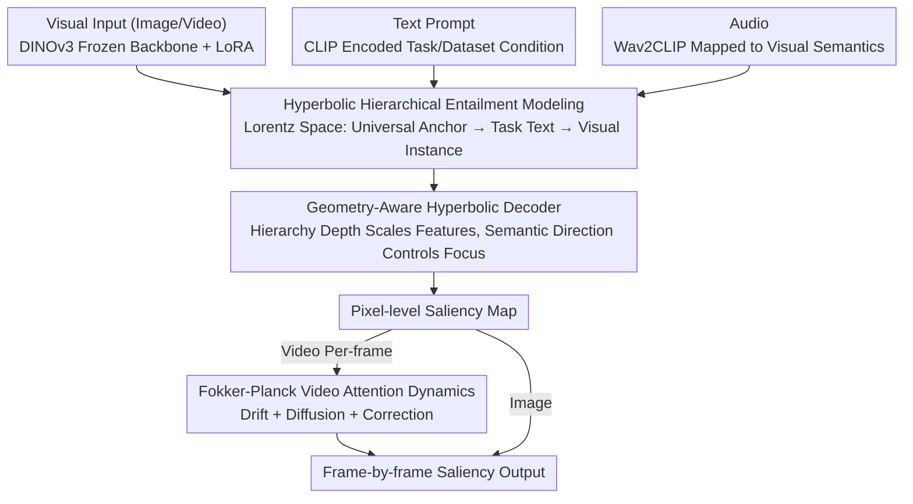

# Attend to Anything: Foundation Model for Unified Human Attention Modeling

**Conference**: ICML2026  
**arXiv**: [2606.03540](https://arxiv.org/abs/2606.03540)  
**Code**: https://github.com/wz-zhao/Attend-to-Anything  
**Area**: Human Understanding / Attention Modeling  
**Keywords**: Human Attention, Visual Saliency, Hyperbolic Representation, Fokker-Planck Dynamics, Multimodal Foundation Models  

## TL;DR
AAM unifies image, video, and audio-visual saliency prediction into a single attention foundation model featuring text conditioning, hyperbolic hierarchical constraints, and Fokker-Planck temporal dynamics. It consistently outperforms specialized models across 16 benchmarks and improves video inference speed to approximately 111 FPS.

## Background & Motivation
**Background**: Human attention modeling is traditionally divided into several branches—image saliency, video saliency, and audio-visual attention—each with its own datasets, model architectures, and training protocols. Image-based methods typically rely on CNNs or Transformers to predict static saliency maps. Video-based methods superimpose optical flow, 3D convolutions, or temporal Transformers, while audio-visual methods utilize additional audio branches to capture speakers, sound sources, or event cues.

**Limitations of Prior Work**: This task segmentation allows models to achieve high performance within single datasets but hinders cross-scenario generalization. The paper notes that even when scaling up capacity and data, existing models often face significant performance degradation in cross-dataset testing. This suggests that the bottleneck is not merely a lack of training samples, but the problem definition itself, which fragments a unified human cognitive mechanism into isolated local tasks.

**Key Challenge**: Human attention involves a unified cognitive process, yet current modeling paradigms treat scene differences, task intentions, and modality variations as isolated statistical biases. Modern models need to simultaneously represent a "universal attention prior" and "task-specific conditions," while situating static images and dynamic videos within a single inferable framework rather than building separate branches for each input format.

**Goal**: The authors aim to construct an attention foundation model reusable across image, video, and audio-visual tasks. It must support text-conditioned control, cross-dataset generalization, frame-by-frame prediction for arbitrary-length videos, and reduce redundant computation in fixed-window video models without sacrificing accuracy.

**Key Insight**: The paper interprets attention differences as a hierarchical entailment relationship from "universal attention" to "specific task attention," utilizing hyperbolic space to represent this general-to-specific structure. Furthermore, it treats the temporal evolution of attention in videos as a process of probability density transport, diffusion, and correction, linking static saliency maps with dynamic attention via the Fokker-Planck equation.

**Core Idea**: By using hyperbolic hierarchical semantics to unify scene and task conditions, and physics-inspired temporal dynamics to unify image and video attention, the authors redefine fragmented saliency prediction as a multimodal conditional foundation model.

## Method

### Overall Architecture
AAM addresses the issue of disconnected image, video, and audio-visual saliency branches by mapping these tasks into a unified text-conditioned attention space, bonded by hierarchical geometry and temporal dynamics. Visual features are extracted by a frozen DINOv3 backbone and adapted via LoRA. Text prompts are encoded by CLIP to describe task or dataset cognitive conditions, and audio is encoded by Wav2CLIP before being mapped into the visual semantic space. Visual and text representations are lifted to a Lorentz hyperbolic space to learn hierarchical relationships. A geometry-aware hyperbolic decoder then converts these conditions back into pixel-level saliency maps. For videos, a Fokker-Planck dynamics module handles frame-by-frame temporal evolution. The system is jointly trained with saliency and hyperbolic entailment losses.

### Key Designs

**1. Hyperbolic Hierarchical Entailment Modeling: Representing Dataset and Task Differences as Cognitive Hierarchies**

In existing methods, different datasets and tasks are typically treated as independent statistical domains. AAM reformulates this as a hierarchical relationship: it learns a partial order $z_{img} \preceq z_{txt} \preceq z_{anc}$ within a Lorentz hyperbolic space, where $z_{anc}$ is a universal attention anchor shared by all tasks, $z_{txt}$ is a text condition for a specific task or dataset, and $z_{img}$ is a specific visual instance. Through hyperbolic entailment cone constraints, the text condition must fall within the cone defined by the universal anchor, and the visual instance must fall within the text condition's cone. This enforces an abstract-to-concrete chain of "Universal Attention → Task Attention → Instance Attention." Hyperbolic space is chosen because its volume grows exponentially with radius, making it naturally suited for tree-like hierarchical semantics.

**2. Geometry-Aware Hyperbolic Decoder: Driving Scale and Spatial Focus via Hierarchical Depth and Semantic Direction**

Simply concatenating text as a conditional vector makes it difficult for a model to distinguish between "general task descriptions" and "fine-grained scene intent." AAM allows geometric properties to participate directly in decoding: the hyperbolic distance from the text point to the origin represents condition specialization depth. This distance selects multi-scale operator weights via $w_k=\mathrm{softmax}_k(-d_L(z_{txt},\mu_k))$, where more specific conditions favor finer scales. Simultaneously, the geodesic direction $\Delta$ of the visual instance relative to the text condition is used to calculate spatial focus weights, identifying which locations in the frame should be emphasized.

**3. Fokker-Planck Video Attention Dynamics: Formulating Temporal Evolution as Probability Density Transport**

Fixed-window video models process multiple frames to output a single prediction, creating high redundancy. AAM treats the video attention distribution $u_t$ as a probability density defined over the spatial domain, where its temporal variation is composed of drift, diffusion, and correction: the drift term utilizes bidirectional temporal self-attention to aggregate evidence across time; the diffusion term uses second-order central differences to smooth high-frequency noise and maintain temporal continuity; the correction term acts like a Kalman gain to reconcile dynamic predictions with current frame observations $u_t^{obs}$. Defining temporal consistency through these physically motivated components enables frame-by-frame inference for arbitrary lengths and high throughput.

### Loss & Training
The model is trained on Attention-1.75M, which encompasses 8 image, 4 video, and 6 audio-visual datasets, totaling over 1.75 million human gaze instances. A phased training strategy is employed: the model is first trained on image and video data, using free-viewing data to warm-start the universal attention anchor. After 10 epochs, audio-visual data is introduced. The visual backbone remains frozen and is adapted only through LoRA and task-specific heads.

The total loss combines traditional saliency prediction loss with hierarchical entailment loss: $L_{total}=L_{KLD}-L_{CC}-L_{SIM}+L_{HAE}$. $L_{HAE}$ constrains the entailment relationships from anchor to text and text to image. Audio-visual fusion utilizes correlation-gated cross-attention, strengthening audio contributions only when audio cues align with visual semantics.

## Key Experimental Results

### Main Results
AAM was evaluated across 16 benchmarks. It achieves stable improvements across natural images, webpages, e-commerce, videos, and audio-visual scenarios.

| Task/Dataset | Metric | Ours (AAM) | Prev. SOTA | Gain |
|--------|------|------|----------|------|
| MIT1003 Image | CC ↑ | 0.831 | SUM 0.768 | +0.063 |
| CAT2000 Image | SIM ↑ | 0.769 | SUM 0.754 | +0.015 |
| SALICON Image | KLD ↓ | 0.163 | SUM 0.192 | -0.029 |
| DIEM Audio-Visual | CC ↑ | 0.710 | TAVDiff 0.670 | +0.040 |
| ETMD Audio-Visual | NSS ↑ | 3.66 | CASP 3.34 | +0.32 |
| DHF1K Video | NSS ↑ | 3.272 | MSFF-Net 3.066 | +0.206 |
| Hollywood2 Video | SIM ↑ | 0.599 | VSSM 0.583 | +0.016 |
| UCF Video | CC ↑ | 0.736 | VSSM 0.705 | +0.031 |

### Ablation Study
The ablation covers joint training, backbones, temporal modules, and hyperbolic components.

| Configuration | Key Metrics | Description |
|------|---------|------|
| Single Dataset Training | Weak cross-dataset generalization | Learns only local distributions, fails to represent unified hierarchy. |
| Image Joint Training | Higher average image metrics | Shared hierarchical conditions stabilize across diverse image types. |
| Full Multimodal Training | Stable gains in Image/Video/AV | AV data does not degrade other tasks; suggests conditions mitigate modality conflicts. |
| W/O Temporal Module | Lower video performance | Static per-frame prediction lacks temporal transport and smoothing. |
| Standard Temporal Self-Attn | Better than none, worse than FPD | Aggregates info but lacks Diffusion/Correction structural constraints. |
| FPD Temporal Module | Optimal video performance | Drift, Diffusion, and Correction together enhance dynamic stability. |
| W/O Hyperbolic Learning | Drop in complex hierarchical scenes | Standard features fail to capture general-to-concrete cognitive relationships. |
| Hyperbolic Loss + Decoder | Best hyperbolic ablation | Constrains representation structure and injects geometry into pixel decoding. |

### Efficiency Comparison
AAM utilizes per-frame prediction via FPD evolution rather than fixed-window multi-frame inputs.

| Method | Backbone | Input Length | FPS | Trainable Params |
|------|----------|----------|-----|-----------|
| TASED | 3D Conv | Fixed Window | 17 | 82M |
| STSANet | Video Swin | Fixed Window | 28 | 643M |
| TMFI-Net | Video Swin | Fixed Window | 30 | 234M |
| **AAM (Ours)** | DINOv3 | Arbitrary | **111** | **21.4M** |

### Key Findings
- **Balanced Cross-task Gains**: Average metric improvements for image, audio-visual, and video tasks are approximately 5.2%, 5.8%, and 6.0%, respectively.
- **Efficiency through FPD**: FPD provides both accuracy and high throughput (111 FPS) with significantly fewer trainable parameters (21.4M).
- **Condition Induction**: Correct task conditions outperform generalized ones, which in turn outperform incorrect ones. The model responds primarily to semantic content rather than surface phrasing.
- **Granularity Scaling**: As prompt granularity moves from general to specific, many tasks benefit, though dynamic or strong task-driven datasets plateau earlier, indicating primary task contexts already determine major gaze patterns.

## Highlights & Insights
- The core value of this work lies in recontextualizing saliency prediction from "dataset-specific regression" to a "unified attention process under cognitive conditions." This reformulation explains why simply increasing capacity fails to solve generalization issues.
- Hyperbolic space is not just decorative; it directly corresponds to the "universal to task-specific" hierarchy. It creates explainable links between textual abstraction, instance specialization, and decoding scale.
- The Fokker-Planck module decomposes temporal consistency in video saliency into drift, diffusion, and correction. This approach could be transferred to other tasks requiring continuous-time smoothing, such as video segmentation or dynamic depth estimation.
- The compilation of Attention-1.75M is crucial. Without standardized corpora across modalities, the value of hyperbolic conditioning and multimodal joint training would be difficult to validate.

## Limitations & Future Work
- The "foundation model" aspect is primarily demonstrated within the attention modeling task family; its direct transferability to broader human-computer interaction, driving decisions, or robotic policy learning remains to be proven.
- Text conditions are currently derived from dataset protocols. Real-world user intent may be more ambiguous or conflict with visual evidence, requiring more systematic robustness testing.
- While FPD is explainable and efficient, its components are still discrete neural approximations of true neurobiological mechanisms.
- Future work could utilize AAM outputs as attention priors for downstream models, providing explainable gaze guidance for VLM region-based QA or robotic active perception.

## Related Work & Insights
- **vs. UNISAL**: UNISAL attempted to unify image and video saliency but relied on task-specific training. AAM extends this to text conditions, hyperbolic hierarchies, and audio-visual data.
- **vs. SUM**: SUM mitigates dataset differences via joint training and parameter isolation. Ours interprets differences as a cognitive hierarchy, removing the need to treat every dataset as an independent statistical domain.
- **vs. TAVDiff/CASP**: These focus specifically on audio-visual fusion. AAM integrates these capabilities into a unified foundation model that handles pure images and videos as well.
- **vs. standard Video Swin/3D Conv**: Traditional video models use fixed windows for temporal context, which is computationally heavy. FPD formulates temporal change as distribution evolution, making arbitrary-length reasoning intrinsic to the model structure.

## Rating
- **Novelty**: ⭐⭐⭐⭐⭐ Using hyperbolic semantics and Fokker-Planck dynamics to unify human attention modeling is a strong problem reformulation.
- **Experimental Thoroughness**: ⭐⭐⭐⭐⭐ 16 benchmarks, three modalities, efficiency comparisons, and extensive ablation studies.
- **Writing Quality**: ⭐⭐⭐⭐ Logic and narrative are clear, though density in specialized ablation charts requires careful reading.
- **Value**: ⭐⭐⭐⭐⭐ Provides a clear unified paradigm for saliency prediction and cognitive-inspired vision models.

<!-- RELATED:START -->

## Related Papers

- [\[ICLR 2026\] AudioX: A Unified Framework for Anything-to-Audio Generation](../../ICLR2026/audio_speech/audiox_a_unified_framework_for_anything-to-audio_generation.md)
- [\[ICLR 2026\] Human Behavior Atlas: Benchmarking Unified Psychological and Social Behavior Understanding](../../ICLR2026/audio_speech/human_behavior_atlas_benchmarking_unified_psychological_and_social_behavior_unde.md)
- [\[AAAI 2026\] USE: A Unified Model for Universal Sound Separation and Extraction](../../AAAI2026/audio_speech/use_a_unified_model_for_universal_sound_separation_and_extraction.md)
- [\[ICLR 2026\] Pay Attention to CTC: Fast and Robust Pseudo-Labelling for Unified Speech Recognition](../../ICLR2026/audio_speech/pay_attention_to_ctc_fast_and_robust_pseudo-labelling_for_unified_speech_recogni.md)
- [\[AAAI 2026\] DualSpeechLM: Towards Unified Speech Understanding and Generation via Dual Speech Token Modeling](../../AAAI2026/audio_speech/dualspeechlm_towards_unified_speech_understanding_and_generation_via_dual_speech.md)

<!-- RELATED:END -->
