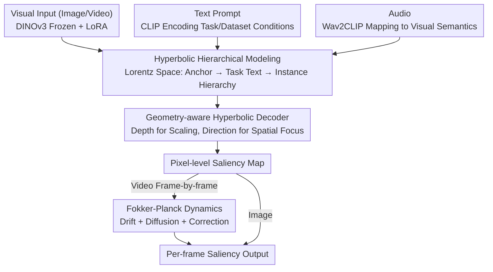

# Attend to Anything: Foundation Model for Unified Human Attention Modeling

**Conference**: ICML2026  
**arXiv**: [2606.03540](https://arxiv.org/abs/2606.03540)  
**Code**: https://github.com/wz-zhao/Attend-to-Anything  
**Area**: Human Understanding / Attention Modeling  
**Keywords**: Human Attention, Visual Saliency, Hyperbolic Representation, Fokker-Planck Dynamics, Multimodal Foundation Model  

## TL;DR
AAM unifies image, video, and audio-visual saliency prediction into a single attention foundation model incorporating text-conditioning, hyperbolic hierarchical constraints, and Fokker-Planck temporal dynamics. It outperforms specialized models across 16 benchmarks and increases video inference speed to approximately 111 FPS.

## Background & Motivation
**Background**: Human attention modeling is typically split into several branches: image saliency, video saliency, and audio-visual attention. Each branch possesses its own datasets, model architectures, and training protocols. Image methods often rely on CNNs or Transformers to predict static maps; video methods add optical flow, 3D convolutions, or temporal Transformers; and audio-visual methods use supplementary audio branches to capture speakers, sound sources, or event cues.

**Limitations of Prior Work**: This task fragmentation allows models to achieve high metrics within single datasets but limits cross-scenario generalization. The paper notes that even when scaling model capacity and data, existing models suffer significant performance drops in cross-dataset testing. This suggests the bottleneck is not merely a lack of training samples, but rather a problem definition that segments the same human cognitive mechanism into disconnected local tasks.

**Key Challenge**: Human attention involves a unified cognitive process, yet current modeling approaches treat scenario differences, task intentions, and modal variations as isolated statistical biases. A model needs to represent both a "general attention prior" and "task-specific conditions" while placing static images and dynamic videos into a single inferable framework, rather than building separate branches for every input format.

**Goal**: The authors aim to construct an attention foundation model reusable across image, video, and audio-visual tasks. It must support text-conditioned control, cross-dataset generalization, frame-by-frame prediction for arbitrary video lengths, and reduced redundant computation in video models without sacrificing accuracy.

**Key Insight**: The paper interprets attention differences as hierarchical entailment relationships from "general attention" to "specific task attention," utilizing hyperbolic space to host this general-to-specific structure. Simultaneously, changes in attention over time in videos are viewed as probability density transport, diffusion, and correction processes, connected via the Fokker-Planck equation to link static saliency with dynamic attention.

**Core Idea**: By using hyperbolic hierarchical semantics to unify scenarios and task conditions, and physics-inspired temporal dynamics to unify image and video attention, the fragmented saliency prediction task is reformulated as a multimodal conditional foundation model.

## Method

### Overall Architecture
AAM addresses the disconnected nature of saliency prediction tasks by mapping them into a unified text-conditioned attention space, bonded by hierarchical geometry and temporal dynamics. Visual inputs are processed by a frozen DINOv3 backbone with LoRA adaptation; text prompts are encoded by CLIP to describe cognitive conditions; audio is mapped to the visual semantic space via Wav2CLIP. Visual and text representations are lifted to the Lorentz hyperbolic space to learn hierarchical relationships. A hyperbolic decoder سپس translates conditions back to pixel-level saliency maps. For videos, a Fokker-Planck dynamics module handles frame-by-frame evolution. The model is trained jointly using saliency loss and hyperbolic entailment loss.

### Key Designs

**1. Hyperbolic Hierarchical Entailment: Representing Dataset and Task Differences as Cognitive Hierarchies**

In prior methods, different datasets and tasks are often treated as independent statistical domains with separate parameters, leading to poor generalization. AAM reformulates this as a hierarchical relationship: learning a partial order $z_{img} \preceq z_{txt} \preceq z_{anc}$ in Lorentz hyperbolic space. Here, $z_{anc}$ is a shared general attention anchor, $z_{txt}$ is a text condition for a task/dataset, and $z_{img}$ represents visual instances. Through hyperbolic entailment cone constraints, text conditions must fall within the cone of the general anchor, and visual instances within the text condition cone. This enforces an abstract-to-concrete chain of "General Attention $\rightarrow$ Task Attention $\rightarrow$ Instance Attention." Hyperbolic space is chosen over Euclidean concatenation because its volume grows exponentially with radius, naturally accommodating tree-like hierarchical semantics where subordination is explicitly encoded.

**2. Geometry-aware Hyperbolic Decoder: Driving Scale and Spatial Focus via Geometric Properties**

Simply concatenating text vectors as conditions makes it difficult for models to distinguish between "generalized task descriptions" and "fine-grained scenario intents." Here, geometric quantities directly participate in decoding. The hyperbolic distance from a text point to the origin represents the specialization depth, used to select multi-scale operator weights $w_k=\mathrm{softmax}_k(-d_L(z_{txt},\mu_k))$; more specific conditions favor finer scales. Simultaneously, the geodesic direction $\Delta$ of the visual instance relative to the text condition determines spatial focus weights, identifying which regions the decoder should emphasize. This ensures hierarchical depth corresponds to scale modulation and semantic offset direction to spatial focus, mirroring how human attention expands or contracts based on task goals.

**3. Fokker-Planck Video Attention Dynamics: Modeling Saliency Evolution as Probability Density Transport**

Fixed-window video models process multiple frames to output only the last, resulting in high redundancy and an inability to perform arbitrary-length frame-by-frame prediction. AAM views the video attention distribution $u_t$ as a probability density over the spatial domain, with its temporal evolution governed by drift, diffusion, and correction terms. The drift term uses bidirectional temporal self-attention to aggregate evidence, allowing attention to migrate with moving targets; the diffusion term uses second-order central differences to smooth high-frequency noise for temporal continuity; the correction term acts like a Kalman gain to adaptively balance dynamic predictions and the current frame observation $u_t^{obs}$, preventing error propagation. Decomposing temporal consistency into these physically meaningful actions is more interpretable than stacking temporal Transformers and enables the high throughput of 111 FPS.

### Loss & Training
The model is trained on Attention-1.75M, a collection of 8 image, 4 video, and 6 audio-visual datasets totaling over 1.75 million human fixation instances. Training follows a staged strategy: initial training on image and video data with a warm-start for the general attention anchor using free-viewing data, followed by the addition of audio-visual data after 10 epochs. The visual backbone remains frozen, adapted only via LoRA and task heads.

The total loss combines traditional saliency losses with hierarchical entailment loss: $L_{total}=L_{KLD}-L_{CC}-L_{SIM}+L_{HAE}$. The $L_{HAE}$ term constrains both anchor-to-text and text-to-image entailment. Audio-visual fusion utilizes a correlation-gated cross-attention mechanism, reinforcing audio contributions only when cues align with visual semantics.

## Key Experimental Results

### Main Results
AAM was evaluated across 16 benchmarks. Representative results show that AAM achieves consistent improvements across natural images, webpages, e-commerce, video, and audio-visual scenarios.

| Task/Dataset | Metric | Ours (AAM) | Prev. SOTA | Gain |
|--------|------|------|----------|------|
| MIT1003 Image | CC ↑ | 0.831 | SUM 0.768 | +0.063 |
| CAT2000 Image | SIM ↑ | 0.769 | SUM 0.754 | +0.015 |
| SALICON Image | KLD ↓ | 0.163 | SUM 0.192 | -0.029 |
| DIEM Audio-Visual | CC ↑ | 0.710 | TAVDiff 0.670 | +0.040 |
| ETMD Audio-Visual | NSS ↑ | 3.66 | CASP 3.34 | +0.32 |
| DHF1K Video | NSS ↑ | 3.272 | MSFF-Net 3.066 | +0.206 |
| Hollywood2 Video | SIM ↑ | 0.599 | VSSM 0.583 | +0.016 |
| UCF Video | CC ↑ | 0.736 | VSSM 0.705 | +0.031 |

### Ablation Study
Ablations covered joint training, backbones, temporal modules, and hyperbolic components.

| Configuration | Key Metrics | Description |
|------|---------|------|
| Single Dataset | Significantly weaker generalization | Learns only local distributions; fails to express unified hierarchy |
| Image Joint Training | Better average image results | Unified hierarchical conditions stabilize cross-scenario performance |
| Full Multimodal Training | Stable gains across all modalities | Audio-visual data does not conflict with existing tasks |
| w/o Temporal Module | Lower average video results | Lacks temporal transport and smoothing |
| Standard Temporal Attention | Better than none, worse than FPD | Aggregates info but lacks structural constraints (diffusion/correction) |
| FPD Temporal Module | Best video ablation | Drift, diffusion, and correction enhance dynamic stability |
| w/o Hyperbolic Learning | Drop in complex hierarchical scenarios | Standard features struggle to represent general-to-specific relations |
| Hyp. Loss + Hyp. Decoder | Best hyperbolic ablation | Constrains both representation and pixel-level decoding |

### Efficiency Comparison
AAM achieves significant throughput through frame-by-frame prediction and FPD evolution.

| Method | Backbone | Input Length | FPS | Trainable Params |
|------|----------|----------|-----|-----------|
| TASED | 3D Conv | Fixed Window | 17 | 82M |
| STSANet | Video Swin | Fixed Window | 28 | 643M |
| TMFI-Net | Video Swin | Fixed Window | 30 | 234M |
| AAM (Ours) | DINOv3 | Arbitrary | 111 | 21.4M |

### Key Findings
- Average gains are balanced across tasks (Image: 5.2%, Audio-Visual: 5.8%, Video: 6.0%), indicating no bias toward specific input types.
- FPD provides both accuracy and throughput benefits, yielding 111 FPS with only 21.4M trainable parameters.
- Condition generalization tests show that correct task conditions significantly outperform generalized ones, which in turn outperform incorrect ones.
- As prompt granularity moves from general to specific, performance plateaus earlier for dynamic or task-driven datasets, suggesting dominant task contexts suffice for fixation patterns.

## Highlights & Insights
- The primary value lies in reframing saliency prediction from "dataset-specific regression" to a "unified attention process under cognitive conditions." This reformulation explains why increased capacity alone failed to solve cross-scenario generalization.
- Hyperbolic space is not merely aesthetic; it maps directly to the hierarchical hypothesis of attention, linking condition abstraction and visual specialization to decoding scales.
- The Fokker-Planck module decomposes temporal consistency into drift, diffusion, and correction, providing physical intuition implementable as neural modules. This is transferable to tasks like video segmentation or dynamic depth estimation.
- The standardization of Attention-1.75M is crucial; without it, verifying the value of multimodal joint training and hierarchical conditions would be impossible.

## Limitations & Future Work
- The "foundation" aspect is currently limited to the attention modeling family; transferability to HCI, driving decisions, or robotic policy learning remains unproven.
- Text conditions primarily derive from dataset protocols; real-world user intent might be more ambiguous or conflict with visual evidence, requiring more robust open-text testing.
- While FPD is efficient, its discrete neural approximation likely still differs from the biological neural mechanisms of eye movement.
- While 16 benchmarks are covered, some ablation results are presented as average curves; full numerical tables for cross-domain zero-shot matrices would be beneficial.

## Related Work & Insights
- **vs UNISAL**: Earlier attempts at unifying image and video saliency relied more on task-specific training. AAM extends this to text-conditioning and audio-visual data.
- **vs SUM**: SUM uses parameter isolation for multi-dataset differences. AAM treats these as cognitive hierarchies, avoiding the need to treat each dataset as an isolated statistical domain.
- **vs TAVDiff/CASP**: These focus on audio-visual fusion. AAM integrates this capability into a broader unified foundation model.
- **vs Video Swin/3D Conv Models**: Traditional models use fixed windows for context, which is computationally heavy. FPD treats temporal changes as distribution evolution, making arbitrary-length reasoning intrinsic to the architecture.

## Rating
- Novelty: ⭐⭐⭐⭐⭐ Strong reformulation of unified attention using hyperbolic semantics and Fokker-Planck dynamics.
- Experimental Thoroughness: ⭐⭐⭐⭐⭐ Comprehensive coverage of 16 benchmarks, three modalities, and extensive efficiency and ablation analysis.
- Writing Quality: ⭐⭐⭐⭐ Clear motivation and narrative, though high information density in charts requires careful reading.
- Value: ⭐⭐⭐⭐⭐ Offers a clear unified paradigm for saliency prediction and cognitive-inspired vision models.

<!-- RELATED:START -->

## Related Papers

- [\[ICLR 2026\] Human Behavior Atlas: Benchmarking Unified Psychological and Social Behavior Understanding](../../ICLR2026/audio_speech/human_behavior_atlas_benchmarking_unified_psychological_and_social_behavior_unde.md)
- [\[AAAI 2026\] USE: A Unified Model for Universal Sound Separation and Extraction](../../AAAI2026/audio_speech/use_a_unified_model_for_universal_sound_separation_and_extraction.md)
- [\[ICLR 2026\] Pay Attention to CTC: Fast and Robust Pseudo-Labelling for Unified Speech Recognition](../../ICLR2026/audio_speech/pay_attention_to_ctc_fast_and_robust_pseudo-labelling_for_unified_speech_recogni.md)
- [\[AAAI 2026\] DualSpeechLM: Towards Unified Speech Understanding and Generation via Dual Speech Token Modeling](../../AAAI2026/audio_speech/dualspeechlm_towards_unified_speech_understanding_and_generation_via_dual_speech.md)
- [\[ACL 2026\] UniSonate: A Unified Model for Speech, Music, and Sound Effect Generation with Text Instructions](../../ACL2026/audio_speech/unisonate_a_unified_model_for_speech_music_and_sound_effect_generation_with_text.md)

<!-- RELATED:END -->
