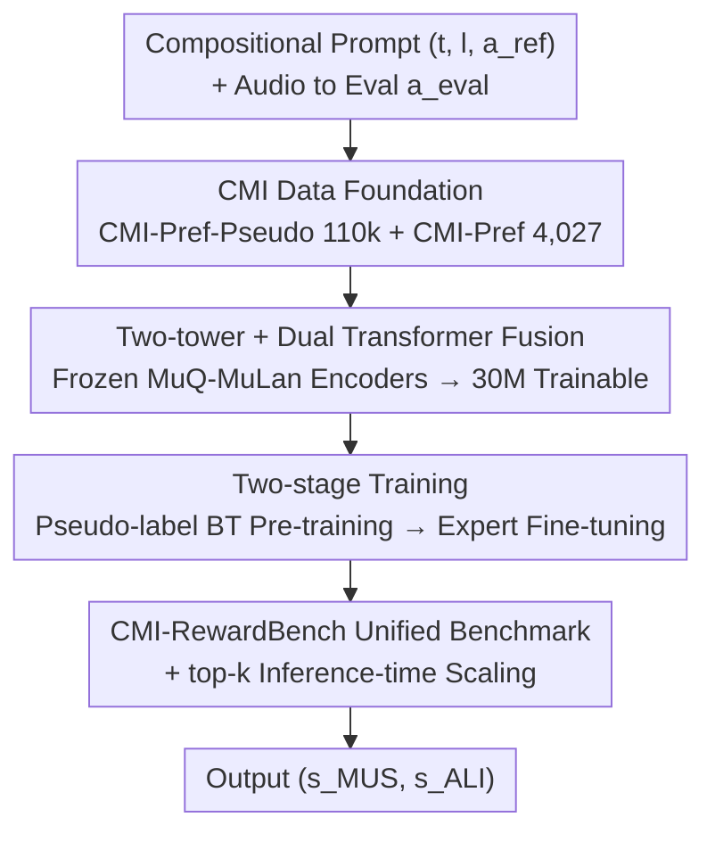

# CMI-RewardBench: Evaluating Music Reward Models with Compositional Multimodal Instruction

**Conference**: ICML2026  
**arXiv**: [2603.00610](https://arxiv.org/abs/2603.00610)  
**Code**: Available (GitHub; model weights CMI-RM and datasets CMI-Pref / CMI-Pref-Pseudo are open-sourced)  
**Area**: Audio & Speech / Music Generation Evaluation / Reward Models  
**Keywords**: Music Reward Model, Compositional Multimodal Instruction, Preference Dataset, Inference-time Scaling, RLHF

## TL;DR
Addressing the lack of unified evaluation for modern music generation models that simultaneously process "text + lyrics + reference audio," this paper establishes a complete ecosystem: 110k pseudo-labeled CMI-Pref-Pseudo, 4,027 human-labeled CMI-Pref, a unified CMI-RewardBench, and a family of ~30M parameter reward models (CMI-RM) capable of handling all modality combinations in a single architecture. The authors demonstrate high correlation with human judgment and enable "inference-time scaling" via top-k filtering.

## Background & Motivation
**Background**: AIGC music generation (e.g., Suno, Stable Audio, YUE, ACE-Step) has evolved to flexibly receive multimodal conditions—pure text, text + lyrics, text + reference audio, or combinations for style transfer/continuation. However, evaluation capabilities for these outputs lag significantly.

**Limitations of Prior Work**: Existing evaluation methods are fragmented and narrow. Distribution-level metrics (FAD, MAD, KAD) only compare at the corpus level and cannot provide sample-level signals needed for post-training/filtering. Sample-level MOS predictors (PAM, Audiobox, SongEval) only assess "musicality." Alignment metrics (CLAP, CLaMP3, MuQ-MuLan) almost exclusively cover text-to-audio, neglecting lyrics and audio prompts. Closed-source systems (MusicRL, DRAGON) also lack reproducibility.

**Key Challenge**: There is a widening gap between model capabilities (flexible combined inputs) and evaluation methods (rigid input assumptions, single-dimension scoring). More fundamentally, data is scarce—large-scale interaction data from recommender systems captures "user-track affinity" (global style preference) rather than "generation alignment" (fine-grained sample-wise comparison for complex multimodal instructions), the latter of which is required for training alignment models.

**Goal**: Define and measure "compositional alignment"—not just satisfying multiple constraints simultaneously, but requiring a unified model that adaptively aligns with human preferences under **optional and varying** input conditions (text, lyrics, or audio reference). Scoring/ranking must stably reflect human judgment of music quality and instruction following.

**Key Insight**: Rather than continuing to build narrow specialized scorers, it is better to first fill the missing data foundation and unified benchmark, then train a parameter-efficient reward model with a single architecture for all modality combinations. The authors found that even frontier multimodal LLMs like Gemini-2.5-Pro struggle to exceed 80% agreement with humans on this benchmark, highlighting a real and unsolved capability gap.

**Core Idea**: Unify music evaluation scenarios using "Compositional Multimodal Instructions (CMI)," supported by a construction of preference data + unified benchmark + two-tower parameter-efficient reward models, allowing a ~30M model to serve as a human proxy for both musicality and alignment.

## Method

### Overall Architecture
CMI-RM aims to solve: given a compositional prompt $\mathcal{P}=(t,l,a_{\text{ref}})$ (optional text $t$, optional lyrics $l$, optional reference audio $a_{\text{ref}}$) and an evaluation audio $a_{\text{eval}}$, output two scalar scores—musicality $s_{\text{MUS}}$ and alignment $s_{\text{ALI}}$—to match human judgment. The architecture consists of three layers: a preference data foundation (large-scale pseudo + small-scale high-quality human), a two-tower dual-Transformer fusion architecture (frozen MuQ-MuLan encoders → 30M trainable), and two-stage training (Pseudo-label BT pre-training → Expert fine-tuning). Finally, this RM is evaluated on CMI-RewardBench and used for top-k filtering during inference.

### Key Designs

**1. Data Foundation: CMI-Pref-Pseudo + CMI-Pref**

Training alignment models lacks data scale, quality, and modality coverage. The authors address this via two complementary datasets: **CMI-Pref-Pseudo** distills diverse generations from 12 open-source models + 11 commercial APIs (Suno v3.5–v5, Stable Audio, etc.), with 35.6% involving audio prompts for style transfer/continuation; Qwen3-Omni serves as an LLM-judge for two-dimensional preferences (musicality + alignment), retaining 110k pairs after consistency filtering. **CMI-Pref** consists of 4,027 high-quality pairs from 31 experts, providing preferences for both dimensions, confidence scores (1–5), and rationales. It includes a balanced 500-pair test set (text / text+lyrics / text+audio / text+audio+lyrics) with human agreement of 75.2% (MUS) and 75.0% (ALI). This is the only preference data covering both "lyric conditions" and "audio-to-audio conditions."

**2. Parameter-Efficient Fusion Architecture (~30M)**

To adapt to "any modality optional" inputs, CMI-RM uses a two-tower structure. All encoders are **frozen** and sourced from MuQ-MuLan ($t$ and $l$ through text encoders, $a_{\text{ref}}$ and $a_{\text{eval}}$ through audio encoders). Missing modalities are treated as zero tensors. The prompt side uses a 4-layer **Prompt Transformer** to fuse embeddings: $\mathbf{h}_{\text{prompt}}=\text{PromptTF}([\mathbf{E}_{t};\mathbf{E}_{l};\mathbf{E}_{a_{\text{ref}}}])$. A single-layer **Joint Transformer** models the interaction between the prompt and evaluation audio: $\mathbf{h}_{\text{eval}}=\text{JointTF}([\mathbf{h}_{\text{prompt}};\mathbf{E}_{a_{\text{eval}}}])$. Final scores are produced by time pooling and a lightweight MLP: $(s_{\text{ALI}},s_{\text{MUS}})=\text{MLP}(\text{Pool}(\mathbf{h}_{\text{eval}}))$.

**3. Two-stage Training: Pseudo BT Pre-training → Expert Fine-tuning**

**Stage 1 Preference Pre-training** uses CMI-Pref-Pseudo (2k steps, batch 48) with Bradley–Terry (BT) modeling for pair-wise preference: $P(A>B)=\sigma\big(s_\theta(\mathcal{P},A)-s_\theta(\mathcal{P},B)\big)$. Label smoothing (0.2) is applied to mitigate overconfidence from pseudo-labels. **Stage 2 Expert Fine-tuning** uses CMI-Pref + MusicEval (6,647 samples) with early stopping. Human labels include both pair-wise preferences (BT loss) and scalar ratings $y\in[1,5]$ (regression loss).

**4. CMI-RewardBench + top-k Inference-time Scaling**

The authors integrate heterogeneous resources into a unified held-out benchmark: PAM (scalar MUS/ALI), MusicEval (scalar MUS), Music Arena (pair-wise preferences), and CMI-Pref (pair-wise MUS/ALI across four modality conditions). Evaluation metrics include LCC/SRCC/Kendall-Tau for ratings and accuracy for preferences. Beyond evaluation, CMI-RM enables **top-k filtering**—generating multiple candidates and selecting the highest-scoring one—to achieve "inference-time scaling."

### Loss & Training
- Pair-wise preference: Bradley–Terry + Cross-Entropy, excluding ties, Stage 1 label smoothing 0.2.
- Scalar ratings: Regression for $y\in[1,5]$.
- Total objective: $\mathcal{L}_{\text{total}}=\frac{1}{2}(\mathcal{L}_{\text{MUS}}+\mathcal{L}_{\text{ALI}})$, joint optimization of both heads.
- Strategy: Batch size 48; Stage 1 for 2k steps, Stage 2 with ~250 steps early stopping.

## Key Experimental Results

### Main Results
Evaluation sources and protocols (all held-out):

| Source | Label Type | Scale | Protocol |
|--------|------------|-------|----------|
| PAM | Scalar (MUS + Text-Align) | 500 | LCC / SRCC / K-Tau |
| MusicEval | Scalar (MUS MOS) | 413 | LCC / SRCC / K-Tau |
| Music Arena | Pair-wise Preference (MUS) | 1,340 | Accuracy |
| CMI-Pref | Pair-wise (MUS + ALI) | 500 | Accuracy |

Dataset comparison (subset of Table 1, sample count refers to "pairs" for preference and "clips" for MOS):

| Dataset | Text | Lyrics | Audio Cond. | Samples | Models/APIs |
|--------|------|------|---------|--------|------------|
| PAM | ✔ | ✗ | ✗ | 500 | 5 |
| MusicEval | — | ✗ | ✗ | 2,748 | 31 |
| Music Arena | ✔ | ✔ | ✗ | 2,800 | 17 |
| **CMI-Pref-Pseudo** | ✔ | ✔ | ✔ | 110k | 23 |
| **CMI-Pref** | ✔ | ✔ | ✔ | 4,027 | 23 |

Key conclusion: Frontier MLLMs like Gemini-2.5-Pro struggle to exceed **80%** human agreement, revealing a significant capability gap.

### Ablation Study

| Setting | Function | Description |
|------|------|------|
| Stage 1 Only | Large-scale base | 2k steps / label smoothing 0.2 to handle pseudo-label noise |
| + Stage 2 | High-quality calibration | 6,647 samples for fine-grained human alignment |
| Frozen MuQ-MuLan Encoders | Parameter efficiency | ~30M trainable, matches/exceeds dedicated baselines like SongEval |
| top-k Filtering | Inference-time scaling | Uses CMI-RM to select high-quality candidates |

### Key Findings
- Even frontier MLLMs (Gemini-2.5-Pro) fail to exceed 80% agreement, showing compositional music evaluation is far from solved.
- The ~30M CMI-RM covers all CMI-RewardBench settings in one architecture, performing comparably or better than specialized open-source baselines (e.g., SongEval).
- CMI-RM serves as both an evaluator and a "generation amplifier" via top-k filtering.

## Highlights & Insights
- **Data-fying the "Evaluation Lag"**: Instead of just another scorer, the authors built the entire ecosystem (large pseudo + expert small + unified benchmark). This "foundation first" approach is replicable for any generation subfield with lagging evaluation.
- **Frozen Encoders + Dual Transformer**: The design using frozen MuQ-MuLan encoders and zeroing out missing modalities elegantly handles any modality combination. The ~30M trainable parameters set a paradigm for lightweight multimodal reward modeling.
- **Reward Model as Inference Amplifier**: Top-k filtering provides a low-cost path to improve quality without retraining large generation model weights.

## Limitations & Future Work
- Pseudo-labels distilled from Qwen3-Omni inherit LLM-judge biases, limiting the upper bound.
- Human agreement on the CMI-Pref test set is ~75%, reflecting the high subjective noise in compositional music preferences.
- Some resources (AIME, MusicPref) were excluded from the main benchmark due to split alignment issues.

## Related Work & Insights
- **vs MOS Predictors (PAM, SongEval)**: They are single-dimensional and rigid; CMI-RM outputs two dimensions and supports arbitrary combinations with less weight.
- **vs Alignment Metrics (CLAP, MuQ-MuLan)**: These focus on text-to-audio; Ours adds lyrics/audio conditions and treats alignment as a trainable human proxy.
- **vs Preference Platforms (Music Arena)**: Mostly text-to-music; CMI-Pref is the first large-scale compositional preference dataset with lyrics and audio.
- **vs LLM-as-a-judge**: Proprietary and un-optimized for music; this work shows MLLMs still have gaps and provides a parameter-efficient alternative.

## Rating
- Novelty: ⭐⭐⭐⭐⭐ First to unify "Compositional Multimodal Instruction" for music evaluation with a full ecosystem.
- Experimental Thoroughness: ⭐⭐⭐⭐ Broad coverage across four sources; however, some per-task values are primarily in the appendix.
- Writing Quality: ⭐⭐⭐⭐ Clear motivation and architecture; rigorous formulas.
- Value: ⭐⭐⭐⭐⭐ Open-sourced data/weights/benchmark; high practical value for AIGC post-training.

<!-- RELATED:START -->

## Related Papers

- [\[ACL 2026\] S2S-Arena: Evaluating Paralinguistic Instruction Following in Speech-to-Speech Models](../../ACL2026/audio_speech/s2s-arena_evaluating_paralinguistic_instruction_following_in_speech-to-speech_mo.md)
- [\[ICML 2026\] Towards Understanding Modality Interaction in Multimodal Language Models via Partial Information Decomposition](towards_understanding_modality_interaction_in_multimodal_language_models_via_par.md)
- [\[ICLR 2026\] EchoMind: An Interrelated Multi-level Benchmark for Evaluating Empathetic Speech Language Models](../../ICLR2026/audio_speech/echomind_an_interrelated_multi-level_benchmark_for_evaluating_empathetic_speech_.md)
- [\[ICML 2026\] MultiBreak: A Scalable and Diverse Multi-turn Jailbreak Benchmark for Evaluating LLM Safety](multibreak_a_scalable_and_diverse_multi-turn_jailbreak_benchmark_for_evaluating_.md)
- [\[ACL 2026\] Music Audio-Visual Question Answering Requires Specialized Multimodal Designs](../../ACL2026/audio_speech/music_audio-visual_question_answering_requires_specialized_multimodal_designs.md)

<!-- RELATED:END -->
