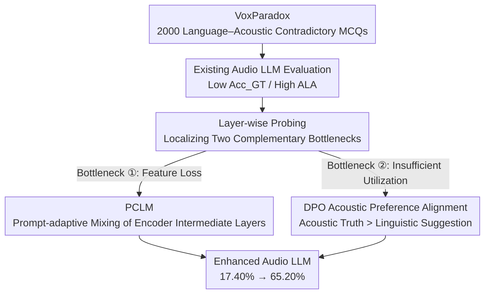

# Do Audio LLMs Listen or Read? Analyzing and Mitigating Paralinguistic Failures with VoxParadox

**Conference**: ICML 2026  
**arXiv**: [2605.27772](https://arxiv.org/abs/2605.27772)  
**Code**: https://voxparadox.github.io/ (Project Homepage)  
**Area**: Audio & Speech / Audio LLM / Paralinguistic Understanding  
**Keywords**: Audio LLM, Paralinguistics, Adversarial Benchmark, Layer-wise Mixing, DPO

## TL;DR
The authors construct VoxParadox, a benchmark of 2,000 Multiple Choice Questions (MCQs) designed with intentional contradictions between "what the text says" and "what the audio sounds like." They demonstrate that current Audio LLMs almost exclusively "read but do not listen" in paralinguistic tasks. By introducing PCLM, a lightweight module that adaptively mixes intermediate audio encoder features based on the prompt, combined with DPO, they improve Audio Flamingo 3's performance on VoxParadox from 17.40% to 65.20%.

## Background & Motivation

**Background**: Audio LLMs such as Qwen2-Audio, SALMONN, Audio Flamingo 3, and Kimi-Audio connect audio encoders (mostly from the Whisper family) to powerful LLMs, achieving impressive instruction following and conversational speech understanding. However, the "paralinguistic" capabilities of these models—extracting information such as emotion, age, gender, pitch, speed, tone, and speaker identity from "how things are said" and "who is speaking"—have not been rigorously evaluated.

**Limitations of Prior Work**: General audio benchmarks like MMAU, MMAU-Pro, MMSU, and MMAR either emphasize broad audio understanding or conflate linguistic cues with acoustic cues. Although MMSU includes a paralinguistic subset, it does not explicitly decouple "linguistically suggested answers" from "acoustic ground truth." Consequently, models can achieve high scores by simply guessing based on the literal meaning of the ASR (Automatic Speech Recognition) transcript without truly "listening."

**Key Challenge**: The training paradigms of Audio LLMs (ASR-centric + text alignment) naturally favor literal semantics. Paralinguistic signals require models to actively abandon semantic shortcuts to focus on acoustic textures. This creates a modality imbalance, yet tools to directly quantify this imbalance are lacking.

**Goal**: (1) Create a benchmark capable of exposing the "listening vs. reading" gap; (2) Determine whether paralinguistic information is lost in the deep layers of the encoder, the projection layer, or if the LLM simply fails to utilize it; (3) Propose a mitigation strategy that is effective without retraining the entire Audio LLM.

**Key Insight**: Drawing inspiration from the use of contradictory captions to expose modality shortcuts in Vision-Language Models (Shekhar 2017, GVQA), the authors construct samples with systematic contradictions between the audio and the text—e.g., an elderly person saying "I am a child," or multiple people saying "Only one person is speaking." If a model selects the incorrect option suggested by the text, it proves it is not listening.

**Core Idea**: The authors first use the adversarial benchmark to localize the failure to two complementary bottlenecks: "feature loss" and "insufficient utilization." They then address feature loss using Prompt-Conditioned Layer Mixing (PCLM) and utilization using DPO.

## Method

### Overall Architecture

The work follows a "Diagnosis—Localization—Treatment" closed loop. In the diagnosis phase, the VoxParadox adversarial benchmark is created to pit text against audio. Existing Audio LLMs are evaluated, and layer-wise probing is used to localize the issues to two bottlenecks: the loss of paralinguistic features in deep encoder layers and the LLM's failure to utilize available features. For the treatment, the audio encoder and LLM backbone weights are frozen. A PCLM module is inserted at the interface to adaptively select layers based on the prompt to recover features, followed by a round of DPO to train "following the audio" as a preference to improve utilization.

### Key Designs

**1. VoxParadox: Forcing the "Listen vs. Read" Gap through Linguistic-Acoustic Contradictions**

In previous benchmarks like MMSU and CP-Bench, linguistic and acoustic cues are coupled, allowing models to score by following ASR transcripts. VoxParadox breaks this by making the textual attribute $y_{\text{adv}}$ and the acoustic attribute $y_{\text{true}}$ systematically contradictory (e.g., an old man saying "I am a child"). Both $y_{\text{true}}$ and $y_{\text{adv}}$ are present in the options, so a correct answer necessitates relying on non-linguistic acoustic evidence, blocking modality shortcuts. The construction is controllable on both sides: GPT-4o generates scripts that assert $y_{\text{adv}}$ while excluding $y_{\text{true}}$; deterministic mechanisms anchor $y_{\text{true}}$ (e.g., fixed metadata for age/gender, signal processing for low-level attributes, SSML for pitch, and concatenation for speaker identity). Quality control includes Whisper large-v3 to ensure WER = 0 for transcripts, SpeechBrain Wav2Vec2 for emotion filtering, and 10% human spot-checking, resulting in 2,000 verified MCQs across 10 tasks. Two metrics are used: $\mathrm{Acc}_{\mathrm{GT}} = \frac{1}{N}\sum_i \mathbb{I}[\hat{y}_i = y_{\text{true}}^{(i)}]$ (how often it listens correctly) and $\mathrm{ALA} = \frac{1}{N}\sum_i \mathbb{I}[\hat{y}_i = y_{\text{adv}}^{(i)}]$ (how often it is misled by text).

**2. PCLM: Mitigating "Feature Loss" via Prompt-Conditioned Layer Mixing**

Probing reveals that paralinguistic cues are strongest in the middle layers of ASR-pretrained encoders and are suppressed in deeper layers, while standard architectures typically only feed the final layer to the LLM. PCLM replaces this interface by calculating a weight $\alpha_\ell(\text{prompt})$ for each layer $h^{(\ell)}$ conditioned on the prompt embedding, then computing $\tilde{h} = \sum_\ell \alpha_\ell(\text{prompt}) \cdot h^{(\ell)}$. Conditioning on the prompt is crucial because tasks like emotion vs. age recognition require different layers. This allows the model to route specific layers based on the question, making it more efficient and tailored than previous multi-encoder or input-only dependent methods.

**3. DPO Acoustic Preference Alignment: Filling the "Utilization Gap"**

The second bottleneck is the "utilization gap": even when acoustic cues are available in the tokens, LLMs systematically ignore them. Standard SFT token-level loss rarely penalizes the "text-first" shortcut. This work uses DPO, treating the acoustically-grounded correct answer as the chosen $y_w$ and the linguistically-suggested incorrect answer as the rejected $y_l$. By optimizing $\log \pi(y_w \mid x) - \log \pi(y_l \mid x)$, the model is explicitly rewarded for favoring the audio when it conflicts with the text. VoxParadox samples naturally provide these $(y_{\text{true}}, y_{\text{adv}})$ pairs, serving as both evaluation data and alignment signals.

### Loss & Training

A two-stage training strategy is employed with the audio encoder and LLM backbone frozen. First, the PCLM module is updated via SFT on conventional paralinguistic data to develop layer-selection capabilities. Second, DPO is performed on paired "acoustically grounded vs. language-implied" data to align preferences, making the LLM more inclined to use the selected acoustic features.

## Key Experimental Results

### Main Results

VoxParadox covers 10 tasks including age, gender, emotion, pitch, volume, speed, tone, speaker counting, speaker identification, and signal comparison. Baselines include Qwen2-Audio, SALMONN, Audio Flamingo 3, and Kimi-Audio.

| Model | VoxParadox Avg | MMSU Paralinguistic Subset | Notes |
| :--- | :--- | :--- | :--- |
| Audio Flamingo 3 (Original) | 17.40% | 37.74% | Strong baseline, yet near random |
| Representative Audio LLMs | Generally Low | Median | ALA significantly higher than $\mathrm{Acc}_{\mathrm{GT}}$ |
| Audio Flamingo 3 + PCLM + DPO (**Ours**) | **65.20%** | **54.78%** | +47.80 Gain on VoxParadox, +17.04 on MMSU |

### Ablation Study

| Configuration | VoxParadox Avg | Description |
| :--- | :--- | :--- |
| Base Audio Flamingo 3 | 17.40% | Last layer only + no preference alignment |
| + PCLM only | Moderate Gain | Fixes "feature loss," benefits emotion, pitch, tone |
| + DPO only | Partial Gain | Fixes "utilization gap," but limited without good features |
| Full: PCLM + DPO | **65.20%** | Both bottlenecks addressed |

### Key Findings

- **Audio LLMs "Read" Rather Than "Listen"**: All evaluated models showed low GT accuracy and high ALA on VoxParadox, proving a systematic bias toward following text transcripts over acoustic evidence.
- **Two Complementary Bottlenecks**: Probing indicates that paralinguistic info degrades in deep encoder layers and the projector, and even when present, LLMs often ignore it (a phenomenon similar to "hidden in plain sight" in VLMs).
- **PCLM and DPO are Synergistic**: PCLM addresses the presence of information ("is it there?"), while DPO addresses its usage ("will the model use it?"). Both are required to reach 65.20%.

## Highlights & Insights

- **Dual Use of Adversarial Benchmarks**: VoxParadox is not just an evaluation tool; its $(y_{\text{true}}, y_{\text{adv}})$ structure serves as preference data for DPO, creating a clean "diagnosis and treatment" loop.
- **Quantifiable Definition of "Reading vs. Listening"**: Using $\mathrm{ALA}$ as a single scalar to quantify modality shortcuts makes linguistic bias measurable and optimizable, a framework applicable to other multimodal systems like Video or 3D LLMs.
- **Lightweight Intervention**: Improving paralinguistic performance does not require retraining a new encoder from scratch, making it engineering-friendly.
- **Transferable Diagnostic Template**: The approach of using layer-wise probing to separate "information loss" from "utilization gaps" can be applied to any "encoder + LLM" multimodal architecture.

## Limitations & Future Work

- **Authenticity of TTS Synthesis**: All 2,000 samples are TTS-synthesized. While verified, there remains a distribution gap with real human voices, noisy environments, and diverse accents.
- **Task Imbalance**: Continuous attributes like emotion and tone are less controllable than discrete ones; the reliance on emotion referees suggests that the adversarial paradigm is harder to scale across all dimensions.
- **"Listening" vs. "Understanding"**: Success is defined as selecting $y_{\text{true}}$, but the real value of paralinguistics lies in downstream decisions (e.g., empathetic responses). Evaluating these models in conversational tasks is a natural next step.
- **Prompt Condition Robustness**: Whether the learned layer weights generalize to different prompt styles or languages remains to be tested in robustness experiments.

## Related Work & Insights

- **vs. LISTEN (Chen 2025)**: LISTEN uses decorrelated pairs for emotion recognition; VoxParadox scales "contradiction by design" to 10 tasks and provides a mitigation strategy.
- **vs. MMSU / MMAU / MMAU-Pro / MMAR**: These are general benchmarks; VoxParadox is a targeted stress test for isolating paralinguistics.
- **vs. PaM (Shan 2025)**: PaM blends multiple encoders; PCLM blends layers within a single encoder, which is more cost-effective and aligns with empirical findings on feature distribution.
- **vs. DPO in TTS (Liu 2025)**: While others use DPO for expressive generation, this work applies it to the understanding side to favor acoustic evidence.
- **Cross-modal Inspiration**: The "language-implied vs. visually-grounded" contradiction logic can be directly ported to VLM evaluation and alignment.

## Rating
- Novelty: ⭐⭐⭐⭐ Systematically migrates the "contradiction" concept from VLM to audio and reuses the benchmark for DPO.
- Experimental Thoroughness: ⭐⭐⭐⭐ Covers multiple LLMs with detailed probing, main experiments, and ablation studies.
- Writing Quality: ⭐⭐⭐⭐ Clear narrative flow from diagnosis to treatment.
- Value: ⭐⭐⭐⭐⭐ Provides both a metric for modality bias and a practical, high-gain mitigation method.

<!-- RELATED:START -->

## Related Papers

- [\[ACL 2025\] Analyzing and Mitigating Inconsistency in Discrete Audio Tokens for Neural Codec Language Models](../../ACL2025/audio_speech/audio_token_consistency.md)
- [\[ICML 2026\] Probing Cross-modal Information Hubs in Audio-Visual LLMs](probing_cross-modal_information_hubs_in_audio-visual_llms.md)
- [\[AAAI 2026\] Do LLMs Feel? Teaching Emotion Recognition with Prompts, Retrieval, and Curriculum Learning](../../AAAI2026/audio_speech/do_llms_feel_teaching_emotion_recognition_with_prompts_retrieval_and_curriculum_.md)
- [\[ICML 2026\] Focus Then Listen: An Empirical Study of Plug-and-Play Audio Enhancer for Noise-Robust Large Audio Language Models](focus_then_listen_an_empirical_study_of_plug-and-play_audio_enhancer_for_noise-r.md)
- [\[ACL 2026\] Protecting Bystander Privacy via Selective Hearing in Audio LLMs](../../ACL2026/audio_speech/protecting_bystander_privacy_via_selective_hearing_in_audio_llms.md)

<!-- RELATED:END -->
