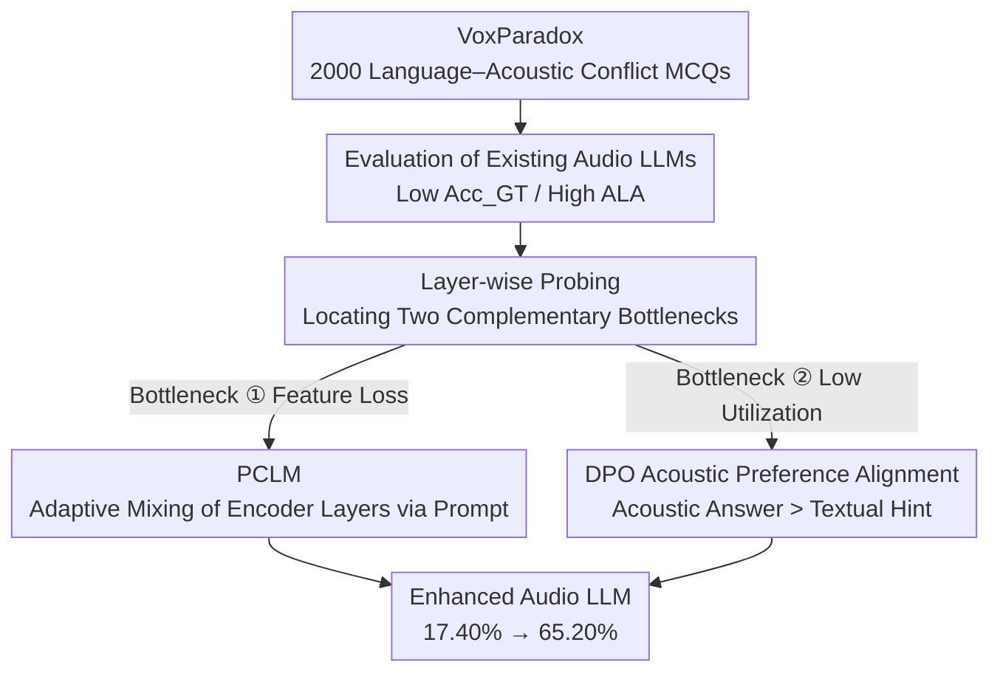

# Do Audio LLMs Listen or Read? Analyzing and Mitigating Paralinguistic Failures with VoxParadox

**Conference**: ICML 2026  
**arXiv**: [2605.27772](https://arxiv.org/abs/2605.27772)  
**Code**: https://voxparadox.github.io/ (Project Homepage)  
**Area**: Audio & Speech / Audio LLM / Paralinguistics  
**Keywords**: Audio LLM, Paralinguistics, Adversarial Benchmark, Inter-layer mixing, DPO

## TL;DR
The authors construct VoxParadox, a 2000-question MCQ benchmark where textual content intentionally conflicts with acoustic signals, proving that current Audio LLMs almost exclusively "read rather than listen" for paralinguistic tasks. By employing PCLM (a lightweight module for prompt-conditioned adaptive mixing of encoder intermediate layers) and DPO (Preference Optimization), the performance of Audio Flamingo 3 on VoxParadox is improved from 17.40% to 65.20%.

## Background & Motivation

**Background**: Audio LLMs, represented by Qwen2-Audio, SALMONN, Audio Flamingo 3, and Kimi-Audio, connect speech encoders (mostly from the Whisper family) to powerful LLMs, achieving competent instruction following and conversational speech understanding. However, their "paralinguistic" capabilities—extracting information such as emotion, age, gender, pitch, speaking rate, tone, and speaker identity from *how* and *who* is speaking—have not been rigorously evaluated.

**Limitations of Prior Work**: Existing general audio benchmarks like MMAU, MMAU-Pro, MMSU, and MMAR either emphasize broad audio understanding or conflate linguistic and acoustic cues. Although MMSU includes a paralinguistic subset, it fails to explicitly decouple "textually implied answers" from "true acoustic answers." Consequently, models can achieve high scores simply by guessing based on ASR literal semantics without truly "listening."

**Key Challenge**: The training paradigm of Audio LLMs (ASR-centric + text alignment) naturally favors literal semantics, whereas paralinguistic signals require the model to actively abandon semantic shortcuts and focus on acoustic textures. A modality imbalance exists between the two, yet tools to directly quantify this imbalance are lacking.

**Goal**: (1) Create a benchmark capable of forcing a gap between "listening vs. reading"; (2) determine whether paralinguistic information is lost in deep encoder layers, the projection layer, or if the LLM simply ignores it; (3) provide a fix that works without retraining the entire Audio LLM.

**Key Insight**: Borrowing the idea of using contradictory captions to expose modality shortcuts in Vision-Language models (Shekhar 2017, GVQA), the authors construct samples with systematic conflicts between "what is spoken" and "what the text says"—e.g., an elderly person saying "I am a child," or multiple people saying "only one person is speaking." If the model selects the textually implied incorrect option, it proves the model is not listening.

**Core Idea**: First, use the adversarial benchmark to locate the pathology in two complementary bottlenecks: "feature loss" and "insufficient utilization." Then, use Prompt-Conditioned Layer Mixing (PCLM) to recover features and DPO to improve utilization.

## Method

### Overall Architecture

The workflow forms a "diagnosis–localization–treatment" closed loop. The diagnosis phase creates VoxParadox, an adversarial benchmark where text and voice conflict, evaluating existing Audio LLMs and using layer-wise probing to locate the pathology in two complementary bottlenecks: paralinguistic features being discarded in deep encoder layers and the LLM's reluctance to use features even when present. The treatment phase, which leaves the audio encoder and LLM backbone weights untouched, inserts a PCLM module at the interface to adaptively select layers based on the prompt, followed by a round of DPO to train "following the voice" as a preference.

### Key Designs

**1. VoxParadox: Forcing the Listen vs. Read Gap via Language–Acoustic Conflict**

The core pain point of previous benchmarks like MMSU and CP-Bench is the coupling of linguistic and acoustic cues. VoxParadox solves this by fixing the textual statement attribute $y_{\text{adv}}$ and the true acoustic attribute $y_{\text{true}}$ to be systematically opposite (e.g., an old man says "I am a child"). Both $y_{\text{true}}$ and $y_{\text{adv}}$ appear in the options—thus, "answering correctly" necessitates reliance on non-linguistic acoustic evidence, blocking modality shortcuts. On the text side, GPT-4o generates scripts asserting $y_{\text{adv}}$; on the acoustic side, deterministic mechanisms anchor $y_{\text{true}}$ (e.g., metadata for age/gender, signal processing for pitch/rate). Quality control uses Whisper large-v3 to ensure WER = 0 and SpeechBrain for emotion filtering. Evaluation uses two metrics: $\mathrm{Acc}_{\mathrm{GT}} = \frac{1}{N}\sum_i \mathbb{I}[\hat{y}_i = y_{\text{true}}^{(i)}]$ measures "correct listening," and $\mathrm{ALA} = \frac{1}{N}\sum_i \mathbb{I}[\hat{y}_i = y_{\text{adv}}^{(i)}]$ (Adversarial Language Alignment) measures how much the model follows textual hints.

**2. PCLM: Prompt-Conditioned Layer Mixing for "Feature Loss"**

Layer-wise probing reveals that paralinguistic cues are strongest in middle layers of ASR-pretrained encoders and are suppressed in deeper layers, while standard architectures only pass the final layer to the LLM. PCLM replaces this interface: it calculates weights $\alpha_\ell(\text{prompt})$ conditioned on the prompt embedding for each encoder layer output $h^{(\ell)}$, then feeds the weighted sum $\tilde{h} = \sum_\ell \alpha_\ell(\text{prompt}) \cdot h^{(\ell)}$ to the LLM. Prompt conditioning allows the module to route layers based on the question (e.g., emotion vs. age), which is more efficient than multi-encoder mixing.

**3. DPO Acoustic Preference Alignment for "Utilization Gap"**

The second bottleneck is that LLMs systematically ignore acoustic cues even when they exist in tokens (utilization gap). Standard SFT loss rarely penalizes the "literal-first" shortcut. DPO is used here by setting the "acoustically grounded correct answer" as the chosen $y_w$ and the "textually implied incorrect answer" as the rejected $y_l$. Optimizing $\log \pi(y_w \mid x) - \log \pi(y_l \mid x)$ explicitly rewards following the audio when text and audio conflict.

### Loss & Training

A two-stage training process is used, freezing the audio encoder and LLM backbone: (1) SFT on general paralinguistic data to update the PCLM module, and (2) DPO on paired "acoustically grounded vs. language-implied" data to align preferences.

## Key Experimental Results

### Main Results

VoxParadox covers 10 tasks including age, gender, emotion, pitch, volume, rate, tone, speaker count, recognition, and signal comparison.

| Model | VoxParadox Avg | MMSU Paralinguistics | Remarks |
|------|---------------|---------------|------|
| Audio Flamingo 3 (Original) | 17.40% | 37.74% | Strong baseline, yet near random |
| Standard Audio LLMs | Generally Low | Medium | ALA significantly higher than $\mathrm{Acc}_{\mathrm{GT}}$ |
| Audio Flamingo 3 + PCLM + DPO (Ours) | **65.20%** | **54.78%** | **Gain**: +47.80 on VoxParadox |

### Ablation Study

| Configuration | VoxParadox Avg | Explanation |
|------|---------------|------|
| Base Audio Flamingo 3 | 17.40% | Final layer only + No preference alignment |
| + PCLM only | Moderate improvement | Fixes "feature loss," benefits pitch/tone |
| + DPO only | Partial improvement | Fixes "utilization," but limited by feature quality |
| Full: PCLM + DPO | 65.20% | Both bottlenecks must be addressed |

### Key Findings

- **Audio LLMs "read" rather than "listen"**: Modern Audio LLMs exhibit low GT accuracy and high ALA on VoxParadox, proving a systematic bias toward transcription text.
- **Two complementary bottlenecks**: (i) Paralinguistic information degrades in deep layers and the encoder-LLM interface; (ii) LLMs often ignore these cues even when present (utilization gap).
- **PCLM and DPO are synergistic**: PCLM ensures features are sent to the LLM, whereas DPO ensures the LLM uses them.

## Highlights & Insights

- **Dual Use of Adversarial Benchmarks**: VoxParadox is both an evaluation tool and a source of paired preference data for DPO.
- **Quantifiable "Read vs. Listen"**: Modality shortcuts are quantified via the ALA metric, turning an intuition into a measurable scalar.
- **Lightweight Intervention**: Drastic improvements are achieved without retraining the encoder or LLM from scratch.
- **Transferable Diagnostic Template**: The process of separating "information loss" from "utilization gaps" can be applied to any encoder+LLM multimodal architecture.

## Limitations & Future Work

- **TTS Synthesis Realism**: Samples are TTS-generated; performance on real-world, noisy, or accented speech remains to be verified.
- **Task Imbalance**: Continuous attributes like emotion are harder to control than discrete ones.
- **"Listening" vs. "Understanding"**: Success is defined by selecting $y_{\text{true}}$, but the downstream value of paralinguistics lies in conversational decisions, which were not evaluated.
- **PCLM Robustness**: Whether prompt-conditioned weights overfit specific prompt styles requires further testing.

## Related Work & Insights

- **vs. LISTEN (Chen 2025)**: LISTEN probes emotion via decoupled samples; VoxParadox scales "contradiction by design" to 10 tasks and adds a treatment method.
- **vs. MMSU / MMAU / MMAR**: These are wide-breadth benchmarks; VoxParadox is a narrow, deep stress test isolating paralinguistics.
- **vs. PaM (Shan 2025)**: PaM mixes multiple encoders; PCLM mixes layers within a single encoder, which is more cost-effective and aligned with layer-wise feature distribution findings.
- **vsV. VARAN (Diatlova 2025)**: PCLM adds prompt conditioning to layer aggregation, making it task-sensitive.

## Rating
- Novelty: ⭐⭐⭐⭐ Systematically migrates "contradiction" to audio paralinguistics and reuses the benchmark for DPO.
- Experimental Thoroughness: ⭐⭐⭐⭐ Covers multiple models, probing, and human verification.
- Writing Quality: ⭐⭐⭐⭐ Clear narrative arc from diagnosis to treatment.
- Value: ⭐⭐⭐⭐⭐ Provides both a metric for modality bias and a practical, high-gain fix.

<!-- RELATED:START -->

## Related Papers

- [\[ACL 2025\] Analyzing and Mitigating Inconsistency in Discrete Audio Tokens for Neural Codec Language Models](../../ACL2025/audio_speech/audio_token_consistency.md)
- [\[ICML 2026\] Probing Cross-modal Information Hubs in Audio-Visual LLMs](probing_cross-modal_information_hubs_in_audio-visual_llms.md)
- [\[AAAI 2026\] Do LLMs Feel? Teaching Emotion Recognition with Prompts, Retrieval, and Curriculum Learning](../../AAAI2026/audio_speech/do_llms_feel_teaching_emotion_recognition_with_prompts_retrieval_and_curriculum_.md)
- [\[ACL 2026\] Protecting Bystander Privacy via Selective Hearing in Audio LLMs](../../ACL2026/audio_speech/protecting_bystander_privacy_via_selective_hearing_in_audio_llms.md)
- [\[ACL 2026\] Omni-Embed-Audio: Leveraging Multimodal LLMs for Robust Audio-Text Retrieval](../../ACL2026/audio_speech/omni-embed-audio_leveraging_multimodal_llms_for_robust_audio-text_retrieval.md)

<!-- RELATED:END -->
