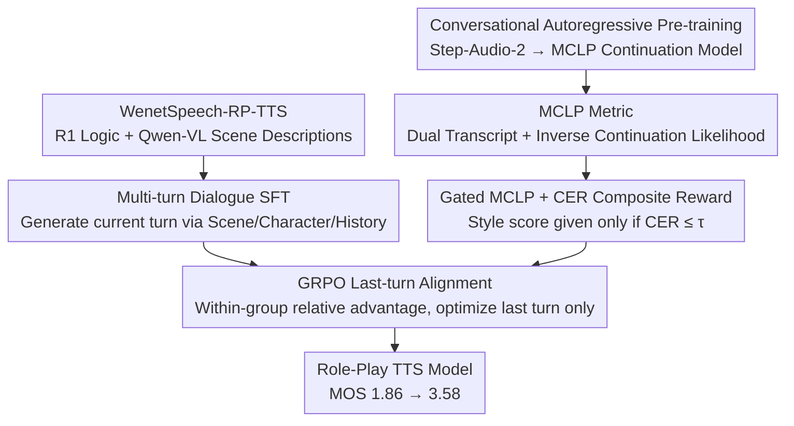

# Evaluating and Rewarding LALMs for Expressive Role-Play TTS via Mean Continuation Log-Probability

**Conference**: ICML 2026  
**arXiv**: [2601.22661](https://arxiv.org/abs/2601.22661)  
**Code**: https://github.com/y-ren16/MCLP  
**Area**: Audio/Speech  
**Keywords**: Role-Play TTS, LALM, Mean Continuation Log-Probability, GRPO, Style Consistency  

## TL;DR
This paper formulates the "continuation probability of a pre-trained Large Audio Language Model (LALM) on ground-truth speech tokens" as an objective style consistency metric named MCLP. By employing a gated hybrid reward of MCLP+CER through GRPO on the newly constructed WenetSpeech-RP-TTS dataset, the subjective MOS of role-play TTS is improved from 1.86 to 3.58.

## Background & Motivation

**Background**: LLM-style TTS (CosyVoice, VALL-E, Step-Audio, etc.) has achieved strong zero-shot voice cloning. Recent Instruct-TTS works allow style control via natural language descriptions, while Speech Role-Playing Agent research (OmniCharacter, SpeechRole, VoxRole, etc.) further aims for models to portray specific characters in multi-turn dialogues.

**Limitations of Prior Work**: In "Role-Playing TTS (RP-TTS)" scenarios—which focus on **controlling style rather than timbre**—existing methods fall short. Instruct-TTS only handles single utterances and treats style as a static attribute, failing to maintain characters across multiple turns. Role-Playing Agents prioritize semantic alignment over acoustic style, often sacrificing expressiveness for coherence. Attempts to use RL for style alignment are hindered by the lack of an **objective style metric**, often regressing to using emotion classifiers as proxy rewards, which only cover the single dimension of emotion.

**Key Challenge**: Style is a continuous, context-dependent, and high-dimensional concept mixing prosody, emotion, and paralinguistic information. Existing evaluations and rewards attempt to approximate it using discrete labels (emotion categories, speaker IDs), inevitably losing information. Furthermore, a single reward (solely CER or similarity) easily triggers reward hacking—either producing highly expressive but unintelligible "gibberish" or generating clear but flat, robotic speech.

**Goal**: To address both issues: (1) define an **interpretable, continuous style metric consistent with human perception**; (2) integrate it into an RL pipeline while maintaining content fidelity.

**Key Insight**: The authors hypothesize that an LALM pre-trained on massive speech data **implicitly learns a continuous latent space of speech styles**. Given a transcript and "candidate speech," if the candidate's speaking style matches the ground truth (GT), the pre-trained LALM should assign a higher continuation probability to the GT speech tokens when using the candidate as context. This translates "style consistency" into "continuation likelihood," which can be quantified numerically.

**Core Idea**: Use the "mean log-likelihood of GT audio tokens assigned by a pre-trained LALM" directly as the style metric, MCLP. This can be used for both offline evaluation and as a reward in GRPO, with CER used as a gate to prevent reward hacking.

## Method

### Overall Architecture

To solve the lack of objective style metrics in RP-TTS, this work first trains a Large Audio Language Model (LALM) capable of speech continuation. Its mean log-likelihood on GT audio tokens, MCLP, serves as the style consistency benchmark for RL rewards. The pipeline consists of three stages: First, conversational-level autoregressive pre-training initialized with Step-Audio-2 on 3M hours of transcribed speech to obtain the MCLP continuation model (loss is only calculated on audio tokens to learn "continue current sentence given text and history audio"). Second, multi-turn dialogue SFT based on Step-Audio-2-mini-Base using the self-constructed WenetSpeech-RP-TTS, enabling the model to generate the $j$-th turn interleaved TA4 token sequence conditioned on scene description $\mathcal{S}$, character profile $\mathcal{P}$, and history $\mathcal{H}_{<j}$. Finally, RL using GRPO is applied only to the last turn of each dialogue, with rewards aggregated from the MCLP style score, CER content penalty, and a clarity gate.

The data loop is built on WenetSpeech: 17k videos were filtered by "YouTube + drama" tags (8556 downloaded), with Demucs for accompaniment removal and pyannote for speaker diarization. DeepSeek-R1 was used to infer drama/episode titles and generate profiles $\mathcal{P}$ from full scripts, while Qwen-VL-7B generated scene descriptions $\mathcal{S}$ for each segment. Scenes were clipped at 5s silences (30s max), yielding 311k scenes (1435 hours), averaging 7.3 utterances and 2.33 speakers per scene.

### Key Designs

**1. MCLP Metric: Converting style consistency to a likelihood scalar via "dual transcripts + inverse continuation"**

To address the loss of information in discrete labels, MCLP uses a context structure $\mathcal{H}=[\mathbf{w},\mathbf{z}^{eval},\mathbf{w}]$. The same transcript $\mathbf{w}$ appears twice, sandwiching the candidate audio $\mathbf{z}^{eval}$. The LALM then continues the ground-truth audio $\mathbf{z}^{gt}$ after $\mathcal{H}$. The metric is defined as $\text{MCLP}=\frac{1}{|\mathbf{z}^{gt}_A|}\sum_{k\in \mathbf{z}^{gt}_A}\log P_\theta(z_k^{gt}\mid \mathcal{H},z_{<k}^{gt})$, averaging over the audio token subset $\mathbf{z}^{gt}_A$. 

Repeating $\mathbf{w}$ ensures the text content is fixed under teacher-forcing, so likelihood variations stem from style rather than text. Step-Audio-2's semantic speech tokenizer preserves style over timbre details. Using the "candidate as context to continue GT" ensures a fixed denominator for fair comparison across multiple candidates.

**2. Gated MCLP + CER Composite Reward: Ensuring intelligibility before pursuing style**

To prevent reward hacking, the reward is split: style branch $R_{style}=\text{MCLP}(\mathbf{z}^{roll},\mathbf{z}^{gt})+C$ (offset $C=15$) and content branch $R_{content}=\lambda\cdot\text{CER}(\hat{\mathbf{w}},\mathbf{w})$ ($\lambda=10$). The final reward $R(\mathbf{z})=R_{style}-R_{content}$ is only granted if $\text{CER}\le\tau=0.2$; otherwise, it is 0. This forces the model to learn clear pronunciation before optimizing expressiveness.

**3. GRPO Last-turn Alignment: Optimizing the final turn with group-relative advantage**

To prevent error accumulation in history, only the last turn of the dialogue is optimized. For each query $\mathbf{q}=(\mathcal{S},\mathcal{P},\mathcal{H})$, $G=8$ rollouts are sampled. The relative advantage $\hat{A}_i=(R_i-\text{mean})/\text{std}$ is used in the objective function with a clipped importance ratio and a token-level KL constraint $\beta\mathbb{D}_{KL}$ ($\beta=0.001$). Training uses 16,186 high-quality scenes (2–6 turns, last sentence >10 characters, non-neutral style) to maximize expressiveness gains.

### Loss & Training

SFT: 1 epoch, batch 64, LR $1\times 10^{-5}$ cosine decay, max sequence 16,384, AdamW. Objective: $\theta^*=\arg\min_\theta\sum -\log P_\theta(\mathbf{y}\mid \mathcal{S},\mathcal{P},\mathcal{H},\mathcal{I})$.  
RL: LR $1\times 10^{-6}$, global batch 128, $G=8$ rollouts, temperature 1.0, max decode 1024.

## Key Experimental Results

### Main Results

| Model | Settings | CER↓ | CAM++↑ | Emo2Vec↑ | MCLP↑ | MOS↑ |
|------|------|------|--------|----------|-------|------|
| Ground Truth | — | — | — | — | — | 4.461 |
| GPT-Audio | w/ history | 11.97 | 0.636 | 0.875 | -4.849 | 1.915 |
| MiMo-Audio-7B | w/ history | 10.60 | 0.699 | 0.902 | -4.753 | 2.484 |
| Step-Audio-2-mini | w/ history | 3.28 | 0.629 | 0.864 | -4.829 | 1.856 |
| OV-InstructTTS | w/o history | 7.19 | 0.669 | 0.900 | -4.768 | 2.864 |
| **Ours** | w/ history | **1.13** | **0.724** | **0.917** | **-4.636** | **3.576** |
| **Ours** | w/o history | **1.63** | **0.704** | **0.910** | **-4.687** | **3.576** |

CER is roughly 1/10th of baselines. MOS is 0.71 higher than the strongest Instruct-TTS and 1.09 higher than the strongest LALM.

### Ablation Study

| Configuration | CER (w/ hist) | MCLP (w/ hist) | MOS |
|------|---------------|----------------|-----|
| Step-Audio-2-mini (baseline) | 3.28 | -4.829 | 1.856 |
| + SFT only | 3.33 | -4.725 | 3.178 |
| Full (SFT + RL with hybrid reward) | **1.13** | -4.636 | **3.576** |
| w/o CER Reward (MCLP only) | 61.14 | **-4.590** | 1.145 |
| w/o MCLP Reward (CER only) | **0.78** | -4.752 | 2.331 |

### Key Findings
- SFT alone increases MOS from 1.86 to 3.18 (+1.32), proving dataset utility; RL adds another 0.40, proving style rewards provide gains beyond SFT.
- Removing CER reward results in the highest MCLP (-4.59) but a CER of 61% and MOS of 1.15, confirming that reward hacking produces unintelligible expressive sounds.
- Human pairwise experiments show that when $\Delta\text{MCLP}>0.1$, the win rate exceeds 0.8, proving MCLP is a reliable preference predictor.

## Highlights & Insights
- **Inverse continuation is a clever normalization**: Using "candidate as context to predict GT" allows for a fixed-length target, ensuring fair normalization. This paradigm of "leveraging LALM linguistic priors to quantify fuzzy concepts" can transfer to other modalities.
- **Gated hybrid rewards as a template**: The combination of hard gating, positive shifting, and content penalty is more robust than a weighted sum and can be applied to any dual-objective task (e.g., accent or emotion TTS).
- **Data提质 (Refining Data)**: The pipeline demonstrates how to upgrade ASR corpora using LLMs/VLMs for character profiles and scene descriptions.

## Limitations & Future Work
- Experiments primarily focused on Chinese drama; multi-lingual validity remains to be verified.
- The evaluation domain is restricted to television; other domains like audiobooks or NPC dialogue might require different gate thresholds.
- Label noise from LLM/VLM generation (e.g., hallucinated plots) remains a bottleneck.
- MCLP calculation is computationally expensive as it requires a 7B LALM forward pass for every rollout; distilling into a smaller estimator is a future direction.

## Related Work & Insights
- **vs Instruct-TTS**: While those rely on single-sentence instruction prompts, ours utilizes multi-turn history + style alignment RL for a significant MOS gain.
- **vs Emotion Rewards**: Instead of discrete labels, MCLP offers a continuous, dense reward signal covering dimensions beyond simple emotion.
- **vs Speech Agents**: Unlike agents focusing on end-to-end semantic alignment, this work decouples "what to say" from "how to say it," serving as a modular TTS backend.

## Rating
- Novelty: ⭐⭐⭐⭐ 
- Experimental Thoroughness: ⭐⭐⭐⭐ 
- Writing Quality: ⭐⭐⭐⭐ 
- Value: ⭐⭐⭐⭐ 

<!-- RELATED:START -->

## Related Papers

- [\[ICML 2026\] Focus Then Listen: An Empirical Study of Plug-and-Play Audio Enhancer for Noise-Robust Large Audio Language Models](focus_then_listen_an_empirical_study_of_plug-and-play_audio_enhancer_for_noise-r.md)
- [\[ICML 2026\] MultiBreak: A Scalable and Diverse Multi-turn Jailbreak Benchmark for Evaluating LLM Safety](multibreak_a_scalable_and_diverse_multi-turn_jailbreak_benchmark_for_evaluating_.md)
- [\[ACL 2026\] Computational Narrative Understanding for Expressive Text-to-Speech](../../ACL2026/audio_speech/computational_narrative_understanding_for_expressive_text-to-speech.md)
- [\[ICLR 2026\] VibeVoice: Expressive Podcast Generation with Next-Token Diffusion](../../ICLR2026/audio_speech/vibevoice_expressive_podcast_generation_with_next-token_diffusion.md)
- [\[ACL 2026\] Phun-Bench: Evaluating LLMs on Phonological Understanding in Chinese](../../ACL2026/audio_speech/phun-bench_evaluating_llms_on_phonological_understanding_in_chinese.md)

<!-- RELATED:END -->
## Related Papers

- [\[ACL 2026\] Computational Narrative Understanding for Expressive Text-to-Speech](../../ACL2026/audio_speech/computational_narrative_understanding_for_expressive_text-to-speech.md)
- [\[ICML 2026\] MultiBreak: A Scalable and Diverse Multi-turn Jailbreak Benchmark for Evaluating LLM Safety](multibreak_a_scalable_and_diverse_multi-turn_jailbreak_benchmark_for_evaluating_.md)
- [\[ACL 2026\] DRInQ: Evaluating Conversational Implicature with Controlled Context Variation](../../ACL2026/audio_speech/drinq_evaluating_conversational_implicature_with_controlled_context_variation.md)
- [\[ACL 2026\] ReStyle-TTS: Relative and Continuous Style Control for Zero-Shot Speech Synthesis](../../ACL2026/audio_speech/restyle-tts_relative_and_continuous_style_control_for_zero-shot_speech_synthesis.md)
- [\[ICML 2026\] CMI-RewardBench: Evaluating Music Reward Models with Compositional Multimodal Instruction](cmi-rewardbench_evaluating_music_reward_models_with_compositional_multimodal_ins.md)

<!-- RELATED:END -->
