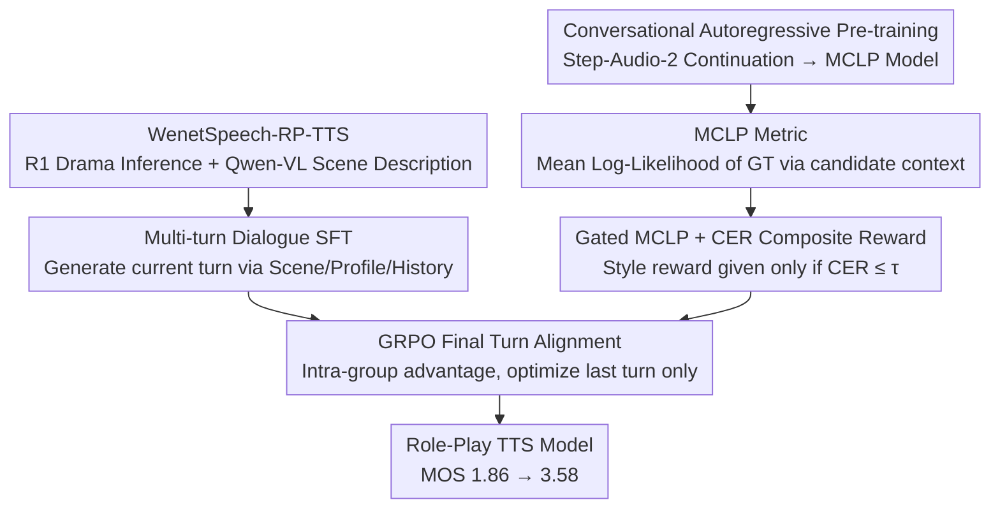

# Evaluating and Rewarding LALMs for Expressive Role-Play TTS via Mean Continuation Log-Probability

**Conference**: ICML 2026  
**arXiv**: [2601.22661](https://arxiv.org/abs/2601.22661)  
**Code**: https://github.com/y-ren16/MCLP  
**Area**: Audio/Speech  
**Keywords**: Role-Play TTS, LALM, Mean Continuation Log-Probability, GRPO, Style Consistency  

## TL;DR
This paper frames the "continuation probability of a pre-trained Large Audio Language Model (LALM) for ground-truth audio tokens" as an objective style consistency metric named MCLP. Using a gated hybrid reward combining MCLP and CER, the authors employ GRPO on the newly constructed WenetSpeech-RP-TTS dataset to improve the subjective MOS of role-play TTS from 1.86 to 3.58.

## Background & Motivation

**Background**: LLM-style TTS models (such as CosyVoice, VALL-E, and Step-Audio) have achieved robust zero-shot voice cloning. Recent Instruct-TTS models allow style control via natural language descriptions. Speech Role-Playing Agents (e.g., OmniCharacter, SpeechRole, VoxRole) go further, requiring models to portray specific characters across multi-turn dialogues.

**Limitations of Prior Work**: In the "Role-Play TTS (RP-TTS)" scenario—which focuses on **controlling style rather than speaker identity**—existing methods are inadequate. Instruct-TTS only handles single utterances and treats style as a static utterance-level attribute, failing to maintain personas across multiple turns. Role-playing agents prioritize semantic alignment over acoustic style, often sacrificing expressiveness for coherence. Attempts to use Reinforcement Learning (RL) for style alignment are hindered by the **lack of objective style metrics**, forcing a reliance on emotion classifiers as proxy rewards, which only covers a single dimension of expressiveness.

**Key Challenge**: Style is a continuous, context-dependent, "high-dimensional concept" mixing prosody, emotion, and paralinguistic information. Existing evaluations and rewards attempt to approximate it using discrete labels (emotion categories, speaker IDs), which inevitably results in information loss. Furthermore, single-objective rewards (focused only on CER or similarity) are prone to reward hacking—leading either to highly expressive but unintelligible "gibberish" or extremely clear but monotonous "robotic" speech.

**Goal**: Resolve both issues simultaneously: (1) Define an **interpretable, continuous style metric** consistent with human perception; (2) Integrate it into an RL pipeline while maintaining content fidelity.

**Key Insight**: The authors hypothesize that LALMs pre-trained on massive speech data **implicitly learn a continuous latent space for speech style**. Given a transcript and a "candidate audio," if the candidate's style matches the ground truth (GT), the pre-trained LALM should assign a higher continuation probability to the GT audio tokens when using the candidate as context. This translates "style consistency" into "continuation likelihood," which can be quantified numerically.

**Core Idea**: Use the "mean log-likelihood of GT audio tokens predicted by a pre-trained LALM" directly as the style metric, MCLP. This serves for both offline evaluation and as a reward in GRPO, with CER used as a gate to prevent reward hacking.

## Method

### Overall Architecture

The study addresses the lack of objective style metrics in RP-TTS. The approach first trains an LALM for speech continuation. Its mean log-likelihood for GT audio tokens (MCLP) is used as a benchmark for style consistency, which is then integrated as an RL reward. The pipeline consists of three stages: (1) Conversational-level autoregressive pre-training initialized with Step-Audio-2 on 3M hours of transcribed speech to obtain the MCLP continuation model (loss is calculated only on audio tokens to learn "continuing the current sentence given text and preceding audio"); (2) Multi-turn dialogue SFT based on Step-Audio-2-mini-Base using the custom WenetSpeech-RP-TTS dataset, enabling the model to generate interleaved TA4 tokens based on scene descriptions $\mathcal{S}$, character profiles $\mathcal{P}$, and history $\mathcal{H}_{<j}$; (3) RL using GRPO applied only to the final turn of each dialogue, with a reward aggregated from the MCLP style score, CER content penalty, and a clarity gate.

The data loop is built on WenetSpeech: 17k videos were filtered via "YouTube + drama" tags, with 8,556 downloaded. Demucs was used for accompaniment removal and pyannote for speaker diarization. DeepSeek-R1 inferred titles/episodes and generated character profiles $\mathcal{P}$ based on full scripts, while Qwen-VL-7B generated scene descriptions $\mathcal{S}$. Scenes were capped at 30 seconds and split by 5-second silences, resulting in 311k scenes (1435 hours), averaging 7.3 sentences and 2.33 speakers. The test set used strict video-level hold-out.

### Key Designs

**1. MCLP Metric: Transforming style consistency into a likelihood scalar via "Double Transcript + Reverse Continuation"**

Discrete labels lose information regarding continuous prosody. The authors assume pre-trained LALMs capture continuous style spaces. The context is structured as $\mathcal{H}=[\mathbf{w},\mathbf{z}^{eval},\mathbf{w}]$, where the same transcript $\mathbf{w}$ appears twice, flanking the candidate audio $\mathbf{z}^{eval}$. The LALM then continues the ground truth audio $\mathbf{z}^{gt}$ following $\mathcal{H}$. The metric is defined as $\text{MCLP}=\frac{1}{|\mathbf{z}^{gt}_A|}\sum_{k\in \mathbf{z}^{gt}_A}\log P_\theta(z_k^{gt}\mid \mathcal{H},z_{<k}^{gt})$, averaged only over audio tokens $\mathbf{z}^{gt}_A$. 

This design ensures likelihood changes reflect only style: repeating $\mathbf{w}$ anchors the text content under teacher-forcing; using Step-Audio-2 focuses the metric on style rather than acoustic details (due to its semantic tokenizer); and "using the candidate to continue the GT" ensures a fixed denominator for fair comparison across candidates.

**2. Gated MCLP + CER Composite Reward: Enforcing intelligibility before style to block reward hacking**

Single-objective rewards are easily hacked: style-only rewards produce "expressive gibberish," while clarity-only rewards produce flat "robotic" speech. The reward is split into two branches with a hard gate: the style branch $R_{style}=\text{MCLP}(\mathbf{z}^{roll},\mathbf{z}^{gt})+C$ with a bias $C=15$ to ensure a positive range, and a content branch $R_{content}=\lambda\cdot\text{CER}(\hat{\mathbf{w}},\mathbf{w})$ ($\lambda=10$), where $\hat{\mathbf{w}}$ is obtained via ASR. The final reward $R(\mathbf{z})=R_{style}-R_{content}$ is applied only if $\text{CER}\le\tau=0.2$; otherwise, it is set to 0. This curriculum forces the model to achieve a clarity threshold before optimizing for expressiveness.

**3. GRPO Final-Turn Alignment: Optimizing only the last turn with intra-group relative advantage**

To prevent error accumulation from contaminating the context, history turns are kept at GT values during RL, and policy optimization is limited to the final turn. For each query $\mathbf{q}=(\mathcal{S},\mathcal{P},\mathcal{H})$, $G=8$ rollouts are sampled. The intra-group relative advantage $\hat{A}_i=(R_i-\text{mean})/\text{std}$ is calculated. The objective function uses a clipped importance ratio $\rho_{i,t}$ multiplied by $\hat{A}_i$, with a token-level KL constraint $\beta\mathbb{D}_{KL}$ ($\beta=0.001$) to anchor the policy to the SFT model.

### Loss & Training

SFT: 1 epoch, batch size 64, learning rate $1\times 10^{-5}$ with cosine decay, AdamW ($\beta_1=0.9, \beta_2=0.95$, weight decay 0.1, grad clip 1.0). RL: learning rate $1\times 10^{-6}$, global batch size 128, $G=8$ rollouts, temperature 1.0.

## Key Experimental Results

### Main Results

| Model | Setting | CER↓ | CAM++↑ | Emo2Vec↑ | MCLP↑ | MOS↑ |
|------|------|------|--------|----------|-------|------|
| Ground Truth | — | — | — | — | — | 4.461 |
| GPT-Audio | w/ history | 11.97 | 0.636 | 0.875 | -4.849 | 1.915 |
| MiMo-Audio-7B | w/ history | 10.60 | 0.699 | 0.902 | -4.753 | 2.484 |
| Step-Audio-2-mini | w/ history | 3.28 | 0.629 | 0.864 | -4.829 | 1.856 |
| OV-InstructTTS | w/o history | 7.19 | 0.669 | 0.900 | -4.768 | 2.864 |
| **Ours** | w/ history | **1.13** | **0.724** | **0.917** | **-4.636** | **3.576** |

CER was reduced to nearly 1/10th of baselines, and MOS improved by 0.71 points over the strongest Instruct-TTS (OV-InstructTTS 2.864).

### Ablation Study

| Configuration | CER (w/ hist) | MCLP (w/ hist) | MOS |
|------|---------------|----------------|-----|
| Step-Audio-2-mini (baseline) | 3.28 | -4.829 | 1.856 |
| + SFT only | 3.33 | -4.725 | 3.178 |
| Full (SFT + RL) | **1.13** | -4.636 | **3.576** |
| w/o CER Reward (Style only) | 61.14 | **-4.590** | 1.145 |
| w/o MCLP Reward (CER only) | **0.78** | -4.752 | 2.331 |

### Key Findings
- SFT alone improves MOS from 1.86 to 3.18, validating the dataset. RL adds an additional 0.40, confirming MCLP's contribution.
- Removing the CER reward results in the highest MCLP but catastrophic CER (61%) and MOS (1.15), proving that reward hacking generates "expressive nonsense."
- CER-only optimization yields the lowest CER but significant MOS loss (2.33), indicating clarity is not synonymous with quality.
- Human pairwise experiments show a win rate $> 0.8$ when $\Delta\text{MCLP}>0.1$, proving the metric's reliability.

## Highlights & Insights
- **"Reverse Continuation + Double Transcript" as a Normalization Technique**: Using evaluations as context to predict fixed GT allows for a fair, content-anchored style comparison.
- **Gated Hybrid Rewards as a Template**: The combination of hard gating and positive-shifted rewards provides a robust framework for multi-objective RL in multimodal tasks.
- **Automated Dataset Upgrading**: The pipeline demonstrates how LLMs (R1) and VLMs (Qwen-VL) can augment legacy ASR corpora with character profiles and scene descriptions.

## Limitations & Future Work
- Experiments primarily focus on Chinese drama; multi-language validation is needed for the MCLP metric.
- Evaluation is limited to TV dramas; performance in domains like audiobooks or NPC dialogue remains unexplored.
- Dataset generation involves LLM/VLM noise; future work could incorporate "gold-standard" human-verified subsets.
- High computational cost: reward calculation requires a 7B LALM forward pass.

## Related Work & Insights
- **vs. CosyVoice3 / InstructTTS**: These focus on single-turn instructions. Ours utilizes multi-turn history and RL alignment.
- **vs. Emotion Rewards**: Discrete labels are replaced by continuous likelihood, covering stylistic dimensions beyond emotion.
- **vs. Role-Playing Agents**: Decouples "what to say" from "how to say it," serving as a modular TTS backend for conversational agents.

## Rating
- Novelty: ⭐⭐⭐⭐ 
- Experimental Thoroughness: ⭐⭐⭐⭐ 
- Writing Quality: ⭐⭐⭐⭐ 
- Value: ⭐⭐⭐⭐ 

<!-- RELATED:START -->

## Related Papers

- [\[ACL 2026\] Computational Narrative Understanding for Expressive Text-to-Speech](../../ACL2026/audio_speech/computational_narrative_understanding_for_expressive_text-to-speech.md)
- [\[ICML 2026\] MultiBreak: A Scalable and Diverse Multi-turn Jailbreak Benchmark for Evaluating LLM Safety](multibreak_a_scalable_and_diverse_multi-turn_jailbreak_benchmark_for_evaluating_.md)
- [\[ACL 2026\] DRInQ: Evaluating Conversational Implicature with Controlled Context Variation](../../ACL2026/audio_speech/drinq_evaluating_conversational_implicature_with_controlled_context_variation.md)
- [\[ACL 2026\] ReStyle-TTS: Relative and Continuous Style Control for Zero-Shot Speech Synthesis](../../ACL2026/audio_speech/restyle-tts_relative_and_continuous_style_control_for_zero-shot_speech_synthesis.md)
- [\[ACL 2026\] S2S-Arena: Evaluating Paralinguistic Instruction Following in Speech-to-Speech Models](../../ACL2026/audio_speech/s2s-arena_evaluating_paralinguistic_instruction_following_in_speech-to-speech_mo.md)

<!-- RELATED:END -->
